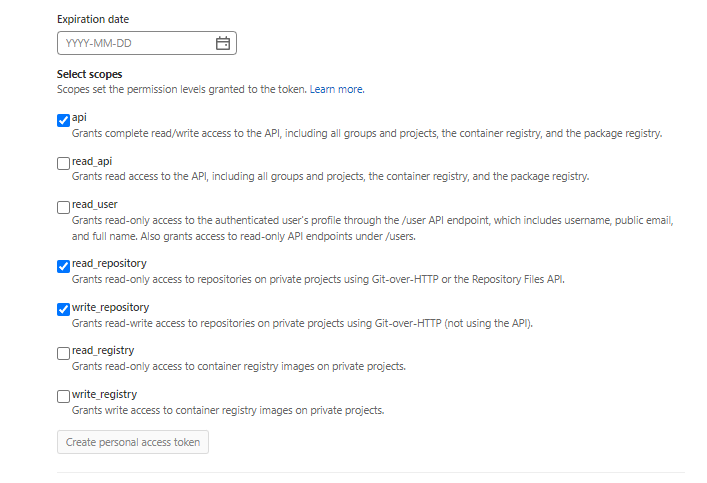

Add a connector for your GitLab account or repository.

Before Harness uses this connector to sync with your Git repo, it confirms that the connector settings are valid. If the connection fails, Harness can't sync with your Git repo.

## Overview settings

* **Name:** The unique name for this connector. Harness generates an **Id** ([Entity Identifier](../../../20_References/entity-identifier-reference.md)) based on the **Name**. You can edit the **Id** during initial connector creation. Once you save the connector, the **Id** is locked.
* **Description:** Optional text string.
* **Tags:** Optional labels you can use for filtering. For details, go to the [Tags reference](../../../20_References/tags-reference.md).

## Details settings

The **Details** settings specify which GitLab account or repository you want this connector to connect to, whether to connect over HTTP or SSH, and the URL to use.

### URL Type

Select **Account** to connect an entire GitLab account. This option lets you use one connector to connect to all repositories in the specified GitLab account. Make sure you have at least one repo in the account; you need a repo to test the connection and save the connector.

Select **Repository** to connect to a single, specific repo in a GitLab account.

### Connection Type

Select the protocol, **HTTP** or **SSH**, to use for cloning and authentication. The **Connection Type** determines the URL format required for the **GitLab Account/Repository URL** field. It also determines the **Authentication** method you must use in the [Credentials settings](#credentials-settings).

### GitLab Account/Repository URL

Enter the URL for the GitLab account or repository that you want to connect to. The required value is determined by the **URL Type** and **Connection Type**.

```mdx-code-block
import Tabs from '@theme/Tabs';
import TabItem from '@theme/TabItem';
```
```mdx-code-block
<Tabs>
  <TabItem value="account" label="URL Type: Account" default>
```

In the **GitLab Account URL** field, provide only the account-identifying portion of the GitLab URL, such as `https://gitlab.com/YOUR_ACCOUNT_NAME/`. Do not include a repo name. The URL format depends on the **Connection Type**:

* **HTTP:** `https://gitlab.com/YOUR_ACCOUNT_NAME/`
* **SSH:** `git@gitlab.com:YOUR_ACCOUNT_NAME/`

### Test Repository

This field is only required if the **URL Type** is **Account**. Provide the name of a repo in your GitLab account that Harness can use to test the connector. Harness uses this repo to validate the connection only. When you use this connector in a pipeline, you'll specify a true code repo in your pipeline configuration or at runtime.

```mdx-code-block
  </TabItem>
  <TabItem value="repo" label="URL Type: Repository">
```

In the **GitLab Repository URL** field, provide the complete URL to the GitLab repository that you want this connector to point to. The URL format depends on the **Connection Type**:

* **HTTP:** `https://gitlab.com/YOUR_ACCOUNT_NAME/YOUR_REPO_NAME`
* **SSH:** `git@gitlab.com:YOUR_ACCOUNT_NAME/YOUR_REPO_NAME`

```mdx-code-block
  </TabItem>
</Tabs>
```

## Credentials settings

Provide authentication credentials for the connector.

### Authentication

Authentication is required for all accounts and repos, including read-only repos. The **Connection Type** you chose in the [Details settings](#details-settings) determines the available **Authentication** methods:

* For **HTTP** connections, you can use **OAuth**, **Username and Password**, or **Username and Token** authentication.
* For **SSH** connections, you must use **SSH Key** authentication.

```mdx-code-block
<Tabs>
  <TabItem value="userpass" label="Username and Password">
```

**Username and Password** authentication is not valid for GitLab accounts with two-factor authentication. Instead, use **Username and Token**, **OAuth**, or **SSH Key** authentication.

1. For **Authentication**, select **Username and Password**.
2. In the **Username** field, enter `git`. Do not enter any other value besides `git`.
3. In the **Password** field, provide your GitLab account password as a [Harness encrypted text secret](../../../Secrets/2-add-use-text-secrets.md).

```mdx-code-block
  </TabItem>
  <TabItem value="usertoken" label="Username and Token" default>
```

1. For **Authentication**, select **Username and Token**.
2. In the **Username** field, enter `git`. Do not enter any other value besides `git`.
3. In the **Personal Access Token** field, provide a GitLab [personal access token](https://docs.gitlab.com/ee/user/profile/personal_access_tokens.html) as a [Harness encrypted text secret](../../../Secrets/2-add-use-text-secrets.md).

:::info Personal access token permissions

Make sure your personal access token has the following permissions: `api`, `read_repository`, and `write_repository`.



:::

```mdx-code-block
  </TabItem>
  <TabItem value="oauth" label="OAuth">
```

:::note

Currently, OAuth for GitLab connectors is behind a feature flag. Contact [Harness Support](mailto:support@harness.io) to enable the feature.

:::

1. For **Authentication**, select **OAuth**.
2. Select **Link to GitLab** to open a new browser tab and authorize access to your GitLab account.

```mdx-code-block
  </TabItem>
  <TabItem value="ssh" label="SSH Key">
```

SSH connections require an **SSH Key** in PEM format. OpenSSH keys are not supported. In Harness, SSH Keys are stored as [Harness SSH credential secrets](/docs/platform/Secrets/add-use-ssh-secrets). When creating an SSH credential secret for a code repo connector, the SSH credential's **Username** must be `git`.

For details on creating SSH keys and adding them to your GitLab account, go to the GitLab documentation about [Using SSH keys to communicate with GitLab](https://docs.gitlab.com/ee/user/ssh.html).

:::tip

If you use the `keygen` command to generate an SSH key, include arguments such as `rsa` and `-m PEM` to ensure your key is properly formatted and uses the RSA algorithm. For example, this command creates an SSHv2 key:

```
ssh-keygen -t rsa -m PEM
```

Make sure to follow the prompts to finish creating the key. For more information, go to the Linux [ssh-keygen man page](https://linux.die.net/man/1/ssh-keygen).

To sync with GitLab, you must generate an SSH key pair and add the SSH key to your GitLab account. For more information, go to the GitLab documentation on [Generating a new SSH key pair](https://gitlab.com/help/ssh/README#generating-a-new-ssh-key-pair).

:::

```mdx-code-block
  </TabItem>
</Tabs>
```

### Enable API access

This setting is only available for connection types and authentication methods where it is not enabled by default.

You must enable API access to use Git-based triggers, Git Sync, manage webhooks, or update Git statuses with this connector. If you are using the Harness Git Experience, this setting is required. API access requires personal access token authentication.

In the **Personal Access Token** field, provide a GitLab [personal access token](https://docs.gitlab.com/ee/user/profile/personal_access_tokens.html) as a [Harness encrypted text secret](../../../Secrets/2-add-use-text-secrets.md). If you selected **Username and Token** authentication, use the same personal access token secret for both **Personal Access Token** fields.

:::info Personal access token permissions

Make sure your personal access token has the following permissions: `api`, `read_repository`, and `write_repository`.


:::

If necessary, use the **API URL** field to override the default URL for API authentication. This is primarily for the [Harness Self-Managed Enterprise Edition](/docs/self-managed-enterprise-edition).

## Connectivity Mode settings

Select whether you want Harness to connect directly to your GitLab account or repo, or if you want Harness to communicate with your GitLab account or repo through a delegate.

### Delegates Setup

If you select **Connect through a Harness Delegate**, you can select **Use any available Delegate** or **Only use Delegates with all of the following tags**.

If you want to use specific delegates, you must identify those delegates. For more information, go to [Select Delegates with Tags](../../../2_Delegates/manage-delegates/select-delegates-with-selectors.md).

### Kubernetes delegate with self-signed certificates

If your codebase connector allows API access and connects through a Harness Delegate that uses self-signed certificates, you must specify `ADDITIONAL_CERTS_PATH` in the delegate pod, as described in [Configure a Kubernetes build farm to use self-signed certificates](/docs/continuous-integration/use-ci/set-up-build-infrastructure/k8s-build-infrastructure/configure-a-kubernetes-build-farm-to-use-self-signed-certificates#enable-self-signed-certificates).
