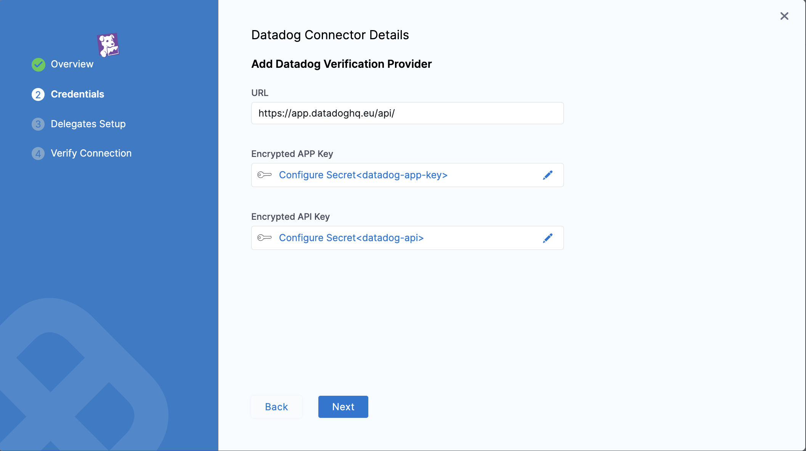

Connect Harness to monitoring and logging systems by adding a verification provider Connector.

You can add a verification provider Connector inline when developing your pipeline, or separately in your Account/Org/Project's resources. Once you add the Connector, it is available in Pipelines of the same Account/Org/Project.

### Monitoring and Logging Systems Scope

You can add a verification provider Connector at the Account/Org/Project scope.

This topic explains how to add a verification provider Connector at the Project scope. The process is same for Org and Account.

### Add AppDynamics

1. Open a Harness Project.
2. In **Project Setup**, click **Connectors**.
3. Click **+** **Connector**, and click **AppDynamics** in **Monitoring and Logging Systems**. The AppDynamics connector settings appear.
   
   
   
4. In **Name**, enter a name for this connector. You will use this name when selecting the Verification Provider in Harness Environments and Workflows. If you plan to use multiple providers of the same type, ensure that you give each provider a different name.
5. Click **Continue**.
6. In the **Controller URL** field, enter the URL of the AppDynamic controller in the format:  
   **http://<Controller\_Host>:<port>/controller </port>**  
   For example:  
   **https://xxxx.saas.appdynamics.com/controller**

   

7. In **Account Name**, enter the name of AppDynamics account you want to use.

   
:::info note
For Harness On-Prem, enter **customer1**.
:::
   
8. In **Authentication**, you can choose one of the following options:
	* **Username and Password**: In **User Name** and **Password**, enter the credentials to authenticate with the AppDynamics server. In **Password**, you can choose [Create or Select a secret](../../Secrets/2-add-use-text-secrets.md)**.**
	* **API Client**: In **Client Id** and **Client Secret** fields, enter a valid Id and secret string that the application uses to prove its identity when requesting a token. In **Client Secret**, you can choose [Create or Select a secret](../../Secrets/2-add-use-text-secrets.md).
  
9. Click **Continue**. The Setup Delegates settings appear.
10. You can choose **Connect via any available delegate** or **Connect only via delegates which has all of the following tags.** If you select a Delegate, Harness will always use that Delegate for this Connector.
11. Click **Save and Continue**.
12. Once the Test Connection succeeds, click **Finish**. AppDynamics is listed under the list of Connectors.

### Add Prometheus

1. Open a Harness Project.
2. In **Project Setup**, click **Connectors**.
3. Click **+** **Connector**, and click **Prometheus**in **Monitoring and Logging Systems**. The Prometheus connector settings appear.
   
   

4. In **Name**, enter a name for this connector. If you are going to use multiple providers of the same type, ensure that you give each provider a different name.
5. Click **Continue**.
6. In the **URL** field, enter the URL of your Prometheus account. You cannot use a Grafana URL.
   
   

   
:::info note
You cannot use a Grafana URL.
:::

1. Click **Next**. The Setup Delegates settings appear.
2. You can choose **Connect via any available delegate** or **Connect only via delegates which has all of the following tags.** If you select a Delegate, Harness will always use that Delegate for this Connector.
3.  Click **Save and Continue**.
4.  Once the Test Connection succeeds, click **Finish**. Prometheus is listed under the list of Connectors.

### Add New Relic

1. Open a Harness Project.
2. In **Project Setup**, click **Connectors**.
3. Click **+** **Connector**, and click **New Relic**in **Monitoring and Logging Systems**. The New Relic connector settings appear.
   
   
   
4. In **Name**, enter a name for this connector. If you are going to use multiple providers of the same type, ensure you give each provider a different name.
5. Click **Continue**.
6. In the **New Relic** **URL** field, enter the URL of your New Relic account. 
   
   

7.  To get the **New Relic Account ID** for your New Relic account, copy the number after the **/accounts/** portion of the URL in the New Relic Dashboard.
8.  In **Encrypted** **API Key**, you can choose **Create or Select a secret.**

For secrets and other sensitive settings, select or create a new [Text Secret](../../Secrets/2-add-use-text-secrets.md). Enter the API key needed to connect with the server.

For steps on generating the New Relic API key, follow this doc from New Relic: [Insights query API](https://docs.newrelic.com/docs/apis/insights-apis/query-insights-event-data-api/).

If you have trouble finding step on generating the **Insights query key**, look for the API key types help in the New Relic help panel:

1. Click **Continue**. The Setup Delegates settings appear.
2.  You can choose **Connect via any available delegate** or **Connect only via delegates which has all of the following tags.** If you select a Delegate, Harness will always use that Delegate for this Connector.
3.  Click **Save and Continue**.
4.  Once the Test Connection succeeds, click **Finish**. New Relic is listed under the list of Connectors.

Usage scope is inherited from the secrets used in the settings. Pro or higher subscription level is needed. For more information, see [Introduction to New Relic's REST API Explorer](https://docs.newrelic.com/docs/apis/rest-api-v2/api-explorer-v2/introduction-new-relics-rest-api-explorer) from New Relic.

### Add Splunk

1. Open a Harness Project.
2. In **Project Setup**, click **Connectors**.
3. Click **+** **Connector**, and click **Splunk**in **Monitoring and Logging Systems**. The Splunk connector settings appear.
   
   
   
4. In **Name**, enter a name for this connector. If you are going to use multiple providers of the same type, ensure you give each provider a different name.
5. Click **Continue**.
6. In the **URL** field, enter the URL for accessing the REST API on the Splunk server. Include the port number in the format **https://<deployment-name>.cloud.splunk.com:8089.</deployment-name> ** The default port number is 8089, which is required for hosted Splunk, also. For example: **https://mycompany.splunkcloud.com:8089**.
   
   
   

Splunk APIs require that you authenticate with a non-SAML account. To access your Splunk Cloud deployment using the Splunk REST API and SDKs, submit a support case requesting access on the Support Portal. For managed deployments, Splunk Support opens port 8089 for REST access. You can specify a range of IP addresses to control who can access the REST API. For self-service deployments, Splunk Support defines a dedicated user and sends you credentials that enable that user to access the REST API. For information see [Using the REST API with Splunk Cloud](http://docs.splunk.com/Documentation/Splunk/7.2.0/RESTTUT/RESTandCloud).

Ensure that the Splunk user account used to authenticate Harness with Splunk is assigned to a role that contains the following REST-related capabilities:

* Search.
* Access to the indexes you want to search.

In the following example we've created a new Splunk role named **Harness User**, and assigned it search capability:

We've given this role access to **All non-internal indexes**. However, we could restrict the access to only the few relevant indexes:

1. In the **Username** field, enter the username of your Splunk account.
2. In **Password** field, you can choose **Create or Select a secret.**

:::info note
For secrets and other sensitive settings, select or create a new [Text Secret.](../../Secrets/2-add-use-text-secrets.md)

:::

1. Click **Connect and Save**. The Setup Delegates settings appear.
2.  You can choose **Connect via any available delegate** or **Connect only via delegates which has all of the following tags.** If you select a Delegate, Harness will always use that Delegate for this Connector.
3.  Click **Save and Continue**.
4.  Once the Test Connection succeeds, click **Finish**. Splunk is listed under the list of Connectors.

### Add Google Cloud Operations (formerly Stackdriver)

:::info note
For details on settings and permissions, see [Google Cloud Platform (GCP) Connector Settings Reference](../Cloud-providers/ref-cloud-providers/gcs-connector-settings-reference.md).

:::

Google Cloud Metrics and Google Cloud Logs are supported with GCP connector. See [Add a GCP Connector](../Cloud-providers/connect-to-a-cloud-provider.md#step-add-a-gcp-connector).

The following roles must be attached to the account used to connect Harness and Google Cloud Operations as a Google Cloud Provider:

* **Stackdriver Logs** - The minimum role requirement is **logging.viewer**
* **Stackdriver Metrics** - The minimum role requirements are **compute.networkViewer** and **monitoring.viewer**.

See [Access control](https://cloud.google.com/monitoring/access-control) from Google.

### Add Splunk Observability [SignalFX]

1. Open a Harness Project.
   
2. Under **Project Setup**, select **Connectors** > **+ New Connector**.

3. Under **Monitoring and Logging Systems**, select **Splunk Observability [SignalFX]**.
   
   The connector settings dialog appears.

4. In the **Overview** tab, enter a name for the connector, an optional description, and a tag, and then select **Continue**.  
   
   If you are going to use multiple providers of the same type, ensure you give each provider a different name.

5. In the **Credentials** tab, enter the following, and then select **Next**:

      - In **URL**, enter the URL of your Splunk Observability [SignalFX] account. The URL format should be one of the following:
  
         - For streaming ingestion: `https://stream.<realm>.signalfx.com`
  
         - For API access: `https://api.<realm>.signalfx.com`

         Where `<realm>` is your specific realm identifier.
   
      - In **API Token**, select **Create or Select a Secret**. In the Create or Select an Existing Secret dialog that appears, you can either select an existing token that you have generated in Splunk Observability. The token must have the authorization scope set as `API Token`.
       
      To create a new secret:

         1. Select **+ New Secret Text**. 
   
         2. In the Add new Encrypted Text dialog, select a secret manager and enter a name for the secret.
   
         3.  In **Secret Value**, enter the API token generated in Splunk Observability (SignalFx). The token must have the authorization scope set as `API Token`. To learn about creating Splunk Observability (SignalFx) API access token, go to [Create and manage authentication tokens using Splunk Observability Cloud](https://docs.splunk.com/Observability/admin/authentication/authentication-tokens/tokens.html).
   
         4.  Add an optional description and a tag, and then select **Save**.  
   
            The secret appears in the **API Token** field.
    
6.  In the **Delegates Setup** tab, choose one of the following:
    
      - **Use any available Delegate**: Harness automatically assigns an available delegate.
   
      - **Only use Delegates with all of the following tags**: You can enter tags to ensure that Harness selects only the delegates that have been assigned those specific tags.
    
7.  Select **Save and Continue**. Harness verifies the connection.
    
8.  After successful verification, select **Finish**.
    
    The Splunk Observability [SignalFX] connector is added to the list of connectors.
   
    ![Splunk Observability [SignalFX] connector](../static/connect-to-monitoring-and-logging-systems-signalfx-35.png)

9.  Select a connector to view its details.

   ![Splunk Observability [SignalFX] connector details](../static/connect-to-monitoring-and-logging-systems-signalfx-35a.png)
    

### Add Datadog

1. Open a Harness Project.

2. In **Project Setup**, click **Connectors**.

3. Click **+ Connector**, and click **Datadog** in **Monitoring and Logging Systems**. The Datadog connector settings appear.
   
   
   
4. In **Name**, enter a name for this connector. If you are going to use multiple providers of the same type, ensure you give each provider a different name.
   
5. Click **Continue**.

6. Connect to a Datadog dashboard.
   To connect to a Datadog dashboard:
7. Copy the protocol and domain part of the URL such as `https://app.datadoghq.com/`.

8. Append a trailing `api/` to create the following URL: `https://app.datadoghq.com/api/](https://app.datadoghq.com/api/`.
    The trailing forward slash after `api`is mandatory. If your URL has `v1` at the end of it, remove `v1`.

9.  In URL field, enter the URL `https://app.datadoghq.com/api/`. The trailing forward slash after api (api/) is mandatory.
    
10. Your URL should look like one of the following:
      - `https://app.datadoghq.com/api/`
      - `https://us3.datadoghq.com/api/`
      - `https://us5.datadoghq.com/api/`
      - `https://app.datadoghq.eu/api/`
      - `https://app.ddog-gov.com/api/`

   
    
11. In **Encrypted APP** Key, enter the application key.
    
    To create an application key in Datadog, do the following:

      1.  In **Datadog**, hover over **Integrations**, and then click **APIs**. The APIs page appears.

         

      2.  In **Application Keys**, in **New application key**, enter a name for the application key, such as **Harness**, and click **Create Application Key**.

      3.  Copy the application key and, in **Harness**, paste it into the **Application Key** field.

12. In Encrypted API Key, enter the API key for API calls.
    
    To create an API key in Datadog, do the following:
      
      1.  In **Datadog**, hover over **Integrations**, and then click **APIs**. The **APIs** page appears.
    
         
      
      2.  In **API Keys**, in **New API key**, enter the name for the new API key, such as **Harness**, and then click **Create API key**.
      
      3.  Copy the API key and, in **Harness**, paste it into the **API Key** field.

13. Click **Next**. The Setup Delegates settings appear.

14. You can choose **Connect via any available delegate** or **Connect only via delegates which has all of the following tags**. If you select a Delegate, Harness will always use that Delegate for this Connector.

15. Click **Save** and **Continue**.

16. Once the Test Connection succeeds, click **Finish**. Datadog is listed under the list of Connectors.

### Add Dynatrace

1. Open a Harness Project.
2. Under **Project Setup**, select **Connectors** > **+ New Connector**.

3.   Under **Monitoring and Logging Systems**, select **Dynatrace**.

4.	In the dialog that appears, in the **Overview** tab, enter a name for the connector, an optional description, and a tag, and then select **Continue**.    
If you are going to use multiple providers of the same type, ensure you give each provider a different name.

5.	In the **Credentials** tab, enter the URL of your Dynatrace account.  
You must use HTTPS to establishing connections with Dynatrace.

6.	Select the **API Token field** > **+ New Secret Text**.

7.	In the Add New Encrypted Text dialog, select a secret manager, and then enter a name for the secret.

8.	In the **Secret Value** field, enter the API token generated in Dynatrace. If you don’t have one, follow these steps to create an API token in Dynatrace:

      1. Sign in to your Dynatrace environment.
      2. In the Dynatrace menu, select **Access tokens** > Select **Generate new token**.
      3. Enter a name for your token.
      4. Be sure to provide a meaningful name for each token you generate. Proper naming helps you efficiently manage your tokens and delete them when they're no longer needed.
      5. Select the following scopes: **Read metrics**, **Read entities**, and **Read events**.
      6. Select **Generate token**.
      7. Copy the generated token to the clipboard. Store the token in a password manager for future use. You can only access your token once upon creation. You can't reveal it afterward.

      For more information on generating Dynatrace API tokens, go to [Dynatrace API - Tokens and authentication](https://www.dynatrace.com/support/help/dynatrace-api/basics/dynatrace-api-authentication).

8.	Select **Save**.

9.	In the Create or Select an Existing Secret dialog, select the Dynatrace secret that you added, and then select **Apply Selected**.

11.  Select **Next**.

12.  In the **Delegates Setup** tab, choose one of the following:

   - **Use any available Delegate**: Harness automatically assigns an available delegate.
  
   - **Only use Delegates with all of the following tags**: You can enter tags to ensure that Harness selects only the delegates that have been assigned those specific tags.

13.  Select **Save** and **Continue**.  
    Harness verifies the connection. 

14.  Once the verification is successful, select **Finish**.  
    The Dynatrace connector is added to the list of connectors.

### Add Custom Health

1. Open a Harness Project.
2. In **Project Setup**, click **Connectors**.
3. Click **+** **Connector**, and click **Custom Health**in **Monitoring and Logging Systems**. The Custom Health connector settings appear.
   
   
   
4. In **Name**, enter a name for this connector. If you are going to use multiple providers of the same type, ensure you give each provider a different name.
5. Click **Continue**.
6. In **URL**, enter the URL of the metrics data provider. For example, **https://mycompany.appd.com.**
7.  In **Headers**, enter the query headers required by your metrics data provider. In **Key**, enter a valid query key. In **Value**, you can create or select a key by clicking [**Create or Select a Secret**](../../Secrets/2-add-use-text-secrets.md)**.** You can also enter a **Plaintext** value**.**
8.  Click **Next**. The **Parameters** setting appears.
9.  In **Parameters**, enter the request parameters. In **Key**, enter a valid query key. In **Value**, you can create or select by clicking [**Create or Select a Secret**](../../Secrets/2-add-use-text-secrets.md) or enter a **Plaintext** value**.**
10. Click **Next**. The **Validation Path** settings appear.
11. In **Request Method**, select **GET** or **POST**.
12. In **Validation Path**, enter the query string from your metric provider.
13. Click **Next**. The Setup Delegates settings appear.
14. You can choose **Connect via any available Delegate** or **Connect only via Delegates which has all of the following tag****.** If you select a Delegate, Harness will always use that Delegate for this Connector.
15. Click **Save and Continue**.
16. Once the Test Connection succeeds, click **Finish**. Custom Health is listed under the list of Connectors.

### Add Grafana Loki

1. Open a Harness Project.

2. Under **Project Setup**, select **Connectors** > **+ New Connector**.

3. Under **Monitoring and Logging Systems**, select **CustomHealth**.
   
4. In the Create or Select an Existing Connector dialog, select **+ New Connector**.
         
5. In the **Overview** tab, enter a name for the connector, an optional description, and a tag, and then select **Continue**. If you are going to use multiple providers of the same type, ensure you give each provider a different name.
   
6. In the **Headers** tab, enter the following and select **Next**:

   - **Base URL** of your Grafana Loki account. By default, Grafana Loki exposes its API on the 3100 port without any authentication. 
   - Optionally, the **Key** and **Value** pair for the Grafana Loki log stream that you want to select in the query. For more information on the log stream selector and key-value pairs, go to [Log stream selector](https://grafana.com/docs/loki/latest/logql/log_queries/#log-stream-selector).

7. Optionally, in the **Parameters** tab, enter the **Key** and **Value** pair.

8. In the **Validation Path** tab, select either the **GET** or **POST** request method and enter the **Validation Path**. If you select **POST**, then you should also enter the request body.

9. In the **Delegates Setup** tab, choose one of the following:

   - **Use any available Delegate**: Harness automatically assigns an available delegate.
               
   - **Only use Delegates with all of the following tags**: You can enter tags to ensure that Harness selects only the delegates that have been assigned those specific tags.

11. Select **Save** and **Continue**.  
               
   Harness verifies the connection. 

11. Once the verification is successful, select **Finish**.  
               
   The Grafana Loki connector is added to the list of connectors.