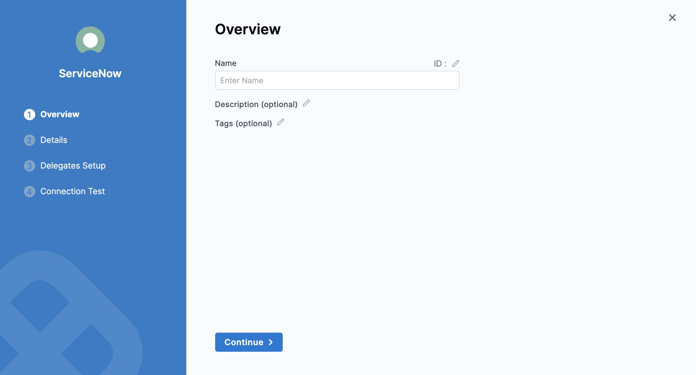
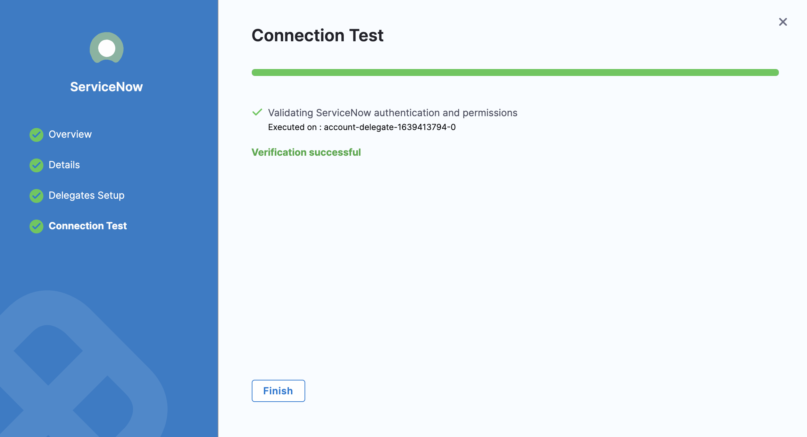

```mdx-code-block
import adfs_settings from '../static/adfs-settings.png'
import adfs_clientid from '../static/adfs-clientid.png'
```

You can connect Harness to ServiceNow using a Harness ServiceNow connector. This connector allows you to approve and reject pipeline steps.

### Important notes

* Your ServiceNow account should ideally have the `admin` role. If this is not possible, it should have at least the `itil_admin` or `itil` role to create and modify tickets.
* Your account should also have the `import_admin` or `import_transformer` role to manage import set transform maps. For details, go to ServiceNow's [Base System Roles](https://docs.servicenow.com/bundle/newyork-platform-administration/page/administer/roles/reference/r_BaseSystemRoles.html) documentation.
* Your ServiceNow REST API account must have permission to view tickets.

### Add a ServiceNow connector

This topic assumes you have a Harness Project set up. If not, go to [Create Organizations and Projects](../../organizations-and-projects/create-an-organization.md).

You can add a connector from any module in your project in project setup, or in your organization, or account resources.

This topic shows you how to add a ServiceNow connector to your project.

1. In **Project Setup**, select **Connectors**.

2. Select **New Connector**, and then select **ServiceNow**. The ServiceNow connector settings appear.

   

3. Enter **Name** for this connector.

   You can choose to update the **Id** or let it be the same as your ServiceNow connector's name. For more information, go to [Entity Identifier Reference](../../20_References/entity-identifier-reference.md).

4. Enter a **Description** and **Tags** for your connector.

5. Select **Continue**.
   
### Add details for the ServiceNow connector

1. In **ServiceNow URL**, enter the base URL by which your users will access ServiceNow. For example: `https://example.service-now.com`.

2. In **Authentication**, select one of the following: 
   - **Username and Password**
   - **ADFS Client Credentials with Certificate**
   - **OIDC Refresh token**

```mdx-code-block
import Tabs from '@theme/Tabs';
import TabItem from '@theme/TabItem';
```
```mdx-code-block
<Tabs>
  <TabItem value="usernamepwd" label="Username and Password" default border-bottom-color="red">
```
To use a username and password for authentication, do the following:

1. Enter **Username**.
2. In **Password/API Key**, create a new password or API key or enter an existing one. For **API Key**, use a [Harness Text Secret](../../Secrets/2-add-use-text-secrets.md).
3. Select **Continue**.

```mdx-code-block
</TabItem>
<TabItem value="adfs" label="ADFS Client Credentials with Certificate">
```

:::info note
* For information on client credentials with certificates, go to the [AD FS OpenID Connect/OAuth flows and Application Scenarios](https://learn.microsoft.com/en-us/windows-server/identity/ad-fs/overview/ad-fs-openid-connect-oauth-flows-scenarios#second-case-access-token-request-with-a-certificate-1).
* Harness supports private keys encoded in RSA (in PKCS8 format).
* Harness supports certificates in `X509` format.
* Permissions granted to this connector in ServiceNow depend on the configuration of the client application group.
:::

To use ADFS credentials for authentication:
  
1. Select an existing secret or create one that has the resource identifier of ServiceNow configured in ADFS as its value for the **Resource ID** field.
2. Select an existing secret or create one that has the application (client) id assigned to your application by AD FS for the **Client ID** field.
   
   ```mdx-code-block
   
   ```

3. Select an existing encrypted file or create one that has the certificate for the **Certificate** field. This is a `X509` format certificate used for signing JWT tokens by your application.
4. In **Private Key**, create a new secret or choose an existing one that has the AD FS private key as the value. This key is the private RSA key corresponding to certificate uploaded in the **Certificate** field.
5. In **ADFS URL**, enter the base AD FS URL.
  
   ```mdx-code-block
   
   ```

```mdx-code-block
</TabItem>
<TabItem value="oidc" label="OIDC Refresh token">
```

:::info note
This feature requires Harness Delegate 799xx or higher.
:::

Harness supports persistent refresh tokens only to authenticate via OpenID Connect (OIDC) for a **Refresh Token** with a **Grant Type** of `refresh_token`. For more information on refresh token grant types, go to [Refreshing Access Tokens](https://www.oauth.com/oauth2-servers/access-tokens/refreshing-access-tokens/) in the OAuth documentation.

All refresh tokens must be valid and updated when revoked. Permissions granted in ServiceNow to this connector depend on the associated resource owner for the credentials/refresh token.

To use an OIDC refresh token for authentication, do the following:

1. Select an existing secret or create one that has the application (client) ID assigned to your application by OIDC for the **Client ID** field.

2. Optional: Select an existing secret or create one that has the application (client) secret assigned.

3. Create a secret for the **Refresh Token**. 

4. Enter the explicit **Token URL**. For example:

   - ServiceNow authentication server: `https://<YOUR_DOMAIN>.service-now.com/oauth_token.do`
   - Okta authentication server: `https://<YOUR_DOMAIN>.okta.com/oauth2/v1/token`

5. (Optional) Enter the **Scope**. If you use ServiceNow for your authentication server, the **Scope** is not required. Harness fetches it from the ServiceNow URL.

   To learn more about how to configure scope for a client in ServiceNow, go to [REST API Auth Scope](https://docs.servicenow.com/bundle/utah-platform-security/page/administer/security/concept/rest-api-auth-scope.html) in the ServiceNow documentation.

6. Select **Continue**.
  
```mdx-code-block
</TabItem>
</Tabs>
```

### Set up delegates

Select the Harness Delegate(s) to use when making a connection to ServiceNow using this connector.

Select **Save and Continue**.

Harness tests the connection.



Select **Finish**.

The ServiceNow connector is listed in **Connectors**.
