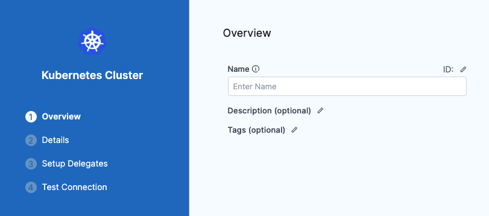

You can connect Harness with your Kubernetes clusters using a Kubernetes Cluster Connector or [Google Cloud Platform (GCP) Connector](connect-to-google-cloud-platform-gcp.md). This topic explains how to set up the Kubernetes Cluster Connector.

Once connected, you can use Kubernetes and Harness for provisioning infrastructure, running a CI build farm, and deploying microservices and other workloads to clusters.

**What roles should my Kubernetes account have?** What roles and policies needed by the account used in the Connector depend on what operations you are using Harness for in the cluster. For a list of roles and policies, see [Kubernetes Cluster Connector Settings Reference](ref-cloud-providers/kubernetes-cluster-connector-settings-reference.md).

### Before you begin

* [Learn Harness' Key Concepts](https://docs.harness.io/article/hv2758ro4e-learn-harness-key-concepts)
* [Kubernetes CD Quickstart](https://docs.harness.io/article/knunou9j30-kubernetes-cd-quickstart)

### Visual Summary

Here's a quick video that shows you how to add a Kubernetes Cluster Connector and install the Kubernetes Delegate in the target cluster at the same time:

### Review: Roles and Policies for the Connector

The IAM roles and policies needed by the account used in the Connector depend on what operations you are using with Harness and what operations you want Harness to perform in the cluster.

You can use different methods for authenticating with the Kubernetes cluster, but all of them use a Kubernetes Role.

The Role used must have either the `cluster-admin` permission in the target cluster or admin permissions in the target namespace.

For a detailed list of roles and policies, see [Kubernetes Cluster Connector Settings Reference](ref-cloud-providers/kubernetes-cluster-connector-settings-reference.md).

In general, the following permissions are require:

* **Deployments:** A Kubernetes service account with permission to create entities in the target namespace is required. The set of permissions should include `list`, `get`, `create`, `watch` (to fetch the pod events), and `delete` permissions for each of the entity types Harness uses. In general, cluster admin permission or namespace admin permission is sufficient.
* **Builds:** A Kubernetes service account with CRUD permissions on Secret, Service, Pod, and PersistentVolumeClaim (PVC).

If you don’t want to use `resources: [“*”]` for the Role, you can list out the resources you want to grant. Harness needs `configMap`, `secret`, `event`, `deployment`, and `pod` at a minimum for deployments, as stated above. Beyond that, it depends on the resources you are deploying via Harness.

If you don’t want to use `verbs: [“*”]` for the Role, you can list out all of the verbs (`create`, `delete`, `get`, `list`, `patch`, `update`, `watch`).

The YAML provided for the Harness Delegate defaults to `cluster-admin` because that ensures anything could be applied. Any restriction must take into account the actual manifests to be deployed.

### Review: Kubernetes Cluster Connector for EKS

If you want to connect Harness to Elastic Kubernetes Service (Amazon EKS), use the platform-agnostic Kubernetes Cluster Connector discussed here. Do not use an [AWS Connector](add-aws-connector.md).

### Review: AKS Clusters Must have Local Accounts Enabled

To use an AKS cluster for deployment, the AKS cluster must have local accounts enabled (AKS property `disableLocalAccounts=false`).

### Review: Switching IAM Policies

If the IAM role used by your Connector does not have the policies required, you can modify or switch the role.

You simply change the role assigned to the cluster or the Harness Delegate your Connector is using.

When you switch or modify the IAM role, it might take up to 5 minutes to take effect.

### Supported Platforms and Technologies

For a list of the platforms and technologies supported by Harness, see [Supported Platforms and Technologies](https://docs.harness.io/article/1e536z41av).

### Step 1: Add a Kubernetes Cluster Connector

Open a Harness Project.

In **Project Setup**, click **Connectors**.

Click **New Connector**, and click **Kubernetes Cluster**. The Kubernetes Cluster Connector settings appear.


In **Name**, enter a name for this connector.

Harness automatically creates the corresponding Id ([entity identifier](../20_References/entity-identifier-reference.md)).

Click **Continue**.

### Step 2: Enter Credentials

Choose the method for Harness to use when connecting to the cluster.

Select one of the following:

* **Specify master URL and credentials**:
	+ You provide the Kubernetes master node URL. The easiest method to obtain the master URL is using kubectl: `kubectl cluster-info`.
	+ Next, enter the **Service Account Key** or other credentials.
* **Use the credentials of a specific Harness Delegate**: Select this option to have the Connector inherit the credentials used by the Harness Delegate running in the cluster. You can install a Delegate as part of adding this Connector.

For details on all of the credential settings, see [Kubernetes Cluster Connector Settings Reference](ref-cloud-providers/kubernetes-cluster-connector-settings-reference.md).

#### Obtaining the Service Account Token using kubectl

To use a Kubernetes Service Account (SA) and token, you will need to either use an existing SA that has the `cluster-admin` permission (or namespace `admin`) or create a new SA and grant it the `cluster-admin` permission (or namespace `admin`).

For example, here's a manifest that creates a new SA named `harness-service-account` in the `default` namespace.


```
# harness-service-account.yml  
apiVersion: v1  
kind: ServiceAccount  
metadata:  
  name: harness-service-account  
  namespace: default
```
Next, you apply the SA.


```
kubectl apply -f harness-service-account.yml
```
Next, grant the SA the `cluster-admin` permission.


```
# harness-clusterrolebinding.yml  
apiVersion: rbac.authorization.k8s.io/v1beta1  
kind: ClusterRoleBinding  
metadata:  
  name: harness-admin  
roleRef:  
  apiGroup: rbac.authorization.k8s.io  
  kind: ClusterRole  
  name: cluster-admin  
subjects:  
- kind: ServiceAccount  
  name: harness-service-account  
  namespace: default
```
Next, apply the ClusterRoleBinding.


```
kubectl apply -f harness-clusterrolebinding.yml
```
Once you have the SA added, you can gets its token using the following commands.


```
SERVICE_ACCOUNT_NAME={SA name}  
  
NAMESPACE={target namespace}  
  
SECRET_NAME=$(kubectl get sa "${SERVICE_ACCOUNT_NAME}" --namespace "${NAMESPACE}" -o=jsonpath='{.secrets[].name}')  
  
TOKEN=$(kubectl get secret "${SECRET_NAME}" --namespace "${NAMESPACE}" -o=jsonpath='{.data.token}' | base64 -d)  
  
echo $TOKEN
```
The `| base64 -d` piping decodes the token. You can now enter it into the Connector.

### Step 3: Set Up Delegates

Regardless of which authentication method you selected, you select Harness Delegates to perform authentication for this Connector.

If you do not have Harness Delegates, click **Install New Delegate** to add one to the cluster, or any cluster in your environment that can connect to the cluster.

Harness uses Kubernetes Cluster Connectors at Pipeline runtime to authenticate and perform operations with Kubernetes. Authentications and operations are performed by Harness Delegates.

You can select **Any Available Harness Delegate** and Harness will select the Delegate. For a description of how Harness picks Delegates, see [Delegates Overview](../2_Delegates/delegates-overview.md).

You can use Delegate Tags to select one or more Delegates. For details on Delegate Tags, see [Select Delegates with Tags](../2_Delegates/delegate-guide/select-delegates-with-selectors.md).

If you need to install a Delegate, see [Delegate Installation Overview](https://docs.harness.io/article/re8kk0ex4k-delegate-installation-overview) or the [Visual Summary](#visual_summary) above.

Click **Save and Continue**.

Harness tests the credentials you provided using the Delegates you selected.

