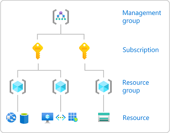
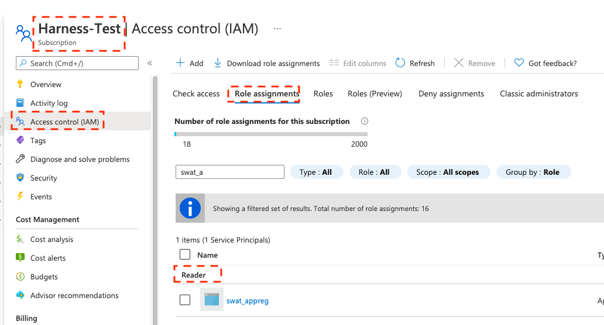
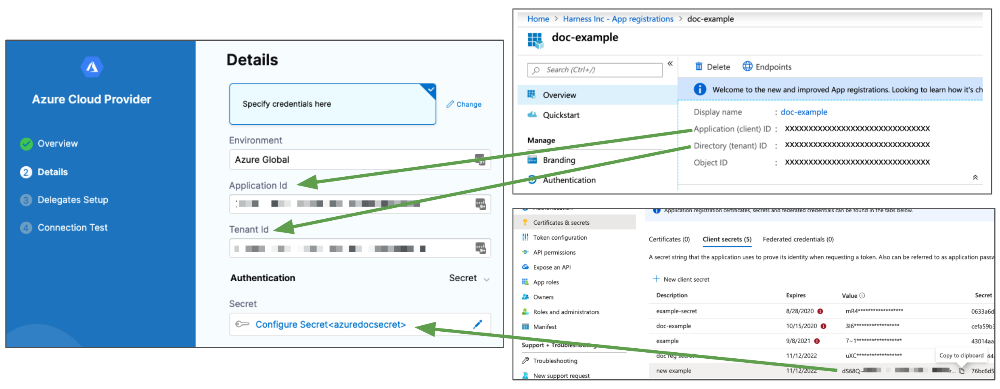
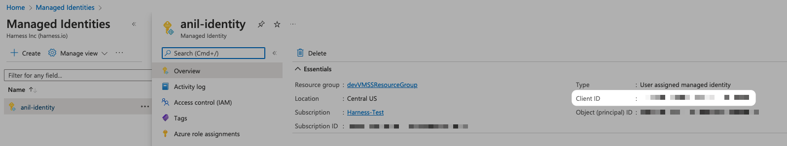
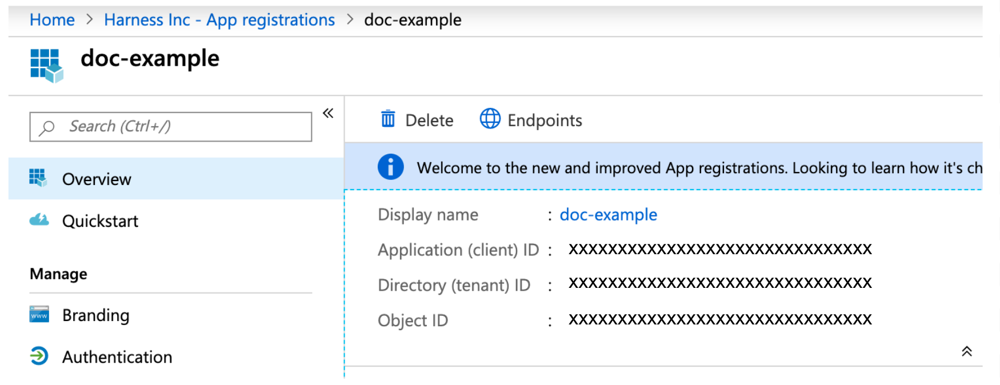

With the Microsoft Azure Cloud connector, your Harness pipelines can pull Azure artifacts and deploy your applications to Azure.

Currently, the Microsoft Azure Cloud Connector is for ACR, AKS, Web Apps, and Virtual Machines for Traditional (SSH) deployments. Support for other services such as ARM and Blueprint are coming soon.

:::tip

If you're using Harness **Cloud Cost Management (CCM)**, you can [Set Up Cloud Cost Management for Azure](../../cloud-cost-management/1-onboard-with-cloud-cost-management/set-up-cloud-cost-management/set-up-cost-visibility-for-azure.md).

:::

## Roles and permissions

This section assumes you're familiar with Azure RBAC. For details, go to the Azure documentation: [Assign Azure roles using the Azure portal](https://docs.microsoft.com/en-us/azure/role-based-access-control/role-assignments-portal).

This graphic from Azure is a useful reminder of how Azure manages RBAC:



For security reasons, Harness uses an application object and service principal rather than a user identity. The process is described in that Azure documentation: [How to use the portal to create an Azure AD application and service principal that can access resources](https://docs.microsoft.com/en-us/azure/active-directory/develop/howto-create-service-principal-portal).

### Azure Container Repository (ACR) role requirements

Harness Azure Cloud connectors that you'll use to connect to ACR must have the **Reader** role, at minimum, or an equivalent or better custom role.

```mdx-code-block
import Tabs from '@theme/Tabs';
import TabItem from '@theme/TabItem';
```
```mdx-code-block
<Tabs>
  <TabItem value="reader" label="Reader role" default>
```
The **Reader** role must be assigned at the **Subscription** level that is used by the Application (Client) Id that you'll use in the Azure Cloud connector's settings. The application must have permission to list **all** container registries.



:::tip

Make sure you:

* Don't put the **Reader** role in a different IAM section of Azure.
* Don't provide only the **AcrPull** role, instead of **Reader**. It might appear that the **AcrPull** role gives access to a specific registry, but Harness needs to list **all** registries.

:::

```mdx-code-block
  </TabItem>
  <TabItem value="custom" label="Custom role">
```

The following permissions (actions) are necessary for any Service Principal and/or Managed Identity user, regardless of whether you are using Kubernetes RBAC or Azure RBAC:
* `Microsoft.ContainerRegistry/registries/read`
* `Microsoft.ContainerRegistry/registries/builds/read`
* `Microsoft.ContainerRegistry/registries/metadata/read`
* `Microsoft.ContainerRegistry/registries/pull/read`
* `Microsoft.ContainerService/managedClusters/read`
* `Microsoft.ContainerService/managedClusters/listClusterUserCredential/action`
* `Microsoft.Resource/subscriptions/resourceGroup/read`

For Helm deployments, the version of Helm must be >= 3.2.0. The Harness `HELM_VERSION_3_8_0` feature flag must be activated.

You can't use Pod Assigned Managed Identity and System Assigned Managed Identity for the same cluster.

The following JSON sample creates a custom role with the required permissions. To use this sample, replace `xxxx` with the role name, subscription Id, and resource group Id.

```json
{
    "id": "/subscriptions/xxxx/providers/Microsoft.Authorization/roleDefinitions/xxxx",
    "properties": {
        "roleName": "xxxx",
        "description": "",
        "assignableScopes": [
            "/subscriptions/xxxx/resourceGroups/xxxx"
        ],
        "permissions": [
            {
                "actions": [],
                "notActions": [],
                "dataActions": [
                    "Microsoft.ContainerService/managedClusters/configmaps/read",
                    "Microsoft.ContainerService/managedClusters/configmaps/write",
                    "Microsoft.ContainerService/managedClusters/configmaps/delete",
                    "Microsoft.ContainerService/managedClusters/secrets/read",
                    "Microsoft.ContainerService/managedClusters/secrets/write",
                    "Microsoft.ContainerService/managedClusters/secrets/delete",
                    "Microsoft.ContainerService/managedClusters/apps/deployments/read",
                    "Microsoft.ContainerService/managedClusters/apps/deployments/write",
                    "Microsoft.ContainerService/managedClusters/apps/deployments/delete",
                    "Microsoft.ContainerService/managedClusters/events/read",
                    "Microsoft.ContainerService/managedClusters/events/write",
                    "Microsoft.ContainerService/managedClusters/events/delete",
                    "Microsoft.ContainerService/managedClusters/namespaces/read",
                    "Microsoft.ContainerService/managedClusters/nodes/read",
                    "Microsoft.ContainerService/managedClusters/pods/read",
                    "Microsoft.ContainerService/managedClusters/pods/write",
                    "Microsoft.ContainerService/managedClusters/pods/delete",
                    "Microsoft.ContainerService/managedClusters/services/read",
                    "Microsoft.ContainerService/managedClusters/services/write",
                    "Microsoft.ContainerService/managedClusters/services/delete",
                    "Microsoft.ContainerService/managedClusters/apps/statefulsets/read",
                    "Microsoft.ContainerService/managedClusters/apps/statefulsets/write",
                    "Microsoft.ContainerService/managedClusters/apps/statefulsets/delete",
                    "Microsoft.ContainerService/managedClusters/apps/replicasets/read",
                    "Microsoft.ContainerService/managedClusters/apps/replicasets/write",
                    "Microsoft.ContainerService/managedClusters/apps/replicasets/delete"
                ],
                "notDataActions": []
            }
        ]
    }
}
```

```mdx-code-block
  </TabItem>
</Tabs>
```

:::info

Harness supports 500 images from an ACR repo. If you don't see some of your images, then you might have exceeded this limit. This is the result of an Azure API limitation.

If you connect to an ACR repo via the platform-agnostic [Docker Connector](ref-cloud-providers/docker-registry-connector-settings-reference.md), the limit is 100.

:::

### Azure Web App role requirements

Harness Azure Cloud connectors that you'll use to connect to Azure Web Apps with Service Principal or Managed Identity credentials, must have the **Contributor** role, at minimum, or an equivalent or better custom role.

```mdx-code-block
import Tabs from '@theme/Tabs';
import TabItem from '@theme/TabItem';
```
```mdx-code-block
<Tabs>
  <TabItem value="contrib" label="Contributor permissions" default>
```

The follow are the Azure RBAC permissions used for System Assigned Managed Identity permissions to perform Azure Web App deployments for container and non-container artifacts:

```json
[
                    "microsoft.web/sites/slots/deployments/read",
                    "Microsoft.Web/sites/Read",
                    "Microsoft.Web/sites/config/Read",
                    "Microsoft.Web/sites/slots/config/Read",
                    "microsoft.web/sites/slots/config/appsettings/read",
                    "Microsoft.Web/sites/slots/*/Read",
                    "Microsoft.Web/sites/slots/config/list/Action",
                    "Microsoft.Web/sites/slots/stop/Action",
                    "Microsoft.Web/sites/slots/start/Action",
                    "Microsoft.Web/sites/slots/config/Write",
                    "Microsoft.Web/sites/slots/Write",
                    "microsoft.web/sites/slots/containerlogs/action",
                    "Microsoft.Web/sites/config/Write",
                    "Microsoft.Web/sites/slots/slotsswap/Action",
                    "Microsoft.Web/sites/config/list/Action",
                    "Microsoft.Web/sites/start/Action",
                    "Microsoft.Web/sites/stop/Action",
                    "Microsoft.Web/sites/Write",
                    "microsoft.web/sites/containerlogs/action",
                    "Microsoft.Web/sites/publish/Action",
                    "Microsoft.Web/sites/slots/publish/Action"
]
```

```mdx-code-block
  </TabItem>
  <TabItem value="custom" label="Custom role">
```

The following permissions (actions) are necessary for any Service Principal and/or Managed Identity user, regardless of whether you are using Kubernetes RBAC or Azure RBAC:
* `Microsoft.ContainerRegistry/registries/read`
* `Microsoft.ContainerRegistry/registries/builds/read`
* `Microsoft.ContainerRegistry/registries/metadata/read`
* `Microsoft.ContainerRegistry/registries/pull/read`
* `Microsoft.ContainerService/managedClusters/read`
* `Microsoft.ContainerService/managedClusters/listClusterUserCredential/action`
* `Microsoft.Resource/subscriptions/resourceGroup/read`

For Helm deployments, the version of Helm must be >= 3.2.0. The Harness `HELM_VERSION_3_8_0` feature flag must be activated.

You can't use Pod Assigned Managed Identity and System Assigned Managed Identity for the same cluster.

The following JSON sample creates a custom role with the required permissions. To use this sample, replace `xxxx` with the role name, subscription Id, and resource group Id.

```json
{
    "id": "/subscriptions/xxxx/providers/Microsoft.Authorization/roleDefinitions/xxxx",
    "properties": {
        "roleName": "xxxx",
        "description": "",
        "assignableScopes": [
            "/subscriptions/xxxx/resourceGroups/xxxx"
        ],
        "permissions": [
            {
                "actions": [],
                "notActions": [],
                "dataActions": [
                    "Microsoft.ContainerService/managedClusters/configmaps/read",
                    "Microsoft.ContainerService/managedClusters/configmaps/write",
                    "Microsoft.ContainerService/managedClusters/configmaps/delete",
                    "Microsoft.ContainerService/managedClusters/secrets/read",
                    "Microsoft.ContainerService/managedClusters/secrets/write",
                    "Microsoft.ContainerService/managedClusters/secrets/delete",
                    "Microsoft.ContainerService/managedClusters/apps/deployments/read",
                    "Microsoft.ContainerService/managedClusters/apps/deployments/write",
                    "Microsoft.ContainerService/managedClusters/apps/deployments/delete",
                    "Microsoft.ContainerService/managedClusters/events/read",
                    "Microsoft.ContainerService/managedClusters/events/write",
                    "Microsoft.ContainerService/managedClusters/events/delete",
                    "Microsoft.ContainerService/managedClusters/namespaces/read",
                    "Microsoft.ContainerService/managedClusters/nodes/read",
                    "Microsoft.ContainerService/managedClusters/pods/read",
                    "Microsoft.ContainerService/managedClusters/pods/write",
                    "Microsoft.ContainerService/managedClusters/pods/delete",
                    "Microsoft.ContainerService/managedClusters/services/read",
                    "Microsoft.ContainerService/managedClusters/services/write",
                    "Microsoft.ContainerService/managedClusters/services/delete",
                    "Microsoft.ContainerService/managedClusters/apps/statefulsets/read",
                    "Microsoft.ContainerService/managedClusters/apps/statefulsets/write",
                    "Microsoft.ContainerService/managedClusters/apps/statefulsets/delete",
                    "Microsoft.ContainerService/managedClusters/apps/replicasets/read",
                    "Microsoft.ContainerService/managedClusters/apps/replicasets/write",
                    "Microsoft.ContainerService/managedClusters/apps/replicasets/delete"
                ],
                "notDataActions": []
            }
        ]
    }
}
```

```mdx-code-block
  </TabItem>
</Tabs>
```

## Connect Harness to Azure Kubernetes Services (AKS)

There are three options for connecting Harness to an AKS cluster:

* Use the platform-agnostic [Kubernetes cluster connector](add-a-kubernetes-cluster-connector.md). with a Kubernetes delegate.
    + You'll need to install a [Kubernetes delegate](../2_Delegates/advanced-installation/install-a-kubernetes-delegate.md) in the target AKS cluster, and then use the delegate's credentials for the Kubernetes cluster connector's authentication method.
	+ You won't need to provide Microsoft Azure Service Principal or Managed Identity credentials.
* Use a **Microsoft Azure Cloud Provider connector**, as described in this topic, with a Kubernetes delegate.
    + You'll need to install a [Kubernetes delegate](../2_Delegates/advanced-installation/install-a-kubernetes-delegate.md) in the target AKS cluster, and then use the delegate's credentials for the Azure Cloud connector's authentication method.
	+ You'll need to provide the Microsoft Azure Environment.
	+ If you use a User Assigned Managed Identity, you'll need to provide the Application (client) Id.
	+ If you use a System Assigned Managed Identity, you won't need to provide any Ids.
* Use a **Microsoft Azure Cloud Connector** with Service Principal or Managed Identity credentials, as described in this topic.
    + You must assign the **Owner** role or an equivalent custom role, as explained in [AKS role requirements](#aks-role-requirements).

### AKS cluster setup requirements

* AKS managed AAD, enabled or disabled.
* Kubernetes RBAC, enabled.
* Azure RBAC, enabled or disabled.
	+ For more information, go to the **Deployments (CD)** section of the [Kubernetes cluster connector settings reference](ref-cloud-providers/kubernetes-cluster-connector-settings-reference.md).
* AKS property `disableLocalAccounts`, enabled or disabled, unless used for deployment.
    + To use an AKS cluster for deployment, the AKS cluster must have local accounts enabled (`disableLocalAccounts=false`).

### AKS role requirements

If you use the Microsoft Azure Cloud connector to connect to AKS with Service Principal or Managed Identity credentials, you must assign the **Owner** role or an equivalent custom role.

```mdx-code-block
import Tabs from '@theme/Tabs';
import TabItem from '@theme/TabItem';
```
```mdx-code-block
<Tabs>
  <TabItem value="custom" label="Custom role" default>
```

The following permissions (actions) are necessary for any Service Principal and/or Managed Identity user, regardless of whether you are using Kubernetes RBAC or Azure RBAC:
* `Microsoft.ContainerRegistry/registries/read`
* `Microsoft.ContainerRegistry/registries/builds/read`
* `Microsoft.ContainerRegistry/registries/metadata/read`
* `Microsoft.ContainerRegistry/registries/pull/read`
* `Microsoft.ContainerService/managedClusters/read`
* `Microsoft.ContainerService/managedClusters/listClusterUserCredential/action`
* `Microsoft.Resource/subscriptions/resourceGroup/read`

For Helm deployments, the version of Helm must be >= 3.2.0. The Harness `HELM_VERSION_3_8_0` feature flag must be activated.

You can't use Pod Assigned Managed Identity and System Assigned Managed Identity for the same cluster.

The following JSON sample creates a custom role with the required permissions. To use this sample, replace `xxxx` with the role name, subscription Id, and resource group Id.

```json
{
    "id": "/subscriptions/xxxx/providers/Microsoft.Authorization/roleDefinitions/xxxx",
    "properties": {
        "roleName": "xxxx",
        "description": "",
        "assignableScopes": [
            "/subscriptions/xxxx/resourceGroups/xxxx"
        ],
        "permissions": [
            {
                "actions": [],
                "notActions": [],
                "dataActions": [
                    "Microsoft.ContainerService/managedClusters/configmaps/read",
                    "Microsoft.ContainerService/managedClusters/configmaps/write",
                    "Microsoft.ContainerService/managedClusters/configmaps/delete",
                    "Microsoft.ContainerService/managedClusters/secrets/read",
                    "Microsoft.ContainerService/managedClusters/secrets/write",
                    "Microsoft.ContainerService/managedClusters/secrets/delete",
                    "Microsoft.ContainerService/managedClusters/apps/deployments/read",
                    "Microsoft.ContainerService/managedClusters/apps/deployments/write",
                    "Microsoft.ContainerService/managedClusters/apps/deployments/delete",
                    "Microsoft.ContainerService/managedClusters/events/read",
                    "Microsoft.ContainerService/managedClusters/events/write",
                    "Microsoft.ContainerService/managedClusters/events/delete",
                    "Microsoft.ContainerService/managedClusters/namespaces/read",
                    "Microsoft.ContainerService/managedClusters/nodes/read",
                    "Microsoft.ContainerService/managedClusters/pods/read",
                    "Microsoft.ContainerService/managedClusters/pods/write",
                    "Microsoft.ContainerService/managedClusters/pods/delete",
                    "Microsoft.ContainerService/managedClusters/services/read",
                    "Microsoft.ContainerService/managedClusters/services/write",
                    "Microsoft.ContainerService/managedClusters/services/delete",
                    "Microsoft.ContainerService/managedClusters/apps/statefulsets/read",
                    "Microsoft.ContainerService/managedClusters/apps/statefulsets/write",
                    "Microsoft.ContainerService/managedClusters/apps/statefulsets/delete",
                    "Microsoft.ContainerService/managedClusters/apps/replicasets/read",
                    "Microsoft.ContainerService/managedClusters/apps/replicasets/write",
                    "Microsoft.ContainerService/managedClusters/apps/replicasets/delete"
                ],
                "notDataActions": []
            }
        ]
    }
}
```

```mdx-code-block
  </TabItem>
  <TabItem value="k8sRbac" label="Kubernetes RBAC example">
```

Here's an example of Kubernetes RBAC permissions used for System Assigned Managed Identity.

```
kind: Role
apiVersion: rbac.authorization.k8s.io/v1
metadata:
  name: cdp-qa-deployer-role
  namespace: default
rules:
  - apiGroups: ["", "apps"]
    resources: ["pods", "configmaps", "deployments", "secrets", "events", "services",  "replicasets", "deployments/scale", "namespaces", "resourcequotas", "limitranges"]
    verbs: ["get", "watch", "list", "create", "update", "patch", "delete"]
---
kind: RoleBinding
apiVersion: rbac.authorization.k8s.io/v1
metadata:
  name: cdp-qa-deployer-role-binding
  namespace: default
roleRef:
  apiGroup: rbac.authorization.k8s.io
  kind: Role
  name: cdp-qa-deployer-role
subjects:
  - kind: Group
    namespace: default
    name: <AD group id to which the SP and MSI users are assigned>
```

```mdx-code-block
  </TabItem>
  <TabItem value="azureRbac" label="Azure RBAC example">
```

Here's an example of Azure RBAC permissions used for System Assigned Managed Identity. To use this sample, replace `xxxx` with the subscription Id and resource group Id.

```json
{
    "id": "/subscriptions/xxxx/providers/Microsoft.Authorization/roleDefinitions/xxxx",
    "properties": {
        "roleName": "HarnessSysMSIRole",
        "description": "",
        "assignableScopes": [
            "/subscriptions/xxxx/resourceGroups/xxxx"
        ],
        "permissions": [
            {
                "actions": [],
                "notActions": [],
                "dataActions": [
                    "Microsoft.ContainerService/managedClusters/configmaps/read",
                    "Microsoft.ContainerService/managedClusters/configmaps/write",
                    "Microsoft.ContainerService/managedClusters/configmaps/delete",
                    "Microsoft.ContainerService/managedClusters/secrets/read",
                    "Microsoft.ContainerService/managedClusters/secrets/write",
                    "Microsoft.ContainerService/managedClusters/secrets/delete",
                    "Microsoft.ContainerService/managedClusters/apps/deployments/read",
                    "Microsoft.ContainerService/managedClusters/apps/deployments/write",
                    "Microsoft.ContainerService/managedClusters/apps/deployments/delete",
                    "Microsoft.ContainerService/managedClusters/events/read",
                    "Microsoft.ContainerService/managedClusters/events/write",
                    "Microsoft.ContainerService/managedClusters/events/delete",
                    "Microsoft.ContainerService/managedClusters/namespaces/read",
                    "Microsoft.ContainerService/managedClusters/nodes/read",
                    "Microsoft.ContainerService/managedClusters/pods/read",
                    "Microsoft.ContainerService/managedClusters/pods/write",
                    "Microsoft.ContainerService/managedClusters/pods/delete",
                    "Microsoft.ContainerService/managedClusters/services/read",
                    "Microsoft.ContainerService/managedClusters/services/write",
                    "Microsoft.ContainerService/managedClusters/services/delete",
                    "Microsoft.ContainerService/managedClusters/apps/statefulsets/read",
                    "Microsoft.ContainerService/managedClusters/apps/statefulsets/write",
                    "Microsoft.ContainerService/managedClusters/apps/statefulsets/delete",
                    "Microsoft.ContainerService/managedClusters/apps/replicasets/read",
                    "Microsoft.ContainerService/managedClusters/apps/replicasets/write",
                    "Microsoft.ContainerService/managedClusters/apps/replicasets/delete"
                ],
                "notDataActions": []
            }
        ]
    }
}
```

```mdx-code-block
  </TabItem>
</Tabs>
```

## Step 1: Add the Azure Cloud Connector

You can add the Azure Cloud Connector inline, when adding artifacts or setting up the target infrastructure for a deployment Pipeline stage, or you can add the Connector separately and use it whenever you need it.

To add the Connector separately, in your Account, Org, or Project **Connectors**, click **New Connector**.

Click **Azure**.

Enter a name for the Connector. Harness automatically creates the Id ([Entity Identifier](../20_References/entity-identifier-reference.md)) for the Connector. You can edit the Id before the Connector is saved. Once it is saved, it is immutable.

Add a Description and [Tags](../20_References/tags-reference.md) if needed.

Click **Continue**.

## Option: Credentials or Inherit from Delegate

In **Details**, you can select how you'd like Harness to authenticate with Azure.

### Visual Summary

The following example shows how to connect Harness to Azure using the Azure Cloud Connector and an Azure App registration.




### Delegate

If you have a Harness Delegate installed in your Azure subscription (preferably in your target AKS cluster) you can select **Use the credentials of a specific Harness Delegate**.

For steps on installing a Delegate, see [Delegate Installation Overview](/docs/platform/2_Delegates/get-started-with-delegates/delegate-installation-overview.md).


In **Environment**, select **Azure Global** or **US Government**.

In **Authentication**, select **System Assigned Managed Identity** or **User Assigned Managed Identity**.

See [Use managed identities in Azure Kubernetes Service](https://docs.microsoft.com/en-us/azure/aks/use-managed-identity) and [How to use managed identities with Azure Container Instances](https://docs.microsoft.com/en-us/azure/container-instances/container-instances-managed-identity) from Azure.If you selected **User Assigned Managed Identity**, in **Client Id**, enter the Client Id from your Managed Identity.


If you selected **User Assigned Managed Identity**, you can also use a [Pod Assigned Managed identity](https://docs.microsoft.com/en-us/azure/aks/use-azure-ad-pod-identity).

If you selected **System Assigned Managed Identity**, click **Continue**.

### System Assigned Managed Identity Notes

* If you select **System Assigned Managed Identity** in the Harness Azure Connector, the identity used is actually AKS cluster predefined [Kubelet Managed Identity](https://docs.microsoft.com/en-us/azure/aks/use-managed-identity#summary-of-managed-identities).
* Kubelet Managed Identity (which has name format `<AKSName>-agentpool`) must have the **acrPull** permission on ACR (if used for image storage).
* [Control plane AKS Managed Identity](https://docs.microsoft.com/en-us/azure/aks/use-managed-identity#summary-of-managed-identities) (which has name format `<AKSName>`) must have the **Reader** permission on the AKS cluster itself.

### Credentials

Using Azure credentials is covered in the following steps.

## Step 2: Gather the Required Information

In Microsoft Azure, you can find the information you need on the App registration **Overview** page:


## Step 3: Environment

In **Environment**, select **Azure Global** or **US Government**.

## Step 4: Application (Client) Id

This is the **Application (Client) Id** for the Azure app registration you are using. It is found in the Azure Active Directory (AAD) **App registrations** or **Managed Identity**. For more information, see [Quickstart: Register an app with the Azure Active Directory v1.0 endpoint](https://docs.microsoft.com/en-us/azure/active-directory/develop/quickstart-v1-add-azure-ad-app) from Microsoft.

To access resources in your Azure subscription, you must assign the Azure App registration using this Application Id to a role in that subscription.

For more information, see [Assign the application to a role](https://docs.microsoft.com/en-us/azure/active-directory/develop/howto-create-service-principal-portal#assign-the-application-to-a-role) and [Use the portal to create an Azure AD application and service principal that can access resources](https://docs.microsoft.com/en-us/azure/active-directory/develop/howto-create-service-principal-portal) from Microsoft.

## Step 5: Tenant (Directory) Id

The **Tenant Id** is the ID of the Azure Active Directory (AAD) in which you created your application. This Id is also called the **Directory ID**. For more information, see [Get tenant ID](https://docs.microsoft.com/en-us/azure/azure-resource-manager/resource-group-create-service-principal-portal#get-tenant-id) and [Use the portal to create an Azure AD application and service principal that can access resources](https://docs.microsoft.com/en-us/azure/active-directory/develop/howto-create-service-principal-portal) from Azure.

## Step 6: Secret or Certificate

Harness supports PEM files only. Currently, Harness does not support PFX files.In **Authentication**, select **Secret** or **Certificate**.

This is the authentication key for your application. This is found in **Azure Active Directory**, **App Registrations**. Click the App name. Click **Certificates & secrets**, and then click **New client secret**.


(./static/add-a-microsoft-azure-connector-69.png)
You cannot view existing secret values, but you can create a new key. For more information, see [Create a new application secret](https://docs.microsoft.com/en-us/azure/active-directory/develop/howto-create-service-principal-portal#create-a-new-application-secret) from Azure.

If you select **Secret**, create or use an existing [Harness Text Secret](../6_Security/2-add-use-text-secrets.md).

If you select **Certificate**, create or use an existing [Harness File Secret](../6_Security/3-add-file-secrets.md).

## Step 7: Delegates Setup

Select the Delegate(s) to use with this Connector.

Click **Save and Continue**.

In **Connection Test**, the connection is verified.

If you run into errors, make sure that your Delegate is running and that your credentials are valid. For example, check that the secret has not expired in your App registration.

## Review: Using ${HARNESS\_KUBE\_CONFIG\_PATH} with Azure

The Harness `${HARNESS_KUBE_CONFIG_PATH}` expression resolves to the path to a Harness-generated kubeconfig file containing the credentials you provided to Harness.

The credentials can be used by kubectl commands by exporting its value to the `KUBECONFIG` environment variable.

For example, you could use a Harness Shell Script step and the expression like this:


```
export KUBECONFIG=${HARNESS_KUBE_CONFIG_PATH} kubectl get pods -n default
```
Steps can be executed on any Delegate or you can select specific Delegates using the steps [Delegate Selector](../2_Delegates/manage-delegates/select-delegates-with-selectors.md) setting.

For Azure deployments, note the following:

* If the Azure Connector used in the Stage's **Infrastructure** uses Azure Managed Identity for authentication, then the Shell Script step must use a Delegate Selector for a Delegate running in AKS.
* If the Azure Connector used in the Stage's **Infrastructure** uses Azure Service Principal for authentication, then the Shell Script step can use any Delegate.

## See also

* [Azure ACR to AKS CD Quickstart](../../continuous-delivery/onboard-cd/cd-quickstarts/azure-cd-quickstart.md)
* [Kubernetes CD Quickstart](../../continuous-delivery/onboard-cd/cd-quickstarts/kubernetes-cd-quickstart.md)
* [Harness Key Concepts](../../getting-started/learn-harness-key-concepts.md)
* [CD Pipeline Basics](../../continuous-delivery/onboard-cd/cd-concepts/cd-pipeline-basics.md)
