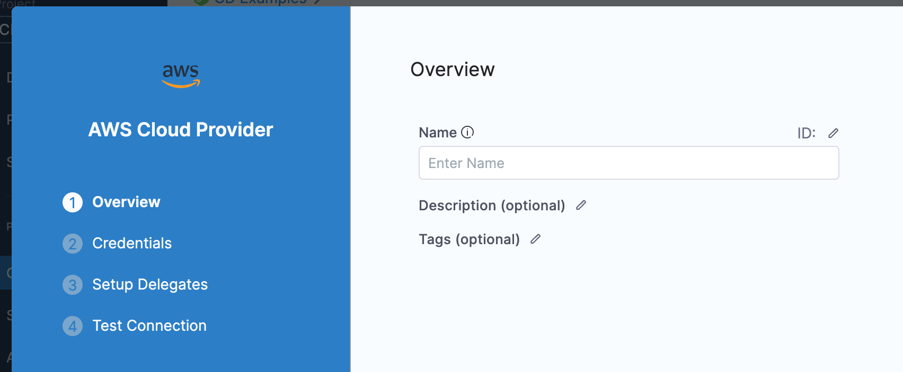

AWS is integrated with Harness using a Harness AWS Connector. You can use AWS with Harness for obtaining artifacts, communicating with AWS services, provisioning infrastructure, and deploying microservices and other workloads.

This topic explains how to set up the AWS Connector.

**What IAM roles should my AWS account have?** What IAM roles and policies needed by the AWS account used in the Connector depend on what AWS service you are using with Harness and what operations you want Harness to perform in AWS. For a list of roles and policies, see [AWS Connector Settings Reference](ref-cloud-providers/aws-connector-settings-reference.md).The [DescribeRegions](https://docs.aws.amazon.com/AWSEC2/latest/APIReference/API_DescribeRegions.html) action is required for all AWS Connectors regardless of what AWS service you are using for your target infrastructure.

### Before you begin

* [Learn Harness' Key Concepts](https://ngdocs.harness.io/article/hv2758ro4e-learn-harness-key-concepts)

### Review: IAM Roles and Policies for the Connector

The [DescribeRegions](https://docs.aws.amazon.com/AWSEC2/latest/APIReference/API_DescribeRegions.html) action is required for all AWS Connectors regardless of what AWS service you are using for your target infrastructure.The IAM roles and policies needed by the AWS account used in the Connector depend on what AWS service you are using with Harness and what operations you want Harness to perform in AWS.

For a list of roles and policies, see [AWS Connector Settings Reference](ref-cloud-providers/aws-connector-settings-reference.md).

The AWS [IAM Policy Simulator](https://docs.aws.amazon.com/IAM/latest/UserGuide/access_policies_testing-policies.html) is a useful tool for evaluating policies and access.

### Review: Kubernetes Cluster Connector for EKS

If you want to connect Harness to Elastic Kubernetes Service (Amazon EKS), use the platform-agnostic [Kubernetes Cluster Connector](connect-to-a-cloud-provider.md).

### Review: Switching IAM Policies

If the IAM role used by your AWS Connector does not have the policies required by the AWS service you want to access, you can modify or switch the role.

You simply change the role assigned to the AWS account or the Harness Delegate your AWS Connector is using.

When you switch or modify the IAM role, it might take up to 5 minutes to take effect.

The [DescribeRegions](https://docs.aws.amazon.com/AWSEC2/latest/APIReference/API_DescribeRegions.html) action is required for all AWS Connectors regardless of what AWS service you are using for your target infrastructure.

### Supported Platforms and Technologies

For a list of the platforms and technologies supported by Harness, see [Supported Platforms and Technologies](https://docs.harness.io/article/1e536z41av).

### Step 1: Add an AWS Connector

Open a Harness Project.

In **Project Setup**, click **Connectors**.

Click **New Connector**, and click **AWS**. The AWS Connector settings appear.

In **Name**, enter a name for this connector.

Harness automatically creates the corresponding Id.

Click **Continue**.

### Step 2: Enter Credentials

The [DescribeRegions](https://docs.aws.amazon.com/AWSEC2/latest/APIReference/API_DescribeRegions.html) action is required for all AWS Connectors regardless of what AWS service you are using for your target infrastructure.There are three options for authenticating with AWS:

* **AWS Access Key:** enter the AWS access and secret key for an AWS IAM user.
* **Assume IAM role on Delegate:** add or select a Harness Delegate running in AWS. The AWS IAM role used when installing the Delegate in AWS is used for authentication by the AWS Connector.  
For example, you can add or select a Harness Kubernetes Delegate running in Amazon Elastic Kubernetes Service (Amazon EKS).
* **Use IRSA:** have the Harness Kubernetes Delegate in AWS EKS use a specific IAM role when making authenticated requests to resources. This option uses [IRSA (IAM roles for service accounts)](https://docs.aws.amazon.com/emr/latest/EMR-on-EKS-DevelopmentGuide/setting-up-enable-IAM.html).

All of the settings for these options are described in detail in [AWS Connector Settings Reference](ref-cloud-providers/aws-connector-settings-reference.md).

### Test Region and AWS GovCloud Support

By default, Harness uses the **us-east-1** region to test the credentials for this Connector.

If you want to use an AWS GovCloud account for this Connector, select it in **Test Region**.

GovCloud is used by organizations such as government agencies at the federal, state, and local level, as well as contractors, educational institutions. It is also used for regulatory compliance with these organizations.

#### Restrictions

You can access AWS GovCloud with AWS GovCloud credentials (AWS GovCloud account access key and AWS GovCloud IAM user credentials).

You cannot access AWS GovCloud with standard AWS credentials. Likewise, you cannot access standard AWS regions using AWS GovCloud credentials.

### Step 3: Set Up Delegates

Harness uses AWS Connectors at Pipeline runtime to authenticate and perform operations with AWS. Authentications and operations are performed by Harness Delegates.

You can select **Any Available Harness Delegate** and Harness will select the Delegate. For a description of how Harness picks Delegates, see [Delegates Overview](../2_Delegates/delegates-overview.md).

You can use Delegate Tags to select one or more Delegates. For details on Delegate Tags, see [Select Delegates with Tags](../2_Delegates/delegate-guide/select-delegates-with-selectors.md).

If you need to install a Delegate, see [Delegate Installation Overview](https://docs.harness.io/article/re8kk0ex4k-delegate-installation-overview).

Click **Save and Continue**.

Harness tests the credentials you provided using the Delegates you selected.

If the credentials fail, you'll see an error such as `AWS was not able to validate the provided access credentials`. Check your credentials by using them with the AWS CLI or console.

The AWS [IAM Policy Simulator](https://docs.aws.amazon.com/IAM/latest/UserGuide/access_policies_testing-policies.html) is a useful tool for evaluating policies and access.The credentials might work fine for authentication, but might fail later when you use the Connector with a Pipeline because the IAM role the Connector is using does not have the roles and policies needed for the Pipeline's operations.

For example, the [DescribeRegions](https://docs.aws.amazon.com/AWSEC2/latest/APIReference/API_DescribeRegions.html) action is required for all AWS Cloud Providers regardless of what AWS service you are using for your target infrastructure.

If you run into any error with an AWS Connector, verify that the IAM roles and policies it using are correct.

For a list of roles and policies, see [AWS Connector Settings Reference](ref-cloud-providers/aws-connector-settings-reference.md).

Click **Finish**.

