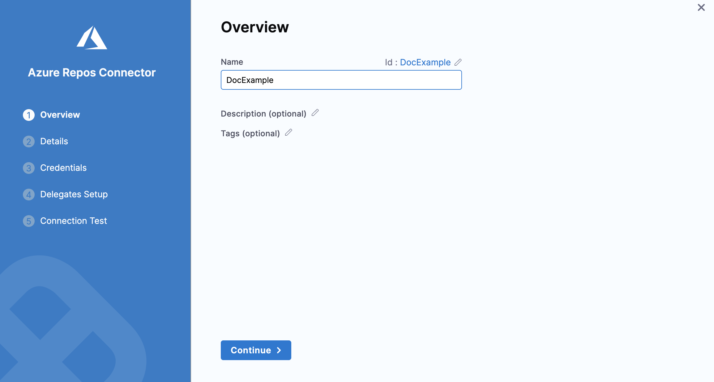
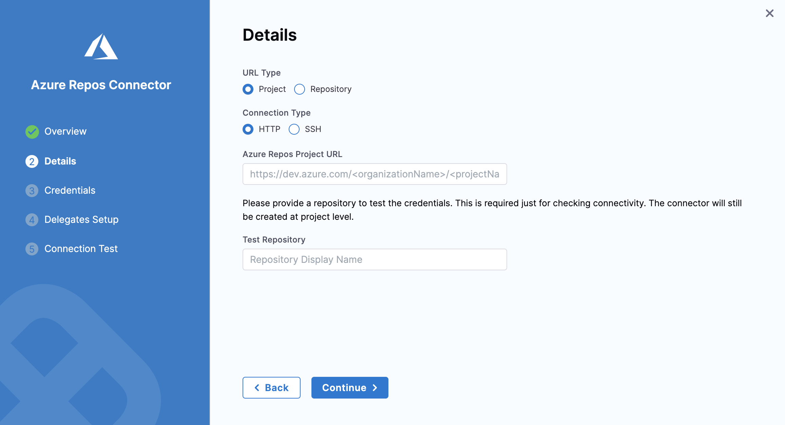
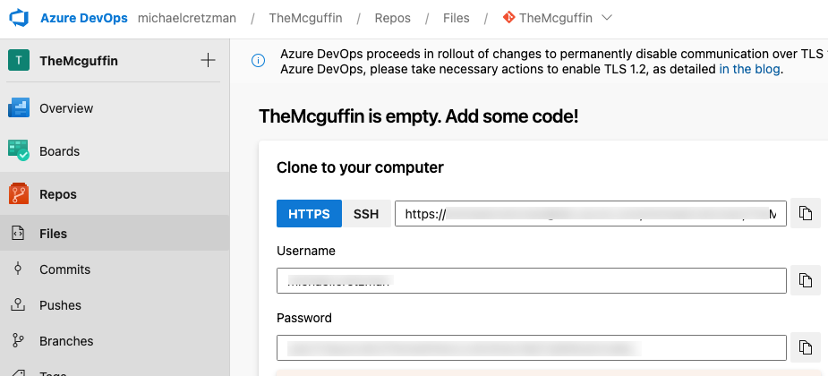
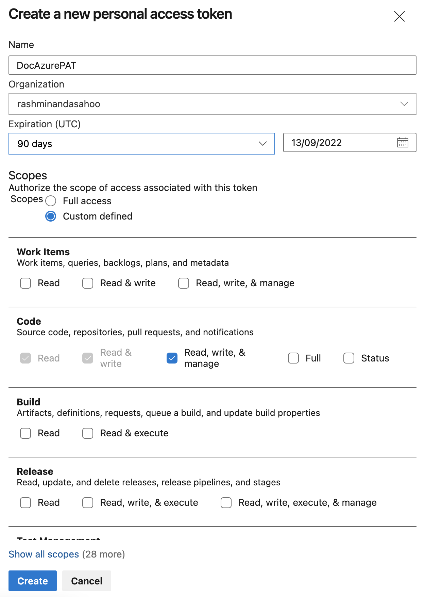

Azure Repos is a set of version control tools that you can use to manage your code. Azure Repos provide the following kinds of version control:

* **Git**: distributed version control
* **Team Foundation Version Control** (TFVC): centralized version control

This topic explains how to connect your Harness Accounts, Organizations or Projects with one of the Azure Repos. You can do this by adding an Azure Repos connector to Harness.

### Before you begin

* Make sure you have set up your Azure Project and Repo.
* Make sure you have **Create/Edit** permissions to add an Azure Repos connector in Harness.

### Step 1: Add an Azure Repos Connector

This topic assumes you have a Harness Project set up. If not, see [Create Organizations and Projects](../1_Organizations-and-Projects/2-create-an-organization.md).​

You can add a Connector from any module in your Project in Project setup.

This topic shows you how to create an Azure Repos Connector from the CD module. To do this, perform the below steps:​

In Harness, click **Deployments** and select your Project.

Click **Project Setup** and then click **Connectors**.

Click **New Connector**.

In **Code Repositories**, click **Azure Repos**.

The **Azure Repos Connector** settings appear.

Enter a **Name** for your Azure Repos Connector.


Click **Continue**.

### Step 2: Details

Select **Project** or **Repository** in the **URL Type**.


#### Option: Project

Select **HTTP** or **SSH** in the **Connection Type**.

Enter your Azure Repos Project URL. For example: `https://dev.azure.com/mycomp/myproject`.

Be careful when copying the project URL because if you are looking a Repos the URL will include `_git` in the path.If you selected Project, enter the **name** of your repository in **Test Repository**, not the full URL.


You can get the project URL from your browser's location field.

#### Option: Repository

Enter your **Azure Repos Repository URL**. For example: `https://johnsmith@dev.azure.com/johnsmith/MyProject/_git/myrepo`.

 You can get the repo URL from the Azure repo:


Click **Continue**.

### Step 3: Credentials

Enter the username and password from the repo.


#### Enable API Access

This option is required for using Git-based triggers, Webhooks management, and updating Git statuses.​

This is a common option for code repos.

In **Personal Access Token**, either create a new [Encrypted Text](../6_Security/2-add-use-text-secrets.md) or use an existing one that has your Azure Personal Access Token.​ Harness requires the token for API access. Generate the token in your Azure account and add it to Harness as a Secret.

To create a Personal Acces Token in Azure, see [Create a PAT](https://docs.microsoft.com/en-us/azure/devops/organizations/accounts/use-personal-access-tokens-to-authenticate?view=azure-devops&tabs=Windows#create-a-pat).


If you selected **SSH** as the **Connection Type**, you must add your SSH Private key to use with the connection as a [Harness Encrypted Text](../6_Security/2-add-use-text-secrets.md).

To create a private SSH Key, enter the following command in your terminal window:


```
 ssh-keygen -t rsa
```
For more information​, see [Create SSH Keys](https://docs.microsoft.com/en-us/azure/devops/repos/git/use-ssh-keys-to-authenticate?view=azure-devops#step-1-create-your-ssh-keys).

Click **Continue**.

### Delegates Setup

Select one of the following:

* **Use any available Delegate:** to let Harness select a Delegate at runtime.
* **Only use Delegates with all of the following tags:** to use specific Delegates using their Tags.

Click **Save and Continue**.

Harness tests the connection. Click **Finish** once the verification is successful.​

The Azure Repos connector is listed in Connectors.

