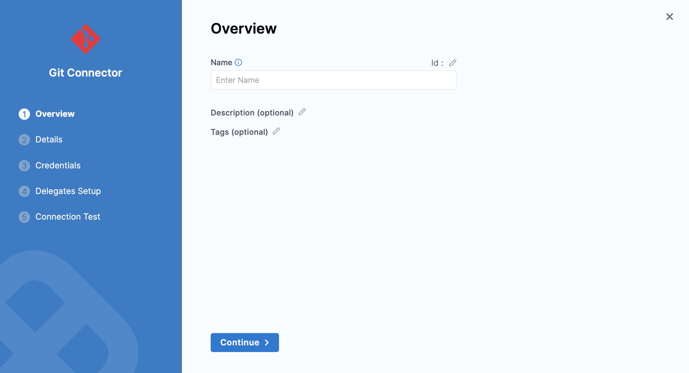
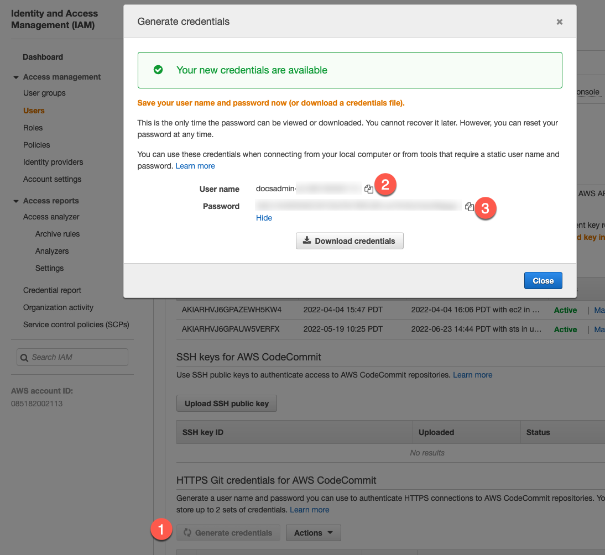

Harness Code Repository Connectors connect your Harness account with your Git platform. Connectors are used to pull important files, such as Helm charts, Kubernetes manifests, and Terraform scripts.

### Connect to Your Git Repositories

You can add a Code Repo Connector to the Account, Org, or Project scope. This topic will explain how to add it to the Project scope. The process is the same for Org and Account. 

### Limitations

* Harness performs a `git clone` to fetch files. If the fetch is timing out, it can be because the repo is too large for the network connection to fetch it before timing out. To fetch very large repos, enable the feature flag `OPTIMIZED_GIT_FETCH_FILES`. When this feature flag is enabled, Harness will use provider-specific APIs to improve performance.Currently, this feature is behind the feature flag `OPTIMIZED_GIT_FETCH_FILES`. Contact [Harness Support](mailto:support@harness.io) to enable the feature.

### Permissions

In general, the Git provider user account you use to set up the Connector needs the same permissions it would need if you were working from Git.

So, if you are using the Harness Connector to pull manifests from a repo, the user account you use in the Connector must have a `read repo` permission for your Git provider.

For Harness Git Experience, see [Source Code Manager Settings](ref-source-repo-provider/source-code-manager-settings.md).

A public Git repo does not require a username and password/token. Harness does not validate public Git repo credentials.

### Add a Git Repo

In most cases, you'll want to add a Connector for a popular Git provider like GitHub, described in [Add a GitHub Connector](add-a-git-hub-connector.md). You can also add a platform-agnostic connection to a Git provider using **Git Repo**.

For more details on the settings to create this connector, see [Git Connector Settings Reference](ref-source-repo-provider/git-connector-settings-reference.md).

1. In your **Project** select a module such as CD.
2. In **Project Setup**, click **Connectors**.
3. Click **New Connector**, and click **Git** in **Code Repositories**. The Git settings appear.
   
   

4. In **Name**, enter a name for this connector.
5. Select **Account** (which is an Organization) or **Repository** in **URL Type**.
6. Select **Connection Type** as **HTTP** or **SSH**. For more information, see [Connection Type](ref-source-repo-provider/git-hub-connector-settings-reference.md#connection-type).
7. Enter the Git Account (org) or repo URL.
8. If you selected **Account**, in **Test Repository**, enter a repository name to test the connection.
9. Click **Continue**.
10. In **Credentials,** Enter your **Username**.
11. In **Secret Key** you can either create a new [Encrypted Text](../6_Security/2-add-use-text-secrets.md) or use an existing one.
12. Click **Continue**.
13. In **Setup Delegates**, you can choose **Connect via any delegate** or **Connect only via delegates which has all of the following tags**.
14. Click **Save and Continue**.
15. Once the Test Connection succeeds, click **Finish**. The Connector is listed in Connectors.

### ​Add GitHub Repo

See [Add a GitHub Connector](add-a-git-hub-connector.md).

### Add AWS CodeCommit Repo

For details on settings and permissions, see [AWS CodeCommit Connector Settings Reference](https://docs.harness.io/article/jed9he2i45-aws-code-commit-connector-settings-reference).

:::note
For steps on setting up the IAM user for CodeCommit connections, go to [Setup for HTTPS users using Git credentials from AWS](https://docs.aws.amazon.com/codecommit/latest/userguide/setting-up-gc.html).

:::

1. Open a Harness Project.
2. In **Project Setup**, click **Connectors**.
3. Click **New Connector**, and click **AWS CodeCommit** in **Code Repositories**. The AWS CodeCommit settings appear.
4. In **Name**, enter a name for this connector.
5. Select **Region** or **Repository**.
   * **Region:** Connect to an entire AWS region. This enables you to use one Connector for all repos in the region. If you select this, you must provide a repository name to test the connection.
   * **Repository:** Connect to one repo.
  
6. Enter the repository URL in **AWS CodeCommit Repository URL**. For example, `https://git-codecommit.us-west-2.amazonaws.com/v1/repos/doc-text`.  
   You can get this URL from your CodeCommit repo by using its **Clone URL** menu and selecting **Clone HTTPS**.
7. Click **Save and Continue**.
8. Enter IAM user's access key in **Access Key**.
9. Enter the corresponding secret key in **Secret Key**. You can either create a new [Encrypted Text](../6_Security/2-add-use-text-secrets.md) or use an existing one.
10. Click **Save and Continue**.
11. Once the Test Connection succeeds, click **Finish**. The Connector is listed in Connectors.

#### Required Credentials

The IAM account you use to connect to CodeCommit must have the following policies:

* **AWSCodeCommitPowerUser**
* **DescribeRegions**

The [DescribeRegions](https://docs.aws.amazon.com/AWSEC2/latest/APIReference/API_DescribeRegions.html) action is required for all AWS connections regardless of what AWS resource you are using with Harness.

For more details, go to [Setup for HTTPS users using Git credentials from AWS](https://docs.aws.amazon.com/codecommit/latest/userguide/setting-up-gc.html) and [AWS managed policies for CodeCommit](https://docs.aws.amazon.com/codecommit/latest/userguide/security-iam-awsmanpol.html) from AWS.

#### Connect to CodeCommit using the platform-agnostic Git Connector

You can also connect to CodeCommit using the Harness platform-agnostic **Git Connector** as opposed to the **AWS CodeCommit Connector**.

With the Git Connector, you use the IAM user's User Name and Password and not the Access Key and Secret Key.

In the IAM User you want to use, click **Security credentials**, and then generate credentials in **HTTPS Git credentials for AWS CodeCommit**.

In the Harness CodeCommit Connector, in **Access Key**, enter the **User name** from the IAM user credentials you generated.

In **Secret Key**, use a [Harness Encrypted Text secret](../6_Security/2-add-use-text-secrets.md) for the **Password** of the IAM user account.

### Add a Bitbucket Repo

:::note
For more details on the settings to create this connector, see [Bitbucket Connector Settings Reference](ref-source-repo-provider/bitbucket-connector-settings-reference.md).

:::

:::note
Harness supports both Cloud and Data Center (On-Prem) versions of Bitbucket.

:::

1. Open a Harness Project.
2. In **Project Setup**, click **Connectors**.
3. Click **New Connector**, and click **Bitbucket** in **Code Repositories**. The Bitbucket settings appear.
4. In **Name**, enter a name for this connector.
5. Select **Account** or **Repository** in **URL Type**.
6. Select **Connection Type** as **HTTP** or **SSH**. For more information, see [Connection Type](ref-source-repo-provider/bitbucket-connector-settings-reference.md#connection-type).
7. Enter your **Bitbucket Account URL**.  
For **HTTP**, the format for the URL should be `https://bitbucket.org/<userName>/<repoName>.git`.
8. In **Test Repository**, enter your repository name to test the connection.
9. Click **Save and Continue**.
10. Enter your **Username**.
11. In **Secret Key** you can either create a new [Encrypted Text](../6_Security/2-add-use-text-secrets.md) or use an existing one.
12. Click **Continue**.
13. In **Setup Delegates**, you can choose **Connect via any delegate** or **Connect only via delegates which has all of the following tags**.
14. Click **Save and Continue**.
15. Once the Test Connection succeeds, click **Finish**. The Connector is listed in Connectors.

### Add GitLab Repo

:::note
For more details on the settings to create this connector, see [GitLab Connector Settings Reference](ref-source-repo-provider/git-lab-connector-settings-reference.md).

:::

1. Open a Harness Project.
2. In **Project Setup**, click **Connectors**.
3. Click **New Connector**, and click **GitLab** in **Code Repositories**. The GitLab Connector settings appear.
4. In **Name**, enter a name for this connector.
5. Select **Account** or **Repository** in **URL Type**.
6. Select **Connection Type** as **HTTP** or **SSH**. For more information, see [Connection Type](ref-source-repo-provider/git-lab-connector-settings-reference.md#connection-type).
7. Enter your **GitLab Account URL**.
8. In **Test Repository**, enter your repository name to test the connection.
9. Click **Continue**.
10. In **Credentials,** Enter your **Username**.
11. In **Secret Key** you can either create a new [Encrypted Text](../6_Security/2-add-use-text-secrets.md) or use an existing one.
12. Click **Continue**.
13. In **Setup Delegates**, you can choose **Connect via any delegate** or **Connect only via delegates which has all of the following tags**.
14. Click **Save and Continue**.
15. Once the Test Connection succeeds, click **Finish**. The Connector is listed in Connectors.

