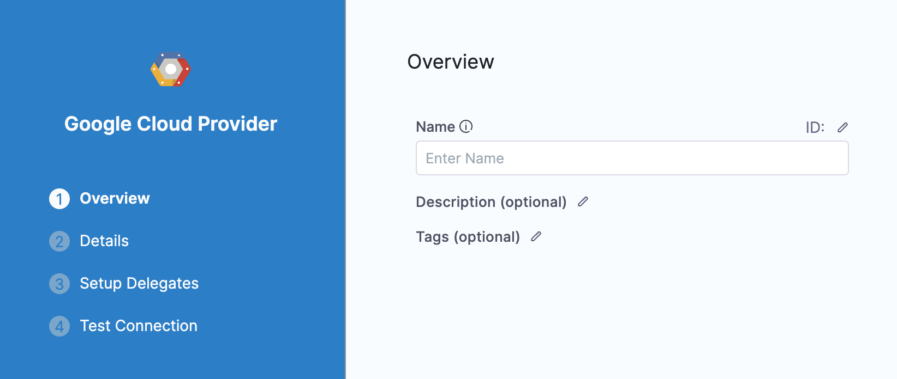

Google Cloud Platform (GCP) is integrated with Harness using a Harness GCP Connector. You can use GCP with Harness for obtaining artifacts, communicating with GCP services, provisioning infrastructure, and deploying microservices, and other workloads.

This topic explains how to set up the GCP Connector.

**What IAM roles should my GCP account have?** What IAM roles and policies needed by the GCP account used in the Connector depend on what GCP service you are using with Harness and what operations you want Harness to perform in GCP. For a list of roles and policies, see [Google Cloud Platform (GCP) Connector Settings Reference](ref-cloud-providers/gcs-connector-settings-reference.md).

### Before you begin

* [Learn Harness' Key Concepts](https://ngdocs.harness.io/article/hv2758ro4e-learn-harness-key-concepts)

### Limitations

Harness supports GKE 1.19 and later.

If you use a version prior to GKE 1.19, please enable Basic Authentication. If Basic authentication is inadequate for your security requirements, use the [Kubernetes Cluster Connector](add-a-kubernetes-cluster-connector.md).

### Supported Platforms and Technologies

For a list of the platforms and technologies supported by Harness, see [Supported Platforms and Technologies](https://docs.harness.io/article/1e536z41av-supported-platforms-and-technologies).

### Review: Connecting to Kubernetes Clusters

You can connect to a Kubernetes cluster running in GCP using a GCP Connector or the platform-agnostic Kubernetes Cluster Connector.

See [Kubernetes Cluster Connector Settings Reference](ref-cloud-providers/kubernetes-cluster-connector-settings-reference.md).

### Review: IAM Roles and Policies for the Connector

The IAM roles and policies needed by the GCP account used in the Connector depend on what GCP service you are using with Harness and what operations you want Harness to perform in GCP.

For a list of roles and policies, see [Google Cloud Platform (GCP) Connector Settings Reference](ref-cloud-providers/gcs-connector-settings-reference.md).

The [GCP Policy Simulator](https://cloud.google.com/iam/docs/simulating-access) is a useful tool for evaluating policies and access.

### Review: Switching IAM Policies

If the IAM role used by your GCP Connector does not have the policies required by the GCP service you want to access, you can modify or switch the role.

You simply change the role assigned to the GCP account or the Harness Delegate your GCP Connector is using.

When you switch or modify the IAM role, it might take up to 5 minutes to take effect.

### Review: GCP Workload Identity

If you installed the Harness [Kubernetes Delegate](https://docs.harness.io/article/4ax6q6dxa4-install-an-immutable-kubernetes-delegate) in a Kubernetes cluster (in GKE) that has [GCP Workload Identity](https://cloud.google.com/kubernetes-engine/docs/how-to/workload-identity?hl=tr#enable_on_cluster) enabled and uses the same service account and node pool annotation, the Google Cloud Platform (GCP) Connector will inherit these credentials if it uses that Delegate.

### Step 1: Add a GCP Connector

Open a Harness Project.

In **Project Setup**, click **Connectors**.

Click **New Connector**, and click **GCP**. The GCP Connector settings appear.

In **Name**, enter a name for this connector.

Harness automatically creates the corresponding Id ([entity identifier](../20_References/entity-identifier-reference.md)).

Click **Continue**.

### Step 2: Enter Credentials

There are two options for authenticating with GCP:

* **Specify credentials here:** use a GCP Service Account Key.
* **Use the credentials of a specific Harness Delegate:** have the Connector inherit the credentials used by the Harness Delegate running in GCP. The GCP IAM role used when installing the Delegate in GCP is used for authentication by the GCP Connector.  
For example, you can add or select a Harness Kubernetes Delegate running in Google Kubernetes Engine (GKE).

All of the settings for these options are described in detail in [Google Cloud Platform (GCP) Connector Settings Reference](ref-cloud-providers/gcs-connector-settings-reference.md).

### Step 3: Set Up Delegates

Harness uses GCP Connectors at Pipeline runtime to authenticate and perform operations with GCP. Authentications and operations are performed by Harness Delegates.

You can select **Any Available Harness Delegate** and Harness will select the Delegate. For a description of how Harness picks Delegates, see [Delegates Overview](../2_Delegates/delegates-overview.md).

You can use Delegate Tags to select one or more Delegates. For details on Delegate Tags, see [Select Delegates with Tags](../2_Delegates/delegate-guide/select-delegates-with-selectors.md).

If you need to install a Delegate, see [Delegate Installation Overview](https://docs.harness.io/article/re8kk0ex4k-delegate-installation-overview).

Click **Save and Continue**.

Harness tests the credentials you provided using the Delegates you selected.

If the credentials fail, you'll see an error. Check your credentials by using them with the GCP CLI or console.

The [GCP Policy Simulator](https://cloud.google.com/iam/docs/simulating-access) is a useful tool for evaluating policies and access.The credentials might work fine for authentication, but might fail later when you use the Connector with a Pipeline because the IAM role the Connector is using does not have the roles and policies needed for the Pipeline's operations.

If you run into any error with a GCP Connector, verify that the IAM roles and policies it using are correct.

For a list of roles and policies, see [Google Cloud Platform (GCP) Connector Settings Reference](ref-cloud-providers/gcs-connector-settings-reference.md).

Click **Finish**.

