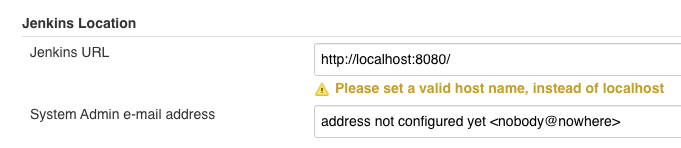

Continuous Integration (CI) can be performed in Harness using the module and [CI Pipelines](../../continuous-integration/ci-quickstarts/ci-pipeline-basics.md).

If you are using Harness Continuous Delivery (CD) but not Harness Continuous Integration (CI), you can still perform CI using the **Jenkins** step in your CD Stage.

You can connect Harness to Jenkins using a Harness Jenkins Connector. This Connector allows you to Jenkins jobs in [Jenkins steps](https://docs.harness.io/article/as4dtppasg-run-jenkins-jobs-in-cd-pipelines).

This topic shows you how to add a Jenkins Connector to Harness.

### Limitations

* Harness does support SAML authentication for Jenkins connections.

### Review: Jenkins Permissions

Make sure the user account for this connection has the following required permissions in the Jenkins Server.

* Overall: Read.
* Job: Build.

For token-based authentication, go to **http://Jenkins-IP-address/jobs/me/configure** to check and change your API access token. The token is added as part of the HTTP header.

See [Jenkins Matrix-based security](https://wiki.jenkins.io/display/JENKINS/Matrix-based+security).

#### Okta or Two-Factor Authentication

If you use Okta or 2FA for connections to Jenkins, use **API Token** for **Authentication** in the Harness Jenkins Connector.

### Step 1: Add a Jenkins Connector

You can add a Jenkins Connector at the Project, Org, or Account level. We'll cover Projects here. The process is the same for Org and Account.

You can also add the Jenkins Connector when setting up the Jenkins step. We'll cover adding it to the Project's Connectors here.

Open a Harness Project.

In **Project Setup**, click **Connectors**.

Click **New Connector**, and then click **Jenkins**. The Jenkins Connector settings appear.

In **Name**, enter a name for this connection. You will use this name to select this connection in Jenkins steps.

Click **Continue**.

### Step 2: Enter the Jenkins URL

Enter the URL of the Jenkins server.

If you are using the Jenkins SaaS (cloud) edition, the URL is in your browser's location field.

If you are using the standalone edition of Jenkins, the URL is located in **Manage Jenkins**, **Jenkins Location**:

### Step 3: Authentication

If you use Okta or 2FA for connections to Jenkins, use **API token** for **Authentication** in the Harness Jenkins Connector.Enter the credentials to authenticate with the server.

* **Username:** enter the user account username.
* **Password/API Token:** select/create a Harness Encrypted Text secret using the Jenkins API token or password.  
For token-based authentication, go to `http://Jenkins-IP-address/jobs/me/configure` to check and change your API access token. The token is added as part of the HTTP header.
* **Bearer Token (HTTP Header):** select/create a Harness Encrypted Text secret using the OpenShift OAuth Access Token in **Bearer Token (HTTP Header)**.  
The **Bearer Token (HTTP Header)** option is only for Jenkins servers hosted/embedded in an OpenShift cluster and using this authentication method. For more information, see [Authentication](https://docs.openshift.com/container-platform/3.7/architecture/additional_concepts/authentication.html) from OpenShift.

Click **Submit**.

The Jenkins Connector is added.

### See also

* [Run Jenkins Jobs in CD Pipelines](https://docs.harness.io/article/as4dtppasg-run-jenkins-jobs-in-cd-pipelines)

