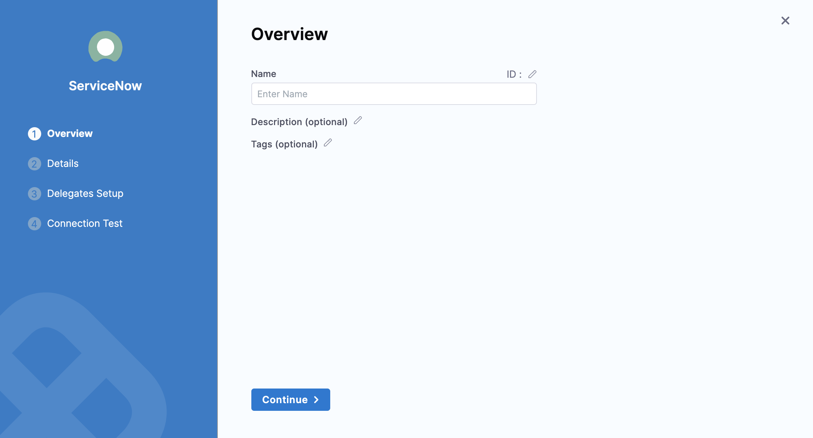
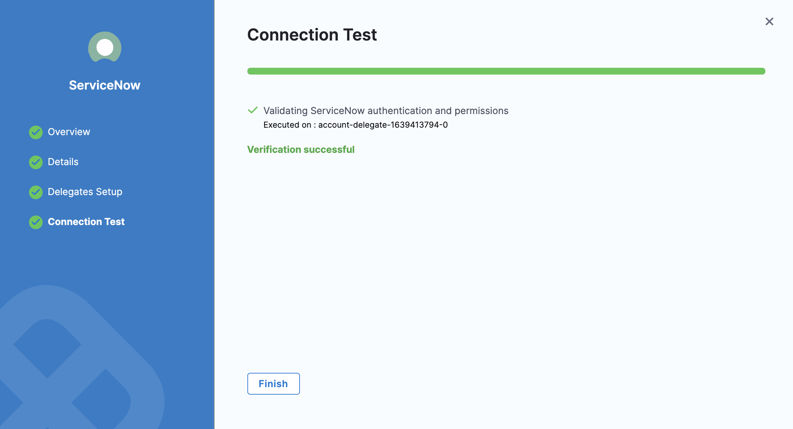

You can connect Harness to ServiceNow using a Harness ServiceNow Connector. This Connector allows you to approve and reject Pipeline steps.

### Before you begin

* [Learn Harness' Key Concepts](https://docs.harness.io/article/hv2758ro4e-learn-harness-key-concepts)

### Limitations

* Your ServiceNow account should ideally have the `admin` role. If this is not possible, it should have at least the `itil_admin` or `itil` role to create and modify tickets.
* Your account should also have the `import_admin` or `import_transformer` role to manage import set transform maps. For details, see ServiceNow's [Base System Roles](https://docs.servicenow.com/bundle/newyork-platform-administration/page/administer/roles/reference/r_BaseSystemRoles.html) documentation.
* Your ServiceNow REST API account must have permission to view tickets.

### Step: Add ServiceNow Connector

This topic assumes you have a Harness Project set up. If not, see [Create Organizations and Projects](../1_Organizations-and-Projects/2-create-an-organization.md).

You can add a Connector from any module in your Project in Project setup, or in your Organization, or Account Resources.

This topic shows you how to add a ServiceNow Connector to your Project.

In **Project Setup**, click **Connectors**.

Click **New Connector**, and then click **ServiceNow**. The ServiceNow Connector settings appear.

Enter **Name** for this Connector.

You can choose to update the **Id** or let it be the same as your ServiceNow Connector's name. For more information, see [Entity Identifier Reference](../20_References/entity-identifier-reference.md).

Enter **Description** and **Tags** for your Connector.

Click **Continue**.

Enter your **Username**.

In **URL**, enter the base URL by which your users will access ServiceNow. For example: `https://example.service-now.com`**.**

Enter your credentials. For **API Key**, use a Harness [Text Secret](../6_Security/2-add-use-text-secrets.md). 

Click **Continue**.

Select the Harness Delegate(s) to use when making a connection to ServiceNow using this Connector.

Click **Save and Continue**.

Harness tests the connection.

Click **Finish**.

The ServiceNow Connector is listed in Connectors.

