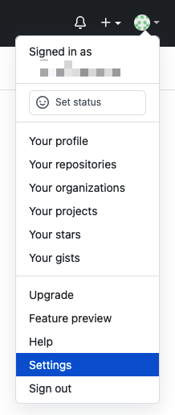
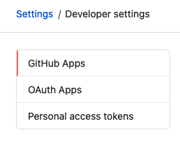
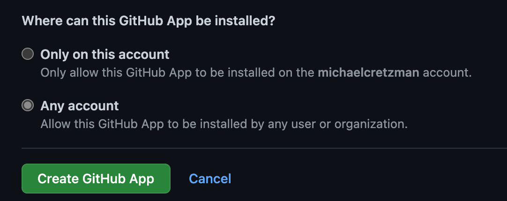
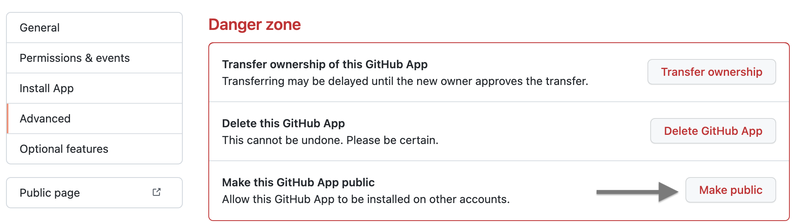
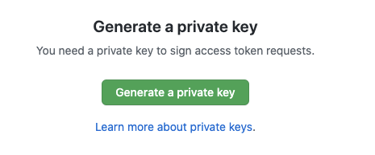
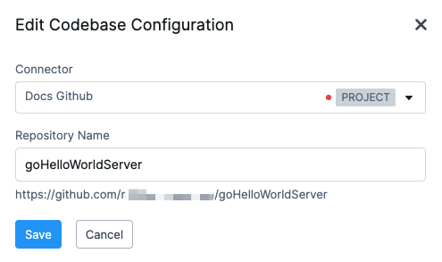
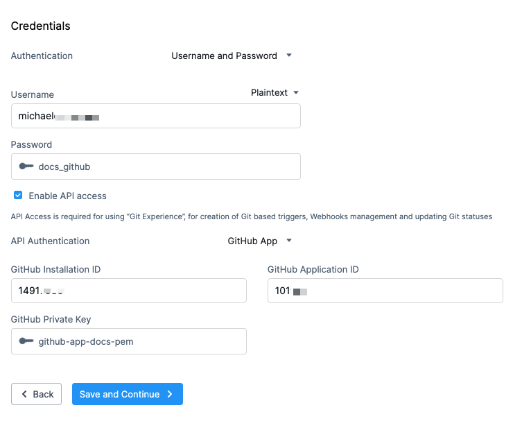
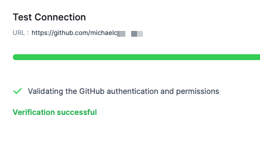
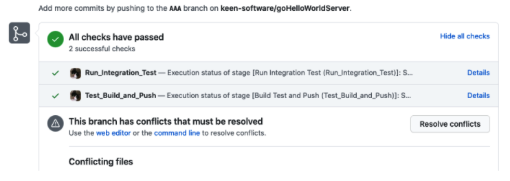

Harness supports API access to GitHub using a GitHub App.

GitHub recommends using GitHub Apps when integrating with GitHub. GitHub Apps offer more granular permissions to access data than typical authentication methods.

Harness supports GitHub Apps in its Harness GitHub Connector.

For more information, see [GitHub Connector Settings Reference](ref-source-repo-provider/git-hub-connector-settings-reference.md). Also, if you're new to GitHub apps, see [About apps](https://docs.github.com/en/developers/apps/about-apps) and [Installing GitHub Apps](https://docs.github.com/en/developers/apps/installing-github-apps) from GitHub

### Before you begin

* [GitHub Connector Settings Reference](ref-source-repo-provider/git-hub-connector-settings-reference.md)
* [Quickstarts](https://docs.harness.io/article/u8lgzsi7b3-quickstarts)

### Review: Requirements

One or more of the following GitHub permissions are required:

* You have the GitHub permissions required to install GitHub Apps on your personal account or under any organization where you have administrative access.
* If you have admin permissions in a GitHub repo in a GitHub organization, you can install GitHub Apps in that repo.
* If a GitHub App is installed in a repository and requires an organization's permission, the organization owner must approve the application.

### Step 1: Create a GitHub app

You can create and register a GitHub App under your personal account or under any organization where you have administrative access. You create your GitHub App in your personal account, and then register it where you have the required GitHub permissions.

See [Creating a GitHub App](https://docs.github.com/en/developers/apps/creating-a-github-app) from GitHub.

In your GitHub personal account, click **Settings**.


Click **Developer settings**.


Click **New GitHub App**.

Enter the following settings, and then click **Create GitHub App**.

* **GitHub App name:** enter the name for your app.
* **Homepage URL:** enter **https://harness.io/**.
* **Webhook:** uncheck **Active**.
* **Repository permissions:**
	+ **Administration:** select **Access: Read & write**.
	+ **Commit statuses**: select **Access: Read & write**.
	+ **Contents:** select **Access: Read & write**.
	+ **Metadata:** select **Access: Read-only**.
	+ **Pull requests**: select **Access: Read & write**. This permission is required for the **Issue Comment** event trigger for Github.
	+ **Webhooks:** select **Read & write**.
* **Where can this GitHub App be installed?** Select **Any account**.


The app is created.

By default the application you created is **Public**.

If your application is **Private**, make sure to make it **Public**.

To do this, open the app by clicking **Edit.**

Select **Advanced**.

In **Make this GitHub App public**, click **Make public**, and click **OK**.


Now you can install the app.

### Step 2: Install the GitHub App

In the same GitHub App, click **Install App**.

In **Repository access**, select **Only select repositories**, and then select the same repo you are connecting with Harness.

In **Permissions**, set the following permissions:

* **Read access to metadata**
* **Read and write access to code, commit statuses, and pull requests**

Install the new app.

Once the app is installed, you'll need to record the following information to use in the Harness Connector:

* **Installation ID:** the Installation ID is located in the URL of the installed app.


* **App ID:** the App ID is located in the GitHub app's **General** tab.


### Step 3: Generate and Download Key

Now we'll create the private key for the GitHub app that you will use in your Harness Connector.

Open the GitHub app you created.

In **Private keys**, click **Generate a private key**.


Download the private key to your local machine.

Open a terminal and navigate to the folder containing the key.

Run the following command, replacing `<your-key>.pem` with the name of your PEM file:


```
openssl pkcs8 -topk8 -inform PEM -outform PEM -in <your-key>.pem -out converted-github-app.pem -nocrypt
```
In the next step, you'll add the file as a new Harness file secret.

### Step 4: Create a Harness Secret with the Key Value

In Harness, click the account, org, or project where you want to store your secret.

Click **Project Setup**, and then click **Secrets**.

Click **New Secret**, and then click **File**.

In **Secrets Manager**, select a Secrets Manager. See [Harness Secrets Manager Overview](../6_Security/1-harness-secret-manager-overview.md).

In **Secret Name**, enter a name for the secret. You'll use this name to select the secret in Harness Connectors and other settings.

In **Secret File**, upload the PEM file.

Click **Save**.

Now we can add the GitHub app to the Harness GitHub Connector.

### Step 5: Use GitHub App and Secret in Harness GitHub Connector

Create or open the GitHub Connector used in your Pipeline codebase. For steps on creating the Connector, see [GitHub Connector Settings Reference](ref-source-repo-provider/git-hub-connector-settings-reference.md).

You can open a Connector from **Resources** in an account, org, or project, or from the stage's settings.

For example, in a CI stage, click **Codebase**. The Connector for the codebase is displayed.


Click the Connector, and then click the edit button. The GitHub Connector is displayed.

In the Connector **Credentials**, enter a username and Personal Access Token (PAT), and then select **Enable API access**.

In **API Authentication**, select **GitHub App**.

Enter the following settings:

* **GitHub Installation ID:** enter the Installation ID located in the URL of the installed GitHub App.
* **GitHub Application ID:** enter the GitHub **App ID** from the GitHub App **General** tab.
* **GitHub Private Key:** select the Harness secret you created for the PEM file key.

When you're done, the settings will look something like this:


Click **Save and Continue**. The connection and authentication is verified.


Click **Finish**.

Now you can run a Pipeline and verify that the GitHub app credentials are working.

### Step 6: Test GitHub Connector

Run a Pipeline that uses the GitHub Connector configured with the GitHub app credentials.

For PR events, use a Git Webhook Trigger to execute the Pipeline.

Make sure the Webhook definition in GitHub sends events for **Pull Request** in its **Events** settings.

If you haven't set a Git Webhook Trigger up, see [Trigger Pipelines using Git Events](../11_Triggers/triggering-pipelines.md).The Git Webhook Trigger should use the same repo as the GitHub App used in your Connector.

You can see the build stages status in the GitHub PR view.

