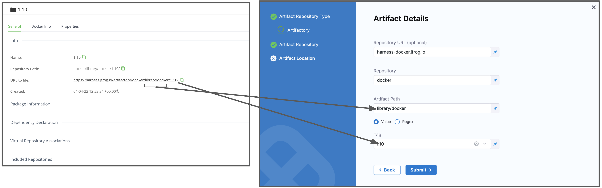

Harness supports both cloud and on-prem versions of Artifactory.

This topic provides settings and permissions for the Artifactory Connector.

### Artifactory Permissions

Make sure the following permissions are granted to the user:

* Privileged User is required to access API, whether Anonymous or a specific username (username and passwords are not mandatory).
* Read permission to all Repositories.

If used as a Docker Repo, user needs:

* List images and tags
* Pull images

See [Managing Permissions: JFrog Artifactory User Guide](https://www.jfrog.com/confluence/display/RTF/Managing+Permissions).

### Artifact and File Type Support

Legend:

* **M/F** - Metadata or file. This includes Docker image and registry information. For AMI, this means AMI ID-only.
* **Blank** - Coming soon.

|  |  |  |  |  |  |  |  |  |  |  |  |  |  |
| --- | --- | --- | --- | --- | --- | --- | --- | --- | --- | --- | --- | --- | --- |
| **Sources** | **Docker Image**(Kubernetes) | **Terraform** | **Helm Chart** | **AWS** **AMI** | **AWS CodeDeploy** | **AWS Lambda** | **JAR** | **RPM** | **TAR** | **WAR** | **ZIP** | **Tanzu** (**PCF)** | **IIS** |
| Artifactory | M |  | F |  |  |  |  |  |  |  | **F** |  |  |

If you are new to using Artifactory as a Docker repo, see [Getting Started with Artifactory as a Docker Registry](https://www.jfrog.com/confluence/display/RTF6X/Getting+Started+with+Artifactory+as+a+Docker+Registry) from JFrog.

### Artifactory Artifact Server

The Harness Artifactory Artifact server connects your Harness account to your Artifactory artifact resources. It has the following settings.

#### Name

The unique name for this Connector.

#### ID

See [Entity Identifier Reference](../../20_References/entity-identifier-reference.md).

#### Description

Text string.

#### Tags

See [Tags Reference](../../20_References/tags-reference.md).

#### Artifactory Repository URL

Enter in your base URL followed by your module name.

For most artifacts, use **https://mycompany.jfrog.io/artifactory**.

In some cases, you can use **https://*****server\_name*****/artifactory**.

The URL really depends on how you have set up Artifactory, and whether it is local, virtual, remote, or behind a proxy.

To ensure you use the correct URL, copy it from your Artifactory settings.

See [Repository Management](https://www.jfrog.com/confluence/display/JFROG/Repository+Management) from JFrog.

#### Username

Username for the Artifactory account user.

#### Password

Select or create a new [Harness Encrypted Text secret](../../6_Security/2-add-use-text-secrets.md).

### Artifact Details

#### Repository URL

This applies to the JFrog Artifactory default configuration. This URL may change if your infrastructure is customized.

Select your repository via the JFrog site. Select **Set Me Up**. The **Set Me Up** settings appear.

Copy the name of the server from the `docker login` command and enter it in **Repository URL**.

See [Configuring Docker Repositories](https://www.jfrog.com/confluence/display/RTF/Docker+Registry#DockerRegistry-ConfiguringDockerRepositories) from JFrog for more information. It describes the URLs for local, remote, and virtual repositories.

#### Repository

Enter the name of the repository where the artifact source is located.

Harness supports only the Docker repository format as the artifact source.

#### Artifact Path

Enter the name of the artifact you want to deploy.

The repository and artifact path must not begin or end with `/`.

#### Tag

Select a Tag from the list.

