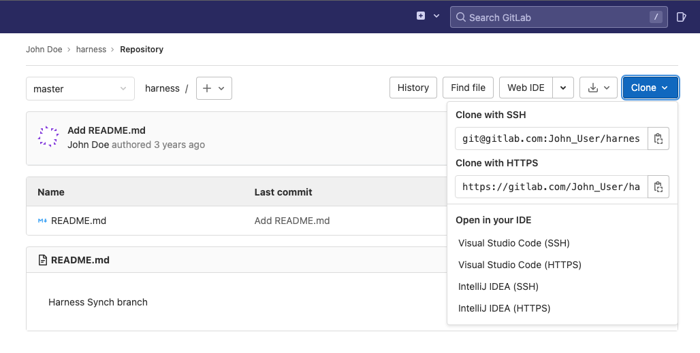

This topic provides settings and permissions for the GitLab Connector.

### Limitations

* Before Harness syncs with your Git repo, it will confirm that all Harness' settings are in a valid state. If a connection is not working, Harness will not sync with your Git repo.

### Name

The unique name for this Connector.

### ID

See [Entity Identifier Reference](../../20_References/entity-identifier-reference.md).

### Description

Text string.

### Tags

See [Tags Reference](../../20_References/tags-reference.md).

### URL Type

You can select Git Account or Git Repository.

You can add a connection to your entire Git account or just a repo in the account. Selecting a Git account enables you to use one Connector for all of your subordinate repos.

Later when you test this connection, you will use a repo in the account.

In either case, when you use the Connector later in Harness, you will specify which repo to use.

### Connection Type

You can select **HTTPS** or **SSH** for the connection.

You will need to provide the protocol-relevant URL in **GitLab Account URL**.

If you use Two-Factor Authentication for your Git repo, you connect over **HTTPS** or **SSH**. HTTPS requires a personal access token.

For SSH, ensure that the key is not OpenSSH, but rather RSA or another algorithm. To generate an SSHv2 key, use: `ssh-keygen -t rsa -m PEM` The `rsa` and `-m PEM` ensure that the key is RSA. Next, follow the prompts to create the PEM key. For more information, see the [ssh-keygen man page](https://linux.die.net/man/1/ssh-keygen).To sync with GitLab, you will need to generate a SSH key pair and add the SSH key to your GitLab account. For more information, see [Generating a new SSH key pair](https://gitlab.com/help/ssh/README#generating-a-new-ssh-key-pair) from GitLab.

### GitLab Account or Repo URL

The URL for your Git repo. Ensure that it matches the Connection Type option you selected.

If you selected **Repository** in **Type**, enter the full URL for the repo. For example: `https://gitlab.com/John_User/harness.git`.

You can get the URL from the **Clone** button in your repo.

If you selected **Account** in **Type**, enter the URL without the repo name. When you use this Connector in a Harness setting you will be prompted to provide a repo name.

### Authentication

You can use a password/token for HTTPS credentials. Typically, a token is used.

If you selected **SSH** as the connection protocol, you must add the **SSH Key** for use with the connection. 

### Username

Enter the username **git**. Do not enter any other value.

**git** is the only value you should use in **Username**.

### Password/Personal Access Token

Enter a [Harness Encrypted Text secret](../../6_Security/2-add-use-text-secrets.md) for the credentials of your GitLab user account.

Typically, a Personal Access Token is used. See [Personal Access Tokens](https://docs.gitlab.com/ee/user/profile/personal_access_tokens.html) from GitLab.

The Personal Access Token requirements for Harness are: `api`, `read_repository`, `write_repository`.

### SSH Key

If you selected **SSH** as the connection protocol, you must add the **SSH Key** for use with the connection as a [Harness Encrypted Text secret](../../6_Security/2-add-use-text-secrets.md).

See [Use SSH keys to communicate with GitLab](https://docs.gitlab.com/ee/user/ssh.html) from GitLab.

### Enable API access

This option is required for using Git-based triggers, Git Sync, and updating Git statuses. 

You'll need this setting if you use [Harness Git Experience](https://harness.helpdocs.io/article/grfeel98am).

Simply use the same Personal Access Token you created earlier.

