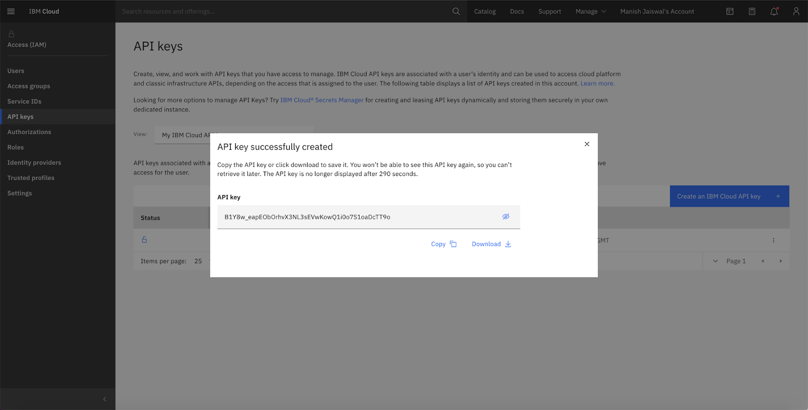
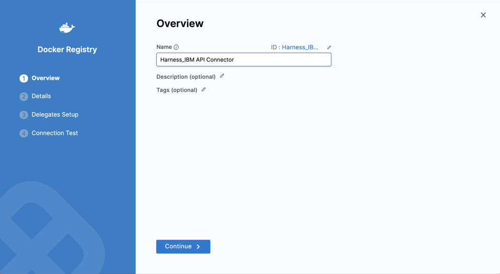
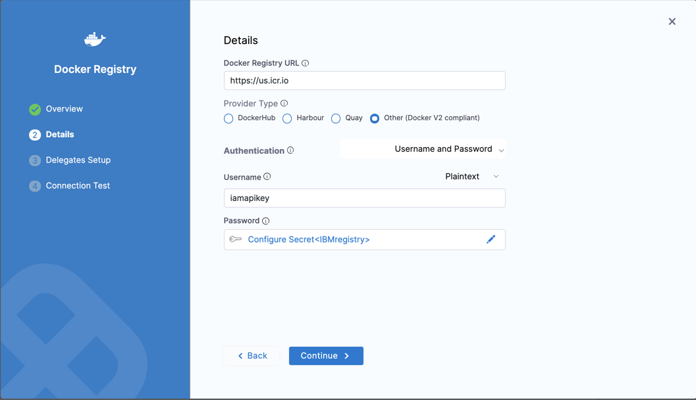
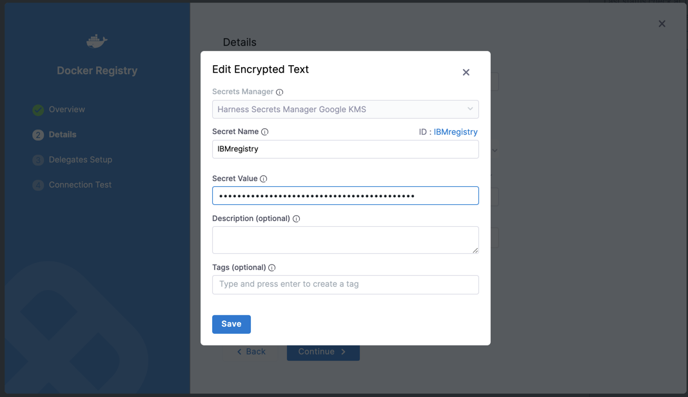
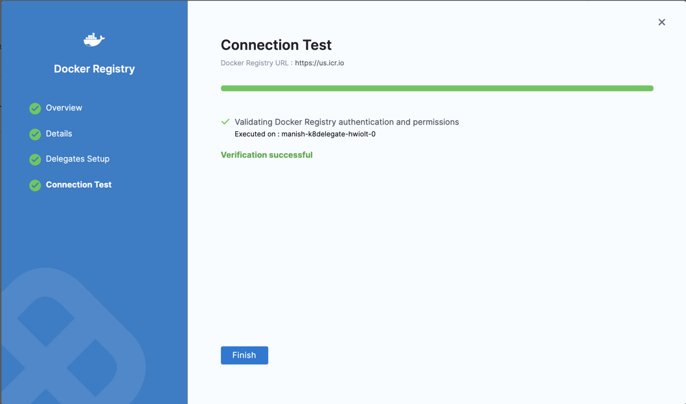

You can connect Harness to IBM Cloud Container Registry using a Harness Docker Registry Connector. The Connector uses your credentials to your IBM Cloud Container Registry and allows you to push and pull images.

This topic explains how to use the Harness Docker Registry Connector to connect Harness to the IBM Cloud Container Registry.

### Before you begin

* [CI Enterprise Concepts](../../continuous-integration/ci-quickstarts/ci-concepts.md)
* [Harness Delegate Overview](../2_Delegates/delegates-overview.md)

### Review: Managing IAM Policies in IBM Cloud

If the IBM Cloud IAM role used by your Docker Registry Connector does not have the policies required by the IBM service you want to access, you can modify or switch the role.

To set up and manage IAM policies, see [Defining access role policies](https://cloud.ibm.com/docs/Registry?topic=Registry-user#user).

When you switch or modify the IAM role, it might take up to 5 minutes to take effect.

### Supported Platforms and Technologies

For a list of the platforms and technologies supported by Harness, see [Supported Platforms and Technologies](https://ngdocs.harness.io/article/1e536z41av-supported-platforms-and-technologies).

### Step 1: Generate an API Key in IBM Cloud Console

Follow the instructions outlined in [Creating an API Key](https://cloud.ibm.com/docs/account?topic=account-userapikey&interface=ui#create_user_key) from IBM.

Once the API key is successfully generated, click **Copy** or **Download the API key.**

### Step 2: Create a Docker Registry Connector in Harness

You can create the Docker Registry Connector at the Harness **Account**, **Organisation**, or **Project** level. In this example, we'll use a **Project**.

Open a Harness **Project**.

In **Project Setup**, click **Connectors**.

Click **New Connector**, and under **Artifact Repositories** click **Docker Registry**. 

The Docker Registry Connector settings appear.

In **Name**, enter a name for this connector.

Harness automatically creates the corresponding Id ([entity identifier](../20_References/entity-identifier-reference.md)).

Click **Continue**.

### Step 3: Enter Credentials

Here is where you'll use the API key you generated in IBM Cloud.

Select or enter the following options:

|  |  |
| --- | --- |
| **Docker Registry URL** | Enter the IBM Cloud Container Registry API endpoint URL. For example:`https://us.icr.io`See [IBM Cloud Container Registry](https://cloud.ibm.com/apidocs/container-registry#endpoint-url) from IBM. |
| **Provider Type** | Select **Other (Docker V2 compliant)** |
| **Authentication** | Select **Username and Password** |
| **Username** | `iamapikey`See [Authentication](https://cloud.ibm.com/docs/Registry?topic=Registry-registry_access&mhsrc=ibmsearch_a&mhq=iamapikey#registry_access_apikey_auth) from IBM. |
| **Password** | In **Password**, click **Create** or **Select a Secret**.In the new Secret in **Secret Value**, enter the API key generated in [Step 1](using-ibm-registry-to-create-a-docker-connector.md#step-1-generate-an-api-key-in-ibm-cloud-console). |

Click **Save**, and **Continue**.

### Step 4: Set Up Delegates

Harness uses Docker Registry Connectors at Pipeline runtime to authenticate and perform operations with IBM Cloud Registry. Authentications and operations are performed by Harness Delegates.

You can select Any Available Harness Delegate and Harness will select the Delegate. For a description of how Harness picks Delegates, see [Delegates Overview](../2_Delegates/delegates-overview.md).

You can use Delegate Tags to select one or more Delegates. For details on Delegate Tags, see [Select Delegates with Tags](../2_Delegates/delegate-guide/select-delegates-with-selectors.md).

If you need to install a Delegate, see [Delegate Installation Overview](https://ngdocs.harness.io/article/re8kk0ex4k-delegate-installation-overview).

The Delegate(s) you use must have networking connectivity to the IBM Cloud Container Registry.

Click **Save** and **Continue**.

### Step 5: Verify Test Connection

Harness tests the credentials you provided using the Delegates you selected.

If the credentials fail, you'll see an error. Click **Edit Credentials** to modify your credentials.

Click **Finish**.

