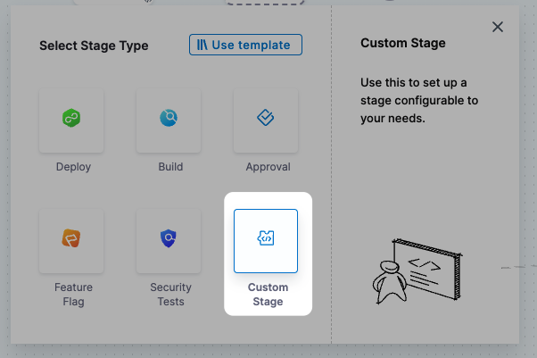

:::note
Currently, this feature is behind the feature flag `NG_CUSTOM_STAGE`. Contact [Harness Support](mailto:support@harness.io) to enable the feature.This topic describes how to set up a Custom stage.

:::

Harness has pre-defined stages for the most common release operations, such as Build (CI), Deploy (CD), and Approval stages; however, there are times when you need to add a stage to your Pipeline that performs other operations and don't require the pre-defined settings of CI, CD, or Approvals.

For example, ad hoc provisioning or jobs that need to run before a deployment stage. This is when a Custom stage is useful.

Unlike the standard Build, Deploy, or Approval stages, a Custom stage has no pre-defined functionality or requirements. The Custom stage provides flexibility to support any use case outside of the standard stages and doesn't require the pre-defined settings of CI, CD, or Approvals.

The steps available in a Custom stage are also available in standard stages.

### Before you begin

* [Learn Harness' Key Concepts](https://docs.harness.io/article/hv2758ro4e-learn-harness-key-concepts)
* [Add a Stage](add-a-stage.md)

### Limitations

* The Custom stage is available in all modules that use Pipelines (CI, CD, Feature Flags).
* Steps available in the Custom stage are also available in Build, Deploy, or Approval stages, but CI and CD-specific steps, like a Rolling Deployment, are not available in the Custom stage.
* Licensing is applied to the steps in Custom stage. For example, CD Steps such as the HTTP step are available inside Custom stage only if you have CD license.
* There is no Rollback functionality in a Custom stage.
	+ Rollbacks can be achieved via conditional execution. For example, run a step only is something failed/succeeded previously.
* You can select which Delegate to use for each step in a Custom stage using the step's **Delegate Selector** setting. If this setting is not used, then Harness will select a Delegate using its standard selection process. See [Delegates Overview](../2_Delegates/delegates-overview.md).
* Custom stage can be used as a template like other stage types. Step templates can be used inside a Custom stage, and the Pipeline containing the Custom stage can also be used as a Template.

### Visual Summary

The following video provides a quick overview of the Custom stage.

### Step 1: Add a Custom Stage

In your Pipeline, click **Add Stage**, and then click **Custom Stage**.

Enter a name for the stage. Harness automatically adds an Id ([Entity Identifier](../20_References/entity-identifier-reference.md)) for the stage.

Click **Set Up Stage**.

The new stage is created and the Execution section is displayed.

Let's look at adding stage variables to the **Overview** section first.

### Option: Add Stage Variables

Once you've created a stage, its settings are in the **Overview** tab.

In **Advanced**, you can add **Stage Variables**.

Stage variables are custom variables you can add and reference in your stage and Pipeline. They're available across the Pipeline. You can override their values in later stages.

You can even reference stage variables in the files fetched at runtime.

You reference stage variables **within their stage** using the expression `<+stage.variables.[variable name]>`.

You reference stage variables **outside their stage** using the expression `<+pipeline.stages.[stage Id].variables.[variable name]>`.

See [Built-in and Custom Harness Variables Reference](../12_Variables-and-Expressions/harness-variables.md).

### Step 2: Add Execution Steps

In **Execution**, click **Add Step**, and add whatever steps you need.

These steps are also available in CI, CD, and Approval stages.

For details on the different steps, see:

* [General CD](https://ngdocs.harness.io/category/y6gyszr0kl)
* [Using Shell Scripts in CD Stages](https://docs.harness.io/article/k5lu0u6i1i-using-shell-scripts)
* [Create an HTTP Step Template](../13_Templates/harness-template-library.md)
* [Approvals](https://ngdocs.harness.io/category/bz4zh3b75p)
* [Synchronize Deployments using Barriers](https://docs.harness.io/article/dmlf8w2aeh-synchronize-deployments-using-barriers)
* [Add a Policy Engine Step to a Pipeline](../14_Policy-as-code/add-a-governance-policy-step-to-a-pipeline.md)
* [Terraform How-tos](https://docs.harness.io/article/w6i5f7cpc9-terraform-how-tos)

CI and CD-specific steps, like a Rolling Deployment, are not available in the Custom stage.

### Option: Configure Advanced Settings

In **Advanced**, you can use the following options:

* [Stage Conditional Execution Settings](w_pipeline-steps-reference/step-skip-condition-settings.md)
* [Step Failure Strategy Settings](w_pipeline-steps-reference/step-failure-strategy-settings.md)

### See also

* [Create a Stage Template](../13_Templates/add-a-stage-template.md)

