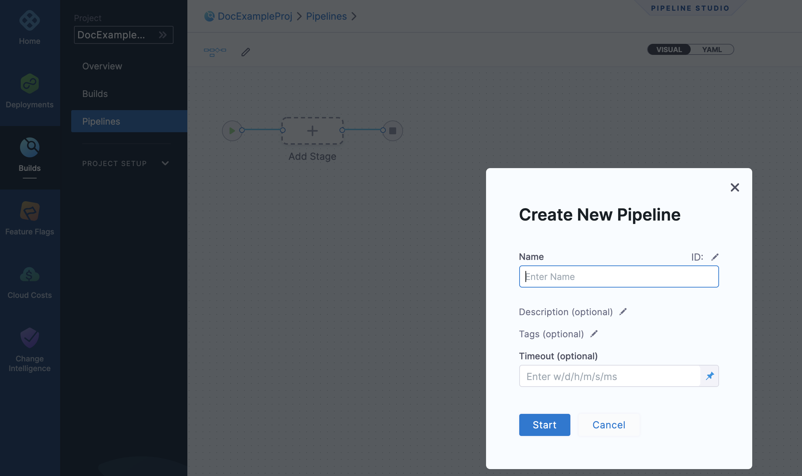

This functionality is limited temporarily to the platforms and settings you can see. More functionality for this feature is coming soon.A Stage is a subset of a Pipeline that contains the logic to perform one major segment of the Pipeline process. Stages are based on the different milestones of your Pipeline, such as building, approving, and delivering.

Adding a stage to your Pipeline is the same across all Harness modules (CD, CI, etc). When you add a stage you select the module you want to use.

The module you select determines the stage settings.

### Before you begin

* [Learn Harness' Key Concepts](https://docs.harness.io/article/hv2758ro4e-learn-harness-key-concepts)
* [Create Organizations and Projects](../1_Organizations-and-Projects/2-create-an-organization.md)

### Step 1: Create a Pipeline

This topic assumes you have a Harness Project set up. If not, see [Create Organizations and Projects](../1_Organizations-and-Projects/2-create-an-organization.md).

You can create a Pipeline from any module in your Project, and then add stages for any module.

This topic shows you how to create a Pipeline from the CI module. To do this, perform the below steps:

In Harness, click **Builds** and then click **Pipelines**.

Click **Pipeline**. The new Pipeline settings appear.

Enter **Name**, **Description**, **Tags**, **and Timeout** for your Pipeline.


Click **Start**. Now you're ready to add a stage.

### Step 2: Add a Stage

Click **Add Stage**. The stage options appear.

Select a stage type and follow its steps.

The steps you see depend on the type of stage you selected.

Don't see the module you want? You can enable modules in your Project Overview. See [Create Organizations and Projects](../1_Organizations-and-Projects/2-create-an-organization.md).Enter a name for the stage.

You can add a name when you create the stage, but you can edit the name in the **Overview** section of the stage anytime.

Changing the stage name doesn't change the stage identifier (Id). The stage identifier is created when you first name the stage and it cannot be changed. See [Entity Identifier Reference](../20_References/entity-identifier-reference.md).

For CD stages, you can select a deployment type. A Stage can deploy Services, and other workloads. Select the type of deployment this Stage performs.

### Option: Stage Variables

Once you've created a stage, its settings are in the **Overview** tab. For example, here's the **Overview** tab for a Deploy stage:


In **Advanced**, you can add **Stage Variables**.

Stage variables are custom variables you can add and reference in your stage and Pipeline. They're available across the Pipeline. You can override their values in later stages.

You can even reference stage variables in the files fetched at runtime.

For example, you could create a stage variable `name` and then reference it in the Kubernetes values.yaml file used by this stage: `name: <+stage.variables.name>`:


```
name: <+stage.variables.name>  
replicas: 2  
  
image: <+artifact.image>  
...
```
When you run this Pipeline, the value for `name` is used for the values.yaml file. The value can be a Fixed Value, Expression, or Runtime Input.

You reference stage variables **within their stage** using the expression `<+stage.variables.[variable name]>`.

You reference stage variables **outside their stage** using the expression `<+pipeline.stages.[stage Id].variables.[variable name]>`.

### Option: Advanced Settings

In **Advanced**, you can use the following options:

* [Stage Conditional Execution Settings](w_pipeline-steps-reference/step-skip-condition-settings.md)
* [Step Failure Strategy Settings](w_pipeline-steps-reference/step-failure-strategy-settings.md)

### Option: Running Stages in Parallel

You can drag stages on top of each other to run them in parallel:


### See also

* [Create Organizations and Projects](../1_Organizations-and-Projects/2-create-an-organization.md)

