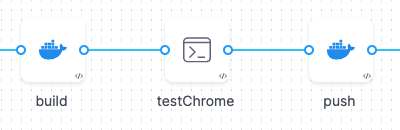
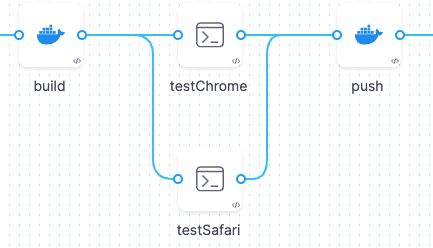

Harness recommends the following best practices for implementing Matrix and Parallelism strategies in your Pipelines.

### Complex Looping Scenarios Require Careful Planning

Harness supports complex looping strategies such as:

* A Matrix strategy with multiple dimensions.
* Multiple looping strategies in the same Stage. For example, you can define a Stage Matrix with three dimensions and then a Step Matrix with four dimensions within the same Stage.

Before you implement a complex looping scenario, you need to consider carefully the resource consumption of your Pipeline containers and the overall capacity of your build/deploy infrastructure. Too many Stages or Steps running concurrently can cause the Pipeline to fail, to time out, to consume too many resources, or to run successfully but incorrectly.  
  
A good general rule to follow is: **Your looping scenario is too complex if you cannot visualize how it will run and calculate the memory and CPU required for the Pipeline to run successfully.**

### How Pipelines Reserve Resources

When a Pipeline requests resources for a Step, it calculates the *maximum CPU and memory required at any point in the Stage*. Consider the following scenario:

* Your Build Stage has three Steps: the first builds an artifact for a web app; the second runs the artifact in a browser to confirm that it runs, the third pushes it to a registry.
* Each Step consumes up to 500M (memory) and 400m (CPU). Because the Steps run serially, not concurrently, the Pipeline reserves 500Mi memory and 400m CPU for the entire Stage.
* Suppose you want to test the app on both Chrome and Firefox. You create a simple Matrix strategy for the Step:
```
matrix:  
  browser: [ chrome, firefox ]  
  maxConcurrency: 2 
```
* The Pipeline creates two copies of the Run Stage and runs them concurrently. This doubles the resource consumption for the overall Stage. When the Pipeline runs, it reserves double the resources (1000M memory, 800m CPU) for the overall Stage.
* So far, so good. The Pipeline executes with no problem. But suppose you add another dimension to your matrix and increase the `maxConcurrency`to run all the Stages at once?
```
matrix:  
  os:      [ macos,  linux,    android ]  
  browser: [ chrome, firefox,  opera   ]  
  maxConcurrency: 9 
```
* In this case, the Stage requires 9 times the original resources to run. The Pipeline fails because the build infrastructure cannot reserve the resources to run all these Stages concurrently.

### How to Determine the Right `maxConcurrency`

Always consider the value you want to specify for the `maxConcurrency`. Your goal is to define a `maxConcurrency` that speeds up your Pipeline builds while staying within the capacity limits of your build infrastructure.

Harness recommends that you determine the `maxConcurrency` for a specific Stage or Step using an iterative workflow:

1. Start with a low `maxConcurrency` value of 2 or 3.
2. Run the Pipeline and monitor the resource consumption for the overall Pipeline.
3. Gradually increase the `maxConcurrency` based on each successive run until you reach a "happy medium" between your run times and resource consumption.

### See also

* [Optimizing CI Build Times](https://harness.helpdocs.io/article/g3m7pjq79y)
* [How to Run a Run a Stage or Step Multiple Times using a Matrix](run-a-stage-or-step-multiple-times-using-a-matrix.md)
* [Looping Strategies Overview: Matrix, Repeat, and Parallelism](looping-strategies-matrix-repeat-and-parallelism.md)
* [Speed Up CI Test Pipelines Using Parallelism](https://harness.helpdocs.io/article/kce8mgionj)

