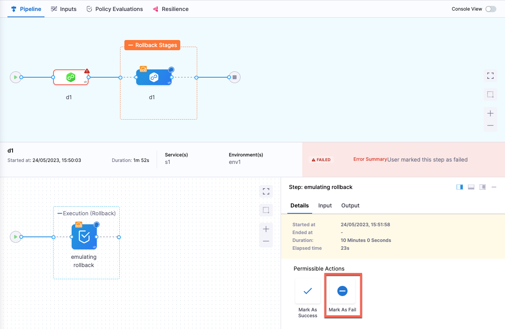
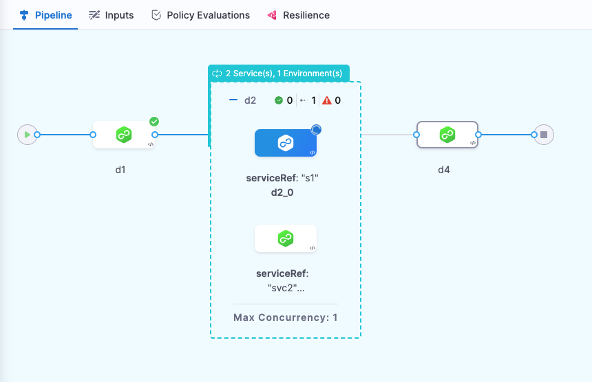

:::info

Currently, this feature is behind the feature flag, `PIPELINE_ROLLBACK`. Contact [Harness Support](mailto:support@harness.io) to enable the feature.

:::

You can add a Rollback Pipeline failure strategy to your pipelines. Rollback pipeline applies to all steps and stages in a pipeline. 

:::info

During [Pipeline chaining](/docs/platform/pipelines/pipeline-chaining/), if there is a stage of type, pipeline, the deployment stages inside the child pipeline cannot be rolled back using the Rollback Pipeline failure strategy because the execution of the child pipeline is considered as a separate execution.

:::

Currently, the Rollback Pipeline failure strategy applies to the following deployments only:
* Kubernetes
* Native Helm
* Amazon Elastic Container Service (ECS)

## Rollback pipeline steps or stages

1. In a pipeline's step or stage, select **Advanced**.
2. In **Failure Strategy** > **On failure of type**, select a failure type or select **All Errors**. 
   Go to [Step and Stage Failure Strategy Settings](w_pipeline-steps-reference/step-failure-strategy-settings.md) for information about error types.
3. In **Perform Action**, select **Rollback Pipeline**.

   Here's the equivalent YAML for the Pipeline Rollback failure strategy: 

   ```
   failureStrategies:
     - onFailure:
         errors:
            - AllErrors                           
         action:
            type: PipelineRollback
   ```

During pipeline execution, in **Permissible Actions**, if you select **Mark as Fail**, the pipeline stage fails and rolls back. 



If you select **Mark as Success**, the stage passes, and the next stage's execution begins. 


