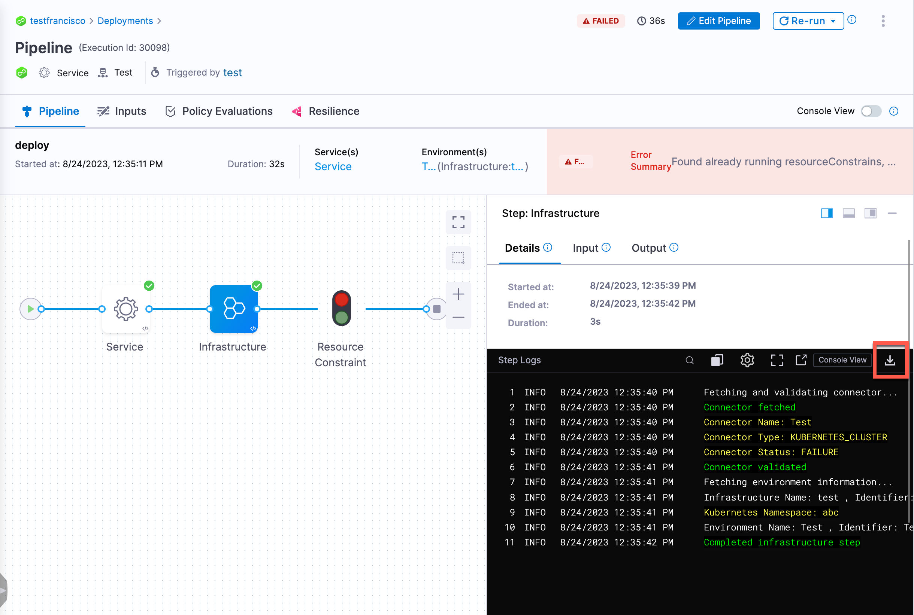

:::info note
Currently, this feature is behind the feature flag `SPG_LOG_SERVICE_ENABLE_DOWNLOAD_LOGS`. Contact [Harness Support](mailto:support@harness.io) to enable the feature.
:::

You can download pipeline or step execution logs via the UI. You can download pipeline, stage, and step execution logs via the API. 

After you download the execution log files, you can view the JSON log.

The process of downloading logs is the same for all Harness modules. Your access to certain modules and settings limits the functionality available to you.

## Download pipeline log files

To download pipeline log files, do the following:

1. In Harness, select your pipeline.
2. Select the three-dots menu, and then select **Download Logs**.

   

   Harness queries the log service, exports the log, and downloads the `logs.zip` file.

3. Open the `logs.zip` file, and unzip the file contents.
4. Path to the log file in the directory.

## Download step log files

To download step log files, do the following:

1. In Harness, select your pipeline.
2. Select the step for which you want to download the execution log.
3. Under **Details**, select the download icon.

   

   Harness queries the log service, exports the log, and downloads the `logs.zip` file. 

4. Open the `logs.zip` file, and unzip the file contents.
5. Path to the log file in the directory.

## Download logs via API

You can download pipeline, stage, and step execution logs via API. The `POST` API requires a Harness API key passed in the Bearer Token field of the Authorization header.

You receive a download link for the log file in the API response. For more information, go to the [API reference](https://apidocs.harness.io/).
