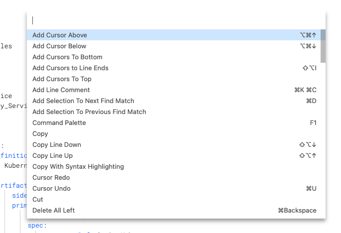

This quickstart shows you how to create a Harness Pipelines using YAML. It's not an exhaustive reference for all of the YAML entries, but a quick procedure to get you started with Harness Pipeline YAML.

Harness includes visual and YAML editors for creating and editing Pipelines, Triggers, Connectors, and other entities. Everything you can do in the visual editor you can also do in YAML.

A quick run through on how to use the YAML builder will get you up and coding Harness Pipelines in minutes. Let's get started.


:::note
For details of the YAML schema, see [YAML Reference: Pipelines](w_pipeline-steps-reference/yaml-reference-cd-pipeline.md).

:::

### Objectives

You'll learn how to:

1. View a Pipeline in the YAML builder.
2. Review the Pipeline YAML schema structure.
3. Use keyboard shortcuts for adding entries and selecting commands.
4. Find and replace YAML.
5. Verify and resolve YAML errors with the YAML builder's assistance.

### Before you begin

* Review [Harness Key Concepts](https://docs.harness.io/article/4o7oqwih6h-harness-key-concepts) to establish a general understanding of Harness.
* The best way to get started with YAML is to do a CI or CD quickstart and then view the YAML in Pipeline Studio. See ​[CD Quickstarts](https://docs.harness.io/category/c9j6jejsws) and [CI Quickstarts](https://docs.harness.io/category/onboard-with-ci).

### Visual Summary

Here's a very quick video showing you how to build a Pipeline using YAML:

### Step 1: Start a New Pipeline

In your Harness Project, click **New Pipeline**.

Enter the name **YAML Example** for the Pipeline and click **Start**.

The Pipeline is created.

Click **YAML** to view the YAML editor.


You can see the Pipeline YAML. Here's an example:


```
pipeline:  
    name: YAML Example  
    identifier: YAML_Example  
    projectIdentifier: CD_Examples  
    orgIdentifier: default  
    tags: {}
```
Place your cursor after `tags: {}` and hit Enter.

Press **Ctrl + Space**. The major Pipeline sections are displayed.


Completing the Pipeline in YAML is simply the process of filing out these sections.

Let's look at the YAML structure of a Pipeline.

### Review: Basic Pipeline Structure

The following outline shows the basic hierarchy of the Pipeline YAML.

This outline is shown to help you gain a general idea of the structure of a Pipeline and help you know which entry to make next as you develop your Pipeline in YAML.

Here are the Pipeline settings and major sections:


```
pipeline:  
    name: YAML Example  
    identifier: YAML_Example  
    projectIdentifier: CD_Examples  
    orgIdentifier: default  
    tags: {}  
    description:   
    stages:  
        -   
    notificationRules:  
        -   
    flowControl:  
          
    properties:  
          
    timeout:   
    variables:  
        -    
```
The following steps walk through adding the YAML for the `stages` section of the Pipeline.

For details of the YAML schema, see [YAML Reference: Pipelines](w_pipeline-steps-reference/yaml-reference-cd-pipeline.md).

### Step 2: Add a Stage

The basic Stage YAML looks like this:


```
    stages:  
        - stage:  
              identifier:   
              name:   
              type:   
              description:   
              tags:  
              spec:  
                  serviceConfig:  
                        
                  infrastructure:  
                        
                  execution:  
                      steps:  
                          -   
              variables:  
                  -   
              when:  
                  pipelineStatus:   
              failureStrategies:  
                  - onFailure:  
                          errors:  
                              - null 
```
In `identifier`, enter a unique Id for the stage, such as **mystage**. In the Visual editor the Id is generated automatically. In YAML, you have to enter an Id.

In `name`, enter a name for the stage, such as **mystage**.

In `type`, you select the type of Stage you want to add. This is the same as clicking Add Stage in the Visual editor.


For details on each type, see:

* **Approval:** [Using Manual Harness Approval Stages](../9_Approvals/adding-harness-approval-stages.md), [Adding Jira Approval Stages and Steps](../9_Approvals/adding-jira-approval-stages.md)
* **CI:** [CI Pipeline Quickstart](../../continuous-integration/ci-quickstarts/ci-pipeline-quickstart.md)
* **Deployment:** [CD Quickstarts](https://docs.harness.io/category/c9j6jejsws)

For this quickstart, we're going to use the **Deployment** type.

In `type`, select **Deployment**.

Next, we'll add a `spec` that defines the Service, Environment, and Execution for the stage.

#### Stage Spec

The Stage spec contains the three major sections of the Stage:


```
              spec:  
                  serviceConfig:  
                      ...  
                  infrastructure:  
                      ...  
                  execution:  
                      steps:  
                          - ...
```
These correspond to the Stage sections in the Visual editor:


#### Stage Service

In `serviceConfig`, press `Enter`, and then `Ctrl + Space`.

You can see the `serviceConfig` options:


For this quickstart, we'll just use `service` and `serviceDefinition`. We're just looking at the structure so we'll use [Runtime Inputs](../20_References/runtime-inputs.md) wherever we can:


```
              spec:  
                  serviceConfig:  
                      service:  
                          identifier: myservice  
                          name: myservice  
                      serviceDefinition:  
                          type: Kubernetes  
                          spec:  
                              manifests:  
                                  - manifest:  
                                        identifier: <+input>  
                                        type: K8sManifest  
                                        spec:  
                                            store:  
                                                type: Github  
                                                spec:  
                                                    connectorRef: <+input>  
                                                    gitFetchType: Branch  
                                                    branch: <+input>  
                                                    folderPath: <+input>  
                                                    repoName: <+input>
```
This stage simply adds a Service named `myservice` and a Service Definition using Kubernetes manifests.

For details on adding manifests to a Service Definition, see [Add Kubernetes Manifests](https://docs.harness.io/article/ssbq0xh0hx-define-kubernetes-manifests).

The `connectorRef` setting is for the Harness Connector that connects to the Git repo where the manifests are located. In the Visual editor you can create/select Connectors inline, but in the YAML editor, you must use the name of an existing Connector. In this example, we simply use a Runtime Input (`connectorRef: <+input>`) and we can add the Connector later.

#### Stage Infrastructure

In `infrastructure`, press `Enter`, and then `Ctrl + Space`.

You can see the `infrastructure` options:


For this quickstart, we'll just use `environment` and `infrastructureDefinition`. We're just looking at the structure so we'll use [Runtime Inputs](../20_References/runtime-inputs.md) wherever we can:


```
                  infrastructure:  
                      environment:  
                          identifier: myinfra  
                          name: myinfra  
                          type: PreProduction  
                      infrastructureDefinition:  
                          type: KubernetesDirect  
                          spec:  
                              connectorRef: <+input>  
                              namespace: <+input>  
                              releaseName: <+input>
```
In `infrastructureDefinition`, you can see that we are using a [Kubernetes Cluster Connector](../7_Connectors/add-a-kubernetes-cluster-connector.md) for a platform-agnostic direct connection to the target cluster.

#### Stage Execution

In `execution`, in `steps`, press **Enter**, type `-`, and then press **Space**.

You can see the `steps` options:


Click `step`. The step settings appear.

In `type`, press **Ctrl + Space** to see the steps you can add.


For this quickstart, we'll just use `ShellScript`. Here's an example:


```
                          - step:  
                                identifier: ssh  
                                name: ssh  
                                type: ShellScript  
                                description: <+input>  
                                spec:  
                                    shell: Bash  
                                    source:  
                                        type: Inline  
                                        spec:  
                                            script: echo "hello world"  
                                    timeout: <+input>  
                                    onDelegate: false  
                                failureStrategies:  
                                    - onFailure:  
                                            errors:  
                                                - AllErrors  
                                            action:  
                                                type: Abort  
                                when:  
                                    stageStatus: Success
```
The step Failure Strategy is set using `failureStrategies` and the Conditional Execution is set using `when`.

#### Stage Conditional Execution

You can add the Stage Conditional Execution settings before or after `stage`. To add them after, make sure you indent to the same depth as stage `identifier`. and then press **Ctrl + Space**.

You can see the remaining options:


Click `when`. The `pipelineStatus` setting appears.

Press **Ctrl + Space** and select `Success`.

#### Stage Failure Strategy

Create a new line under `pipelineStatus: Success` , indent to the same level as `when`, and the remaining options appear.


Click `failureStrategies`. The Failure Strategy settings appear.

Here's an example:


```
              failureStrategies:  
                  - onFailure:  
                          errors:  
                              - AllErrors  
                          action:  
                              type: Abort
```
#### Stage Variables

Create a new line, indent to the same level as `failureStrategies`, and the remaining options appear.


Click `variables`. On the new line, press **Ctrl + Space**. The `variables` options appear.

Here's an example:


```
              variables:   
                  - name: myvar  
                    type: String  
                    value: myval
```
The Pipeline stage is now complete.

Click **Save**.

For details of the YAML schema, see [YAML Reference: Pipelines](w_pipeline-steps-reference/yaml-reference-cd-pipeline.md).

### Review: Autocomplete

The YAML editor has an autocomplete feature that makes it very easy to see what entries are available.

The keyboard command for autocomplete is `Ctrl + Space`.


If an entry already has a value, the autocomplete will not show you other options. You need to delete the value and then enter `Ctrl + Space`.

Let's look at an example.

Navigate to `rollbackSteps: []` at the bottom of the stage.

Delete the `[]`, press `Enter`, type `-`, and press `Space`.

You can see the available options:


Click `step`. The default step settings appear:


```
                      rollbackSteps:   
                          - step:  
                                identifier:   
                                name:   
                                type: 
```
In `type`, press `Ctrl + Space` to see the options. You can see all of the available steps:


This shows you how easy it is to view settings with autocomplete.

### Review: Find and Replace YAML

Click **Cmd/Ctrl + f** to see the Find and Replace settings.


You can quickly find and replace anything in the YAML.

### Review: Command Palette

The command palette keyboard command is `F1`.



The command palette displays all of the commands and the keyboard shortcuts for most commands.

### Review: Validating YAML

Ad you edit your YAML you will see **Invalid** to highlight that your YAML is incomplete.

Hover over **Invalid** to see where the errors are:


You can also hover over any incomplete entry to see what is expected:


Click **Peek Problem** to see suggestions and valid values also:


### Next steps

In this tutorial, you learned how to:

1. View a Pipeline in the YAML builder.
2. Review the Pipeline YAML schema structure.
3. Use keyboard shortcuts for adding entries and selecting commands.
4. Find and replace YAML.
5. Verify and resolve YAML errors with the YAML builder's assistance.

### See also

* [YAML Reference: Pipelines](w_pipeline-steps-reference/yaml-reference-cd-pipeline.md)

