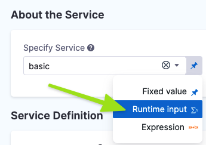
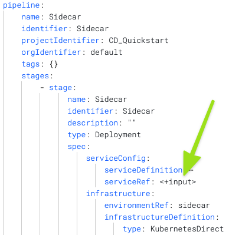
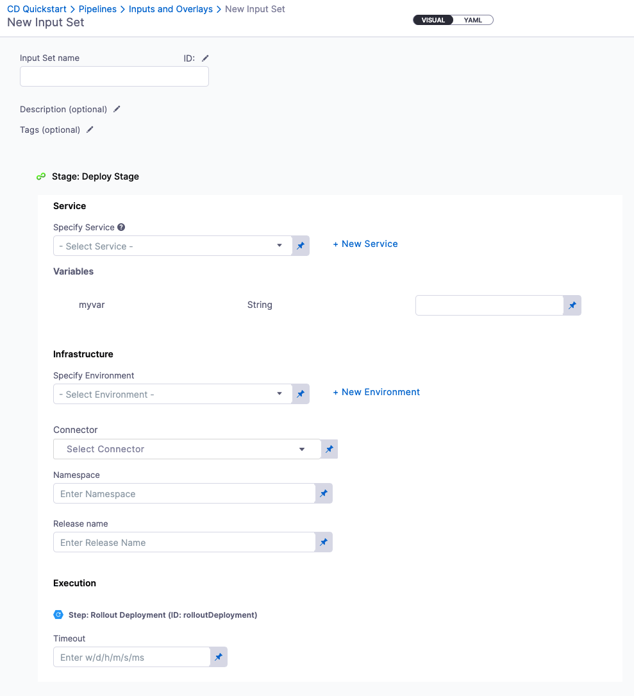

Harness Input Sets are collections of runtime inputs for a Pipeline provided before execution.

All Pipeline settings can be set as runtime inputs in Pipeline Studio **Visual** and **YAML** editors:

|  |  |
| ------------------------------------ | ------------------------------------ |

An Input Set includes all the runtime inputs that are not permanent in the Pipeline. Runtime inputs contain the values that you would be prompted to provide when you executed the Pipeline.

Overlays are groups of Input Sets. Overlays enable you to provide several Input Sets when executing a Pipeline.

With Input Sets and Overlays, you can make a single Pipeline template that can be used for multiple scenarios. Each scenario can be defined in an Input Set or Overlay and simply selected at runtime.

Looking for the How-to? See [Run Pipelines using Input Sets and Overlays](run-pipelines-using-input-sets-and-overlays.md).

### Input Sets Overview

Nearly every setting in a Pipeline can be configured as a runtime input. You can then create an Input Set from those inputs.

Here are some Input Set examples:

* Values of fields and variables
* Artifacts
* Connectors
* Environments
* Infrastructures
* Services
* Secrets
* Stage variables
* Step settings

Input sets group the values of these entities and make it easy provide the correct set of values for a single Pipeline execution, and reuse the same values for the executions of multiple Pipelines.

### Overlays Overview

You can add several Input Sets as an Overlay. Overlays are use when:

* The Pipeline is used for multiple Services.
* The Services have some configurations in common but some have differences. For example:
	+ Same configuration but using different runtime variables.
	+ Same artifact stream.

In this use case, you can then create different Input Sets:

* 1 Input Set for the common configuration: this set is used for every Pipeline execution regardless of the Service selected in the Pipeline.
* 1 Input Set for each Service with a specific configuration.
* 1 Input Set for a unique execution. For example, if it contains a specific build number.

For a specific execution, you provide multiple Input Sets. All together, these Input Sets provide a complete list of values needed for Pipeline execution.

#### Input Set Order in Overlays

You can order the Input Sets you add to an Overlay to give priority to certain Input Sets.

Each Input Set in an Overlay can overwrite the settings of previous Input Sets in the order. 

### Using Input Sets for Pipeline Execution

Before running a Pipeline, you can select one or more Input Sets and apply them to the Pipeline. As a result, Harness will do the following operations:

* Apply the Input Set(s) on the Pipeline. If you are using an Overlay, the application it performed in the same as the Input Sets in the Overlay to ensure the correct values are used.
* Indicate if the Pipeline can start running. Meaning, all required values are provided.
	+ If the Pipeline cannot start running, Harness indicates which values are missing.
* Harness shows the following:
	+ The values that were resolved.
	+ The values that were not resolved. In this case, Harness provides a clear indication that the Pipeline cannot run without values for all variables.

