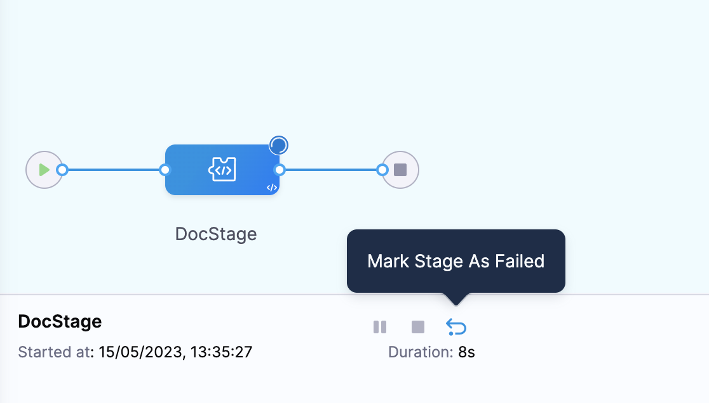

You can mark a specific stage as failed during pipeline execution by selecting the `Mark Stage As Failed` option.
This lets you do the following: 
- Abort a step that is running.
- Trigger configured failure strategy after the step is aborted.

## Important

- You must have `Execute` pipeline permission to be able to mark as stage as failed.
- You must enable `Allow users to mark a running Step as failure` in the default settings. For more information, go to [Default settings](/docs/platform/Settings/default-settings).
- The option `Mark Stage As Failed` is at a stage level in the execution phase. During the execution of parallel stages (like a matrix), you must either mark each one as a failure or let the other steps complete before applying the failure strategy.
- Harness aborts any delegate task currently running after you mark a stage as failed.

## Mark a stage as failed

To mark a stage as failed during pipeline execution: 

1. Select your pipeline, and then select **Run**.
2. Enter runtime input, if any, and then select **Run Pipeline**.
3. Select **Mark Stage As Failed**.
   
   

4. Select **Confirm**.
   
   The **Error Summary** for the stage displays `User Initiated Failure`. The failure type of this stage is set to `USER_MARKED_FAILURE`.

   

## Configure failure strategy

To configure failure strategy for a stage marked as failure: 

1. Select your pipeline, and then select the stage for which you want to configure failure strategy.
2. Select **Advanced**.
3. In **Failure Strategy**, select **Add**.
4. Select **User Marked Failure** in **On failure of type**.
5. Select desired action in **Perform Action**, for example, **Rollback** or **Retry**.
   The action you select here gets triggered after you mark a stage as failed.
6. Select **Save**.

   

:::important
If you mark a stage as failed, and its failure strategy is not defined, Harness triggers the default failure strategy.
:::

