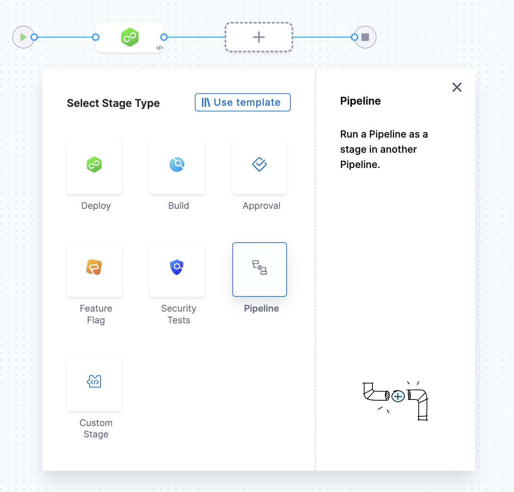
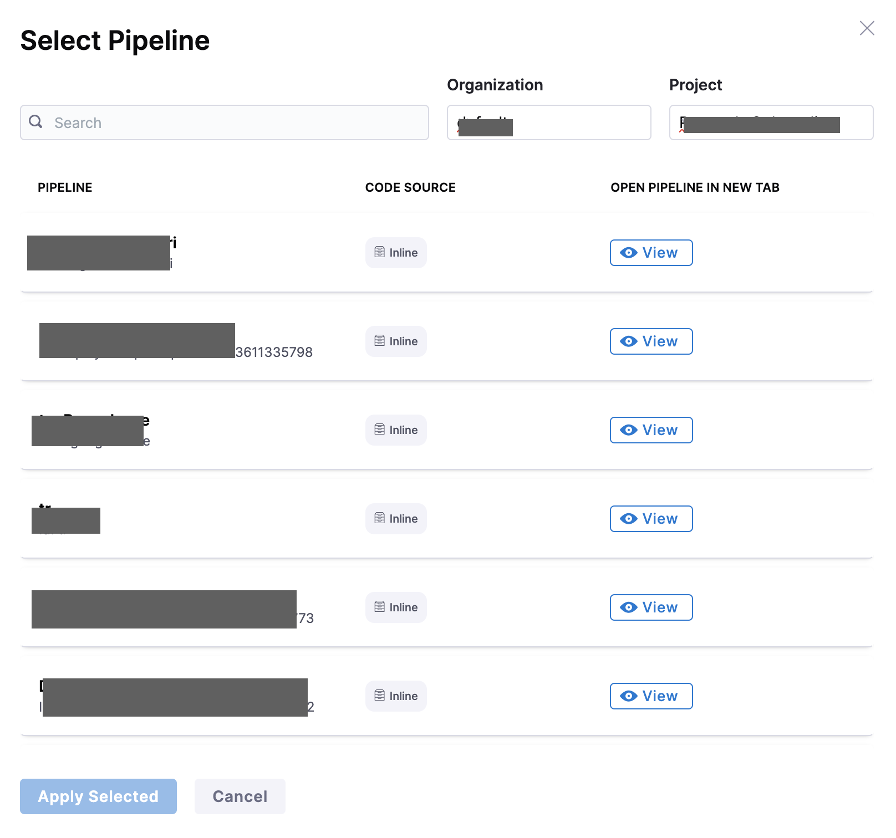

Pipeline chaining involves using the output of one pipeline as input for another. You can link multiple processing steps together and execute them sequentially, creating a more complex workflow.

For example, you could have a pipeline that deploys an application to a test environment. This could be followed by a pipeline that runs a set of integration tests and, finally, a pipeline that deploys the application to production. Each pipeline in the chain is triggered by the completion of the previous pipeline. The output of each pipeline is passed to the next pipeline in the chain. This way, you can automate the whole process and make sure that the application is tested properly before deploying to production.

## Important

- Make sure you have read permissions for the child pipeline and edit permissions for the parent pipeline to add a pipeline stage to a parent pipeline.

- Whenever you change the runtime input fields in a chained pipeline, select **Inputs** in the parent pipeline to see the changes.

- The run pipeline form does not support validation of child pipelines during the pre-flight check of the parent pipeline.

- At this time, you cannot define a matrix strategy in the pipeline stage of the parent pipeline.

- The pipeline stage does not support auto expressions in **Outputs**.

## Benefits of pipeline chaining

Chaining pipelines in Harness offers the following benefits:

- Development of complex workflows involving multiple stages of deployment, testing, and verification.

- Ease of handling errors. Visibility into the deployment process makes it easier to identify and troubleshoot issues.

- Faster and more efficient deployment.

- Reusability of the pipeline across multiple applications and environments, reducing the need to recreate the same steps for each deployment.

- Improved collaboration and communication by allowing different teams to work on different stages of the deployment process. 

- Enable greater compliance with regulatory requirements and industry best practices through automatic deployments.

## Chain pipelines 
To chain pipelines in Harness, perform the following steps: 

1. Create your parent [pipeline](../8_Pipelines/add-a-stage.md#step-1-create-a-pipeline) and configure it with the desired settings, such as triggers, environment variables, and deployment steps.

2. Select **Add Stage** and then select **Pipeline**.
   
   

3. Select the pipeline from the list. You can select any pipeline across different orgs and projects corresponding to your access and permissions and chain it to your parent pipeline.
   
   For more information on access, go to [RBAC in Harness](/docs/platform/role-based-access-control/rbac-in-harness).

   
   
   :::info note
   You must have execute permissions for the parent and child pipeline to ensure successful execution.
   :::

4. Click **Apply Selected**.

5. To use the output of a child pipeline in subsequent stages of the parent pipeline, select **Outputs**.

   The variables you select in the output tab can be referred to at a later stage.

   For example, you can use the build image in a subsequent deployment stage.
   
   :::info note
   The **Outputs** tab supports auto suggestions.
   :::
   
6. Repeat this process for any additional pipelines that you want to chain.

7. In the final chained pipeline, you can add a **Deploy** step to deploy the application to the desired environment.
   After you have chained the pipelines, you can run the parent pipeline.
   
Harness recommends testing the pipeline before executing it in production.

## Use an output expression in later stages

You can use an output expression in one stage as an input expression in a later stage. Here's a sample pipeline that uses an output expression in a later stage:

```yaml
pipeline:
  identifier: "parent"
  name: "parent"
  projectIdentifier: "YOUR_PROJECT_IDENTIFIER"
  orgIdentifier: "default"
  tags: {}
  stages:
  - stage:
      identifier: "chained"
      type: "Pipeline"
      name: "chained"
      description: ""
      spec:
        org: "default"
        pipeline: "childPipeline2"
        project: "YOUR_PROJECT"
        inputs:
          identifier: "childPipeline2"
          stages:
          - stage:
              identifier: "custom"
              type: "Custom"
              spec:
                execution:
                  steps:
                  - step:
                      identifier: "ShellScript_1"
                      type: "ShellScript"
                      timeout: "17m"
        outputs:
        - name: "timeout"
          value: "<+pipeline.stages.custom.spec.execution.steps.ShellScript_1.timeout>"
  - stage:
      identifier: "stage2"
      type: "Pipeline"
      name: "stage2"
      description: ""
      spec:
        org: "default"
        pipeline: "childPipeline22"
        project: "YOUR_PROJECT"
        inputs:
          identifier: "childPipeline22"
          stages:
          - stage:
              identifier: "custom"
              type: "Custom"
              spec:
                execution:
                  steps:
                  - step:
                      identifier: "ShellScript_1"
                      type: "ShellScript"
                      timeout: "<+stages.chained.output.timeout>"
        outputs: []
  variables:
  - name: "input1"
    type: "String"
    description: ""
    value: "value1"

```

:::info note

Consider the following points for executing remote chained pipelines:

- A chained pipeline is fetched from the default branch when the parent pipeline is defined inline, and the chained pipeline is defined remotely.
- When the parent pipeline is defined remotely, and the chained pipeline is defined inline, the parent pipeline is fetched from the corresponding branch, and the chained pipeline is fetched inline.
- When both the chained pipeline and the parent pipeline are defined remotely, but under the same repository, the chained pipeline should belong to the same branch as the parent pipeline.
- A chained pipeline is fetched from the default branch when both the parent and chained pipelines are defined remotely in separate repositories. This is irrespective of the branch of the parent pipeline.

:::

