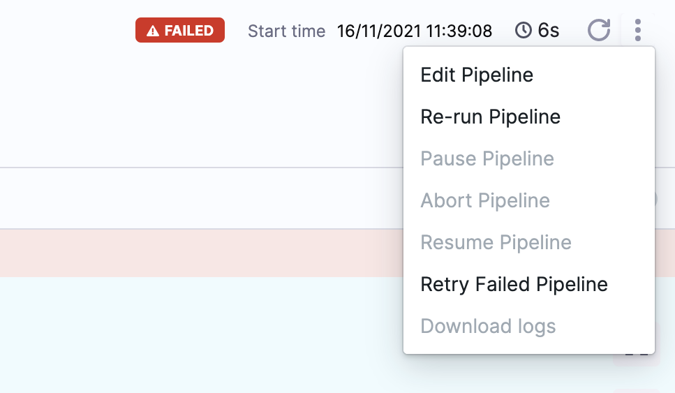
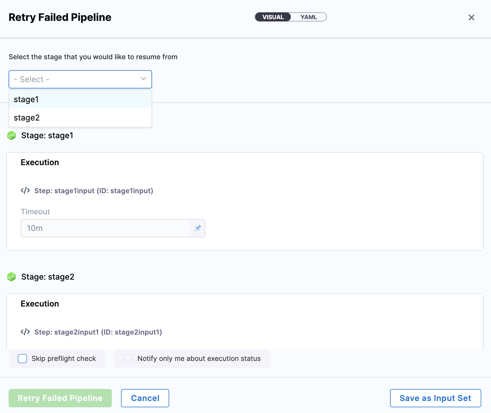
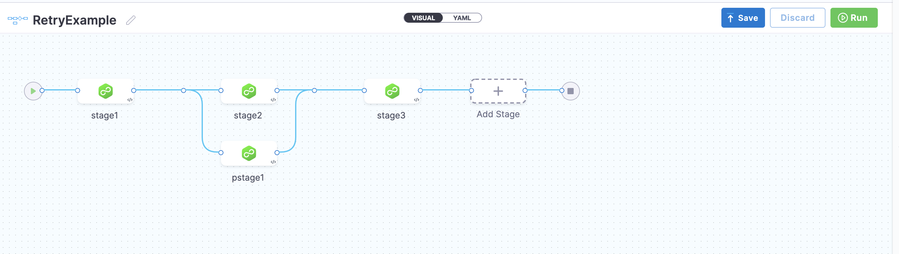
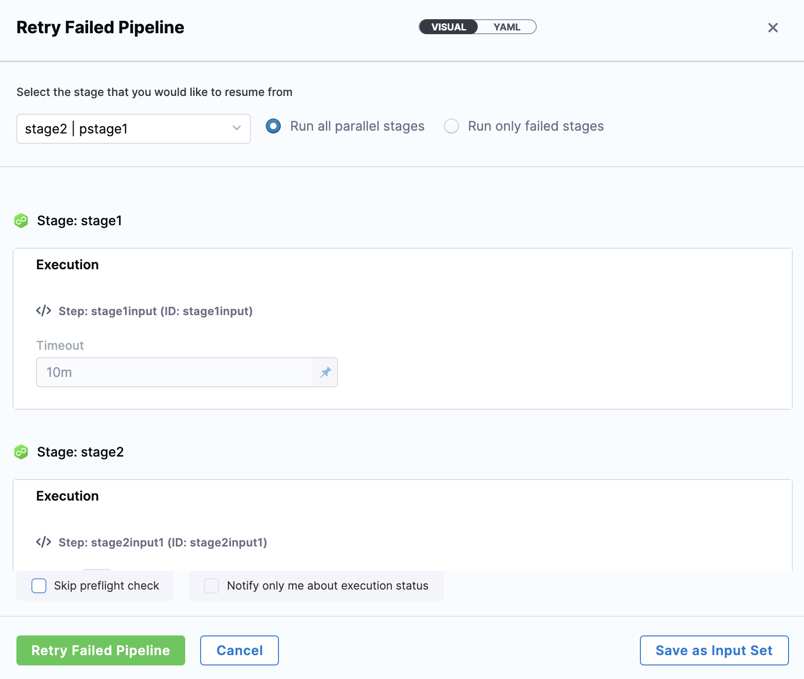

Pipeline execution might fail for many reasons, such as infrastructure changes or changes to resource access. In such cases, rerunning an entire Pipeline can be costly and time-consuming. 

Harness provides an option to resume Pipeline executions from any executed Stage or from the failed Stage. These options enable you to quickly rerun stages after you identify the cause of the failure. 

Retrying a Pipeline or Stage is different from rerunning a Pipeline or Stage. When you rerun, you can select new values for Runtime Inputs. When you retry a Pipeline or Stage, you are running the Pipeline or Stage exactly as it was run before. See [Run Specific Stages in Pipeline](run-specific-stage-in-pipeline.md).Harness provides an option to resume Pipeline executions from any previously executed Stage or from the failed Stage.

### Before you begin

* [Learn Harness' Key Concepts](https://docs.harness.io/article/hv2758ro4e-learn-harness-key-concepts)
* [Create Organizations and Projects](../1_Organizations-and-Projects/2-create-an-organization.md)
* [Add a Stage](../8_Pipelines/add-a-stage.md)
* Make sure you have **Execute** permissions for Pipeline to run a specific Stage of the Pipeline. For example, the [Pipeline Executor](../4_Role-Based-Access-Control/ref-access-management/permissions-reference.md) default role in the Project where your Pipeline is located.

### Limitations

* You can retry Pipelines when they are in **Failed**, **Aborted**, **Expired,** or **Rejected** status.
* You cannot retry a Stage's execution if it was run successfully. You need to rerun the Pipeline and select Stage. This will be a new run of the Stage. To rerun a successful Stage in a Pipeline, click **Rerun** in the execution. For more information, see [Rerun Stage](run-specific-stage-in-pipeline.md#rerun-stage).
* You cannot change mandatory settings, parameters, or conditions when you retry.

### Review: Serial and Parallel Stages

Stages can be added to Pipelines serially and in parallel. Here is an example that shows both:

How you run and retry Stages is different depending on whether you are retrying a serial or a parallel Stage.

### Option: Retry Serial Stages

This topic assumes you have a Harness Project set up. If not, see [Create Organizations and Projects](../1_Organizations-and-Projects/2-create-an-organization.md).

You can [create a Pipeline](add-a-stage.md#step-1-create-a-pipeline) from CI and CD module in your Project, and then [add Stages](add-a-stage.md#add-a-stage) for any module.

Click on the failed deployment that you want to retry and click **Retry** **Failed Pipeline**.

The Retry Pipeline settings appear.

Choose the failed Stage or any previous Stage to retry the Pipeline. The [Runtime Inputs](../20_References/runtime-inputs.md) for the selected and later stages are automatically filled from the previous execution. You can modify these Runtime Inputs while retrying the Pipeline.

### Option: Retry Parallel Stages

When there are parallel Stages in your Pipeline and one of the parallel Stages fails, you can execute the failed Stage or all the parallel Stages.

Let's take an example of a Pipeline that has parallel Stages.

If Stage stage1 fails, you can either execute all the parallel Stages or only the failed Stage.

All the previous values are populated for the stages. You can keep them or modify them as needed.

You cannot retry any execution that is more than 30 days old.

### See also

* [Run Pipelines using Input Sets and Overlays](run-pipelines-using-input-sets-and-overlays.md)
* [Run Specific Stages in Pipeline](run-specific-stage-in-pipeline.md)

