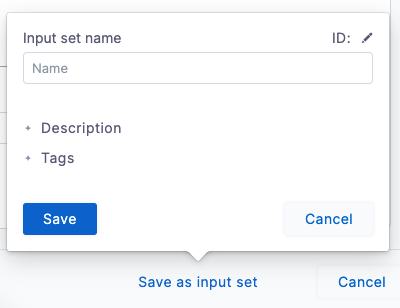
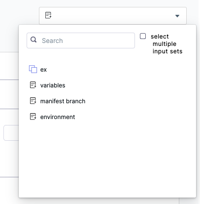
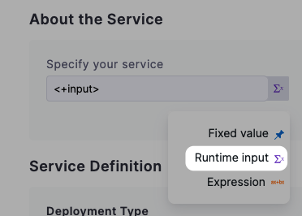

Harness Input Sets are collections of runtime variables and values that can be provided to Pipelines before execution.

An Input Set includes all the runtime inputs that are not permanent in the Pipeline. Runtime inputs are the settings that you would be prompted to provide when you executed the Pipeline manually.

Overlays are groups of Input Sets. Overlays enable you to provide several input sets when executing a Pipeline.

Input Sets and Overlays allow you to create a Pipeline template that can use different runtime input values for different services, codebases, target environments, and goals.


### Before you begin

* [CI Pipeline Quickstart](../../continuous-integration/ci-quickstarts/ci-pipeline-quickstart.md)
* [Kubernetes CD Quickstart](https://docs.harness.io/article/knunou9j30-kubernetes-cd-quickstart)
* [Input Sets and Overlays](input-sets.md)
* [Runtime Inputs](../20_References/runtime-inputs.md)

### Step 1: Create the Input Sets

You can create an Input Set in two ways:

* From the **Run Pipeline** page:
1. Configure your Pipeline and click **Run**.
2. Enter values for the required runtime inputs.
3. Click **Save as Input Set**. The Input Set setup appears.
   
   
   
4. Enter a name, description, and tags for the new Input Set, and then click **Save**.
* By simply creating an Input Set:
1. In **Pipeline Studio**, click **Input Sets**.
2. Click **New Input Set** and select **Input Set**.
3. Enter values for the required runtime inputs and click **Save**.

#### YAMl Example

YAML Example
```
inputSet:  
    name: service  
    tags: {}  
    identifier: service  
    pipeline:  
        identifier: BG_example  
        stages:  
            - stage:  
                  identifier: nginx  
                  type: Deployment  
                  spec:  
                      serviceConfig:  
                          serviceDefinition:  
                              type: Kubernetes  
                              spec:  
                                  manifests:  
                                      - manifest:  
                                            identifier: manifests  
                                            type: K8sManifest  
                                            spec:  
                                                store:  
                                                    type: Git  
                                                    spec:  
                                                        branch: main  
                                  variables:  
                                      - name: foo  
                                        type: String  
                                        value: bar  
                          serviceRef: nginx  
                      infrastructure:  
                          environmentRef: quickstart  
                  variables:  
                      - name: stagevar  
                        type: String  
                        value: ""
```
### Step 2: Create an Overlay

Once you have multiple Input Sets set up you can combine them into an Overlay.

In an Overlay, you select the order in which to apply several Input Sets.

When you run a Pipeline using an Overlay, the Inputs Sets are applied in the order specified in the Overlay. The first Inputs Set is used and then subsequent Inputs Sets override any previously specified or empty values.

### Step 3: Run the Pipeline using Input Set or Overlay

When you have created your Input Sets and Overlays, you can run the Pipeline using them.

You can select Input Sets and Overlays in two ways:

* From the **Run Pipeline** page:
1. In **Pipeline Studio**, click **Run**.
2. In the **Run Pipeline** page, click the Input Sets option.
   
   
   
3. Click an Input Set(s) or Overlay(s) to apply their settings.
4. Click **Run Pipeline**.
* From the **Input Sets** list:
1. In **Pipeline Studio**, click **Input Sets**.
2. In the Input Set or Overlay you want to use, click **Run Pipeline**.  
You can also use the Input Sets option here.
3. Change any settings you want and click **Run Pipeline**.

 The Pipeline is run with the Input Set(s) or Overlay(s) settings.

### Limitations

Only runtime inputs are available in Input Sets. Most, but not all, Pipeline and Stage settings can be defined as runtime inputs.

You can use any setting that offers the **Runtime input** option:



### 

