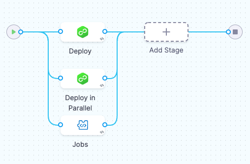
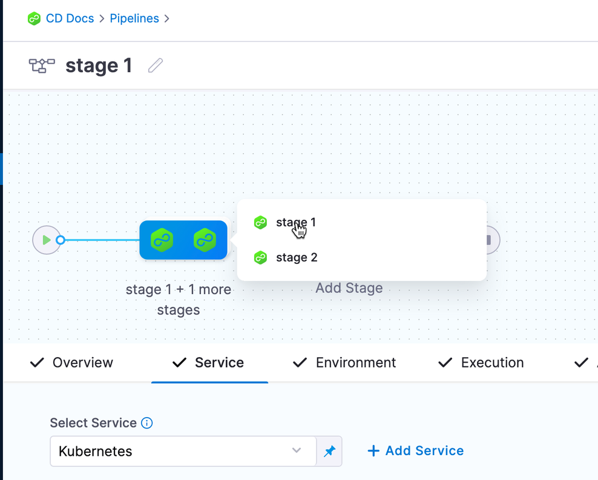

Run stages in parallel when you want to deploy multiple, independent services to the same environment. 

### Before you begin

* [Learn Harness' Key Concepts](../../getting-started/learn-harness-key-concepts.md)
* [Add a Stage](add-a-stage.md)

### Running stages in parallel

Run stages in parallel by dragging them together or by clicking the `+` button under a stage in the UI. 



The only change in the stage YAML is an additional `parallel`. 

```
stages:
    - parallel:
        - stage: 
```


Navigate between the stages by hovering over them and selecting the stage.



A [Resource Constraint](../..continuous-delivery/cd-deployments-category/deployment-resource-constraints/) step is added to every stage automatically to make sure that two infrastructures are not being deployed concurrently. Hence, one of the two parallel stages will deploy first. Once the deployment of the winning stage finishes, the other stages will start.

You can deploy multiple services and multiple environments in a single stage. However, using multi-service will deploy each selected service to a selected environment. For such use cases, we recommend using multiple stages.

