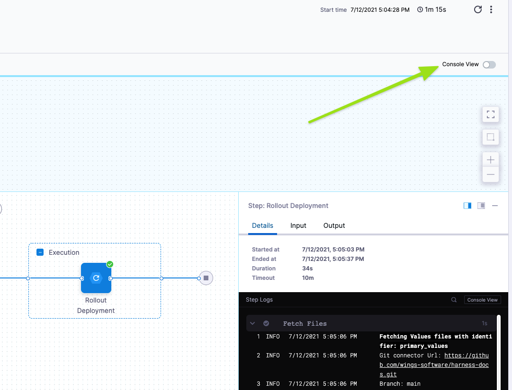
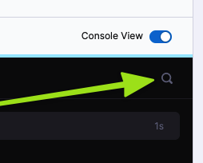
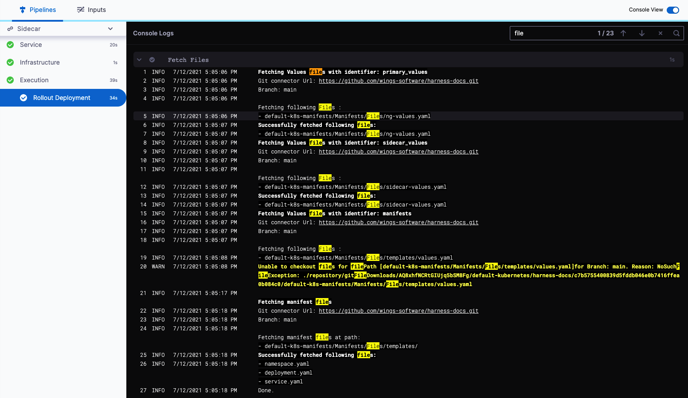

Pipeline executions can be viewed in Console View and you can quickly search the logs for each step.

### Before you begin

Before you can search execution logs, you need to run a Pipeline. See [Quickstarts](https://docs.harness.io/article/u8lgzsi7b3-quickstarts) to set up and run a Pipeline in minutes.

### Step: Search the Execution Step Logs

In the Pipeline execution, click **Console View**.

In the Console View of an execution, click the step you want to search.

Enter `Cmd + f` (Mac), `Ctrl + f` (Windows).

You can also click the search icon.

The search appears.

Type in your search query and the results are highlighted immediately.

### Option: Console Keyboard Shortcuts

Use the following shortcuts to search the log (these are Mac example, just substitute `Ctrl` for `Cmd` for Windows):

* `Up` to go up or go to the next search result.
* `Down` to go down or go to the previous search result.
* `Enter` to go to the next search result.
* `Esc` to cancel search.

