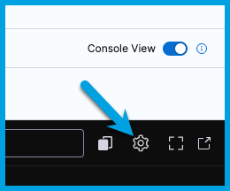
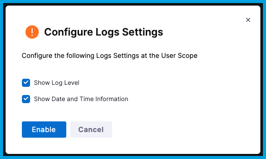

When viewing execution details, you can search logs in the console view.

To view execution details, you must have run a pipeline at least once. If you haven't run a pipeline before, try a [tutorial](/docs/getting-started/quickstarts/) to get started with Harness.

## Search step logs

1. Go to the execution details page, and make sure **Console View** is enabled.

   

2. Select the step that has the logs that you want to search.
3. In the **Console Logs**, select the **Search** icon or use the *find in page* keyboard shortcut, which is `CMD + F` on macOS or `Ctrl + F` on Linux or Microsoft Windows.

   

4. Enter your search query. Results are immediately highlighted.

   

## Console search keyboard shortcuts

You can use these shortcuts when searching logs.

* `CMD/Ctrl + F`: Enable search.
* `Up`: Move to the previous search result.
* `Down` or `Enter`: Move to the next search result.
* `Esc`: Clear and exit search.

## Configure log settings

You can configure your preferences for log level and date and time information.

1. Go to the execution details page, and make sure **Console View** is enabled.

   

2. In the **Console Logs**, select the **Settings** icon.

   

3. Configure your log settings as desired, and then select **Enable**.

   
