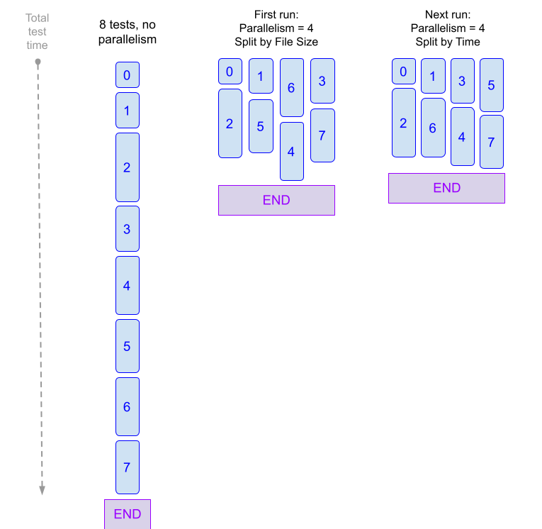
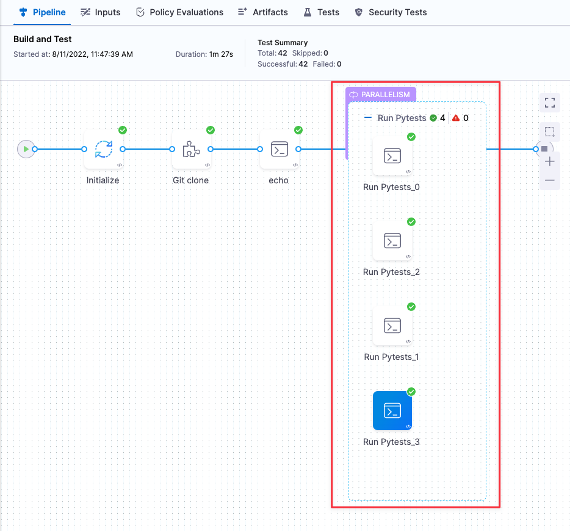
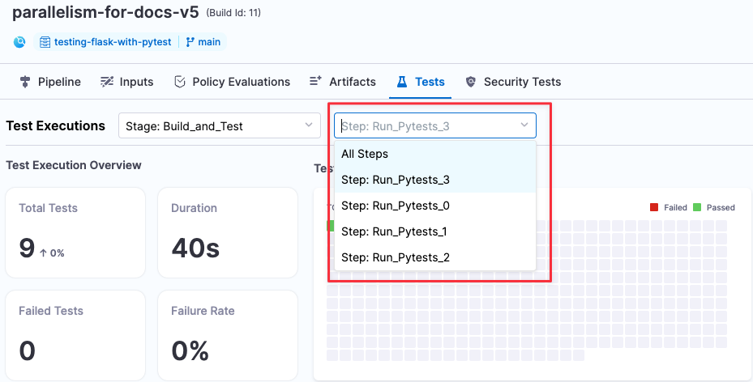
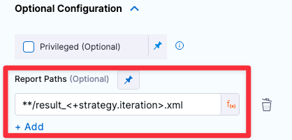

Currently, this feature is behind a Feature Flag. Contact [Harness Support](mailto:support@harness.io) to enable the feature.The more tests you run, the longer it takes for them to complete if run sequentially. To reduce test cycle time, you can split your tests and run them across multiple groups at the same time. 

*Parallelism* is one of the [looping strategies](looping-strategies-matrix-repeat-and-parallelism.md) available in Harness pipelines. Parallelism is useful whenever you can split a step or stage into multiple groups and run them at the same time. 

Parallelism is one of the [available methods](../../continuous-integration/troubleshoot/optimizing-ci-build-times.md) you can use to speed up your CI builds.

### Key concepts: parallelism and test splitting

Many pipelines are set up to run a set of tests with every new commit. When you [set up parallelism](#set-up-parallelism-in-a-pipeline) in your pipeline, you specify the following:

1. How many copies of the stage or step to run ([`parallelism`](#define-the-parallelism-strategy) field).
2. How to split your tests into groups ([`split_tests`](#define-test-splitting) command). This command splits the tests as evenly as possible to ensure the fastest overall test time. You can split by file size or by file timing.

The following figure illustrates how parallelism can speed up your CI pipelines. The first time you run with parallelism, the pipeline splits the tests by file size and collects timing data for all tests. You can then split your tests by time and speed up your pipeline even further. Every build optimizes the splitting based on the most recent timing data.

**Figure 1: Parallelism and Test Times**



### YAML stage with parallelism

Parallelism can be set on both steps and stages. 

The following snippet shows a YAML definition of a Run step that uses [pytest](https://docs.pytest.org/) to split tests into four test groups running in parallel.


```
# Use "run" step type  
- step:  
      type: Run      
      name: Run Pytests  
      identifier: Run_Pytests  
# Enable parallelism strategy   
      strategy:              
          parallelism: 4    # Number of parallel runs  
          maxConcurrency: 2 # (optional) Limit the number of parallel runs   
      spec:  
          connectorRef: $dockerhub_connector  
          image: python:latest  
          shell: Sh  
# Store the current index and total runs in environment variables  
          envVariables:    
              HARNESS_NODE_INDEX: <+strategy.iteration>  # index of current run  
              HARNESS_NODE_TOTAL: <+strategy.iterations> # total runs  
          command: |-  
              pip install -r requirements.txt  
# Define splitting strategy and generate a list of test groups  
              FILES=`/addon/bin/split_tests --glob "**/test_*.py" \  
                     --split-by file_timing \  
                     --split-index ${HARNESS_NODE_INDEX} \  
                     --split-total ${HARNESS_NODE_TOTAL}`  
              echo $FILES  
# Run tests with the test-groups string as input  
              pytest -v --junitxml="result_<+strategy.iteration>.xml" $FILES  
# Publish JUnit test reports to Harness   
         reports:    
              type: JUnit   
              spec:  
                  paths:   # Generate unique report for each iteration  
                      - "**/result_<+strategy.iteration>.xml"   
      failureStrategies: []
```
### Important notes

* Please consider any resource constraints in your build infrastructure when using parallelism. To learn more, go to [Best Practices for Looping Strategies](best-practices-for-looping-strategies.md).
* You can implement a parallelism strategy for an entire stage or for individual steps within a stage.
* If you are implementing parallelism in a step rather than a stage, you need to make sure that each test-group step generates a report with a unique filename to avoid conflicts.  
You can do this using the `<+strategy.iteration>` variable, which is the index of the current test group run. This index is in the range of `0` to `parallelism- 1`.
* If you want to publish your test results, you must ensure that your output files are in [JUnit](https://junit.org/junit5/) XML format. How you publish your test results depends on the specific language, test runner, and formatter used in your repo.  
For more information, go to [Publish test reports](#define-the-test-reports).

### Set up parallelism in a pipeline

The following steps describe the high-level workflow for setting up parallelism in a pipeline.

1. Enable parallelism and specify the number of jobs you want to in parallel. Go to [Define the parallelism strategy](#define-parallelism-strategy).
2. Define the following environment variables in the stage where you run your parallelism strategy:
	* `HARNESS_NODE_TOTAL` = `<+strategy.iterations>` — The total number of iterations in the current Stage or Step.
	* `HARNESS_NODE_INDEX` = `<+strategy.iterations>` — The index of the current test run. This index is in the range of `0` to `parallelism``- 1`.. This snippet shows how you can define and use these variables in the YAML editor:
```
- step:     
     ....  
     envVariables:         
          HARNESS_NODE_INDEX: <+strategy.iteration>   
          HARNESS_NODE_TOTAL: <+strategy.iterations>   
     command: |-         
          pip install -r requirements.txt         
          FILES=`/addon/bin/split_tests --glob "**/test_*.py" \  
                --split-by file_size \  
                --split-index ${HARNESS_NODE_INDEX} \  
                --split-total=${HARNESS_NODE_TOTAL}`         
          pytest -v --junitxml="result_${HARNESS_NODE_INDEX}.xml" $FILES   
          echo "$HARNESS_NODE_TOTAL runs using file list $FILES" 
```
To define these attributes in the Pipeline Studio, go to the step that implements the parallelism strategy. Then go to **Optional Configuration** > **Environment Variables**.

3. Set up the split\_tests command with the splitting criteria based on file size (`--split-by file_size`). Go to [Define test splitting](#define-test-splitting).
4. Define your test reports. Your reports must be in JUnit format. Go to [Publish test reports](#define-the-test-reports).
5. Run your Pipeline to make sure all your Steps complete successfully. You can see the parallel copies of your Step running in the Build UI.  
**Figure 2: Parallel steps in a build**

   

6. When the build finishes, go to the Tests tab and view your results. You can view results for each parallel run using the pull-down.  
   **Figure 3: View results for individual runs**

   

7. Now that Harness has collected timing data, you can split your tests by time and reduce your build times further. Go to [Define test splitting](#define-test-splitting).

### Define the parallelism strategy

The `parallelism` value defines how many steps you want to run in parallel. In general, a higher value means a faster completion time for all tests. The primary restraint is the resource availability in your build infrastructure. The YAML definition looks like this:


```
- step:  
      ...  
      strategy:  
        parallelism: 4
```
#### Defining parallelism in the Pipeline UI

You can configure parallelism in the Pipeline Studio as well:

1. In the Pipeline Studio, open the Step or Stage where you run your Tests and click the **Advanced** tab.
2. Under **Looping Strategies**, select **Parallelism** and define your strategy.  
**Figure 4: Define parallelism in a Run step**


[Parallelism Workflow](#set-up-parallelism-in-a-pipeline)

### Define test splitting

You use the `split_tests` CLI command to define the set of tests you want to run. In the **Command** field of the step where you run your tests, you need to do the following:

1. Configure the `split_tests` command to define how you want to split your tests. This command outputs a string of your test groups.
2. Run the test command with your test-groups string as input.


```
# Generate a new set of grouped test files and output the file list to a string...  
/addon/bin/split_tests --glob "**/test_*.py" \  
          --split-by file_time \  
          --split-index ${HARNESS_NODE_INDEX} \  
          --split-total=${HARNESS_NODE_TOTAL}  
echo $FILES  
# example output: test_api_2.py test_api_4.py test_api_6.py  
  
# Then use the $FILES list as input to the test command--in this case, pytest:  
pytest -v --junitxml="result_${HARNESS_NODE_INDEX}.xml" $FILES 
```
The `split_tests` command creates a new set of test files that is ordered based on your splitting criteria. This command takes the following as inputs:

* The set of all the tests you want to run (`--glob` argument).
* The algorithm used to split the tests into groups (`--split-by` argument).
* The run index and total number of runs. You should set these to the environment attributes you defined previously (`--split-index ${HARNESS_NODE_INDEX}` and `--split-total ${HARNESS_NODE_TOTAL}`).

#### Test splitting strategies

The `split_tests` command allows you to define the criteria for splitting tests. The pipeline uses [Test Intelligence](../../continuous-integration/ci-quickstarts/test-intelligence-concepts.md) to eliminate tests that don’t need to be rerun; then it splits the remaining tests based on the splitting strategy.

Harness supports the following strategies:

* `--split-by file_size` - Split files into groups based on the size of individual files.  
The pipeline needs timing data from the previous run to split tests by time. If timing data isn't available, the pipeline splits tests using this option.
* `--split-by file_timing` — Split files into groups based on the test times of individual files. This is the default setting: `split_tests` uses the most recent timing data to ensure that all parallel test runs finish at approximately the same time.
* `--split-by test_count` — Split tests into groups based on the overall number of tests.
* `--split-by class_timing` — Split tests into groups based on the timing data for individual classes.
* `--split-by testcase_timing` — Split tests into groups based on the timing data for individual test cases.
* `--split-by testsuite_timing` — Split tests into groups based on the timing data for individual test suites.

##### Specifying the Tests to Split

To split tests by time, you need to provide a list of the classes, test cases, or test suites to include.In the following example code, included in a Run Tests step, the `split_tests` command parses all matching test files (`--glob` option) and splits them into separate lists based on `--split-by file_timing`. The number of lists is based on the parallelism setting. If `parallelism` = 2, for example, the the command creates creates two separate lists of files, evenly divided by testing time. The pipeline then creates two parallel steps that run tests for the files in each list.


```
pip install -r requirements.txt  
  
# Split by timing data  
FILES=`/addon/bin/split_tests --glob "**/test_*.py" --split-by file_timing`  
echo $FILES  
pytest -v --junitxml="result_${HARNESS_NODE_INDEX}.xml" $FILES
```
When the pipeline finishes a build, the `echo $FILES` output shows the files that got tested in each step. For example, one step log shows....


```
  
+ FILES=test_file_1.py test_file_2.py test_file_6.py test_file_9.py test_file_10.py test_file_12.py test_file_13.py
```
...while the other log shows:


```
  
+ FILES=test_file_3.py test_file_4.py test_file_5.py test_file_8.py test_file_11.py test_file_14.py  

```
Note that this example applies to the `--split-by file_timing`option. In this case, you can use a glob expression to specify the set of elements that need to be split and tested. For class, test-case, or test-suite timing, you must provide a text file of the elements to split. If you want to split by Java-class timing, for example, you could specify the set of classes to split and test in a new-line-delineated string like this:


```
echo 'io.harness.jhttp.server.PathResolverTest\nio.harness.jhttp.processor.DirectoryIndexTest\nio.harness.jhttp.functional.HttpClientTest\nio.harness.jhttp.processor.ResourceNotFoundTest'> classnames.txt  
CLASSES=`/addon/bin/split_tests --split-by class_timing --file-path classnames.txt`
```
[Parallelism Workflow](#set-up-parallelism-in-a-pipeline)

### Define the test reports

The `report` section in the Pipeline YAML defines how to publish your test reports. Here's an example:


```
reports:   
   type: JUnit   
      spec:   
         paths: - "**/result_${HARNESS_NODE_INDEX}.xml"
```
You need to do the following:

* Set up your test runner and formatter to publish your test reports in [JUnit](https://junit.org/junit5/) XML format and to include filenames in the XML output. If you are using [pytest](https://docs.pytest.org/), for example, you can configure the report format by setting the `junit_family` in the pytest.ini file in your code repo:  
`junit_family=xunit1`  
Reporting setup and configurations depend on the specific test runner. Go to the external documentation for your specific runner to determine how to publish in the correct format.
* If you are implementing parallelism in a step rather than a stage, you need to make sure that each test-group step generates a report with a unique filename.  
You can do this using the `<+strategy.iteration>`variable, which is the index of the current test run. This index is in the range of `0` to `parallelism``- 1`.

You can configure your test reporting options in the pipeline YAML, as shown above, or in the Pipeline Studio. Go to the Run or Run Tests Step and configure the **Report Paths** field under Optional Configuration.

**Figure 6: Define Report Paths in a Run Step**



[Parallelism Workflow](#set-up-parallelism-in-a-pipeline)

### YAML pipeline example with parallelism

The following example shows a full end-to-end pipeline with parallelism enabled.

parallelism-pipeline-example.yml
```
pipeline:  
    name: parallelism-for-docs-v6  
    identifier: parallelismfordocsv6  
    projectIdentifier: myproject  
    orgIdentifier: myorg  
    tags: {}  
    properties:  
        ci:  
            codebase:  
                connectorRef: $GITHUB_CONNECTOR  
                repoName: testing-flask-with-pytest  
                build: <+input>  
    stages:  
        - stage:  
              name: Build and Test  
              identifier: Build_and_Test  
              type: CI  
              spec:  
                  cloneCodebase: true  
                  infrastructure:  
                      type: KubernetesDirect  
                      spec:  
                          connectorRef: $HARNESS_K8S_DELEGATE_CONNECTOR  
                          namespace: harness-delegate-ng  
                          automountServiceAccountToken: true  
                          nodeSelector: {}  
                          os: Linux  
                  execution:  
                      steps:  
                          - step:  
                                type: Run  
                                name: Run Pytests  
                                identifier: Run_Pytests  
                                strategy:  
                                    parallelism: 4  
                                spec:  
                                    connectorRef: $DOCKERHUB_CONNECTOR  
                                    image: python:latest  
                                    shell: Sh  
                                    envVariables:  
                                        HARNESS_NODE_INDEX: <+strategy.iteration>  
                                        HARNESS_NODE_TOTAL: <+strategy.iterations>  
                                    command: |-  
                                        pip install -r requirements.txt  
                                        FILES=`/addon/bin/split_tests --glob "**/test_*.py" \  
                                               --split-by file_timing \  
                                               --split-index ${HARNESS_NODE_INDEX} \  
                                               --split-total=${HARNESS_NODE_TOTAL}`  
                                        echo $FILES  
                                        pytest -v --junitxml="result_${HARNESS_NODE_INDEX}.xml" $FILES  
                                    reports:  
                                        type: JUnit  
                                        spec:  
                                            paths:  
                                                - "**/result_${HARNESS_NODE_INDEX}.xml"  
                                failureStrategies: []
```
### See also

* [Optimizing CI Build Times](https://harness.helpdocs.io/article/g3m7pjq79y)
* [Looping Strategies Overview: Matrix, For Loop, and Parallelism](https://harness.helpdocs.io/article/eh4azj73m4)
* [Best Practices for Looping Strategies](best-practices-for-looping-strategies.md)
* [Run a Stage or Step Multiple Times using a Matrix](run-a-stage-or-step-multiple-times-using-a-matrix.md)

