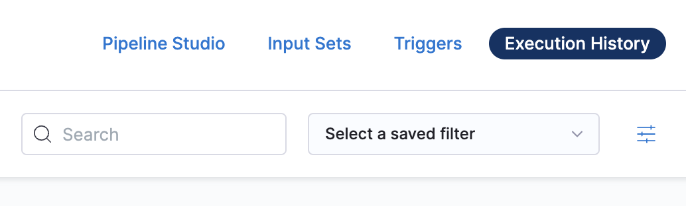
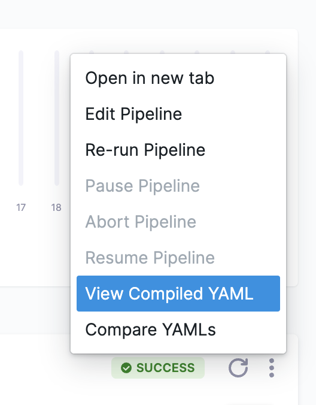
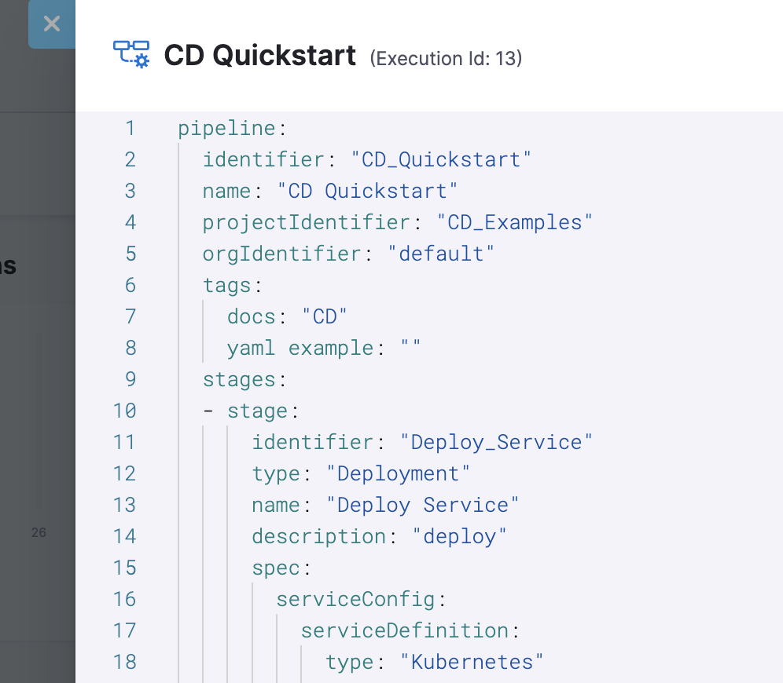
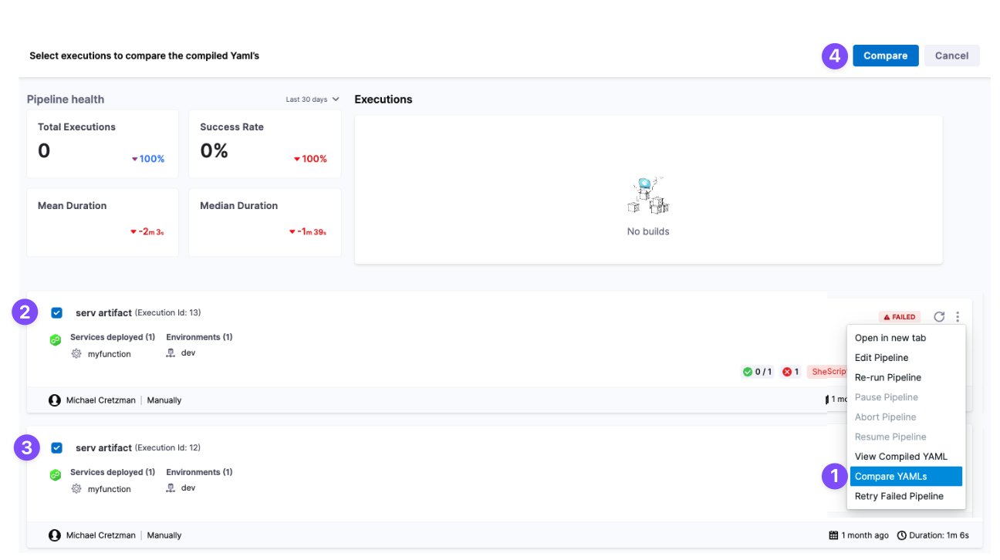
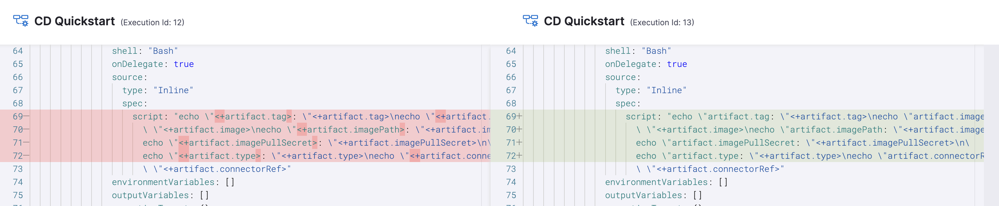

You can view and compare the compiled Harness Pipeline YAML used for each Pipeline execution.

Comparing Pipeline YAML helps you see what changes took place between executions. This can help with troubleshooting execution failures.

### Before you begin

* [CD Pipeline Basics](https://docs.harness.io/article/cqgeblt4uh-cd-pipeline-basics)
* [CI Pipeline Basics](../../continuous-integration/ci-quickstarts/ci-pipeline-basics.md)

### Limitations

* You can only compare YAML from two executions at a time.

### Visual Summary

You can compare Pipeline executions by selecting **Compare YAML**, selecting executions, and clicking **Compare**.

A diff of the Pipeline YAML for each execution is displayed:

### Option: View Compiled Execution YAML

Compiled execution YAML is the Pipeline YAML used in the execution, including all resolved [Runtime Inputs, Expressions](../20_References/runtime-inputs.md), and [variables](../12_Variables-and-Expressions/harness-variables.md).

In a Pipeline, click **Execution History**.

Pick an execution, click more options (⋮), and then click **View Compiled YAML**.

The YAML for the Pipeline used in that execution is displayed.

### Option: Compare Execution YAML

You can compare the compiled execution YAML of two executions. This comparison can help you see what changed between executions. 

In a Pipeline, click **Execution History**.

Select **Compare YAML**, select two executions, and click **Compare**.

A diff of the Pipeline YAML for the two executions is displayed:

The diff can help you quickly see changes and troubleshoot a failed execution.

### See also

* [Pipelines and Stages How-tos](https://docs.harness.io/category/pipelines)

