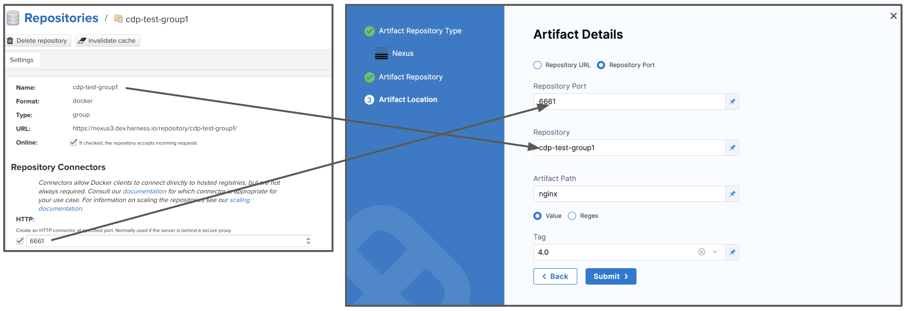

This topic provides settings and permissions for the Nexus Connector.

### Nexus Permissions Required

Ensure the connected user account has the following permissions in the Nexus Server.

* Repo: All repositories (Read)
* Nexus UI: Repository Browser

If used as a Docker Repo, the user needs:

* List images and tags
* Pull images

See [Nexus Managing Security](https://help.sonatype.com/display/NXRM2/Managing+Security).

### Artifact Type Support

Legend:

* **M** - Metadata. This includes Docker image and registry information. For AMI, this means AMI ID-only.
* **Blank** - Not supported.

|  |  |  |  |  |  |  |  |  |  |  |
| --- | --- | --- | --- | --- | --- | --- | --- | --- | --- | --- |
| **Docker Image**(Kubernetes/Helm) | **AWS** **AMI** | **AWS CodeDeploy** | **AWS Lambda** | **JAR** | **RPM** | **TAR** | **WAR** | **ZIP** | **PCF** | **IIS** |
| M |  |  |  |  |  |  |  |  |  | M |

### Docker Support

Nexus 3 Artifact Servers only.

### Nexus Artifact Server

The Harness Nexus Artifact server connects your Harness account to your Nexus artifact resources. It has the following settings.

#### Name

The unique name for this Connector.

#### ID

See [Entity Identifier Reference](../../20_References/entity-identifier-reference.md).

#### Description

Text string.

#### Tags

See [Tags Reference](../../20_References/tags-reference.md).

#### Nexus Repository URL

The URL that you use to connect to your Nexus server. For example, `https://nexus3.dev.mycompany.io`.

#### Version

The **Version** field in the dialog lists the supported Nexus version, 3.x.

For Nexus 3.x, Harness supports only the Docker repository format as the artifact source.

#### Credentials

The username and password for the Nexus account.

The password uses a [Harness Encrypted Text secret](../../6_Security/2-add-use-text-secrets.md).

### Nexus Artifact Details

#### Repository URL

The URL you would use in the Docker login to fetch the artifact. This is the same as the domain name and port you use for `docker login hostname:port`.

#### Repository Port

The port you use for `docker login hostname:port`. As a best practice, include the scheme and port. For example `https://your-repo:443`. If you cannot locate the scheme, you may omit it, for example `your-repo:18080`.

For more information, see [Docker Repository Configuration and Client Connection](https://support.sonatype.com/hc/en-us/articles/115013153887-Docker-Repository-Configuration-and-Client-Connection) and [Using Nexus 3 as Your Repository – Part 3: Docker Images](https://blog.sonatype.com/using-nexus-3-as-your-repository-part-3-docker-images) from Sonatype.

#### Repository

Name of the repository where the artifact is located.

#### Artifact Path

The name of the artifact you want to deploy. For example, `nginx`, `private/nginx`, `public/org/nginx`.

The repository and artifact path must not begin or end with `/`.
#### Tag

Select a Tag from the list.

