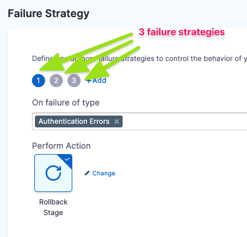

This topic describes the failure strategy settings for pipeline steps and stages.

### Where can I add failure strategies?

You can apply a failure strategy to the following:

* **Step:** This failure strategy overrides (or enhances) the stage failure strategy.
* **Step Group:** You can set up a failure strategy for all steps in the group. Individual steps in the group will not have a failure strategy.
* **Stage:** The failure strategy for all steps and step groups in the stage. It is overridden by step and step group failure strategies, if present.

See [Define a Failure Strategy on Stages and Steps](../define-a-failure-strategy-on-stages-and-steps.md).

### Error types

The following types of errors can be selected in a failure strategy.

Currently, only **All Errors** is supported.

| **Error Type** | **Description** |
| :--- | :--- |
| **Authentication** | Credentials provided in a connector are not valid. Typically, the Harness secret used for one of the credentials is incorrect. If Harness cannot determine if an error is authentication and authorization, then it is treated as an authentication error. |
| **Authorization** | The credentials are valid but the user permissions needed to access the resource are not sufficient. If Harness cannot determine if an error is authentication and authorization, then it is treated as an authentication error. |
| **Connectivity** | A Harness delegate cannot connect to a specific resource. For example, the delegate cannot connect to repo or a VM or a Secrets Manager. |
| **Timeout** | A Harness delegate failed to complete a task within the timeout setting in the stage or step. For example, if the Kubernetes workload you are deploying fails to reach steady state within the step timeout. |
| **Delegate Provisioning** | No available delegate can accomplish the task or the task is invalid. For example, if an HTTP step attempts to connect to a URL but there is no available delegate to perform the task. |
| **Verification** | A Harness continuous verification step failed. |
| **Approval Rejection** | Rollback pipeline stage if approval is rejected for a step or stage. You can select specific failure strategies for approval rejection across steps and stages.
| **All Errors** | An error whether defined by the other error types or not. |

### Error scope

The scope of a failure strategy is confined to where it is set.

For example, a failure strategy set on a step does not impact the failure strategy set on a stage. Likewise, the failure strategy set at the stage does not override any failure strategies on its steps.

### Rollback stage only

Both step and stage failure strategies include the **Rollback Stage** action option. There is no rollback step option.

### Failure strategy settings

The follow tables lists the failure strategy actions and how they work at the step, step group, and stage levels.

These actions can be applied to the failure strategy as the primary action and as the timeout action.

| **Action** | **Step** | **Step Group** | **Stage** |
| :--- | :--- | :--- | :--- |
| **Manual Intervention** | A Harness user will perform a manual intervention when the error type occurs. There are several options to select from: <li> **Mark as Success**</li><li>**Ignore Failure**</li><li>**Retry**</li><li>**Abort**</li><li>**Rollback Stage**</li>Harness pauses the pipeline execution while waiting for manual intervention. The state of the Pipeline execution is displayed as **Paused**. | Same as step. | Same as step, but applies to all steps. |
| **Mark as Success** | The step is marked as **Successful** and the stage execution continues. | Same as step. | The step that failed is marked as **Successful** and the pipeline execution continues. |
| **Ignore Failure** | The stage execution continues. The step is marked as **Failed**, but no rollback is triggered. | Same as step. | Same as step. |
| **Retry** | Harness will retry the execution of the failed step automatically. You can set **Retry Count** and **Retry Intervals**. | Same as step. | Same as step. |
| **Abort** | Pipeline execution is aborted. If you select this option, no timeout is needed. | Same as step. | Same as step. |
| **Rollback Stage** | The stage is rolled back to the state prior to stage execution. How the stage rolls back depends on the type of build or deployment it was performing. | Same as step. | Same as step. |
| **Rollback Step Group** | N/A | The step group is rolled back to the state prior to step group execution. How the step group rolls back depends on the type of build or deployment it was preforming. | N/A |

### Review: Failure strategy takes precedence over conditional execution

Harness pipeline stages and steps both include **Conditional Execution** and **Failure Strategy** settings.

Using these settings together in multiple stages requires some consideration.

Let's say you have a pipeline with two stages: **stage 1** followed by **stage 2**. 

Stage 2's **Conditional Execution** is set to **Execute this step only if prior stage or step failed**. Stage 1's **Failure Strategy** is set to **Rollback Stage on All Errors**.

If stage 1 has any error it is rolled back and so it is not considered a failure. Hence, the stage 2's **Conditional Execution** is not executed.

In order to get stage 2 to execute, you can set the stage 1 **Failure Strategy** to **Ignore Failure**. Rollback will not occur and stage 2's **Conditional Execution** is executed.

In general, if you want to run particular steps on a stage failure, you should add them to stage's **Rollback** section.

### Review: Stage and step priority

The stage failure strategy applies to all steps that do not have their own failure strategy. A step's failure strategy overrides (or extends) its stage's failure strategy.

Step failure strategies are evaluated before their stage's failure strategy. The order of the steps determines which failure strategy is evaluated first.

If the first step in the execution does not have a failure strategy, the stage's failure strategy is used. If the second step has its own failure strategy, it is used. And so on.

### Review: Multiple failure strategies in a stage

A stage can have multiple failure strategies.

When using multiple failure strategies in a stage, consider the following:

* For failure strategies that do not overlap (different types of failures selected), they will behave as expected.
* Two failures cannot occur at the same time. So, whichever error occurs first, that failure strategy will be used.

### Review: Failure strategy conflicts

Conflicts might arise between failure strategies on the same level or different levels. By level, we mean the step level or the stage level.

#### Same level

If there is a conflict between multiple failures in strategies on the same level, the first applicable strategy is used, and the remaining strategies are ignored.

For example, consider these two strategies:

1. Abort on verification failure or authentication failure.
2. Ignore on verification failure or connectivity error.

Here's what will happen:

* On a verification failure, the stage is aborted.
* On an authentication failure, the stage is aborted.
* On a connectivity error, the error is ignored.

#### Different levels

If there is a clash between selected errors in strategies on different levels, the step-level strategy is used and the stage level strategy is ignored.

### Related reference material

* [Stage and Step Execution Condition Settings](step-skip-condition-settings.md)

