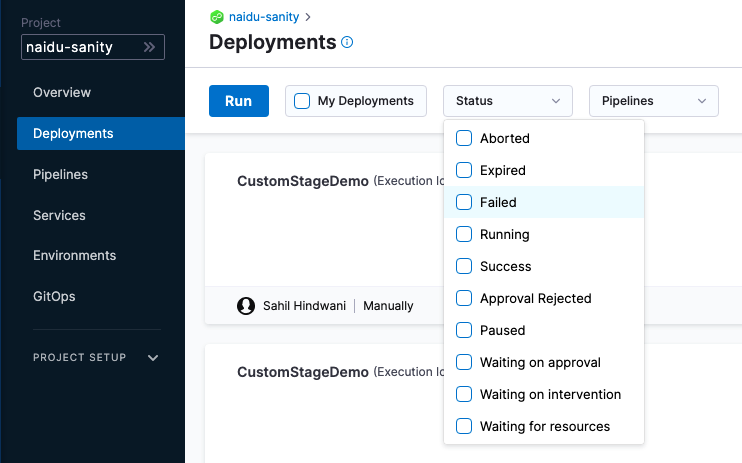

This topic describes Pipeline stage and step **Conditional Executional** settings.

### Failure strategy takes precedence over conditional execution

Harness Pipeline stages and steps both include **Conditional Execution** and **Failure Strategy** settings:

Using these settings together in multiple stages requires some consideration.

Let's say you have a Pipeline with two stages: **stage 1** followed by **stage 2**.

Stage 2's **Conditional Execution** is set to **Execute this step only if prior stage or step failed**. Stage 1's **Failure Strategy** is set to **Rollback Stage on All Errors**.

If stage 1 has any error it is rolled back and so it is not considered a failure. Hence, the stage 2's **Conditional Execution** is not executed.

In order to get stage 2 to execute, you can set the stage 1 **Failure Strategy** to **Ignore Failure**. Rollback will not occur and stage 2's **Conditional Execution** is executed.

In general, if you want to run particular steps on a stage failure, you should add them to stage's **Rollback** section.

### Stage and step priority

The stage Conditional Execution applies to all steps that do not have their own Conditional Execution. A step's Conditional Execution overrides its stage's Conditional Execution.

### Stage conditions

#### Execute this stage if pipeline execution is successful so far

Select this option if you only want this stage to run when all previous stages were successful.

This is the default setting and used most of the time.

#### Always execute this stage

Select this option if you always want this stage to run regardless of the success or failure of previous stages.

#### Execute this stage only if prior pipeline or stage failed

Select this option if you always want this stage to run only if the prior Pipeline or stage failed.

#### And execute this stage only if the following JEXL Condition evaluates to True

Only execute this stage is a [JEXL expression](http://commons.apache.org/proper/commons-jexl/reference/examples.html) is met (evaluates to **true**).

In the JEXL expression, you could use any of the Pipeline variables, including the output of any previous steps.

Examples:

* `<+pipeline.stages.cond.spec.execution.steps.echo.status> == "SUCCEEDED"`
* `<+environment.name> != “QA”`

See [Built-in Harness Variables Reference](../../12_Variables-and-Expressions/harness-variables.md).

### Step conditions

#### Execute this step if the stage execution is successful thus far

Select this option if you only want this step to run when all previous steps were successful.

This is the default setting and used most of the time.

#### Always execute this step

Select this option if you always want this step to run regardless of the success or failure of previous steps.

#### Execute this step only if prior stage or step failed

Select this option if you always want this step to run only if the prior stage or step failed.

#### And execute this step only if the following JEXL Condition evaluates to True

Only execute this step is a [JEXL expression](http://commons.apache.org/proper/commons-jexl/reference/examples.html) is met (evaluates to **true**).

In the JEXL expression, you could use any of the Pipeline variables, including the output of any previous steps.

Example:

* `<+pipeline.stages.cond.spec.execution.steps.echo.status> == "SUCCEEDED"`
* `<+environment.name> != “QA”`

For more information on variable expressions, go to [Built-in and Custom Harness Variables Reference](../../12_Variables-and-Expressions/harness-variables.md).

### Variable expressions in conditional execution settings

Stages and Steps support variable expressions in the JEXL conditions of their **Conditional Execution** settings.

You can only use variable expressions in the JEXL conditions that can be resolved before the stage.

Since **Conditional Execution** settings are used to determine if the stage should be run, you cannot use variable expressions that can't be resolved until the stage is run.

### Deployment status of pipelines, stages, and steps

Deployment status values are a Java enum. The list of values can be seen in the Deployments **Status** filter:

You can use any status value in a JEXL condition. For example, `<+pipeline.stages.cond.spec.execution.steps.echo.status> == "FAILED"`.

#### Stage status

The expression `<+pipeline.stages.STAGE_ID.status>` resolves to the status of a stage.

You must use the expression after the stage in execution.

#### Step status

The expression `<+pipeline.stages.STAGE_ID.spec.execution.steps.STEP_ID.status>` resolves to the status of a step. For example, `<+pipeline.stages.MyStageName.spec.execution.steps.mystep.status>`.

You must use the expression after the step in execution.

### Conditional execution as a runtime input

Conditional execution settings can be defined as runtime inputs in pipelines and templates at stage, step, and step group levels. 

Here's a video that explains how to define conditional execution as a runtime input:

<!-- Video:
https://harness-24.wistia.com/medias/5w053wtla8-->
<docvideo src="https://harness-24.wistia.com/medias/5w053wtla8" />
