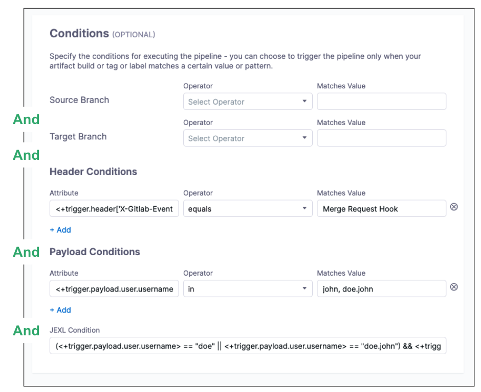
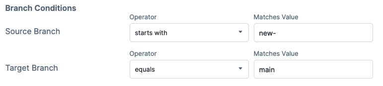
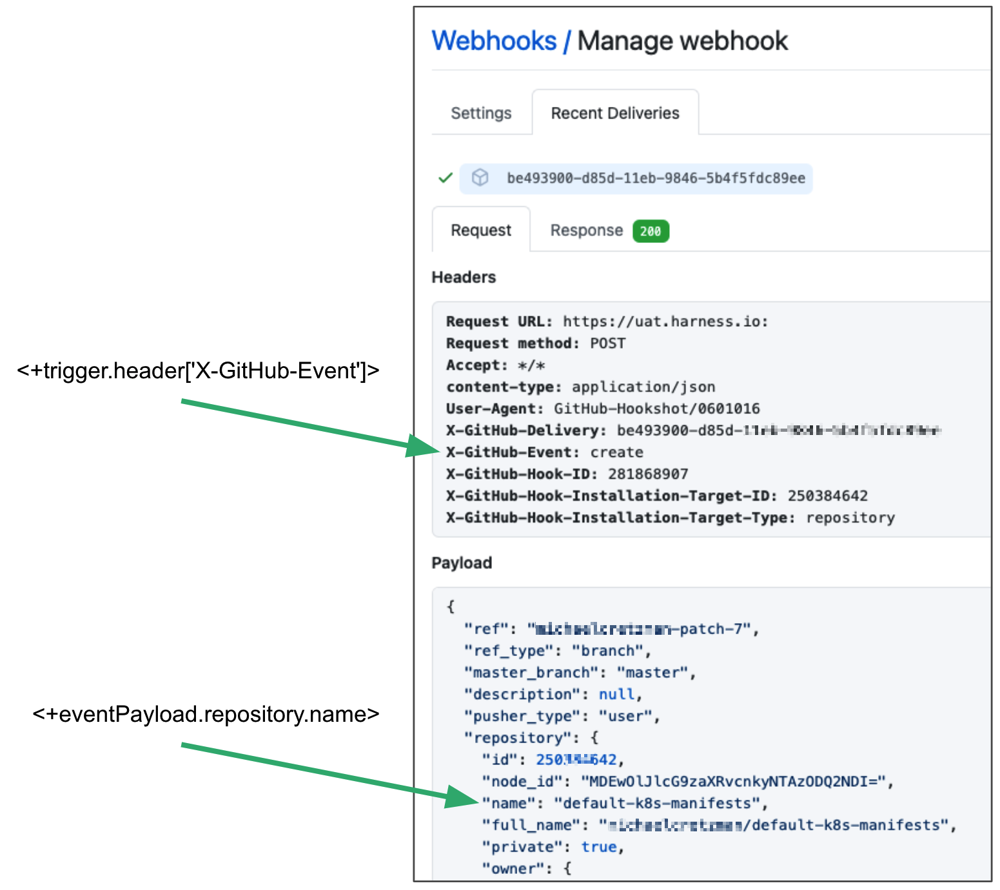
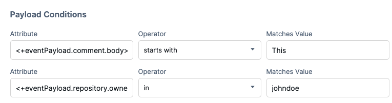
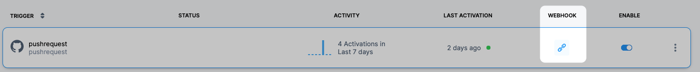
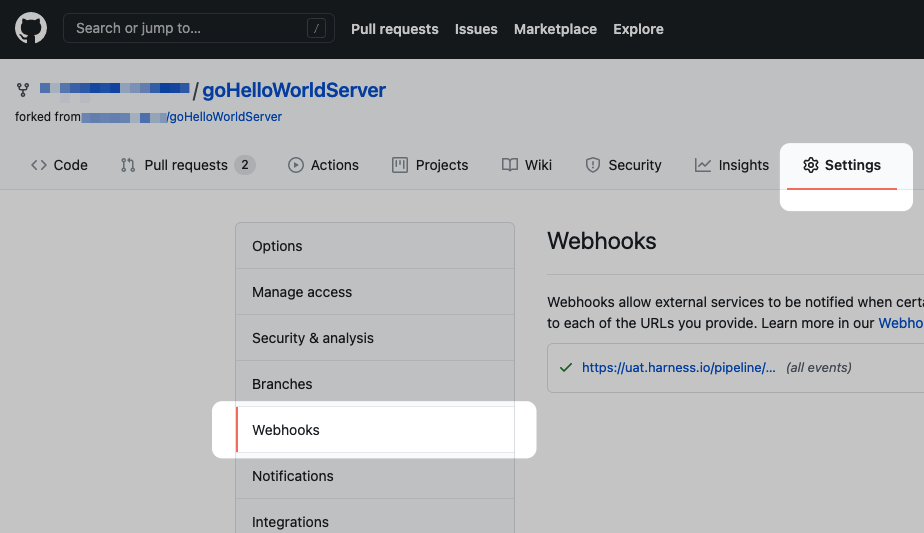

This topic provides settings information for Triggers. Triggers are used to initiate the execution of Pipelines.

For steps on setting up different types of Triggers, see [Triggers Howtos](https://docs.harness.io/category/triggers).

### Name

The unique name for the Trigger.

### ID

See [Entity Identifier Reference](../../20_References/entity-identifier-reference.md).

### Description

Text string.

### Tags

See [Tags Reference](../../20_References/tags-reference.md).

### Payload Type

Git providers, such as GitHub, Bitbucket, and GitLab.

### Custom Payload type

To use a custom payload type, copy the secure token and add it to your custom Git provider.

Whenever you regenerate a secure token, any preceding tokens become invalid. Update your Git provider with the new token.

### Connector

Select the Code Repo Connector that connects to your Git provider account.

See [Code Repo Connectors Tech Ref](https://docs.harness.io/category/code-repo-connectors).

### Repository Name

Enter the name of the repo in the account.

### Event and Actions

 Select the Git events and actions that will initiate the Trigger.


|  |  |  |
| --- | --- | --- |
| **Payload Type** | **Event** | **Action** |
|  **Github** |  Pull Request | Closed |
|   |   | Edited |
|   |   | Labeled |
|   |   | Opened |
|   |   | Reopened |
|   |   | Synchronized |
|   |   | Unassigned |
|   |   | UnLabeled |
|   | Push | n/a |
|   | Issue CommentOnly comments on a pull request are supported. | Created |
|   |   | Deleted |
|   |   | Edited |
| **GitLab** | Push | N/A |
|   | Merge Request | Sync |
|  |  | Open |
|  |  | Close |
|  |  | Reopen |
|  |  | Merge |
|  |  | Update |
| **Bitbucket** |  On Pull Request | Pull Request Created |
|   |   | Pull Request Merged |
|   |   | Pull Request Declined |
|   | Push |  |

Harness uses your Harness account Id to map incoming events. Harness takes the incoming event and compares it to ALL triggers in the account.

You can see the event Id that Harness mapped to a Trigger in the Webhook's event response body `data`:


```
{"status":"SUCCESS","data":"60da52882dc492490c30649e","metaData":null,...
```
Harness maps the success status, execution Id, and other information to this event Id.

### Conditions

Optional conditions to specify in addition to events and actions. These help to form the overall set of criteria to trigger a Pipeline based on changes in a given source.

For example:

* Trigger when a specific value is passed in the source payload.
* Trigger when there's a change in a specific file or a pull request.
* Trigger based on a specific artifact tag convention.

#### Conditions are ANDs

You can think of each Trigger as a complex filter in which all Conditions are `AND`-ed together. To execute a Trigger, the event payload must match all Conditions in the Trigger.


In this example, an event must match all conditions under **Source Branch**, **Target Branch**, **Header Conditions**, **Payload Conditions**, and **JEXL Conditions** for the Trigger to be filtered.

To use `OR`, `NOT`, or other operators across the payload, use a **JEXL Condition** and leave the rest empty.

The JEXL `in` operator is not supported in **JEXL Condition**.

#### Source and Target Branch

The source and target branches of the Git merge that must be matched.

These are available depending on the type of event selected. Any event that belongs to a merge will have Source Branch and Target Branch conditions.

For example:

* Source Branch starts with `new-`
* Target Branch equals `main`


#### Built-in Git Trigger and Payload Expressions

Harness includes built-in expressions for referencing trigger details such as a PR number.

##### Main Expressions

* `<+trigger.type>`
	+ Webhook.
* `<+trigger.sourceRepo>`
	+ Github, Gitlab, Bitbucket, Custom
* `<+trigger.event>`
	+ PR, PUSH, etc.

##### PR and Issue Comment Expressions

* `<+trigger.targetBranch>`
* `<+trigger.sourceBranch>`
* `<+trigger.prNumber>`
* `<+trigger.prTitle>`
* `<+trigger.gitUser>`
* `<+trigger.repoUrl>`
* `<+trigger.commitSha>`
* `<+trigger.baseCommitSha>`
* `<+trigger.event>`
	+ PR, PUSH, etc.

##### Push Expressions

* `<+trigger.targetBranch>`
* `<+trigger.gitUser>`
* `<+trigger.repoUrl>`
* `<+trigger.commitSha>`
* `<+trigger.event>`
	+ PR, PUSH, etc.

#### Header Conditions

Valid JSON cannot contain a dash (–), but headers are not JSON strings and often contain dashes. For example, X-Github-Event, content-type:


```
Request URL: https://app.harness.io:  
Request method: POST  
Accept: */*  
content-type: application/json  
User-Agent: GitHub-Hookshot/0601016  
X-GitHub-Delivery: be493900-000-11eb-000-000  
X-GitHub-Event: create  
X-GitHub-Hook-ID: 281868907  
X-GitHub-Hook-Installation-Target-ID: 250384642  
X-GitHub-Hook-Installation-Target-Type: repository
```
The header expression format is `<+trigger.header['key-name']>`. For example. `<+trigger.header['X-GitHub-Event']>`.


If the header key doesn't contain a dash (`–`), then the format `<+trigger.header.['key name']>` will work also.

When Harness evaluates the header key you enter, the comparison is case insensitive.

In **Matches Value**, you can enter multiple values separated by commas and use wildcards.

#### Payload Conditions

Conditions based on the values of the JSON payload. Harness treats the JSON payload as a data model and parses the payload and listens for events on a JSON payload key.

To reference payload values, you use `<+eventPayload.` followed by the path to the key name.

For example, a payload will have a repository owner:


```
...  
>   "repository" : {  
>     "id": 1296269,  
>     "full_name": "octocat/Hello-World",  
>     "owner": {  
>       "login": "octocat",  
>       "id": 1,  
>       ...  
>     },  
...
```
To reference the repository owner, you would use `<+eventPayload.repository.owner>`. Here's an example using `name`:


Next, you enter an operator and the value to match. For example:


#### Referencing Payload Fields

You can reference any payload fields using the expression `<+trigger.payload.pathInJson>`, where `pathInJson` is the path to the field in the JSON payload.

For example: `<+trigger.payload.pull_request.user.login>`

How you reference the path depends on a few things:

* There are different payloads for different events.
* Different Git providers send JSON payloads formatted differently, even for the same event. For example, a GitHub push payload might be formatted differently than a Bitbucket push payload. Always make sure the path you use works with the provider's payload format.

#### JEXL Expressions

You can refer to payload data and headers using [JEXL expressions](https://commons.apache.org/proper/commons-jexl/reference/syntax.html). That includes all constants, methods, and operators in [JexlOperator](https://commons.apache.org/proper/commons-jexl/apidocs/org/apache/commons/jexl3/JexlOperator.html).

Be careful when you combine Harness variables and JEXL expressions.

* **Invalid expression:** `<+pipeline.variables.MAGIC.toLowerCase()>`  
This expression is ambiguous. It could be evaluated as a Harness variable (return the value of variable `pipeline.variables.MAGIC.toLowerCase()`) or as a JEXL operation (return the lowercase of literal string `pipeline.variables.MAGIC`).
* **Valid expression:** `<+<+pipeline.variables.MAGIC>.toLowerCase()>` First it gets the value of variable `pipeline.variables.MAGIC`. Then it returns the value converted to all lowercase.

Here are some examples:

* `<+trigger.payload.pull_request.diff_url>.contains("triggerNgDemo")`
* `<+trigger.payload.pull_request.diff_url>.contains("triggerNgDemo") || <+trigger.payload.repository.owner.name> == "wings-software"`
* `<+trigger.payload.pull_request.diff_url>.contains("triggerNgDemo") && (<+trigger.payload.repository.owner.name> == "wings-software" || <+trigger.payload.repository.owner.name> == "harness")`

#### Operators

Some operators work on single values and some work on multiple values:

**Single values:** `equals`, `not equals`, `starts with`, `ends with`, `regex`.

**Multiple values:** `in`, `not in`.

The **IN** and **NOT IN** operators don't support Regex.

### Pipeline Input

Runtime Inputs for the Trigger to use, such as Harness Service and artifact.

You can use the [Built-in Git Payload Expressions](#built_in_git_trigger_and_payload_expressions) and JEXL expressions in this setting.

See [Run Pipelines using Input Sets and Overlays](../run-pipelines-using-input-sets-and-overlays.md).

### Webhook

For all Git providers supported by Harness, the Webhook is created in the repo automatically. You don't need to copy it and add it to your repo webhooks.

#### Git Events Automatically Registered with Webhooks

The following Git events are automatically added to the webhooks Harness registers.

##### GitHub

[GitHub events](https://docs.github.com/en/developers/webhooks-and-events/webhooks/webhook-events-and-payloads):

* `create`
* `push`
* `delete`
* `deployment`
* `pull_request`
* `pull_request_review`

##### GitLab

[GitLab events](https://docs.gitlab.com/ee/user/project/integrations/webhooks.html):

* Comment events
* Issue events
* Merge request events
* Push events

##### Bitbucket Cloud

[Bitbucket Cloud events](https://support.atlassian.com/bitbucket-cloud/docs/event-payloads/):

* `issue`
* `pull request`

##### Bitbucket Server

[Bitbucket Server events](https://confluence.atlassian.com/bitbucketserver/event-payload-938025882.html):

* Pull requests
* Branch push tag

#### Manually Applying the Webhook

Although Webhooks are applied automatically by Harness, here's a quick summary of the manual process. This is provided in case the automatic Webhook registration doesn't work.

You obtain the Webhook to use in your repo by clicking the **Webhook** icon.


Log into your repo in the Git provider and navigate to its Webhook settings. For example, here's the **Webhooks** section of GitHub.


Add a Webhook.

In the Webhook settings, paste the Webhook URL you copied from Harness into the payload URL setting in the repo.

Make sure that you select JSON for the content type. For example, in GitHub, you select **application/json** in **Content type**.

#### Custom Webhook

You enter the webhook in your custom Git provider.

Make sure that the payload content type is JSON (application/json).The format for the custom Webhook is:


```
https://app.harness.io/pipeline/api/webhook/custom?accountIdentifier=123456789&orgIdentifier=default&projectIdentifier=myProject&pipelineIdentifier=newpipelinetest&triggerIdentifier=myTrigger
```
The `pipelineIdentifier` and `triggerIdentifier` target the Webhook at the specific Pipeline and Trigger.

Is some cases, you will not want to target the Webhook at the specific Pipeline and Trigger. For example, there are events in GitHub that are not covered by Harness and you might want to set up a Trigger for those events that applies to all Pipelines and their Triggers in the Project.

To instruct Harness to evaluate the custom Trigger against all Pipelines (until it finds a **Conditions** match), remove `pipelineIdentifier` and `triggerIdentifier` from the URL before adding it to your repo.

The `orgIdentifier` and `projectIdentifier` are mandatory.

### Last Execution Details

In a Trigger's details, you can see when the Trigger was executed:

Activation means the Trigger could request Pipeline execution. It doesn't mean that the Webhook didn't work.

If you see **Failed**, the Pipeline probably has a configuration issue that prevented the Trigger from initiating a Execution.

### YAML Example

You can edit your Trigger in YAML also. Click the Trigger, and then click YAML.


```
trigger:  
    name: GitlabNewTrigger  
    identifier: GitlabNewTrigger  
    enabled: true  
    description: ""  
    tags: {}  
    orgIdentifier: default  
    projectIdentifier: NewProject  
    pipelineIdentifier: testpp  
    source:  
        type: Webhook  
        spec:  
            type: Gitlab  
            spec:  
                type: MergeRequest  
                spec:  
                    connectorRef: gitlab  
                    autoAbortPreviousExecutions: true  
                    payloadConditions:  
                        - key: <+trigger.payload.user.username>  
                          operator: In  
                          value: john, doe.john  
                    headerConditions:  
                        - key: <+trigger.header['X-Gitlab-Event']>  
                          operator: Equals  
                          value: Merge Request Hook  
                    jexlCondition: (<+trigger.payload.user.username> == "doe" || <+trigger.payload.user.username> == "doe.john") && <+trigger.header['X-Gitlab-Event']> == "Merge Request Hook"  
                    actions: []  
    inputYaml: |  
        pipeline:  
            identifier: testpp  
            properties:  
                ci:  
                    codebase:  
                        build:  
                            type: branch  
                            spec:  
                                branch: <+trigger.branch>  
            variables:  
                - name: testVar  
                  type: String  
                  value: alpine
```
### Notes

* For details on each providers events, see:
	+ [Events that trigger workflows](https://docs.github.com/en/actions/reference/events-that-trigger-workflows) from GitHub.
	+ [Events](https://docs.gitlab.com/ee/api/events.html) from GitLab.
	+ [Repository events](https://support.atlassian.com/bitbucket-cloud/docs/event-payloads/#Repository-events) from Bitbucket.

