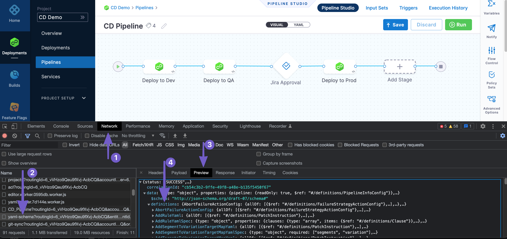

This topic describes the YAML schema for a Pipeline.

It includes common examples of the major schema entries.

New to Harness YAML? See [Harness YAML Quickstart](../harness-yaml-quickstart.md).

### Visual Summary

Here's a very quick video showing you how to build a Pipeline using YAML:

### Viewing the YAML Schema

The Harness YAML schema is over 20k lines long and we are investigating how to expose it in a way that makes it easy to navigate.

In the meantime, you can use [Chrome DevTools](https://developer.chrome.com/docs/devtools/) to view the schema:


### Pipeline Studio YAML Editor

The Pipeline Studio includes visual and YAML editors.

The best way to get started with YAML is to do a CI or CD quickstart and then view the YAML in Pipeline Studio.

See ​[CD Quickstarts](https://docs.harness.io/category/c9j6jejsws) and [CI Quickstarts](https://docs.harness.io/category/onboard-with-ci).

The YAML editor validates YAML before allowing you to save it.

To learn how to use the YAML editor, see [Harness YAML Quickstart for CD](../harness-yaml-quickstart.md).

### Autocomplete and Command Palette

The YAML editor has an autocomplete feature that makes it very easy to see what entries are available.

The keyboard command for autocomplete is `Ctrl + Space`.


If an entry already has a value, the autocomplete will not show you other options. You need to delete the value and then enter `Ctrl + Space`.

The command palette keyboard command is `F1`.


The command palette displays the keyboard shortcuts for all commands.

### Limitations

The visual editor lets you create Connectors inline but the YAML editor does not. For the YAML editor you need the entity Id of the Connector first. Typically, the Id is entered as the value for the `connectorRef` key.

This is a minor limitation as once you have entered in the Id you can configure the rest of the settings in YAML using autocomplete.

For example, here is a Connector with the name `GCP Example` and Id `GCP_Example`. You can see the Id used in the YAML as `connectorRef: GCP_Example`:


|                                               |                                      |
| --------------------------------------------- | ------------------------------------ |
| **Connector**                                 | **YAML**                             |
|  |  |

```
...type: Gcrspec:    connectorRef: GCP_Example    imagePath: library/bar    registryHostname: gcr.io    tag: <+input>identifier: foo...
```
 |

Once you have entered the Id in `connectorRef`, you can use autocomplete to view the remaining settings:


### Schema Overview

Harness Pipeline YAML lets you model your release process declaratively. Each Pipeline entity, component, and setting has a YAML entry.

#### Entries

Entries are standard YAML associative arrays using `key: value`.

Settings are not quoted.

#### Indentation

Whitespace indentation is 4 spaces.

### Conventions

Pipeline syntax uses the following conventions:

* Quotes indicate an empty string. Values do not need quotes. Once you enter a value and save the quotes are removed.
* Entries are listed as `key: keyword`. The key is a data type that corresponds to a setting such as `skipResourceVersioning`. The keyword is a literal definition for the setting, like `false` or `K8sManifest`.
* Brackets indicate an inline series branch (an array of the data type). For example `variables: []`. To edit, you delete the brackets, enter a new line, and enter a dash `-`. Now you can use autocomplete to see the available entries.
* Curly braces indicate an array separated by new lines. For example, `tags: {}`. To enter the entries for this type, delete the curly braces, enter a new line, and then enter the `key: value` pairs. For example:
```
...  
tags:  
    docs: "CD"  
    yaml example: ""  
...
```
* The block style indicator `|` turns every newline within the string into a literal newline and adds one line at the end. The `-` indicates removes newlines from the end. For example:
```
...  
script: |-  
    echo "hello"  
  
    echo <+pipeline.name>  
...
```

### Pipeline

A Pipeline can have an unlimited number of configurations. This section simply covers the basic YAML schema.

#### Schema

This is the basic schema for a Pipeline:


```
pipeline:  
    name: ""  
    identifier: ""  
    projectIdentifier: ""  
    orgIdentifier: ""  
    tags: {}  
    stages:  
        - stage:  
    flowControl:  
    notificationRules:
```
The `projectIdentifier` and `orgIdentifier` must match existing Project and Org Ids.

From here you can add stages, Service, Infrastructure, and Execution. Harness will not allow you to save your Pipeline until these three components are set up.

#### Example

Here is a very basic Pipeline that meets the minimum requirements and uses a Shell Script step:


```
pipeline:  
    name: YAML  
    identifier: YAML  
    projectIdentifier: CD_Examples  
    orgIdentifier: default  
    tags: {}  
    stages:  
        - stage:  
              name: Deploy  
              identifier: Deploy  
              description: ""  
              type: Deployment  
              spec:  
                  serviceConfig:  
                      serviceRef: nginx  
                      serviceDefinition:  
                          type: Kubernetes  
                          spec:  
                              variables: []  
                  infrastructure:  
                      environmentRef: helmchart  
                      infrastructureDefinition:  
                          type: KubernetesDirect  
                          spec:  
                              connectorRef: <+input>  
                              namespace: <+input>  
                              releaseName: release-<+INFRA_KEY>  
                      allowSimultaneousDeployments: false  
                  execution:  
                      steps:  
                          - step:  
                                type: ShellScript  
                                name: Echo  
                                identifier: Echo  
                                spec:  
                                    shell: Bash  
                                    onDelegate: true  
                                    source:  
                                        type: Inline  
                                        spec:  
                                            script: echo "hello"  
                                    environmentVariables: []  
                                    outputVariables: []  
                                    executionTarget: {}  
                                timeout: 10m  
                      rollbackSteps: []  
              tags: {}  
              failureStrategies:  
                  - onFailure:  
                        errors:  
                            - AllErrors  
                        action:  
                            type: StageRollback
```
See also:

* [Using Shell Scripts in CD Stages](https://docs.harness.io/article/k5lu0u6i1i-using-shell-scripts)

### Stage

A Stage is a subset of a Pipeline that contains the logic to perform one major segment of the Pipeline process. Stages are based on the different milestones of your Pipeline, such as building, approving, and delivering.

#### Schema


```
stages:  
    - stage:  
          name: ""  
          identifier: ""  
          description: ""  
          type: Deployment  
          spec:  
              serviceConfig:  
                  serviceRef: ""  
                  serviceDefinition:  
                      type: ""  
                      spec:  
                          variables: []  
              infrastructure:  
                  environmentRef: ""  
                  infrastructureDefinition:  
                      type: ""  
                      spec:  
                          connectorRef: ""  
                          namespace: ""  
                          releaseName: release-""  
                  allowSimultaneousDeployments: ""  
              execution:  
                  steps:  
                      - step:  
                            type: ""  
                            name: ""  
                            identifier: ""  
                            spec:  
                  rollbackSteps: []  
          tags: {}  
          failureStrategies:  
              - onFailure:  
                    errors:  
                        - AllErrors  
                    action:  
                        type: StageRollback
```
Rollback steps, failure strategies, and execution conditions are set at the end of the stage YAML.


```
...  
                  rollbackSteps: []  
          tags: {}  
          failureStrategies:  
              - onFailure:  
                    errors:  
                        - AllErrors  
                    action:  
                        type: StageRollback  
...
```
#### Example


```
stages:  
    - stage:  
          name: Deploy  
          identifier: Deploy  
          description: ""  
          type: Deployment  
          spec:  
              serviceConfig:  
                  serviceRef: nginx  
                  serviceDefinition:  
                      type: Kubernetes  
                      spec:  
                          variables: []  
              infrastructure:  
                  environmentRef: helmchart  
                  infrastructureDefinition:  
                      type: KubernetesDirect  
                      spec:  
                          connectorRef: <+input>  
                          namespace: <+input>  
                          releaseName: release-<+INFRA_KEY>  
                  allowSimultaneousDeployments: false  
              execution:  
                  steps:  
                      - step:  
                            type: ShellScript  
                            name: Echo  
                            identifier: Echo  
                            spec:  
                                shell: Bash  
                                onDelegate: true  
                                source:  
                                    type: Inline  
                                    spec:  
                                        script: echo "hello"  
                                environmentVariables: []  
                                outputVariables: []  
                                executionTarget: {}  
                            timeout: 10m  
                  rollbackSteps: []  
          tags: {}  
          failureStrategies:  
              - onFailure:  
                    errors:  
                        - AllErrors  
                    action:  
                        type: StageRollback
```
See also:

* [Add a Stage](../add-a-stage.md)
* [Define a Failure Strategy on Stages and Steps](../define-a-failure-strategy-on-stages-and-steps.md)
* [Set Execution Conditions on Stages and Steps](https://docs.harness.io/article/f5y37ke7ko-set-execution-conditions-on-stages-and-steps)

### Service

A Service represents your microservices and other workloads logically.

A Service is a logical entity to be deployed, monitored, or changed independently.

When a Service is added to the stage in a Pipeline, you define its Service Definition. Service Definitions represent the real artifacts, manifests, and variables of a Service. They are the actual files and variable values.

#### Schema


```
spec:  
    serviceConfig:  
        serviceRef: ""  
        serviceDefinition:  
            type: ""  
            spec:  
                variables: []
```
If you propagate a Service from a previous stage, the YAML indicated it this way:


```
spec:  
    serviceConfig:  
        useFromStage:  
            stage: ""
```
#### Example


```
spec:  
    serviceConfig:  
        serviceRef: nginx  
        serviceDefinition:  
            type: Kubernetes  
            spec:  
                variables: []
```
See also:

* [Propagate and Override CD Services](https://docs.harness.io/article/t57uzu1i41-propagate-and-override-cd-services)

### Infrastructure

Infrastructure is defined under Environments. Environments represent your deployment targets logically (QA, Prod, etc). You can add the same Environment to as many Stages as you need.

#### Schema


```
infrastructure:  
    environmentRef: ""  
    infrastructureDefinition:  
        type: ""  
        spec:  
            connectorRef: ""  
            namespace: ""  
            releaseName: release-""  
    allowSimultaneousDeployments: true|false
```
#### Example


```
infrastructure:  
    environmentRef: <+input>  
    infrastructureDefinition:  
        type: KubernetesDirect  
        spec:  
            connectorRef: <+input>  
            namespace: <+input>  
            releaseName: release-<+INFRA_KEY>  
    allowSimultaneousDeployments: false
```
That example is for the platform agnostic Kubernetes infrastructure. For a different infrastructure, such as GCP, it would look slightly different:


```
 infrastructure:  
    environmentRef: <+input>  
    infrastructureDefinition:  
        type: KubernetesGcp  
        spec:  
            connectorRef: <+input>  
            cluster: <+input>  
            namespace: <+input>  
            releaseName: release-<+INFRA_KEY>  
    allowSimultaneousDeployments: false
```
See also:

* [Define Your Kubernetes Target Infrastructure](https://docs.harness.io/article/0ud2ut4vt2-define-your-kubernetes-target-infrastructure)
* [Define Kubernetes Cluster Build Infrastructure](https://docs.harness.io/article/x7aedul8qs-kubernetes-cluster-build-infrastructure-setup)

### Execution

The stage Execution contains the steps for the stage.

#### Schema


```
execution:  
    steps:  
        - step:  
              identifier: ""  
              name: ""  
              type: ""  
    rollbackSteps: []
```
#### Example

Here is an example using the Shell Script step.


```
execution:  
    steps:  
        - step:  
              type: ShellScript  
              name: Step  
              identifier: Step  
              spec:  
                  shell: Bash  
                  onDelegate: true  
                  source:  
                      type: Inline  
                      spec:  
                          script: echo "hello"  
                  environmentVariables: []  
                  outputVariables: []  
                  executionTarget: {}  
              timeout: 10m  
    rollbackSteps: []
```
See also:

* [Viewing Execution Status](https://docs.harness.io/article/aiuwxmwfe9-viewing-execution-status)

### Steps and Step Groups

A step is an individual operation in a stage.

Steps can be run in sequential and parallel order.

A Step Group is a collection of steps that share the same logic such as the same rollback strategy.

#### Schema

Step:


```
- step:  
      identifier:   
      name:   
      type: 
```
Step Group:


```
- stepGroup:  
      name:   
      identifier:   
      steps:  
          - step:  
                identifier:   
                name:   
                type: 
```
#### Example

Each step has different entries.

Here is an example of a Canary Deployment step.


```
- step:  
      name: Canary Deployment  
      identifier: canaryDeployment  
      type: K8sCanaryDeploy  
      timeout: 10m  
      spec:  
          instanceSelection:  
              type: Count  
              spec:  
                  count: 1  
          skipDryRun: false
```
See also:

* [CD How-tos](https://docs.harness.io/category/21a052rbi0)

### Fixed Value, Runtime Input, and Expression

You can use Fixed Value, Runtime Input, and Expressions for most settings.

* **Fixed value:** The value is simply entered in the value of the `key: value` entry.
* **Runtime input:** You simple enter `<+input>` in the value of the `key: value` entry.
* **Expression:** You simply enter `<+` in the value of the `key: value` entry and a list of available expressions appears. Select the expression to use.


See also:

* [Fixed Values, Runtime Inputs, and Expressions](../../20_References/runtime-inputs.md)

### Flow Control

Barriers allow you to synchronize different stages in your Pipeline, and control the flow of your deployment systematically.

The Flow Control YAML is at the end of the Pipeline YAML, but it is not mandatory.

#### Schema


```
pipeline:  
    name: ""  
    identifier: ""  
    projectIdentifier: ""  
    orgIdentifier: ""  
    tags: {}  
    stages:  
...  
    flowControl:  
        barriers:  
            - name: ""  
              identifier: ""
```
#### Example


```
flowControl:  
    barriers:  
        - name: mybarrier  
          identifier: mybarrier
```
See also:

* [Synchronize Deployments using Barriers](https://docs.harness.io/article/dmlf8w2aeh-synchronize-deployments-using-barriers)

### Notification Rules

You can send Pipeline event notifications using email and popular communication and incident management platforms.

Event notifications are set up using Notification Rules in your Pipeline. You select the types of events to send, and then select how you want to send notifications. When those events occur, Harness sends event information to those channels and recipients.

The Notification Rules YAML is at the end of the Pipeline YAML, but it is not mandatory.

#### Schema


```
pipeline:  
    name: ""  
    identifier: ""  
    projectIdentifier: ""  
    orgIdentifier: ""  
    tags: {}  
    stages:  
...  
    notificationRules:  
        - name: ""  
          pipelineEvents:  
              - type: ""  
          notificationMethod:  
              type: ""  
              spec:  
                  userGroups: []  
                  recipients:  
                      - ""  
          enabled: true|false
```
#### Example


```
notificationRules:  
    - name: mynotification  
      pipelineEvents:  
          - type: AllEvents  
      notificationMethod:  
          type: Email  
          spec:  
              userGroups: []  
              recipients:  
                  - john.doe@harness.io  
      enabled: true
```
See also:

* [Add a Pipeline Notification Strategy](https://docs.harness.io/article/4bor7kyimj-notify-users-of-pipeline-events)

### Triggers

Triggers are used to automate the execution of Pipelines based on some event like new artifact/manifest, or run on a schedule or an external webhook.

Trigger YAML is not part of the main Pipeline YAML, but Triggers can be configure using YAML in the **Triggers** tab of the Pipeline.

#### Schema

Webhook:


```
trigger:  
    name: ""  
    identifier: ""  
    enabled: true|false  
    description: ""  
    tags: {}  
    orgIdentifier: ""  
    projectIdentifier: ""  
    pipelineIdentifier: ""  
    source:  
        type: Webhook  
        spec:  
            type: Github  
            spec:  
                type: ""  
                spec:  
                    connectorRef: ""  
                    autoAbortPreviousExecutions: true|false  
                    payloadConditions:  
                        - key: ""  
                          operator: ""  
                          value: ""  
                        - key: ""  
                          operator: ""  
                          value: ""  
                        - key: ""  
                          operator: ""  
                          value: ""  
                    headerConditions: []  
                    actions: []
```
Schedule (Cron):


```
trigger:  
    name: ""  
    identifier: ""  
    enabled: true|false  
    tags: {}  
    orgIdentifier: ""  
    projectIdentifier: ""  
    pipelineIdentifier: ""  
    source:  
        type: Scheduled  
        spec:  
            type: Cron  
            spec:  
                expression: ""
```
Custom:


```
trigger:  
    name: ""  
    identifier: ""  
    enabled: true|false  
    description: ""  
    tags: {}  
    orgIdentifier: ""  
    projectIdentifier: ""  
    pipelineIdentifier: ""  
    source:  
        type: Webhook  
        spec:  
            type: Custom  
            spec:  
                payloadConditions: []  
                headerConditions: []
```
#### Example

Here's a Webhook Trigger for a Pipeline with Runtime Input settings. Runtime Input settings in a Pipeline result in the `inputYaml` section of the Trigger.


```
trigger:  
    name: mytrigger  
    identifier: mytrigger  
    enabled: true  
    description: ""  
    tags: {}  
    orgIdentifier: default  
    projectIdentifier: CD_Examples  
    pipelineIdentifier: YAML  
    source:  
        type: Webhook  
        spec:  
            type: Github  
            spec:  
                type: PullRequest  
                spec:  
                    connectorRef: quickstart  
                    autoAbortPreviousExecutions: false  
                    payloadConditions:  
                        - key: changedFiles  
                          operator: Equals  
                          value: filename  
                        - key: sourceBranch  
                          operator: Equals  
                          value: foo  
                        - key: targetBranch  
                          operator: Equals  
                          value: bar  
                    headerConditions: []  
                    actions: []  
    inputYaml: |  
        pipeline:  
            identifier: YAML  
            stages:  
                - stage:  
                      identifier: Deploy  
                      type: Deployment  
                      spec:  
                          infrastructure:  
                              infrastructureDefinition:  
                                  type: KubernetesDirect  
                                  spec:  
                                      connectorRef: Kubernetes_Quickstart  
                                      namespace: default  
                - stage:  
                      identifier: Canary  
                      type: Deployment  
                      spec:  
                          infrastructure:  
                              environmentRef: helmchart  
                              infrastructureDefinition:  
                                  type: KubernetesDirect  
                                  spec:  
                                      connectorRef: Kubernetes_Quickstart  
                                      namespace: default
```
See also:

* 

### Input Sets and Overlays

Harness Input Sets are collections of runtime inputs for a Pipeline provided before execution. Runtime inputs contain the values that you would be prompted to provide when you executed the Pipeline.

Overlays are groups of Input Sets. Overlays enable you to provide several Input Sets when executing a Pipeline.

#### Schema

The Input Set YAML depends on the settings in your Pipeline that use Runtime Inputs.

Input Set:


```
inputSet:  
    name: ""  
    tags: {}  
    identifier: ""  
    orgIdentifier: ""  
    projectIdentifier: ""  
    pipeline:  
        identifier: ""  
        stages:  
            - stage:  
                  identifier: ""  
                  type: ""  
                  spec:  
                      infrastructure:  
                          infrastructureDefinition:  
                              type: ""  
                              spec:  
                                  connectorRef: ""  
                                  namespace: ""
```
Overlay:


```
overlayInputSet:  
    name: ""  
    identifier: ""  
    orgIdentifier: ""  
    projectIdentifier: ""  
    pipelineIdentifier: ""  
    inputSetReferences:  
        - ""  
        - ""  
    tags: {}
```
#### Example

Input Set:


```
inputSet:  
    name: My Input Set 1  
    tags: {}  
    identifier: My_Input_Set  
    orgIdentifier: default  
    projectIdentifier: CD_Examples  
    pipeline:  
        identifier: YAML  
        stages:  
            - stage:  
                  identifier: Deploy  
                  type: Deployment  
                  spec:  
                      infrastructure:  
                          infrastructureDefinition:  
                              type: KubernetesDirect  
                              spec:  
                                  connectorRef: Kubernetes_Quickstart  
                                  namespace: default  
            - stage:  
                  identifier: Canary  
                  type: Deployment  
                  spec:  
                      infrastructure:  
                          environmentRef: helmchart  
                          infrastructureDefinition:  
                              type: KubernetesDirect  
                              spec:  
                                  connectorRef: Kubernetes_Quickstart  
                                  namespace: default
```
Overlay:


```
overlayInputSet:  
    name: My Overlay Set  
    identifier: My_Overlay_Set  
    orgIdentifier: default  
    projectIdentifier: CD_Examples  
    pipelineIdentifier: YAML  
    inputSetReferences:  
        - My_Input_Set  
        - My_Input_Set_2  
    tags: {}
```
See also:

* [Input Sets and Overlays](../input-sets.md)

### Connectors

Connectors contain the information necessary to integrate and work with 3rd party tools.

Harness uses Connectors at Pipeline runtime to authenticate and perform operations with a 3rd party tool.

In the visual editor, Connectors can be added inline as your build your Pipeline.

In YAML editor, Connectors are not configured inline. You can only reference existing Connectors.

When you create a Connector, you can use YAML.

Here's what the YAML for a Connector looks like:


```
connector:  
    name: cd-doc  
    identifier: cddoc  
    description: ""  
    orgIdentifier: default  
    projectIdentifier: CD_Examples  
    type: K8sCluster  
    spec:  
        credential:  
            type: InheritFromDelegate  
        delegateSelectors:  
            - example
```
You reference a Connector in your Pipeline by using its Id in `connectorRef`:


```
...  
infrastructureDefinition:  
    type: KubernetesDirect  
    spec:  
        connectorRef: cddoc  
        namespace: default  
        releaseName: release-<+INFRA_KEY>  
...
```

