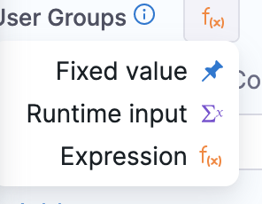
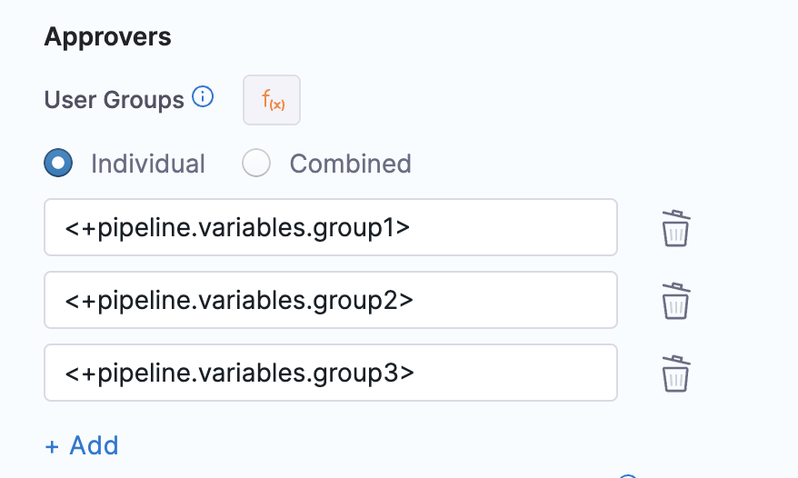
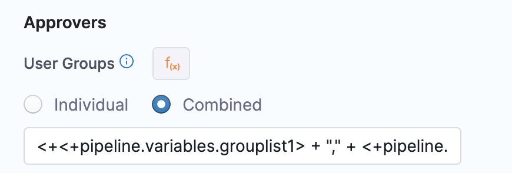

You can specify Harness User Group(s) to approve or reject a Pipeline at any point in its execution. During deployment, the User Group members use the Harness Manager to approve or reject the Pipeline deployment manually.

Approvals are added in between Stages to prevent the Pipeline execution from proceeding without an approval.

For example, in a [CI Build pipeline](../../continuous-integration/ci-quickstarts/ci-pipeline-quickstart.md), you might want to add an approval stage between a Build Stage and an Integration Test Stage.

Other approval methods are:

* [Manual Harness Approval Steps in CD Stages](/docs/continuous-delivery/x-platform-cd-features/cd-steps/approvals/using-harness-approval-steps-in-cd-stages/): add Approval steps to a stage for manual intervention.
* [Adding Jira Approval Stages and Steps](adding-jira-approval-stages.md): add Jira Approval stages and steps.

### Before you begin

* [Add a Stage](../8_Pipelines/add-a-stage.md)

### Visual summary

Here's a Manual Approval Stage step during the execution of a pipeline:


An approver can approve/reject the stage, stopping the pipeline. The approver can also add comments and define variables for use by subsequent approvers and steps.

Here's a quick video that walks you through setting up and running the step:

<!-- Video:
https://www.youtube.com/watch?v=V-d6kaMBf-w-->
<docvideo src="https://www.youtube.com/watch?v=V-d6kaMBf-w" />

Here's what a Manual Approval Stage and step looks like in YAML:

YAML Example
```
- stage:  
      name: Manual Stage  
      identifier: Manual_Stage  
      description: ""  
      type: Approval  
      spec:  
          execution:  
              steps:  
                  - step:  
                        name: Approval  
                        identifier: approval  
                        type: HarnessApproval  
                        timeout: 1d  
                        spec:  
                            approvalMessage: |-  
                                Please review the following information  
                                and approve the pipeline progression  
                            includePipelineExecutionHistory: true  
                            approvers:  
                                minimumCount: 1  
                                disallowPipelineExecutor: false  
                                userGroups:  
                                    - docs  
                            approverInputs:  
                                - name: myvar  
                                  defaultValue: myvalue  
      failureStrategies: []
```
### Add the Approval stage

In a CD Pipeline, click **Add Stage**.

Click **Approval**.

Enter a name and then click **Harness Approval**. The **Harness Approval** stage appears, containing a new **Approval** step.

Click the **Approval** step.

### Set timeout

Set a default for the step timeout. Leave enough time for the Users in **Approvers** to see and respond to the waiting step.

The default timeout for an Approval step is **1d** (24 hours). You can use `**w**` for week, `**d**` for day, `**h**` for hour, `**m**` for minutes, `**s**` for seconds and `**ms**` for milliseconds. For example, 1d for one day.

The maximum timeout duration is 53 weeks. The timeout countdown appears when the step in executed.


### Add message

In **Approval Message**, add the message for the Users in **Approvers**.

### Include stage execution details in approval

Enable this option to provide approvers with the execution history for this Pipeline. This can help approvers make their decision.

### Auto-reject previous deployments in approval

Enable this option to reject old executions waiting for approval when a latest step is approved. 

:::info

If you have two approval steps in a step group of a stage with the same step identifier, Harness won't be able to differentiate between the approval steps, and rejects previous deployments with the same identifier.

:::

### Select approvers

In **Approvers**, in **User Groups**, select the Harness User Groups across Project/Org/Account scope, that will approve the step.


In **Number of approvers**, enter how many of the Users in the User Groups must approve the step.

### Prevent approval by pipeline executor

If you don't want the User that initiated the Pipeline execution to approve this step, select the **Disallow the executor from approving the pipeline** option.

### Approver inputs

You can enter variables and when the approver views the step they can provide new values for the variables.

If there are multiple approvers, the first approver sees the variables as you entered them in the step. If the first approver enters new values, the next approver sees the values the first approver entered.

A third approver will see all the variables the first and second approver provided.

The variable values entered by the final approver populate the expressions created from the inputs.

For example, if there were three approvers, and you added a Shell Script step that referenced the input variables with an expression, the expression would render the variable values entered by the final, third approver.

You can reference input variables using the `approverInputs` expression:

`<+pipeline.stages.[stage_name].spec.execution.steps.[step_name].output.approverInputs.[variable_name]>`

These variables can serve as inputs to later stages of the same Pipeline, where they support conditional execution or user overrides. 

For example, in a subsequent step's **Conditional Execution** settings, you could use an expression that only runs the step if the expression evaluates to 1.

`<+pipeline.stages.Shell_Script.spec.execution.steps.Harness_Approval_Step.output.approverInputs.foo> == 1`

### User groups as expressions

In **User Groups**, select **Expression** as the type of value.



You can select one of the following types of expression for user groups:
* **Individual**: Specify individual expressions for each user group that needs to be configured as an approver. Select **Add** to add more user groups. 

  

* **Combined**: Specify a combined expression for all user groups that need to be configured as Approvers. This expression must resolve to a list of strings.

  Following example shows a combined expression:

  `<+ <+pipeline.variables.grouplist1> + "," + <+pipeline.variables.grouplist2> >.split(",")`

  The expression `<+pipeline.variables.grouplist1>` resolves to `_project_all_users,testUserGroup`
  and the expression `<+pipeline.variables.grouplist2>` resolves to `org._organization_all_users,account._account_all_users`. 
  The above two expressions resolve to a string of comma-separated user groups. The combined expression resolves to a list of the following user groups:
  - _project_all_users
  -  testUserGroup
  -  org._organization_all_users
  -  account._account_all_users

  :::important
  Make sure no spaces are present in the expression values. In the above example, the format must be `_project_all_users,testUserGroup` to match the        split criteria `,` .
  :::


   

### Advanced settings

See:

* [Step Skip Condition Settings](../8_Pipelines/w_pipeline-steps-reference/step-skip-condition-settings.md)
* [Step Failure Strategy Settings](../8_Pipelines/w_pipeline-steps-reference/step-failure-strategy-settings.md)
* [Select Delegates with Selectors](../2_Delegates/manage-delegates/select-delegates-with-selectors.md)

### See also

* [Using Manual Harness Approval Steps in CD Stages](/docs/continuous-delivery/x-platform-cd-features/cd-steps/approvals/using-harness-approval-steps-in-cd-stages/)
* [Update Jira Issues in CD Stages](/docs/continuous-delivery/x-platform-cd-features/cd-steps/ticketing-systems/update-jira-issues-in-cd-stages)

