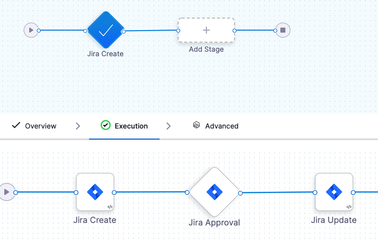
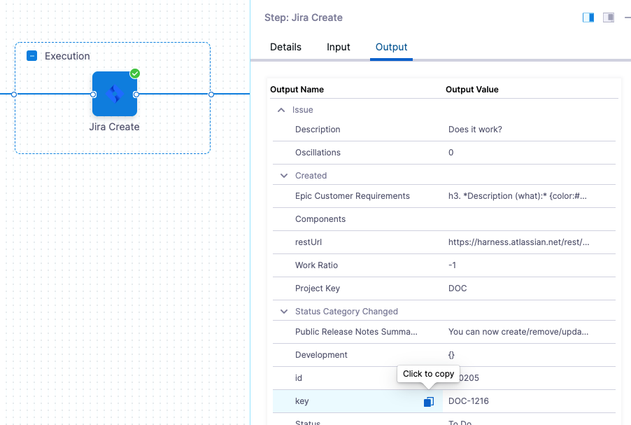
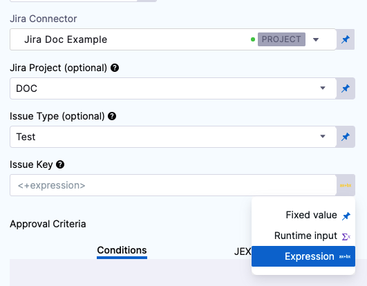
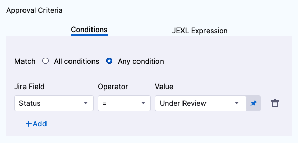
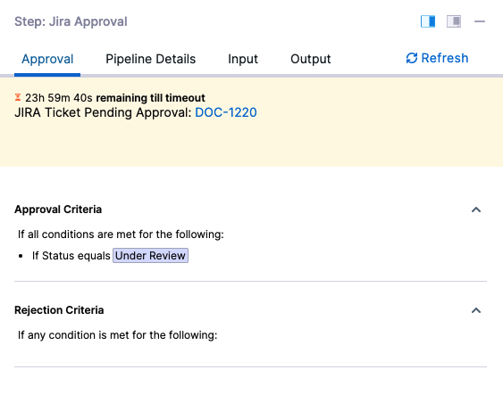
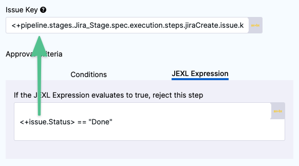
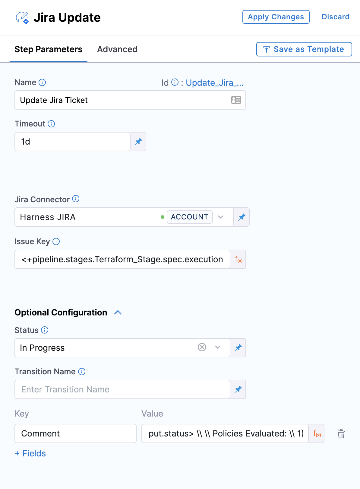

You can use Jira issues to approve or reject a Pipeline or stage at any point in its execution.

During deployment, a Jira issue's fields are evaluated according to criteria you define and its approval/rejection determines if the Pipeline or stage may proceed.

The **Jira Approval** step can be added in Jira Approval stages or in CD stages. The Jira Approval step prevents the stage execution from proceeding without an approval.

For example, in a [Kubernetes Blue Green Deployment](https://ngdocs.harness.io/article/mog5tnk5pi-create-a-kubernetes-blue-green-deployment), you might want to add an approval step between the Stage Deployment step, where the new app version is deployed to the staging environment, and the Swap Primary with Stage step, where production traffic is routed to the pods for the new version.

Looking to create or update Jira issues? See [Create Jira Issues in CD Stages](https://ngdocs.harness.io/article/yu40zr6cvm-create-jira-issues-in-cd-stages), [Update Jira Issues in CD Stages](https://ngdocs.harness.io/article/urdkli9e74-update-jira-issues-in-cd-stages).

### Before you begin

* [Connect to Jira](../7_Connectors/connect-to-jira.md)
* [Create Jira Issues in CD Stages](https://docs.harness.io/article/yu40zr6cvm-create-jira-issues-in-cd-stages)
* [Update Jira Issues in CD Stages](https://docs.harness.io/article/urdkli9e74-update-jira-issues-in-cd-stages)

### Visual Summary

The following video shows you how to use the Jira Create, Jira Update, and Jira Approval steps:

### Limitations

* Harness supports only Jira fields of type `Option`, `Array`, `Any`, `Number`, `Date`, and `String`. Harness does not integrate with Jira fields that manage users, issue links, or attachments. This means that Jira fields like Assignee and Sprint are not accessible in Harness' Jira integration.

### Review: Jira Approval Stages vs Steps

You can use Jira Approvals in two ways:

* **Jira Approval step:** you can add a Jira Approval step to any CD or Approval stage.
* **Jira Approval stage:** the Jira Approval stage includes Jira Create, Jira Approval, and Jira Update steps:

You do not need to use the Jira Create and Jira Update steps with the Jira Approval step, but they are included in the Jira Approval stage because many users want to create a Jira issue, approve/reject based on its settings, and then update the Jira issue all in one stage.

You can also achieve this simply by using the Jira Create, Jira Approval, and Jira Update steps within a non-Approval stage.

The Jira Create and Jira Update steps are described in other topics. This topic describes the Jira Approval step only.

See:

* [Create Jira Issues in CD Stages](https://docs.harness.io/article/yu40zr6cvm-create-jira-issues-in-cd-stages)
* [Update Jira Issues in CD Stages](https://docs.harness.io/article/urdkli9e74-update-jira-issues-in-cd-stages)

### Step 1: Add a Jira Approval Step

In a CD or Approval stage, click **Add Step**, and then click **Jira Approval**.

When you add a Jira Approval stage, Harness automatically adds Jira Create, Jira Approval, and Jira Update steps. We'll only cover the Jira Approval step here.

In **Name**, enter a name that describes the step.

In **Timeout**, enter how long you want Harness to try to complete the step before failing (and initiating the stage or step [Failure Strategy](../8_Pipelines/define-a-failure-strategy-on-stages-and-steps.md)).

You can use `**w**`  for week, `**d**`  for day, `**h**`  for hour, `**m**`  for minutes, `**s**`  for seconds and `**ms**` for milliseconds. For example, 1d for one day.

Jira communication can take a few minutes. Do not use a brief timeout.

The maximum is 3w 3d 20h 30m.In **Jira Connector**, create or select the [Jira Connector](../7_Connectors/connect-to-jira.md) to use.

In **Project**, select the Jira project that contains the issue you want to evaluate.

In **Issue Key**, enter the Jira issue key of the issue you want to evaluate.

### Option: Use an Expression in Issue Key

In **Issue Key**, you can use an expression to reference the Key ID from another Jira Create or Jira Update step.

The Jira Create or Jira Update step you want to reference must be before the Jira Approval step that references it in the Pipeline and stage.

First, identify the step where you want to get the ID from.

You'll have to close the Jira Approval step to get the the ID from the previous step. An ID is required, so you can just enter any number for now and click **Save**.In the Pipeline, click **Execution History**.

Select a successful execution, and click the Jira Create/Update step in the execution.

Click the **Output** tab, locate the **Key** setting, and click the copy button.

The expression will look something like this:

`<+pipeline.stages.Jira_Stage.spec.execution.steps.jiraCreate.issue.key>`

Now you have the expression that references the key ID from this step.

Go back to your Jira Approval step. You can just select **Edit Pipeline**.

In **Issue Key**, select **Expression**.

In **Issue Key**, paste in the expression you copied from the previous Jira Create/Update step.

Now this Jira Approval step will use the issue created by the Jira Create/Update step.

Some users can forget that when you use a Jira Create step it creates a new, independent Jira issue every time it is run. If you are using the same issue ID in Jira Approval, you are approving using a new issue every run.

### Step 2: Set Approval Criteria

The **Approval Criteria** in the step determines if the Pipeline or stage is approved or rejected.

Whether the Pipeline/stage stops executing depends on the stage or step [Failure Strategy](../8_Pipelines/define-a-failure-strategy-on-stages-and-steps.md).You can specify criteria using **Conditions** and/or **JEXL Expression**. If you use them in combination they both must evaluate to `True` for the step to be successful.

In **Conditions**, you simply use the Jira Field, Operator, and Value to define approval criteria.

In **JEXL Expression**, you can use [JEXL expressions](https://commons.apache.org/proper/commons-jexl/reference/syntax.html). You can use a JEXL expression if the field is set to **Fixed value**, **Runtime input**, or **Expression**.

### Option: Set Rejection Criteria

In **Optional Configuration**, in **Rejection Criteria**, you can define criteria for rejecting the approval.

If you add rejection criteria it is used in addition to the settings in **Approval Criteria**.

### Option: Advanced Settings

In Advanced, you can use the following options:

* [Step Skip Condition Settings](../8_Pipelines/w_pipeline-steps-reference/step-skip-condition-settings.md)
* [Step Failure Strategy Settings](../8_Pipelines/w_pipeline-steps-reference/step-failure-strategy-settings.md)

### Step 3: Apply and Test

Click **Apply Changes**. The Jira Update step is added to the stage.

Run the Pipeline.

When the Jira Approval step is reached, you can see its approval and rejection criteria:

You can also click the **JIRA Ticket Pending Approval** link to open the ticket.

The step can take a few minutes to receive information from Jira.

### Review: Issue Expressions

You can use `<+issue>` to refer to the value in the **Issue Key** setting.

For example, `<+issue.Status> == "Done"` in the Approval Criteria **JEXL Expression** checks to see in the status of the issue in Issue Key is **Done**:

`Status` is an issue field. You can use any issue field.

### Notes

* To add comments in you can use **Comment** key. Use `\\` for line breaks.

### See also

* [Using Manual Harness Approval Stages](adding-harness-approval-stages.md)
* [Using Manual Harness Approval Steps in CD Stages](https://docs.harness.io/article/43pzzhrcbv-using-harness-approval-steps-in-cd-stages)

