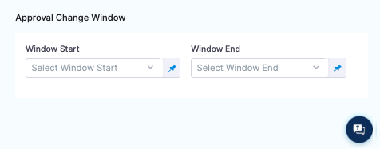

You can use ServiceNow tickets to approve or reject a Pipeline or stage at any point in its execution.

During deployment, a ServiceNow ticket's fields are evaluated according to the criteria you define, and its approval/rejection determines if the Pipeline or stage may proceed.

Approvals can be added as stages or in-between stage steps to prevent stage execution from proceeding without approval.

For example, in a [Kubernetes Blue Green Deployment](https://docs.harness.io/article/mog5tnk5pi-create-a-kubernetes-blue-green-deployment), you might want to add an approval step between the Stage Deployment step, where the new app version is deployed to the staging environment, and the Swap Primary with Stage step, where production traffic is routed to the pods for the new version.

### Before you begin

* [Connect to ServiceNow](../7_Connectors/connect-to-service-now.md)

### Review: ServiceNow Approval Stages vs Steps

You can use ServiceNow Approvals in two ways:

* **ServiceNow Approval step:** you can add a ServiceNow Approval step to any Pipeline or Approval stage.
* **ServiceNow** **Approval stage:** the ServiceNow Approval stage.
  
  

### UTC Timezone Only

The ServiceNow API only allows date time and time values in the UTC timezone. Consequently, input for any datetime/time fields in Harness ServiceNow steps must be provided in UTC format irrespective of time zone settings in your ServiceNow account.

The timezone settings govern the display value of the settings not their actual value.

The display values in the Harness UI depend on ServiceNow timezone settings.

### Step: Add an Approval Step

In your Pipeline, click **Add Stage**.

Click **Approval**. The Stage settings appear.

In **Name**, enter a name for your Stage and select **ServiceNow** as approval type. Click **Setup Stage**. The pipeline appears.

In the pipeline, click **ServiceNow Approval.** The **ServiceNow Approval** settings appear.

In **Timeout**, enter how long you want Harness to try to complete the step before failing (and initiating the stage or step [Failure Strategy](../8_Pipelines/define-a-failure-strategy-on-stages-and-steps.md)).

You can use `**w**`  for week, `**d**`  for day, `**h**`  for hour, `**m**`  for minutes, `**s**`  for seconds and `**ms**` for milliseconds. For example, 1d for one day.

ServiceNow communication can take a few minutes. Do not use a brief timeout.

The maximum is 3w 3d 20h 30m.In **ServiceNow** **Connector,** create or select the [ServiceNow Connector](../7_Connectors/connect-to-service-now.md) you want to use.

Select the ServiceNow **Ticket Type**. Use the same type as the ticket you created in the Workflow.

Enter the ServiceNow **Ticket Number**.

### Step 2: Set Approval Criteria

The **Approval Criteria** in the step determines if the Pipeline or stage is approved or rejected. Define the approval criteria using the ServiceNow status items.

Whether the Pipeline/stage stops executing depends on the stage or step [Failure Strategy](../8_Pipelines/define-a-failure-strategy-on-stages-and-steps.md).You can specify criteria using **Conditions** and/or **JEXL Expression**. If you use them in combination, they both must evaluate to `True` for the step to be successful.

In **Conditions**, you can use the ServiceNow ticket related fields to define approval criteria.

In **JEXL Expression**, you can use [JEXL expressions](https://commons.apache.org/proper/commons-jexl/reference/syntax.html). You can use a JEXL expression if the field is set to **Fixed value** or **Expression**.

### Option: Set Rejection Criteria

In **Optional Configuration**, in **Rejection Criteria**, you can define criteria for rejecting the approval. Define the rejected criteria using the ServiceNow status items.

If you add rejection criteria, it is used in addition to the settings in **Approval Criteria**.

### Option: Approval Change Window

In **Approval Change Window**, use **Window Start** and **Window End** values to specify the window in which Harness will proceed with the deployment. Once this step is approved, Harness proceeds with deployment if the current time is within this window. The values that appear depend on the type selected in **Ticket Type**. 

The start and end times use the time zone set in the ServiceNow account selected in the ServiceNow Connector.

### Option: Advanced Settings

In **Advanced**, you can use the following options:

* [Delegate Selector](../2_Delegates/delegate-guide/select-delegates-with-selectors.md#option-select-a-delegate-for-a-step-using-tags)
* [Step Skip Condition Settings](../8_Pipelines/w_pipeline-steps-reference/step-skip-condition-settings.md)
* [Step Failure Strategy Settings](../8_Pipelines/w_pipeline-steps-reference/step-failure-strategy-settings.md)

### Step 3: Apply and Test

Click **Apply Changes**. The ServiceNow approval step is added to the stage.

Run the Pipeline.

When the ServiceNow Approval step is reached, you can see its approval and rejection criteria:

### Review: Issue Expressions

You can use `<+ticket>` to refer to the value in the **JEXL Expression** setting.

For example, `<+ticket.state.displayValue> == "New"` in the Approval Criteria, **JEXL Expression** checks to see if the status of the ticket is **New.**

`state` is a ticket field. You can use any ticket field.

### See also

* [Using Manual Harness Approval Stages](adding-harness-approval-stages.md)
* [Using Manual Harness Approval Steps in CD Stages](https://docs.harness.io/article/43pzzhrcbv-using-harness-approval-steps-in-cd-stages)

