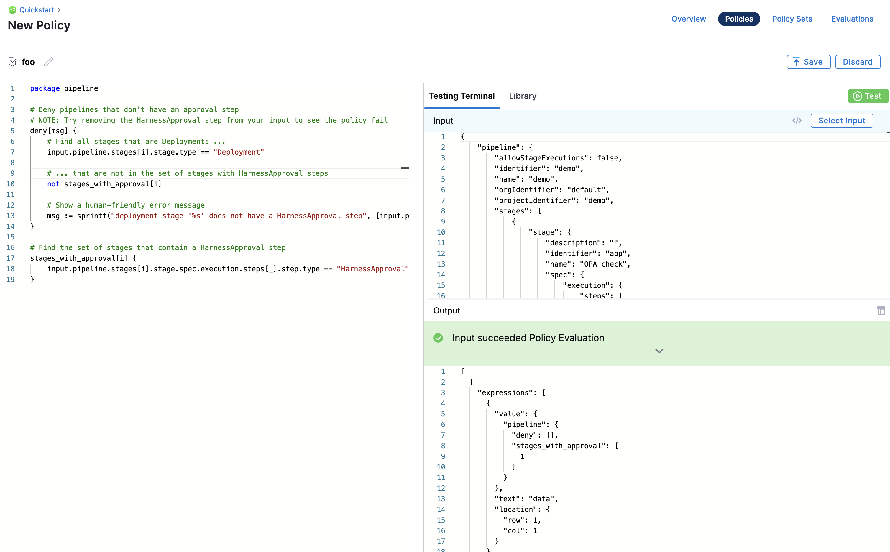
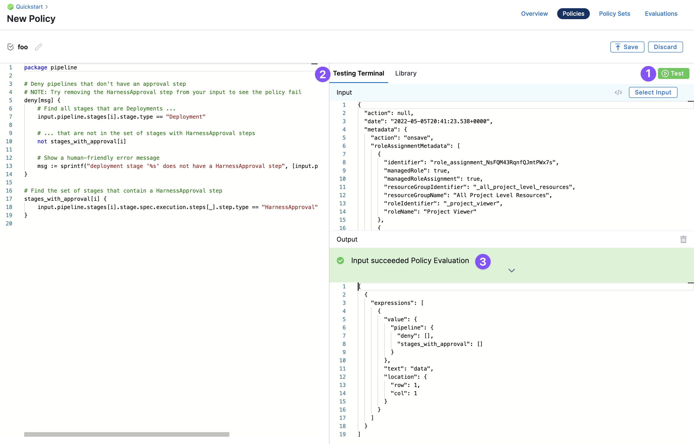
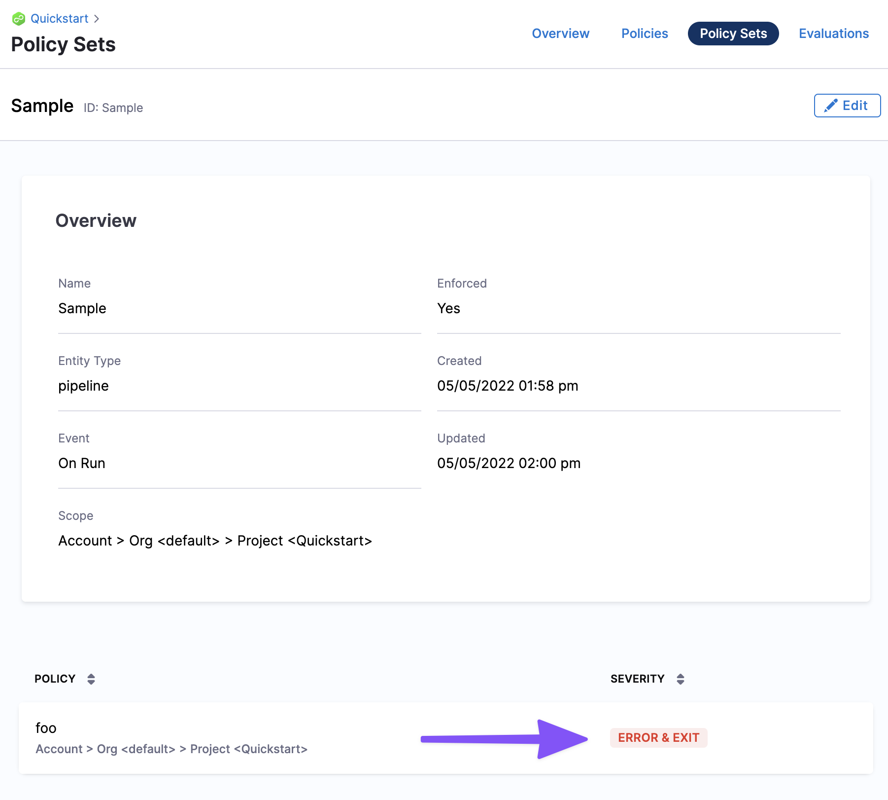
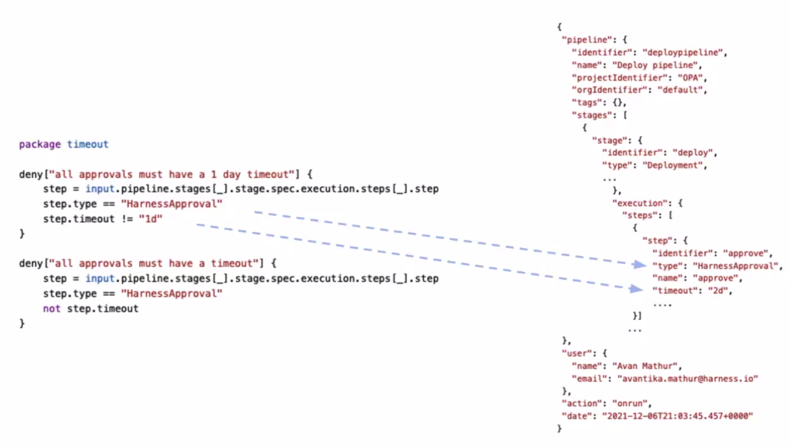
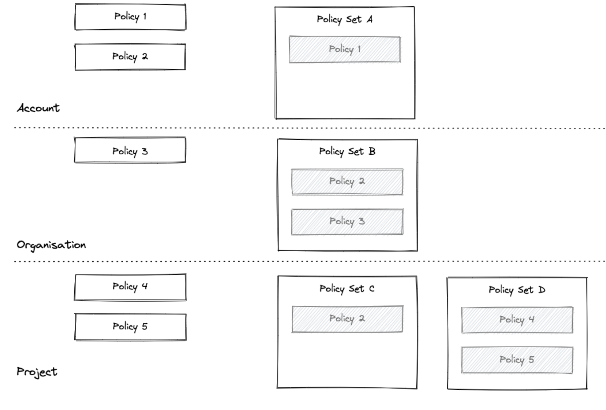

This topic provides an overview of how Harness Policy As Code implemented governance.


:::note
Looking for the quickstart? See [Harness Policy As Code Quickstart](/docs/platform/governance/policy-as-code/harness-governance-quickstart).

:::

### Before you begin

Before learning about Harness Policy As Code, you should have an understanding of the following:

* [Learn Harness' Key Concepts](../../../getting-started/learn-harness-key-concepts.md)

### How does Harness use OPA?

Harness Policy As Code uses [Open Policy Agent (OPA)](https://www.openpolicyagent.org/) as the central service to store and enforce policies for the different entities and processes across the Harness platform.

You can centrally define and store policies and then select where (which entities) and when (which events) they will be applied.

Currently, you can define and store policies directly in the OPA service in Harness.

Soon, you will be able to use remote Git or other repos (e.g. OCI-compatible registries) to define and store the policies used in Harness.

### Governance Examples with Harness OPA

#### Example A: Pipeline > On Save


When a Pipeline is saved, there needs to be an Approval step before deploying to a production environment.

* **Success:** you configure an Approval Step in the Pipeline and then proceed to configure a prod stage. When you save the Pipeline, the policy rule is evaluated and returns `success`.
* **Warning:** a warning message appears: `You need an Approval step. If you save the Pipeline and deploy, Harness will throw an error.`
* **Failure:** you configure a Pipeline with a Deploy stage that deploys to a prod environment without an Approval stage before it. When you save the Pipeline, Harness throws an error message indicating the rule was enforced and the Pipeline fails validation.

#### Example B: Pipeline > On Run


On deployment, I need my pod CPU and memory to be pre-defined.

* **Success:** you deploy the Pipeline and during the dry run the pod CPU and memory have been defined and populated in the deployment manifest. As a result, the dry run progresses. Harness indicates that the rule was evaluated and the action was valid.
* **Failure:** pod CPU and memory were not defined in the deployment manifest. As a result, the dry run fails. Harness indicates that a rule was enforced and the deployment is prevented.

### Harness OPA Server

The Harness OPA server is an OPA server managed by Harness.

In Harness, you add Rego policies to a Policy Set and select the Harness entities (e.g. Pipelines) for evaluation. At that point, the policies are configured on the Harness OPA Server via a Kubernetes ConfigMap.

When certain events happen (e.g. saving or running a Pipeline), Harness reaches out to the Harness OPA server to evaluate the action using the Policy Set.

### Harness Policies

A policy is a single rule. Policies are written as code in the OPA Rego policy language.

A policy itself is just the rule and it's not enforced anywhere. When a policy is added to a Policy Set, it is associated with the entity event on which it will be enforced (On Save, On Run, etc).

Policies are written against an input payload. The input payload is the JSON of the entity that the policy is being enforced against (Pipeline, Feature Flag, etc).

Policies are saved within the hierarchy in the Harness platform: Account > Organizations > Projects.

Policy scope is determined by the whether the policy is created at the account, Organization, or Project level. A policy added at the account level can be applied to all entities in the Orgs and Projects in the account. A policy added at the Project level can be applied to entities in that Project alone.

Polices can be tested individually, but they are not applied individually. To enforce a policy, it must be in a Policy Set.

Policies are written in the OPA policy language, Rego.

**New to OPA Policy Authoring?** Use the following resources to learn Rego:

* **Highly recommend:** Free online course on Rego from Styra founder and OPA co-creator Tim Hendricks: [OPA Policy Authoring](https://academy.styra.com/courses/opa-rego).
* See [Policy Language](https://www.openpolicyagent.org/docs/latest/policy-language/) from OPA. The [Rego Cheatsheet](https://dboles-opa-docs.netlify.app/docs/v0.10.7/rego-cheatsheet/) is also helpful to have on hand.

#### Policy Editor

Harness policies are written and tested using the built-in policy editor.



For an example of how to use the policy editor, see [Harness Policy As Code Quickstart](/docs/platform/governance/policy-as-code/harness-governance-quickstart).

#### Policy Library

The Policy Editor includes a library of policies that cover many common governance scenarios.

Sample policies are also useful references while writing your policy. When you import an example, a sample payload is also loaded for testing the policy.


You can simply use the library policies to quickly generate the policy you want to create.

#### Select Input

In the Policy Editor, you can select sample entities to test your policy on. For example, Pipelines.


#### Testing Terminal

The Testing Terminal lets you test the policy against real inputs while you're developing it. You can select input payloads from previous evaluations to test what will happen when your policy is evaluated.



#### Policy Input Payload User Metadata

The input payload contains user metadata for the user that initiated the event. Metadata includes roles, groups, etc, and is added to every evaluation automatically. For example:


```
{  
  "action": null,  
  "date": "2022-05-05T20:41:23.538+0000",  
  "metadata": {  
    "action": "onsave",  
    "roleAssignmentMetadata": [  
      {  
        "identifier": "role_assignment_NsFQM43RqnfQJmtPWx7s",  
        "managedRole": true,  
        "managedRoleAssignment": true,  
        "resourceGroupIdentifier": "_all_project_level_resources",  
        "resourceGroupName": "All Project Level Resources",  
        "roleIdentifier": "_project_viewer",  
        "roleName": "Project Viewer"  
      }  
    ],  
    "timestamp": 1651783283,  
    "type": "pipeline",  
    "user": {  
      "disabled": false,  
      "email": "john.doe@harness.io",  
      "externallyManaged": false,  
      "locked": false,  
      "name": "john.doe@harness.io",  
      "uuid": "U6h_smb9QTGimsYfNdv6VA"  
    },  
    "userGroups": []  
  },  
...
```
This enables enforcing policies with advanced and attribute-based access control use cases.

For more information, go to [RBAC in Harness](/docs/platform/role-based-access-control/rbac-in-harness).

### Harness Policy Set

You define a set of rules (policies) that are evaluated together in a Policy Set.

Policies are only enforced once they are added to a Policy Set. In the Policy Set, policies are grouped and associated with a Harness entity and the event that will initiate evaluation.

Each policy in the set is also assigned a severity that determines what will happen if the policy evaluation fails (Error and Exit, Warn and Continue).



Policy Sets are stored to the Harness OPA server for a given entity type and event in Harness. The entity (Pipelines, etc) and event (On Save, On Run, etc) associated with a Policy Set determine when the policies in that set are evaluated.

Policy Sets are saved at the Harness account, Organization, or Project level, and where they are saved determines the scope of the Policy Set.

A Policy Set at the account level applies to all entities in the Orgs and Projects in the account. A Policy Set at the Project level only applies to entities in that Project alone.

### Entities and Events

When you create a policy, you identify the Harness entities were the policy is applied.

For example, here's a policy that applies the [Harness Approval](/docs/continuous-delivery/x-platform-cd-features/cd-steps/approvals/using-harness-approval-steps-in-cd-stages/) steps:



Currently, governance can be applied to the following Harness entities and events.

Soon, policies can be applied to more entities, such as Connectors, Services, Environments, Cloud Cost Management, Infrastructure Provisioners.

#### Pipelines

Policies are evaluated against Harness Pipelines. The input payload is an expanded version of the Pipeline YAML, including expanded references and parameters at runtime. 

Policy Sets can be configured to be enforced automatically on these Pipeline events:

* **On Save:** Policies are evaluated when the Pipeline is saved.
* **On Run:** Policy sets are evaluated after the preflight checks.

Severities:

* **On error (Error and Exit):** a message is shown and the action does not complete.
* **On warning (Warn and Continue):** a message is shown and the action is completed.

The Policy step in a Pipeline also enables evaluating policies during Pipeline execution. See [Add a Governance Policy Step to a Pipeline](/docs/platform/Governance/14_Policy-as-code/add-a-governance-policy-step-to-a-pipeline.md).

#### Feature Flags

Policies are evaluated against Harness [Feature Flags](/docs/feature-flags/ff-onboarding/cf-feature-flag-overview).  

Policy Sets can be configured to evaluate policies on these Feature Flag events:

* Feature Flag is saved.
* Flag is created.
* Flag is toggled on or off.

See [Use Harness Policy As Code for Feature Flags](/docs/platform/Governance/14_Policy-as-code/using-harness-policy-engine-for-feature-flags.md).

#### Custom

You can define a policy with the entity type Custom.

The Custom entity type provides flexibility to enforce policy evaluations against any input payload during Pipeline execution. This is done using the Policy step. See [Add a Governance Policy Step to a Pipeline](/docs/platform/Governance/14_Policy-as-code/add-a-governance-policy-step-to-a-pipeline.md).

Custom entity types are open ended. There is no pre-set JSON schema that is used for Custom policies. The payload that the policy is evaluated against is determined by you (defined in the Policy step).

### Policy and Policy Set Hierarchy and Inheritance

Policies and Policy Sets are saved at the Harness Account, Organization, or Project level in the Harness. Where the Policy or Policy set is saved determines its scope. 

* Policies saved at the Account level can be added to Policy Sets in the Account, or Orgs and Projects within that Account.
* A policy at the Org level can only be added to Policy Sets in that Org and its Project.
* A policy at the Project level can only be added to Policy Sets in that Project.



### See also

* [Harness Policy As Code Quickstart](/docs/platform/governance/policy-as-code/harness-governance-quickstart)
* [Add a Policy Step to a Pipeline](/docs/platform/Governance/14_Policy-as-code/add-a-governance-policy-step-to-a-pipeline.md)
* [Harness Policy As Code Overview for Feature Flags](/docs/feature-flags/harness-policy-engine)

