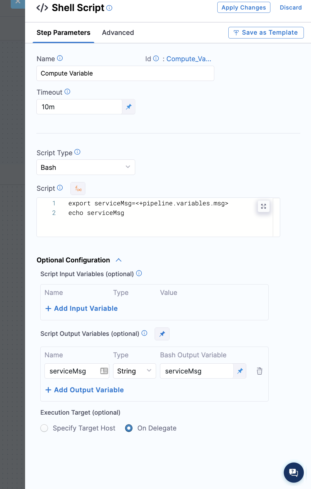
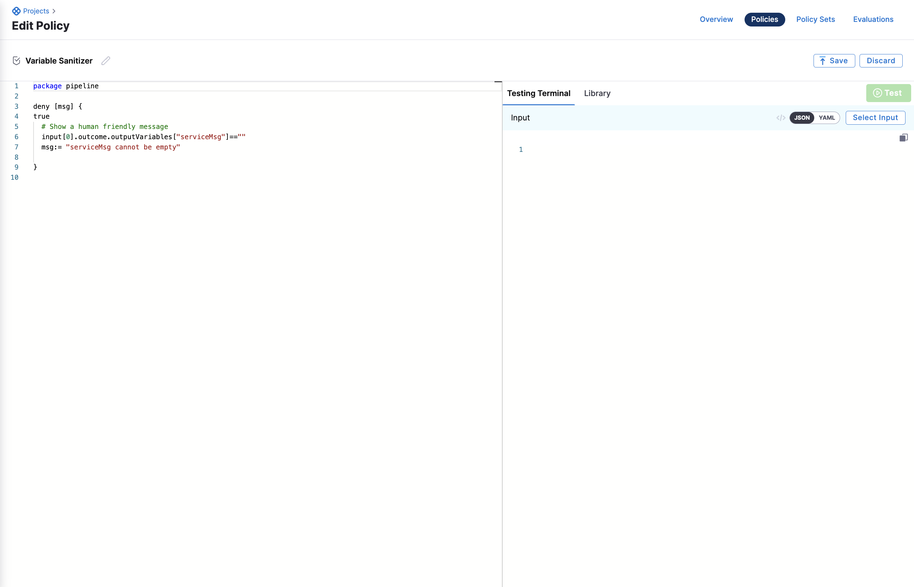
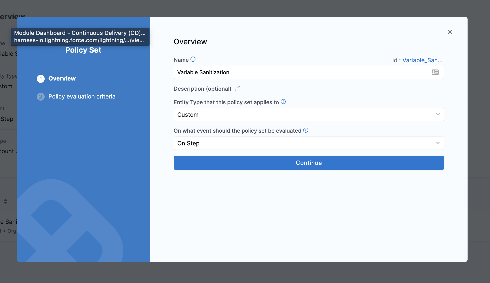
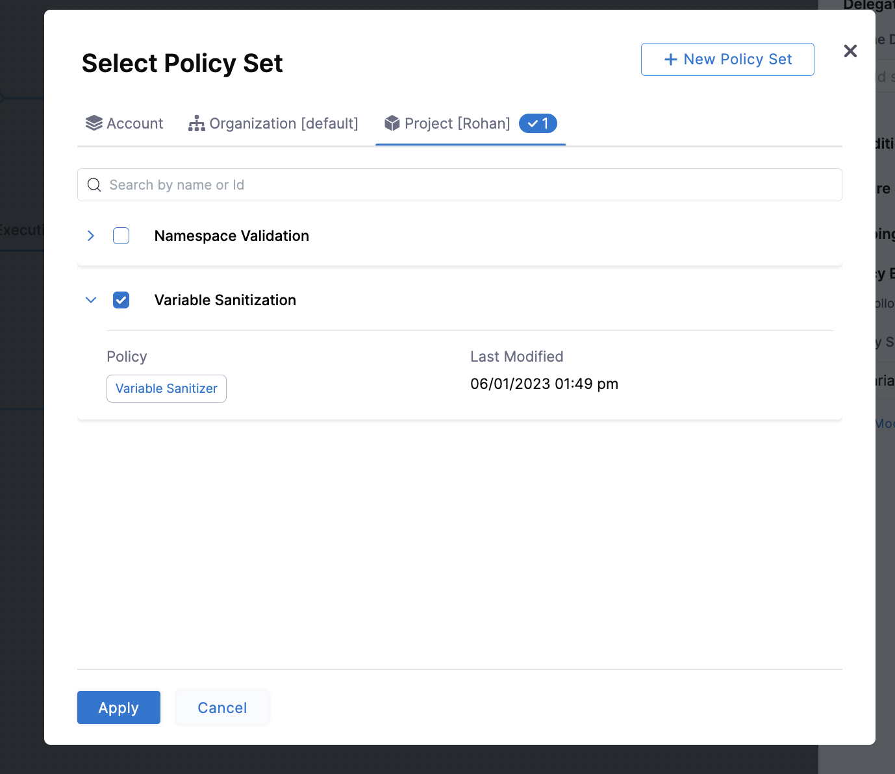
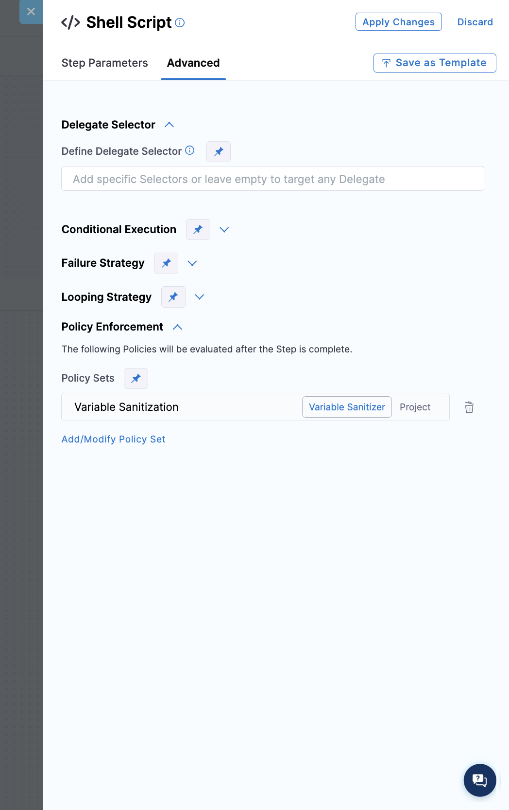
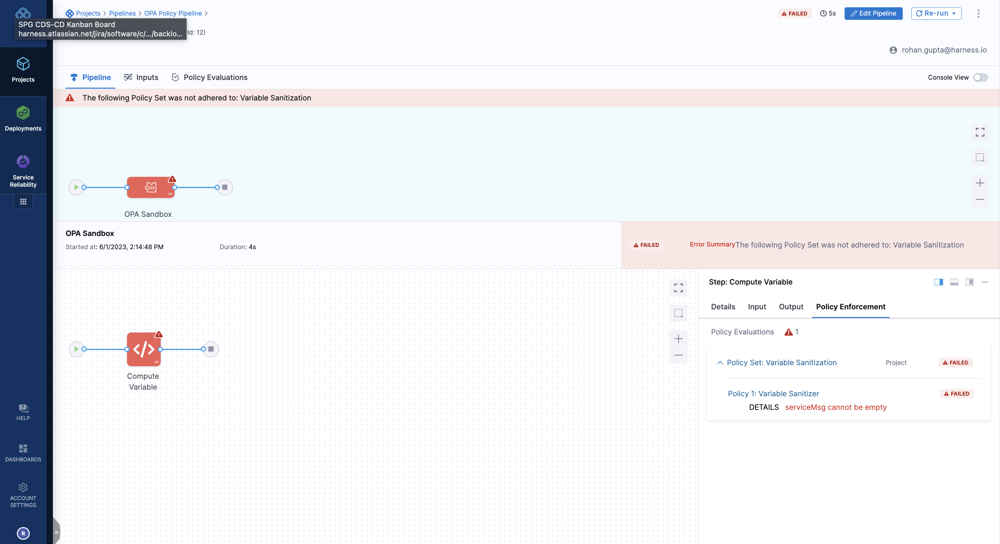
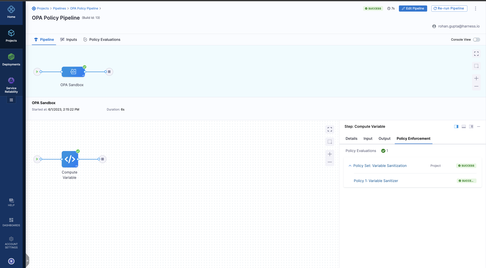

:::important
Currently, this feature is behind the feature flags `OPA_PIPELINE_GOVERNANCE`, `CUSTOM_POLICY_STEP`, and `OPA_FF_GOVERNANCE`. Contact [Harness Support](mailto:support@harness.io) to enable the feature.

:::

This topic explains steps to create policies using the Harness Policy As Code and apply them to your pipeline steps. Harness Policy As Code uses the Open Policy Agency (OPA) to store policies on the Harness Platform. For more information, go to [Harness Policy As Code Overview](/docs/feature-flags/harness-policy-engine).

## Before you begin

* See [Harness Policy As Code Overview](/docs/feature-flags/harness-policy-engine).
* Make sure you have set up a project and a working pipeline in the Harness platform.
* Policies use OPA authoring language Rego. For more information, go to:
  - [OPA Policy Authoring](https://academy.styra.com/courses/opa-rego).
  - [Policy Language](https://www.openpolicyagent.org/docs/latest/policy-language/) from OPA.
  - [Rego Cheat Sheet](https://dboles-opa-docs.netlify.app/docs/v0.10.7/rego-cheatsheet/).

## Video of using policies with Harness steps

<!-- Video:
https://www.loom.com/share/5ca3d3a110694ab6b272ec604998395e-->
<docvideo src="https://www.loom.com/share/5ca3d3a110694ab6b272ec604998395e" />

## Sample pipeline

Here is a sample YAML of a pipeline with steps:

```YAML
pipeline:
  name: OPA Policy Pipeline
  identifier: OPA_Policy_Pipeline
  projectIdentifier: ## YOUR PROJECT ID
  orgIdentifier: ## YOUR ORG ID
  tags: {}
  stages:
    - stage:
        name: OPA Sandbox
        identifier: OPA_Sandbox
        description: ""
        type: Custom
        spec:
          execution:
            steps:
              - step:
                  type: ShellScript
                  name: Compute Variable
                  identifier: Compute_Variable
                  timeout: 10m
                  spec:
                    shell: Bash
                    onDelegate: true
                    source:
                      type: Inline
                      spec:
                        script: |-
                          export serviceMsg=<+pipeline.variables.msg>
                          echo serviceMsg
                    environmentVariables: []
                    outputVariables:
                      - name: serviceMsg
                        type: String
                        value: serviceMsg
                  enforce:
                    policySets:
                      - Variable_Sanitization
        tags: {}
  variables:
    - name: msg
      type: String
      description: ""
      value: <+input>

```

## Set up your policy and policy set for the pipeline step

To apply a policy to a pipeline step, you must:
1. Create a policy
2. Create a policy set
3. Add a policy set to a step in the pipeline
4. Run the pipeline

### Create a policy

The first step of using policies with your steps is navigating to policies and creating your own policy.

The policy will be coupled with how the step is designed and configured. If the step is more free-form like a shell script step, it's essential that you properly map and capture the outputs of variables you wish to reference in your policy step for validation.

More out-of-the-box steps like the rolling deployment step, have a pre-defined output variable path and make it easier for the policy to be re-used across multiple steps.

For this example, we will be modeling the policy around this shell script step



YAML snippet:

```YAML
- step:
   type: ShellScript
   name: Compute Variable
   identifier: Compute_Variable
   timeout: 10m
   spec:
      shell: Bash
      onDelegate: true
      source:
         type: Inline
         spec:
            script: |-
                     export serviceMsg=<+pipeline.variables.msg>
                     echo serviceMsg
               environmentVariables: []
                  outputVariables:
                   - name: serviceMsg
                     type: String
                     value: serviceMsg
```


Create a policy with the following:

```TEXT
package pipeline

deny [msg] {
true
  # Show a human friendly message
  input[0].outcome.outputVariables["serviceMsg"]==""
  msg:= "serviceMsg cannot be empty"

}
```

The policy above is checking to make sure that the message isn't empty. We want to enforce that all variables have some value that is not an empty value.




### Create a policy set

Navigate to your Policy Set and click "+ New Policy Set".

* Please provide a name for your policy - (i.e. `Variable Sanitization`)
* Entity Type that this policy set applies to: `Custom` 
* On what event should the policy set be evaluated: `On Step` 

*Note: Entity type is custom because the step we are enforcing is a custom object type.*

By setting the policy on step users' can now access the outputs and inputs of a step and enforce the policy on them.




### Add a policy set to a step

You will need to add your policy set to your step in order for the policy engine to evaluate the outputs of the step and provide a judgment.

Navigate to the *advanced section* of the step and select the *policy enforcement* accordion.

You will be prompted to pick a policy set to associate with the step.




After the selection, you will see the policy set associated with the step:




### Run the pipeline

Don't provide any input into the Run form and just hit run, you will see the policy evaluate and error out with the below message:



You will see the policy evaluate and the corresponding denial message. If you re-run the pipeline and provide input, you will see the pipeline succeed.

In the example below, we provided deploy and the variable was assigned "deploy" and the validation passed




## See also

* [Add Policy Step in Pipeline](/docs/platform/Governance/Policy-as-code/add-a-governance-policy-step-to-a-pipeline)


