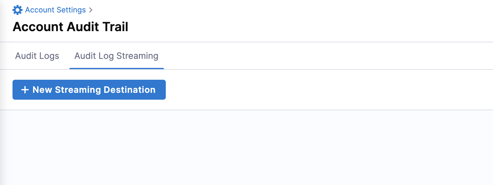
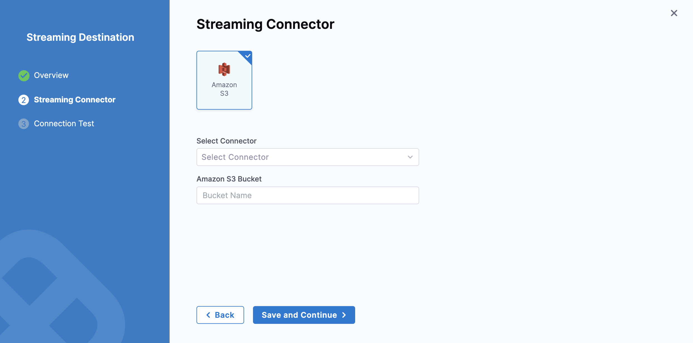
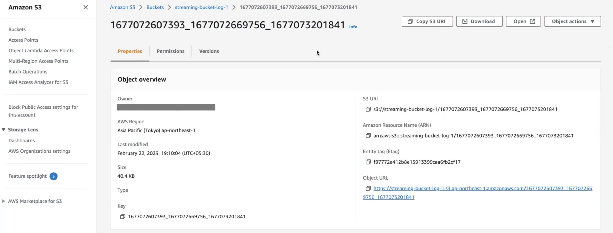

:::important
Currently, this feature is in Beta and behind the feature flag `PL_AUDIT_LOG_STREAMING_ENABLED`. Contact [Harness Support](mailto:support@harness.io) to enable the feature.
:::

You can configure a streaming destination in Harness to send audit log data to another location for processing. Integrating audit data with other Security Incident and Event Management (SIEM) tools lets you do the following:

- Trigger alerts for specific events.

- Create views of audit data.

- Perform anomaly detection. 

- Store more than 2 years audit data, which is the maximum amount of data that Harness keeps for your accounts.

- Keep your resources and data protected, and ensure compliance with regulations.

Harness streams the audit events to your chosen SIEM tool as structured JSON.

## Important

- Streaming destinations receive all audit event data, which could include sensitive information. Make sure you trust the streaming destination.
- Harness supports streaming to Amazon S3.
- You can add multiple streaming destinations in Harness.

## Add a streaming destination

To add a streaming destination in Harness:

1. In your Harness account, select **Account Settings**.

2. Select **Audit Trail** and then select **Audit Log Streaming**.

3. Select **New Streaming Destination** to open the configuration settings.

4. Enter a name for the streaming destination.

5. Harness populates the destination's Id automatically. You can retain or change the Id.

6. Enter a description and tag(s) for the streaming destination.

7. Select **Continue**.
   
   

## Configure the streaming connector

1. Select **Amazon S3**.

2. In **Select Connector**, select an existing AWS Cloud Provider connector or create a new one.

   Go to [Add an AWS connector](../../7_Connectors/Cloud-providers/add-aws-connector.md) for steps to create a new AWS Cloud Provider connector.

3. Select **Apply Selected**.

4. In **Amazon S3 Bucket**, enter the bucket name.
   
   Harness writes all the streaming records to this destination.

   

5. Select **Save** and **Continue**.

6. After the connection test is successful, select **Finish**.
   
   :::important
   Harness does not consider AWS buckets while testing the connection. Also, it tests the connector used without testing the bucket.
   :::
   
   The streaming destination gets configured and appears in the list of destinations under **Audit Log Streaming**. By default the destination is inactive.
   
## Activate or deactivate streaming

1. To activate streaming to this destination, toggle the status to **Active** besides the streaming destination.

   Harness starts writing audit logs after the destination is activated.

   Harness streams audit logs to the destination every 30 minutes.

2. You can pause audit streaming, preventing any new audit events from being streamed to the configured endpoint by setting the status to **Inactive**. 
   
   When you reactivate the streaming destination, Harness starts streaming the audit logs from the point where it was paused.

## Update audit stream

You can change the audit stream configuration by clicking three dots beside the stream destination. This opens a pop-up menu with the following options:

- **Edit**: Select a different streaming destination or make changes to the existing destination.

- **Delete**: Delete the audit stream destination.


## Amazon S3 audit file details

Here is an example of an audit stream file in one of the Amazon S3 buckets.



This file has a list of audit events in JSON format.

Following are the key points about the naming convention of the audit stream file: 
- There are three timestamps in the file name: `<t1>_<t2>_<t3>`.
- `<t1>` and `<t2>` indicate the time range of audit events in the file. This time range is provided for information only and is not always accurate. The timestamp can also be out of range if there is a delay in capturing the event.
- `<t3>` indicates the time when the file was written.


:::important
Harness recommends not building any business logic based on the file name.
:::


## Payload schema

Streamed audit events have a predictable schema in the body of the response.

|**Field**       |  **Description**     |   **Is required**    |
|  ---  |  ---  |  ---  |
|   auditEventId    |  Unique ID for the audit event.     |   Required    |
|   auditEventAuthor    |  [Principal](/docs/platform/role-based-access-control/rbac-in-harness#rbac-components) attached with audit event.    |   Required    |
|    auditModule   | Module for which the audit event is generated.      |   Required    |
|   auditResource    |  Resource audited.     |  Required     |
|   auditResourceScope    |  [Scope](/docs/platform/role-based-access-control/rbac-in-harness#permissions-hierarchy-scopes) of the audited resource.     |   Required    |
|  auditAction     |  Action on the audited resource.     |  Required     |
|    auditEventTime   |  Date and time of the event.     | Required      |
|   auditHttpRequestInfo    |  Details of the HTTP request.     |  Optional     |
|   auditEventMetadata    |     Additional details required for streaming the audit log.  |  Optional     |


### JSON payload

```json
{
  "$schema": "http://json-schema.org/draft-04/schema#",
  "type": "object",
  "properties": {
    "auditEventId": {
      "type": "string"
      "description":"Unique ID for each audit event"
    },
    "auditEventAuthor": {
      "type": "object",
      "properties": {
        "principal": {
          "type": "object",
          "properties": {
            "type": {
              "type": "string"
            },
            "identifier": {
              "type": "string"
            },
            "email": {
              "type": "string"
            }
          },
          "required": [
            "type",
            "identifier",
          ]
        }
      },
      "required": [
        "principal"
      ]
      "description":"Information about Author of the audit event"
    },
    "auditModule": {
      "type": "string"
      "description":"Information about Module of audit event origin"
    },
    "auditResource": {
      "type": "object",
      "properties": {
        "type": {
          "type": "string"
        },
        "identifier": {
          "type": "string"
        }
      },
      "required": [
        "type",
        "identifier"
      ]
      "description":"Information about resource for which Audit event was generated"
    },
    "auditResourceScope": {
      "type": "object",
      "properties": {
        "accountIdentifier": {
          "type": "string"
        },
        "orgIdentifier": {
          "type": "string"
        },
        "projectIdentifier": {
          "type": "string"
        }
      },
      "required": [
        "accountIdentifier",
      ]
      "description":"Information about scope of the resource in Harness"
    },
    "auditAction": {
      "type": "string"
      "description":"Action CREATE,UPDATE,DELETE,TRIGGERED,ABORTED,FAILED , Not exhaustive list of events"
    },
    "auditHttpRequestInfo": {
      "type": "object",
      "properties": {
        "requestMethod": {
          "type": "string"
        }
        "clientIP": {
          "type": "string"
        }
      },
      "required": [
        "requestMethod",
        "clientIP"
      ]
      "description":"Information about HTTP Request"
    },
    "auditEventTime": {
      "type": "string"
      "description":"Time of auditEvent in miliiseconds"
    },
    "auditEventMetadata": {
      "type": "object"
      "description":"No fixed schema , Additional meta about audit event"
    }
  },
  "required": [
    "auditEventId",
    "auditEventAuthor",
    "auditModule",
    "auditResource",
    "auditResourceScope",
    "auditAction",
    "auditEventTime",
  ]
}
```
