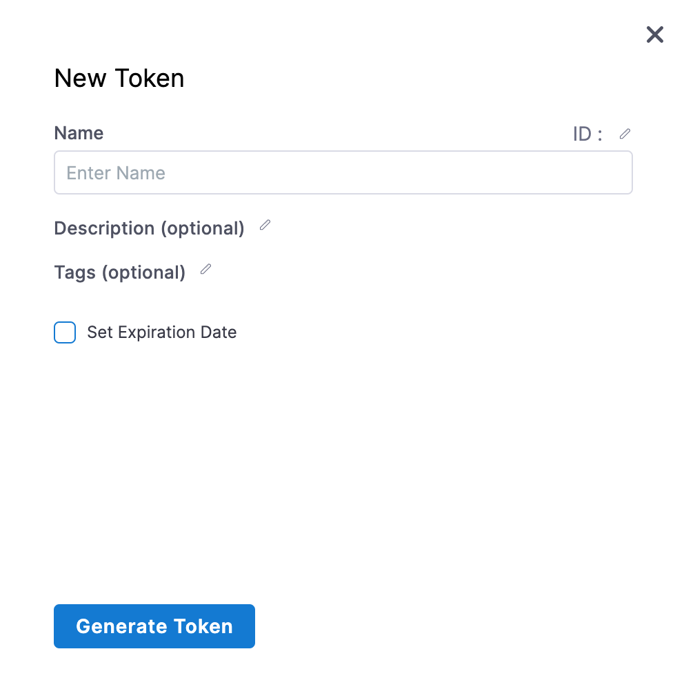

Any resource you can create in Harness, you can also create with the Harness REST APIs.

:::info API reference documentation

For detailed documentation of endpoints and other Harness API reference information, go to the [Harness API reference documentation](https://apidocs.harness.io/).

:::

## Requirements

To use Harness APIs to manage a resource, you must have the necessary [permissions](./api-permissions-reference) to view, create/edit, or delete that resource. You need one of the following default roles or an equivalent [custom role](../../role-based-access-control/add-manage-roles.md): Account Administrator, Organization Admin, Project Admin.

You need an understanding of Harness, [RBAC in Harness](/docs/platform/role-based-access-control/rbac-in-harness), sending API requests, and mechanisms for sending requests, such as `curl`.

## Create a Harness API key and token

Harness APIs use API keys to authenticate requests. Create an API key in your Harness user profile, add tokens to the key, and then use the token in your API requests. For more information, go to [Manage API keys](/docs/platform/Resource-Development/APIs/add-and-manage-api-keys).

:::info

* **Service accounts:** You can use service account tokens instead of personal API keys and tokens. For more information, go to [Manage service accounts](/docs/platform/role-based-access-control/add-and-manage-service-account).
* **CORS:** Harness APIs support cross-origin resource sharing (CORS). This allows interactions between resources from different origins, and it is normally prohibited to prevent malicious behavior. Each API request must provide authentication credentials, either a personal access token or a service account token.

:::

1. Go to your user profile in Harness.
2. Under **My API Keys**, select **API Key**.
3. Enter a **Name** for the API key. **Description** and **Tags** are optional.

   

4. Select **Save** to create your API key.
5. Select **Token** under your new API key.
6. Enter a **Name** for the token. **Description** and **Tags** are optional.

   

7. Select **Set Expiration Date** and enter an expiration date in `mm/dd/yyyy` format.
8. Select **Generate Token** and copy the token.

   :::caution

   The token is only displayed once. Store the token somewhere secure that you can access when you make API requests.

   Your API keys carry many privileges. Don't store them in publicly-accessible areas.

   After [rotating tokens](/docs/platform/Resource-Development/APIs/add-and-manage-api-keys#rotate-tokens) make sure you always use the new token.

   :::

   <!--  -->

   <docimage path={require('./static/api-quickstart-04.png')} />

## Get your account ID

To send API requests, you need your Harness account ID.

You can find your account ID in any Harness URL, for example:

```
https://app.harness.io/ng/#/account/ACCOUNT_ID/home/get-started
```

## Use the API

Once you have a token and your account ID, you can start sending requests.

The following examples demonstrate how to create a project, connector, and pipeline using `curl` and the Harness APIs. Although these examples use `curl`, the Harness APIs support many languages, such as Go, Java, and Node.js. You can find examples for other supported languages in the [Harness API reference documentation](https://apidocs.harness.io/).

:::info Rate limiting

Harness uses rate limiting to control traffic and ensure the stability of the platform. For platform rate limit information, go to [Rate limits](/docs/platform/rate-limits).

:::

### Example: Create a project through API

A Harness [project](../../../getting-started/learn-harness-key-concepts.md#organizations-and-projects) is a group of Harness modules and their pipelines and other resources.

The following `curl` command creates a Harness project called `APISample` in the `default` Harness organization. To use this command replace `ACCOUNT_ID` with your [Harness account ID](#get-your-account-id), and replace `API_KEY_TOKEN` with your [token](#create-a-harness-api-key-and-token). If you want to create a project under a different organization, replace `default` in the command with the desired organization ID.

```
curl -i -X POST \
  'https://app.harness.io/ng/api/projects?accountIdentifier=ACCOUNT_ID&orgIdentifier=default' \
  -H 'Content-Type: application/json' \
  -H 'x-api-key: API_KEY_TOKEN' \
  -d '{
    "project": {
      "orgIdentifier": "default",
      "identifier": "apisample",
      "name": "APISample",
      "color": "#0063F7",
      "modules": [],
      "description": "",
      "tags": {}
    }
  }'
```

A successful response includes the `project` data from the request, as well as creation timestamps, metadata (which may be `null`), and a correlation ID. For example:

```
{
"status": "SUCCESS",
"data": {
"project": {},
"createdAt": 0,
"lastModifiedAt": 0,
"isFavorite": true
},
"metaData": { },
"correlationId": "string"
}
```

If the response is successful, go to your **Projects** in Harness to find your APISample project.

### Example: Create a connector through API

Harness connectors contain information necessary to integrate and communicate with third-party tools, such as Docker registries, cloud providers, a source control repositories.

The following `curl` command creates a [Docker registry connector](/docs/platform/connectors/cloud-providers/ref-cloud-providers/docker-registry-connector-settings-reference) called `dockerhub` that connects to Docker Hub anonymously. The connector is created in the `default` Harness organization under the [APISample project](#create-a-project-through-api).

To use this command replace `ACCOUNT_ID` with your [Harness account ID](#get-your-account-id), and replace `API_KEY_TOKEN` with your [token](#create-a-harness-api-key-and-token).

If you want to create your connector under a different organization, replace `default` in the command with the desired organization ID. If you want to create your connector under a different project, replace `apisample` with the desired project ID.

```
curl -i -X POST \
  'https://app.harness.io/ng/api/connectors?accountIdentifier=ACCOUNT_ID' \
  -H 'Content-Type: application/json' \
  -H 'x-api-key: API_KEY_TOKEN' \
  -d '{
    "connector": {
      "name": "dockerhub",
      "identifier": "dockerhub",
      "description": "",
      "accountIdentifier": "ACCOUNT_ID",
      "orgIdentifier": "default",
      "projectIdentifier": "apisample",
      "tags": {},
      "type": "DockerRegistry",
      "spec": {
        "connectorType": "DockerConnector",
        "dockerRegistryUrl": "https://index.docker.io/v2/",
        "providerType": "DockerHub",
        "auth":
          "type": "Anonymous"
      }
    }
  }'
```

You can create all types of connectors with this endpoint. For this endpoint's specifications, go to the [Harness API reference documentation](https://apidocs.harness.io/tag/Connectors#operation/createConnector).

A successful response includes the `connector` data from the request, as well as creation timestamps, various metadata and settings, and a correlation ID. For example:

```
{
"status": "SUCCESS",
"data": {
"connector": {},
"createdAt": 0,
"lastModifiedAt": 0,
"status": {},
"activityDetails": {},
"harnessManaged": true,
"gitDetails": {},
"entityValidityDetails": {},
"governanceMetadata": {},
"isFavorite": true
},
"metaData": { },
"correlationId": "string"
}
```

If the response is successful, you can find your new connector in Harness in your APISample project's **Connectors**.

### Example: Create a pipeline through API

A pipelines are end-to-end workflows. There are several types of pipelines across the Harness modules.

The following `curl` command creates a simple CD pipeline that contains a `hello world` shell script. The pipeline uses [Runtime Inputs](../../20_References/runtime-inputs.md) (`<+input>`) for most settings. The pipeline is created in the `default` Harness organization under the [APISample project](#example-create-a-project-through-api).

To use this command replace `ACCOUNT_ID` with your [Harness account ID](#get-your-account-id), and replace `API_KEY_TOKEN` with your [token](#create-a-harness-api-key-and-token).

If you want to create the pipeline under a different organization, replace `default` in the command with the desired organization ID. If you want to create the pipeline under a different project, replace `apisample` with the desired project ID.

```
curl -i -X POST \
  'https://app.harness.io/pipeline/api/pipelines/v2?accountIdentifier=ACCOUNT_IT&orgIdentifier=default&projectIdentifier=apisample' \
  -H 'Content-Type: application/yaml' \
  -H 'x-api-key: API_KEY_TOKEN' \
  -d 'pipeline:
      name: api example
      identifier: api_example
      allowStageExecutions: false
      projectIdentifier: apisample
      orgIdentifier: default
      tags: {}
      stages:
          - stage:
                name: Sample Deploy Stage
                identifier: Sample_Deploy_Stage
                description: ""
                type: Deployment
                spec:
                    serviceConfig:
                        serviceRef: <+input>
                        serviceDefinition:
                            spec:
                                variables: []
                            type: Kubernetes
                    infrastructure:
                        environmentRef: <+input>
                        infrastructureDefinition:
                            type: KubernetesDirect
                            spec:
                                connectorRef: <+input>
                                namespace: <+input>
                                releaseName: release-<+INFRA_KEY>
                        allowSimultaneousDeployments: false
                    execution:
                        steps:
                            - step:
                                  name: shell
                                  identifier: shell
                                  type: ShellScript
                                  spec:
                                      shell: Bash
                                      onDelegate: true
                                      source:
                                          type: Inline
                                          spec:
                                              script: echo "hello world!"
                                      environmentVariables: []
                                      outputVariables: []
                                      executionTarget: {}
                                  timeout: 10m
                        rollbackSteps: []
                tags: {}
                failureStrategies:
                    - onFailure:
                          errors:
                              - AllErrors
                          action:
                              type: StageRollback
  '
```

For more information about this endpoint, go to the [Harness API reference documentation](https://apidocs.harness.io/tag/Pipeline#operation/postPipelineV2).

A successful response includes the `pipeline` data from the request, as well as the pipeline ID, various metadata, and a correlation ID. For example:

```
{
"status": "SUCCESS",
"data": {
"identifier": "string",
"governanceMetadata": {}
},
"metaData": { },
"correlationId": "string"
}
```

If the response is successful, you can find your new pipeline in Harness in your APISample project's **Pipelines**.

## Reference documentation

For detailed documentation of endpoints and other Harness API reference information, go to the [Harness API reference documentation](https://apidocs.harness.io/).

### Error responses

Harness uses conventional HTTP response codes to indicate the success or failure of an API request.

| HTTPS Status Code | Summary |
| --- | --- |
| 200 - OK | The request has been processed successfully on the server. |
| 400 - Bad Request | The request was not processed successfully due to incorrect syntax or missing parameters. |
| 401 - Unauthorized | The request was unauthorized due to an invalid API Key. |
| 402 - Request Failed | The request cannot be processed. |
| 403 - Forbidden | The API Key does not have permission to perform the request. |
| 404 - Not Found | The requested resource does not exist. |
| 429 - Server Errors | The rate limit is exceeded. |
| 500, 502, 503, 504 - Server Errors | The Harness server encountered an unexpected error. |
