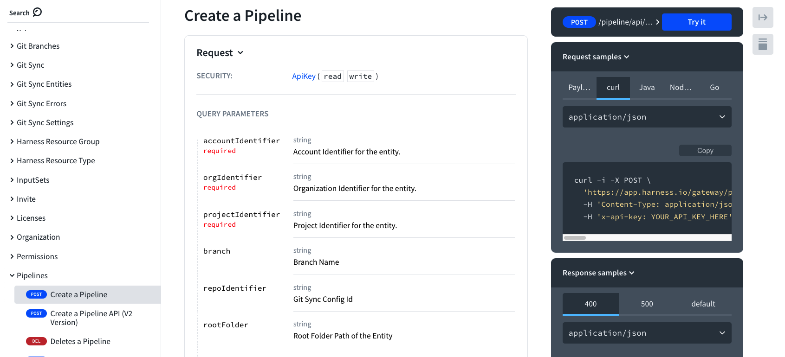
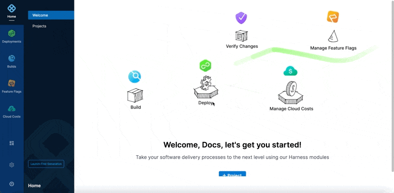

The Harness REST API lets you automate Harness operations, including your builds, deployments, feature flags, etc.

The Harness REST API reference docs are located at [https://harness.io/docs/api](https://harness.io/docs/api/).

You can try the API within the reference docs, or anywhere else (Postman, etc), but you'll need an API key from your Harness account first.

When using the API key within the API reference docs, your credentials are saved until the end of the browser session.

### Step 1: Create a Harness API Key and PAT

The Harness API uses API keys to authenticate requests. You create the API key in your Harness Manager User Profile, add a Personal Access Token (PAT) to the key, and then use the PAT in your API requests.

For an overview of Harness API keys, see [Add and Manage API Keys](../../3_User-Management/7-add-and-manage-api-keys.md).Let's create the API key and its Personal Access Token.

Here's a quick visual summary:

#### Create API Key

In Harness, navigate to your **Profile**.

In **My API Keys**, Click **API Key**. The API Key settings appear.

Enter **Name, Description,** and **Tags** for your API.

Click **Save**. The new API Key is created.

#### Create Personal Access Token

Next, we'll add the Personal Access Token (PAT) that you will use when you make API requests.

Click **Token** below the API Key you just created.

In the **New Token** settings, enter a Name, Description, and Tags.

To set an expiration date for this token, select **Set Expiration Date** and enter the date in **Expiration Date (mm/dd/yyyy)**.

Click **Generate Token**.

Your new token is generated.

Please copy and store your token value somewhere safe. You won't be able to see it again.  
  
Your API keys carry many privileges, so be sure not to share them in publicly accessible areas. Make sure you always use the updated API Key value after you rotate the token. For more details, see [Rotate Token](../../3_User-Management/7-add-and-manage-api-keys.md#rotate-token).

#### Service Account Tokens

You can also use a Service Account Tokens instead of PAT. See [Add and Manage Service Accounts](../../3_User-Management/6-add-and-manage-service-account.md).

### Step 2: Use the API

Now you're ready to use the Harness API in the reference docs or anywhere else.

See [https://harness.io/docs/api](https://harness.io/docs/api/).

:::important
You can use the same vanity URL in the API if you use one. Harness registers the vanity URL with load balancers and DNS to move it to the correct Harness account cluster (for example, prod-3) and the API call works seamlessly with the vanity URL.
:::

