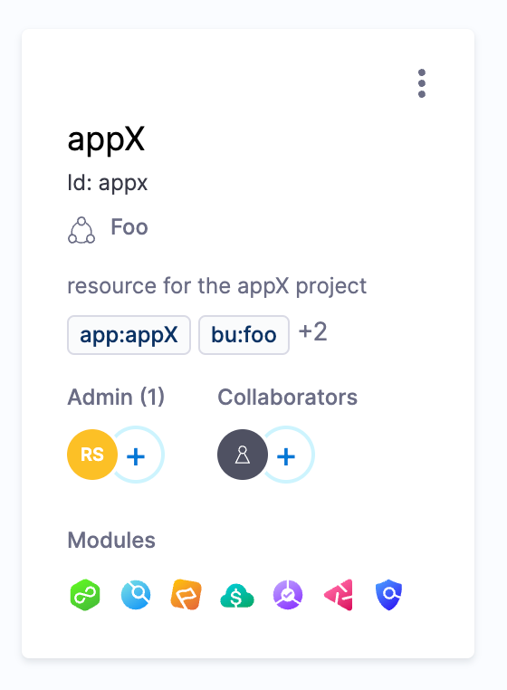

The Harness Solution Architecture team has curated a collection of terraform modules that aim to help onboard new teams and applications to the Harness platform.

The target audience for this article are: 
- Harness admins.
- Members of a Harness center of excellence.
- Any developer who wants to provision resources into Harness using terraform.

## Resource scoping

A common pattern you will see in the following modules is using `project_id` and `organization_id` to specify the [scope](/docs/platform/role-based-access-control/rbac-in-harness#permissions-hierarchy-scopes) at which the resources should be created.

- Adding the organization ID adds the resource to the target organization.
- Adding the project ID adds the resource to the target project.
- The resource will be created at the account level (highest) if neither of these options are selected. 

Most resources shown below will support any of the three scopes.

## Authentication

The recommended way to authenticate with the Harness Terraform provider is environment variables. 

You should set at least:

- `HARNESS_ACCOUNT_ID`: Your Harness account id.
- `HARNESS_PLATFORM_API_KEY`: A user or service account token.

You can read more about the provider [here](https://registry.terraform.io/providers/harness/harness/latest/docs) or view our quick-start guide [here](https://developer.harness.io/docs/platform/terraform/harness-terraform-provider/).

## [Structure](https://github.com/harness-community/terraform-harness-structure)

This collection of Terraform modules focuses on the initial setup of Harness Platform configurations and base functionality.

### [Organizations](https://github.com/harness-community/terraform-harness-structure/tree/main/modules/organizations)

To start we need to provision organizations that our projects will live in:

```terraform
module "org_foo" {
  source = "git@github.com:harness-community/terraform-harness-structure.git//modules/organizations"

  name        = "Foo"
  description = "resources for buissness unit Foo"
  tags = {
    bu = "foo"
  }
  global_tags = {
    source = "tf_modules_org"
  }
}
```

### [Projects](https://github.com/harness-community/terraform-harness-structure/tree/main/modules/projects)

Under organizations, we have projects. Project usually map to a team, application, or an overall grouping of pipelines.

```terraform
module "project_appX" {
  source = "git@github.com:harness-community/terraform-harness-structure.git//modules/projects"

  organization_id = module.org_foo.organization_details.id
  name            = "appX"
  description     = "resource for the appX project"
  color           = "#ffffff"
  tags = {
    bu  = module.org_foo.organization_details.id,
    app = "appX"
  }
  global_tags = {
    source = "tf_modules_project"
  }
}
```

### [Variables](https://github.com/harness-community/terraform-harness-structure/tree/main/modules/variables)

```terraform
module "variable_appX_cost_center" {
  source = "git@github.com:harness-community/terraform-harness-structure.git//modules/variables"

  organization_id = module.org_foo.organization_details.id
  project_id      = module.project_appX.project_details.id
  name            = "cost_center"
  description     = "billing code for application"
  value           = "h768"
  tags = {
    bu  = module.org_foo.organization_details.id,
    app = module.project_appX.project_details.id
  }
  global_tags = {
    source = "tf_modules_variable"
  }
}
```

### [Secrets](https://github.com/harness-community/terraform-harness-structure/tree/main/modules/secrets/text)

By removing the `project_id` we can move the variable to be under the organization. Removing the `organization_id` puts it under the account level.

```terraform
module "secret_appX_dockerhub" {
  source = "git@github.com:harness-community/terraform-harness-structure.git//modules/secrets/text"

  organization_id = module.org_foo.organization_details.id
  project_id      = module.project_appX.project_details.id
  name            = "dockerhub"
  description     = "dockerhub token"
  value           = "kjsdhf923uewhfslfj-udfsdjh"
  tags = {
    bu  = module.org_foo.organization_details.id,
    app = module.project_appX.project_details.id
  }
  global_tags = {
    source = "tf_modules_variable"
  }
}
```

We can also set [secret files](https://github.com/harness-community/terraform-harness-structure/tree/main/modules/secrets/file):

```terraform
module "secret_appX_dockerhub_cert" {
  source = "git@github.com:harness-community/terraform-harness-structure.git//modules/secrets/file"

  organization_id = module.org_foo.organization_details.id
  project_id      = module.project_appX.project_details.id
  name            = "dockerhub_cert"
  description     = "dockerhub certificate"
  file_path       = "/Users/rileysnyder/hub.pem"
  tags = {
    bu  = module.org_foo.organization_details.id,
    app = module.project_appX.project_details.id
  }
  global_tags = {
    source = "tf_modules_variable"
  }
}
```

The result of provisioning the above resources is a Harness account with different level in which you can create additional resources, and a project where you can begin to create pipelines.



## [RBAC](https://github.com/harness-community/terraform-harness-rbac)

This collection of Terraform modules focuses on the initial setup of Harness Platform roles, resource groups, service accounts, user groups, and user accounts.

### [Roles](https://github.com/harness-community/terraform-harness-rbac/tree/main/modules/roles)

We can create custom roles to define a certain set of Harness access. To see a list of all available actions we can assign to the role we need to make an authenticated API call. `curl -H "x-api-key: $HARNESS_PLATFORM_API_KEY" https://app.harness.io/gateway/authz/api/permissions`

A handy tip to filter down the large list of option is to use `jq` and `grep`: `curl -H "x-api-key: $HARNESS_PLATFORM_API_KEY" https://app.harness.io/gateway/authz/api/permissions | jq -c '.data[].permission' | grep "connector"`

```terraform
module "rbac_devops" {
  source = "git@github.com:harness-community/terraform-harness-rbac.git//modules/roles"

  organization_id  = module.org_foo.organization_details.id
  project_id       = module.project_appX.project_details.id
  name             = "devops"
  role_permissions = ["core_environment_access", "core_connector_access"]
}
```

### [Resource groups](https://github.com/harness-community/terraform-harness-rbac/tree/main/modules/resource_groups)

If giving access to an entire account, organization, or project is too wide we can use resource groups to scope the access down to a subset of resources.

```terraform
data "harness_current_account" "current" {}

module "preprod" {
  source = "git@github.com:harness-community/terraform-harness-rbac.git//modules/resource_groups"

  harness_platform_account = data.harness_current_account.current.account_id
  organization_id          = module.org_foo.organization_details.id
  project_id               = module.project_appX.project_details.id
  name                     = "pre-prod"
  resource_group_filters = [
    {
      type = "ENVIRONMENT"
      filters = [
        {
          name = "type"
          values = [
            "PreProduction"
          ]
        }
      ]
    }
  ]
}
```

### [User groups](https://github.com/harness-community/terraform-harness-rbac/tree/main/modules/user_groups)

Rather than assigning access directly to users, we should create user groups with certain access profiles. Users can then be added to groups depending on the access they require.

```terraform
module "devops" {
  source = "git@github.com:harness-community/terraform-harness-rbac.git//modules/user_groups"

  organization_id   = module.org_foo.organization_details.id
  project_id        = module.project_appX.project_details.id
  name              = "devops"
  role_id           = module.rbac_devops.role_details.id
  resource_group_id = module.preprod.resource_group_details.id
}
```

### [User accounts](https://github.com/harness-community/terraform-harness-rbac/tree/main/modules/user_accounts)

It is not recommended that you create user accounts with terraform. Instead you should explore enabling [SSO](https://developer.harness.io/docs/platform/authentication/single-sign-on-sso-with-oauth/), [SCIM](/docs/platform/role-based-access-control/provision-users-and-groups-using-azure-ad-scim), or SSO linked groups to control user access from your IDP.

## [Connectors](https://github.com/harness-community/terraform-harness-connectors)

This collection of Terraform modules focuses on the initial setup of Harness Platform configurations and base functionality.

### [Kubernetes cluster](https://github.com/harness-community/terraform-harness-connectors/tree/main/modules/kubernetes/cluster)

To deploy into a k8s cluster we need a connector. Connectors can use one of many types of authentication: delegate, service account, username/password, certificate, or open-id connect.

```terraform
module "dev_k8s_delegate" {
  source = "git@github.com:harness-community/terraform-harness-connectors.git//modules/kubernetes/cluster"

  organization_id    = module.org_foo.organization_details.id
  project_id         = module.project_appX.project_details.id
  name               = "dev_k8s"
  delegate_selectors = ["minikube"]
}
```

[Read more about k8s connectors on our developer hub](/docs/platform/Connectors/Cloud-providers/add-a-kubernetes-cluster-connector)

### [SCM GitHub](https://github.com/harness-community/terraform-harness-connectors/tree/main/modules/scms/github)

To grab manifests and values from GitHub, we can create a connector using PAT or SSH authentication.

```terraform
module "github" {
  source = "git@github.com:harness-community/terraform-harness-connectors.git//modules/scms/github"

  organization_id = module.org_foo.organization_details.id
  project_id      = module.project_appX.project_details.id
  name            = "rssnyder"
  url             = "https://github.com/rssnyder"
  github_credentials = {
    type            = "http"
    username        = "rssnyder"
    secret_location = "account"
    password        = "gh_pat"
  }
}
```

[Read more about GitHub connectors on our developer hub](/docs/platform/Connectors/Code-Repositories/ref-source-repo-provider/git-hub-connector-settings-reference)

## [Delivery](https://github.com/harness-community/terraform-harness-delivery)

This collection of Terraform modules focuses on the initial setup of Harness Platform environments, infrastructure and services functionality.

### [Environments](https://github.com/harness-community/terraform-harness-delivery/tree/main/modules/environments)

Environments represent your deployment targets. They can be either non-production or production, and can have any number of overrides.

The terraform resource for environments takes in some basic information, but mainly uses YAML to define the content of the environment. It can sometimes be helpful to create your first environment using the Harness UI and then copy its YAML definition into terraform. From there you can modify copies as needed.

```terraform
module "dev" {
  source = "git@github.com:harness-community/terraform-harness-delivery.git//modules/environments"

  organization_id = module.org_foo.organization_details.id
  project_id      = module.project_appX.project_details.id
  name            = "dev"
  type            = "nonprod"
  yaml_render     = false
  yaml_data       = <<EOT
environment:
  name: dev
  identifier: dev
  projectIdentifier: ${module.project_appX.project_details.id}
  orgIdentifier: ${module.org_foo.organization_details.id}
  description: Harness Environment created via Terraform
  type: PreProduction
  EOT
}
```

[Read more about environments on our developer hub](https://developer.harness.io/docs/continuous-delivery/onboard-cd/cd-concepts/services-and-environments-overview/)

### [Infrastructures](https://github.com/harness-community/terraform-harness-delivery/tree/main/modules/environments)

Environments require an infrastructure definition to define where an application should be deployed. A given environment can have one to many infrastructure definitions of all different types.

The terraform resource for infrastructures take in some basic information, but mainly uses YAML to define the content of the infrastructure. It can sometimes be helpful to create your first infrastructure using the Harness UI and then copy its YAML definition into terraform. From there you can modify copies as needed.

```terraform
module "dev_k8s" {
  source = "git@github.com:harness-community/terraform-harness-delivery.git//modules/infrastructures"

  organization_id = module.org_foo.organization_details.id
  project_id      = module.project_appX.project_details.id
  name            = "k8s"
  environment_id  = module.dev.environment_details.id
  type            = "KubernetesDirect"
  deployment_type = "Kubernetes"
  yaml_data       = <<EOT
spec:
  connectorRef: ${module.dev_k8s_delegate.connector_details.id}
  namespace: appx
  releaseName: release-<+INFRA_KEY>
  EOT
}
```

### [Services](https://github.com/harness-community/terraform-harness-delivery/tree/main/modules/environments)

Services encapsulate the definition of the application you are going to deploy.

```terraform
module "appX" {
  source = "git@github.com:harness-community/terraform-harness-delivery.git//modules/services"

  organization_id = module.org_foo.organization_details.id
  project_id      = module.project_appX.project_details.id
  name            = "appX"
  yaml_render     = false
  yaml_data       = <<EOT
service:
  name: appX
  identifier: appx
  tags: {}
  serviceDefinition:
    type: Kubernetes
    spec:
      manifests:
        - manifest:
            identifier: template
            type: K8sManifest
            spec:
              store:
                type: Github
                spec:
                  connectorRef: account.Github
                  gitFetchType: Branch
                  paths:
                    - deployment.yaml
                  repoName: rssnyder/template
                  branch: main
              valuesPaths:
                - values.yaml
              skipResourceVersioning: false
      artifacts:
        primary:
          primaryArtifactRef: <+input>
          sources:
            - spec:
                connectorRef: account.dockerhub
                imagePath: library/nginx
                tag: <+input>
              identifier: nginx
              type: DockerRegistry
      variables:
        - name: port
          type: String
          description: ""
          value: <+input>
          default: "80"
        - name: replicas
          type: String
          description: ""
          value: <+input>
          default: "1"
  EOT
}
```

[Read more about services on our developer hub](https://developer.harness.io/docs/continuous-delivery/onboard-cd/cd-concepts/services-and-environments-overview/)

## [Content](https://github.com/harness-community/terraform-harness-content)

This collection of Terraform modules focuses on the initial setup of Harness Platform pipeline and template functionality.

### [Pipelines](https://github.com/harness-community/terraform-harness-content/tree/main/modules/pipelines)

Creating a pipeline using terraform is as easy as placing the YAML into the resource.

```terraform
module "pipelines" {
  source = "git@github.com:harness-community/terraform-harness-content.git//modules/pipelines"

  organization_id = module.org_foo.organization_details.id
  project_id      = module.project_appX.project_details.id
  name            = "sample-pipeline"
  yaml_data       = <<EOT
  stages:
    - stage:
        name: Build
        identifier: Build
        description: ""
        type: CI
        spec:
          cloneCodebase: false
          platform:
            os: Linux
            arch: Amd64
          runtime:
            type: Cloud
            spec: {}
          execution:
            steps:
              - step:
                  type: Run
                  name: WhoAmI
                  identifier: WhoAmI
                  spec:
                    shell: Sh
                    command: whoami
  EOT
  tags = {
    role = "sample-pipeline"
  }
}
```

### [Templates](https://github.com/harness-community/terraform-harness-content/tree/main/modules/templates)

We can also create templates for any resource using terraform, again by just pasting the YAML into the resource.

```terraform
module "template" {
  source = "git@github.com:harness-community/terraform-harness-content.git//modules/templates"

  name             = "sample-step-template"
  yaml_data        = <<EOT
  spec:
    type: ShellScript
    timeout: 10m
    spec:
      shell: Bash
      onDelegate: true
      source:
        type: Inline
        spec:
          script: |-
            #!/bin/sh
            set -eou pipefail
            set +x

            echo '
            ------------------------------------------------------
            ---- This is a Test Step ----
            ------------------------------------------------------
            '
      environmentVariables: []
      outputVariables: []
  EOT
  template_version = "v1.0.0"
  type             = "Step"
  tags = {
    role = "sample-step"
  }
}
```
