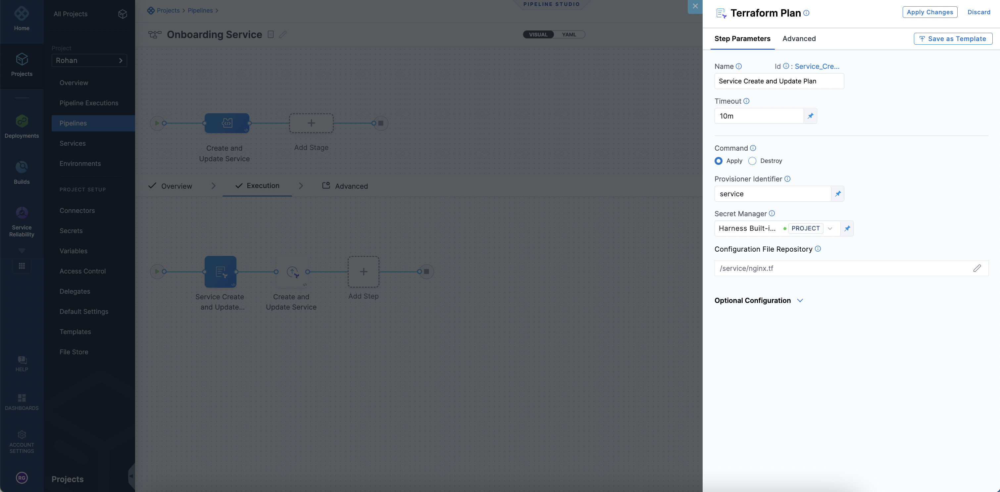
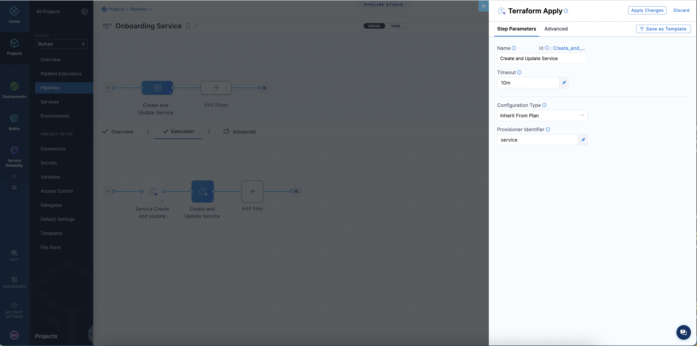
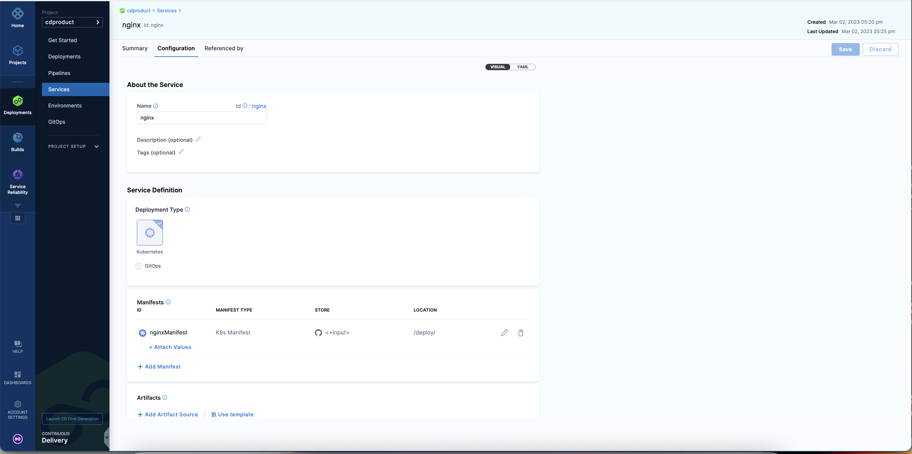
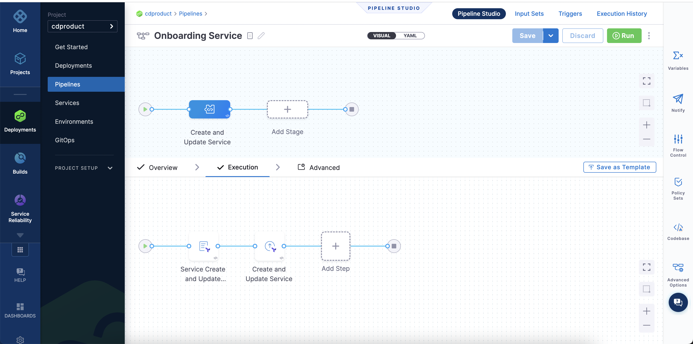
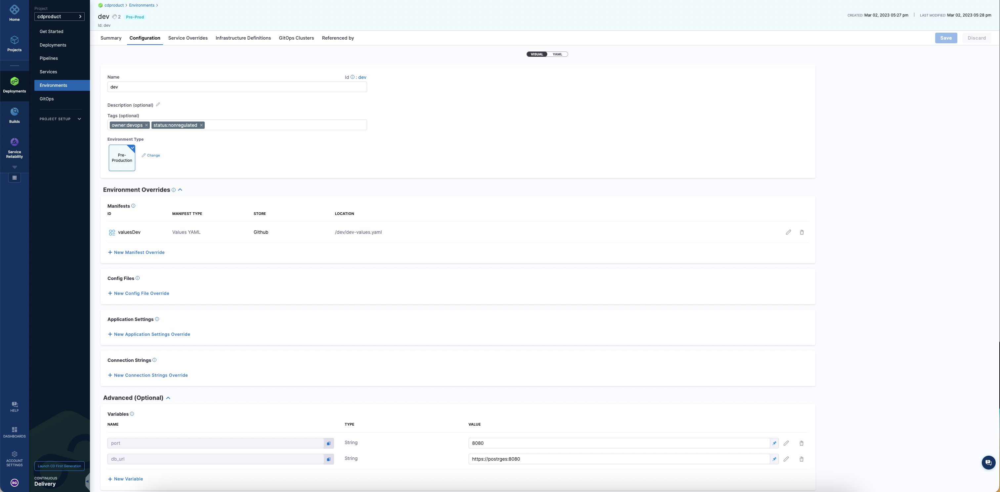
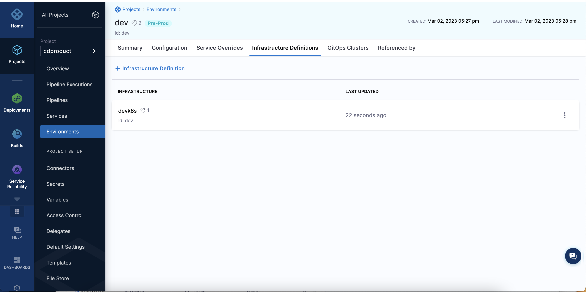
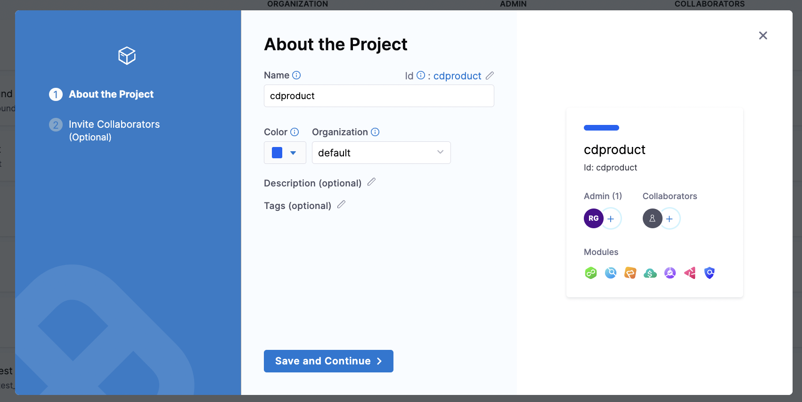

Harness offers a first-class Terraform provider to automate adoption and growth.

To use the Harness Terraform provider, go to [Harness' Terraform module](https://registry.terraform.io/providers/harness/harness/latest/docs) in the HashiCorp Terraform Registry. Select **Next Gen** to see all the resources Harness supports for provisioning.

This topic uses a [sample repository](https://github.com/thisrohangupta/harness) to explain the steps to automate onboarding using the Harness Terraform provider.

## Important

- To get started with the Harness provider, Harness recommends installing a delegate with Terraform CLI. You need the delegate to build out the automation pipelines to create the various resources.
- Harness recommends making changes using Git when using the Terraform provider.
- Defining your resources like service, environment, infrastructure definition, etc. via Terraform is a one-way sync. By using Terraform, you define the object in Git. After you commit the change, a Harness pipeline provisions the resource to your account. 
- Any changes you make via Git are propagated to the UI via this pipeline, which fetches the Terraform file definition for the resource.
- To avoid configuration mismatches, any changes you make in the UI must be reconciled and updated in the YAML.
- To prevent the editing and creation of resources in the Harness UI, use [RBAC](/docs/platform/role-based-access-control/rbac-in-harness).

## Product Demo

<!-- Video:
https://harness-1.wistia.com/medias/a7nilatjff-->
<docvideo src="https://harness-1.wistia.com/medias/a7nilatjff" />

## Install a delegate

1. Install a Kubernetes delegate. For steps to install a Kubernetes delegate, go to [Delegate YAML Quickstart](https://developer.harness.io/docs/first-gen/firstgen-platform/account/manage-delegates/install-kubernetes-delegate/).
2. Download the YAML.
3. Modify the `INIT_SCRIPT` section in the YAML to include the following value:
   
   ```
   - name: INIT_SCRIPT
          value: | ## Install Terraform Here, You can use the latest version, of Terraform.
                curl -O -L  https://releases.hashicorp.com/terraform/0.12.25/terraform_0.12.25_linux_amd64.zip  
                unzip terraform_0.12.25_linux_amd64.zip  
                mv ./terraform /usr/bin/          
                terraform --version 
   ```

    <details>
    <summary>
    YAML sample
    </summary> 

    ```
    apiVersion: v1
    kind: Namespace
    metadata:
    name: harness-delegate-ng

    ---

    apiVersion: rbac.authorization.k8s.io/v1
    kind: ClusterRoleBinding
    metadata:
    name: harness-delegate-ng-cluster-admin
    subjects:
    - kind: ServiceAccount
        name: default
        namespace: harness-delegate-ng
    roleRef:
    kind: ClusterRole
    name: cluster-admin
    apiGroup: rbac.authorization.k8s.io

    ---

    apiVersion: v1
    kind: Secret
    metadata:
    name: terraform-proxy
    namespace: harness-delegate-ng
    type: Opaque
    data:
    # Enter base64 encoded username and password, if needed
    PROXY_USER: ""
    PROXY_PASSWORD: ""

    ---

    apiVersion: apps/v1
    kind: StatefulSet
    metadata:
    labels:
        harness.io/name: terraform
    name: terraform
    namespace: harness-delegate-ng
    spec:
    replicas: 1
    podManagementPolicy: Parallel
    selector:
        matchLabels:
        harness.io/name: terraform
    serviceName: ""
    template:
        metadata:
        labels:
            harness.io/name: terraform
        spec:
        containers:
        - image: harness/delegate:latest
            imagePullPolicy: Always
            name: harness-delegate-instance
            ports:
            - containerPort: 8080
            resources:
            limits:
                memory: "2048Mi"
            requests:
                cpu: "0.5"
                memory: "2048Mi"
            readinessProbe:
            exec:
                command:
                - test
                - -s
                - delegate.log
            initialDelaySeconds: 20
            periodSeconds: 10
            livenessProbe:
            exec:
                command:
                - bash
                - -c
                - '[[ -e /opt/harness-delegate/msg/data/watcher-data && $(($(date +%s000) - $(grep heartbeat /opt/harness-delegate/msg/data/watcher-data | cut -d ":" -f 2 | cut -d "," -f 1))) -lt 300000 ]]'
            initialDelaySeconds: 240
            periodSeconds: 10
            failureThreshold: 2
            env:
            - name: JAVA_OPTS
            value: "-Xms64M"
            - name: ACCOUNT_ID
            value: <YOUR ACCOUNT ID> ## Your Account ID will be generated here
            - name: MANAGER_HOST_AND_PORT
            value: https://app.harness.io
            - name: DEPLOY_MODE
            value: KUBERNETES
            - name: DELEGATE_NAME
            value: terraform
            - name: DELEGATE_TYPE
            value: "KUBERNETES"
            - name: DELEGATE_NAMESPACE
            valueFrom:
                fieldRef:
                fieldPath: metadata.namespace
            - name: INIT_SCRIPT
            value: | ## Install Terraform Here, You can use the latest version, of Terraform.
                    curl -O -L  https://releases.hashicorp.com/terraform/0.12.25/terraform_0.12.25_linux_amd64.zip  
                    unzip terraform_0.12.25_linux_amd64.zip  
                    mv ./terraform /usr/bin/          
                    terraform --version  
            - name: DELEGATE_DESCRIPTION
            value: ""
            - name: DELEGATE_TAGS
            value: ""
            - name: NEXT_GEN
            value: "true"
            - name: DELEGATE_TOKEN
            value: <YOUR DELEGATE TOKEN> ## Your Generated Delegate token will go here
            - name: WATCHER_STORAGE_URL
            value: https://app.harness.io/public/prod/premium/watchers
            - name: WATCHER_CHECK_LOCATION
            value: current.version
            - name: DELEGATE_STORAGE_URL
            value: https://app.harness.io
            - name: DELEGATE_CHECK_LOCATION
            value: delegateprod.txt
            - name: HELM_DESIRED_VERSION
            value: ""
            - name: CDN_URL
            value: "https://app.harness.io"
            - name: REMOTE_WATCHER_URL_CDN
            value: "https://app.harness.io/public/shared/watchers/builds"
            - name: JRE_VERSION
            value: 11.0.14
            - name: HELM3_PATH
            value: ""
            - name: HELM_PATH
            value: ""
            - name: KUSTOMIZE_PATH
            value: ""
            - name: KUBECTL_PATH
            value: ""
            - name: POLL_FOR_TASKS
            value: "false"
            - name: ENABLE_CE
            value: "false"
            - name: PROXY_HOST
            value: ""
            - name: PROXY_PORT
            value: ""
            - name: PROXY_SCHEME
            value: ""
            - name: NO_PROXY
            value: ""
            - name: PROXY_MANAGER
            value: "true"
            - name: PROXY_USER
            valueFrom:
                secretKeyRef:
                name: terraform-proxy
                key: PROXY_USER
            - name: PROXY_PASSWORD
            valueFrom:
                secretKeyRef:
                name: terraform-proxy
                key: PROXY_PASSWORD
            - name: GRPC_SERVICE_ENABLED
            value: "true"
            - name: GRPC_SERVICE_CONNECTOR_PORT
            value: "8080"
        restartPolicy: Always

    ---

    apiVersion: v1
    kind: Service
    metadata:
    name: delegate-service
    namespace: harness-delegate-ng
    spec:
    type: ClusterIP
    selector:
        harness.io/name: terraform
    ports:
        - port: 8080
    ```
    </details>  

3. After you modify the delegate YAML, connect to the Kubernetes cluster to install.
   To do this, run the following command: 
   
   ```
   kubectl apply -f harness-delegate.yaml
   ```
4. Run the following command to verify if the Terraform CLI is successfully installed:
   
   ```
   kubectl logs <HARNESS_DELEGATE_POD_NAME> -n harness-delegate-ng
   ```
   To see if the CLI is installed successfully, search `Terraform`.

## Set up a GitHub repo

1. You can use an existing repo to manage the Harness configuration or create a new one.
   For more information on creating a GitHub Repo, go to [Adding a local repository to GitHub using Git](https://docs.github.com/en/get-started/importing-your-projects-to-github/importing-source-code-to-github/adding-locally-hosted-code-to-github#adding-a-local-repository-to-github-using-git). 

   Harness recommends creating a GitHub Repo to store and manage the Harness configuration. 
2. Harness recommends the following folder structure to manage your configurations: 
   
   
   ```
    service/
    -- backend-service.tf
    -- frontend-service.tf
    -- transformer.tf

    environments/
    -- dev.tf
    -- qa.tf
    -- prod.tf 

    infrastructure/
    -- dev_k8s.tf
    -- qa_k8s.tf
    -- prod_k8s.tf 

   ```


## Manage the automation pipeline

   Harness recommends storing the automation pipeline to create and manage resources in a common project that many teams can access. You can create a project called `Onboarding` and users can leverage this to run the pipeline to create a service, environment, infrastructure definition, secret, etc. Harness lets you manage pipelines in Git via the Git experience. This lets you maintain all your pipeline configurations in Git.

   Alternatively you can create pipeline templates that teams can use in their projects. This lets a central team manage the onboarding processes and distribute them to the application teams to leverage and onboard.

### Set up pipeline

This section explains the steps to set up a sample pipeline.

1. Create a pipeline.

2. Create a trigger for a Git based source.

3. Create the terraform resource file of a Harness object.

4. Commit the Harness terraform resource object (service, environment, infrastructure, etc.) in GitHub.

5. Watch the pipeline execute based on the trigger.

6. In your Harness account, look for the resource that was configured to be created.

### Build the pipeline

For detailed steps to build the pipeline, go to [Kubernetes deployment tutorial](/docs/continuous-delivery/deploy-srv-diff-platforms/kubernetes/kubernetes-cd-quickstart).

### Configure pipeline stages

To configure the stages for your pipeline, go to the following: 
- [Custom Stage](https://developer.harness.io/docs/platform/pipelines/add-a-custom-stage/)
- [Terraform Plan Step](https://developer.harness.io/docs/continuous-delivery/cd-advanced/terraform-category/run-a-terraform-plan-with-the-terraform-plan-step/)
- [Terraform Apply Step](https://developer.harness.io/docs/continuous-delivery/cd-advanced/terraform-category/run-a-terraform-plan-with-the-terraform-apply-step)
   

The **Terraform Plan** step fetches the terraform resource from Git. Harness then initiates a terraform plan on the files collected.



Harness passes the terraform plan that was generated based on the Harness Terraform resource file and then to the **Terraform Apply** step. The **Terraform Apply** step can inherit the plan and create or update the service resource by selecting **Inherit from Plan**. 



:::caution
Ensure the **Terraform Plan** step is configured before the apply step.
:::

### Set up trigger

This section explains the steps to set up a sample trigger.

Harness recommends using the [GitHub Webhook](https://developer.harness.io/docs/platform/pipelines/w_pipeline-steps-reference/triggers-reference/) trigger because you can make changes in GitHub and based of a branch condition, push, pull request, issue comment, etc. you can fire off the pipeline to make changes. The trigger doesn't need to be GitHub.

Harness supports the following: 
- GitHub
- GitLab
- Bitbucket

For more information on triggers, go to [Trigger pipelines using Git Events](/docs/platform/triggers/triggering-pipelines/).

```YAML
trigger:
  name: Create and Update Service
  identifier: Create_and_Update_Service
  enabled: true
  encryptedWebhookSecretIdentifier: ""
  description: ""
  tags: {}
  orgIdentifier: default
  projectIdentifier: cdproduct
  pipelineIdentifier: Deploy_Sample_Pipeline
  source:
    type: Webhook
    pollInterval: "0"
    webhookId: ""
    spec:
      type: Github
      spec:
        type: Push
        spec:
          connectorRef: ProductManagementRohan ## Replace this with your Connector
          autoAbortPreviousExecutions: false
          payloadConditions:
            - key: targetBranch
              operator: Equals
              value: main
          headerConditions: []
          repoName: harness
          actions: []
  inputYaml: |
    pipeline: {}
```

## Onboard a service

For onboarding a Service onto Harness you will need to use the [Harness Terraform Resource](https://registry.terraform.io/providers/harness/harness/latest/docs/resources/platform_service). In Harness, you can create a [service](https://developer.harness.io/docs/continuous-delivery/onboard-cd/cd-concepts/services-and-environments-overview/) at the project, organization or account level.

Your will need to create this YAML and store it in your Github Repository.

```YAML
resource "harness_platform_service" "service" {
  identifier  = "nginx" ## Service Identifier
  name        = "nginx" ## Service Name to appear in Harness
  description = "sample nginx app created via Harness terraform Provider"  
  org_id      = "default" ## Replace with Harness Org Identifier for the resource, optional if creating at account level
  project_id  = "cdproduct" ## Replace with your Harness Project Identifier, optional if creating at org or account level. This project is where the service will be created
  yaml = <<-EOT
                service:
                  name: nginx ## Service Name (same as above)
                  identifier: nginx ## Service Identifier, needs to be same as above
                  serviceDefinition:
                    spec:
                      manifests:
                        - manifest:
                            identifier: nginxManifest
                            type: K8sManifest
                            spec:
                              store:
                                type: Github
                                spec:
                                  connectorRef: <+input> ## This is a connector in your account, project or Org to fetch source code
                                  gitFetchType: Branch
                                  paths:
                                    - /deploy/
                                  repoName: <+input> ## For an account level git connector, you can provide the Repo Name
                                  branch: master
                              skipResourceVersioning: false
                      configFiles: ## This block is optional, this is for config files like a python script or json file you want to attach to the service
                        - configFile:
                            identifier: configFile1
                            spec:
                              store:
                                type: Harness
                                spec:
                                  files:
                                    - <+org.description>
                      variables: ## These are service variables you can define
                        - name: port
                          type: String
                          value: 8080
                        - name: namespace
                          type: String
                          value: <+service.name>-<+env.name>
                    type: Kubernetes
                  gitOpsEnabled: false
              EOT
}
```

When you run an automation pipeline to create service, you will see the service created in the UI.



### Set up pipeline for Service Creation

Here is a sample pipeline to create the nginx service and manage it via Git automation. 

You also need to configure a Github Webhook Trigger to initiate updates to the service and automate the pipeline execution to update and create services.

```YAML
pipeline:
  name: Onboarding Service
  identifier: Deploy_Sample_Pipeline
  projectIdentifier: cdproduct
  orgIdentifier: default
  tags: {}
  stages:
    - stage:
        name: Create and Update Service
        identifier: Create_and_Update_Service
        description: Create and update a service from Github
        type: Custom
        spec:
          execution:
            steps:
              - step:
                  type: TerraformPlan
                  name: Service Create and Update Plan
                  identifier: Service_Create_and_Update_Plan
                  spec:
                    configuration:
                      command: Apply
                      configFiles:
                        store:
                          type: Github
                          spec:
                            gitFetchType: Branch
                            connectorRef: ProductManagementRohan
                            branch: main
                            folderPath: service/nginx.tf
                            repoName: harness
                        moduleSource:
                          useConnectorCredentials: true
                      secretManagerRef: harnessSecretManager
                    provisionerIdentifier: service
                  timeout: 10m
              - step:
                  type: TerraformApply
                  name: Create and Update Service
                  identifier: Create_and_Update_Service
                  spec:
                    configuration:
                      type: InheritFromPlan
                    provisionerIdentifier: service
                  timeout: 10m
        tags: {}
  description: This Pipeline is dedicated to onboarding services in Harness
```
The pipeline looks like this:



## Onboard an environment

For onboarding an environment, Harness recommends using the environment resource in the [Harness Terraform Provider](https://registry.terraform.io/providers/harness/harness/latest/docs/resources/platform_environment). 
In Harness, you can create an [environment](https://developer.harness.io/docs/continuous-delivery/onboard-cd/cd-concepts/services-and-environments-overview/) at the project, organization, and account scope.

Your need to create this YAML and store it in your GitHub Repository.

```YAML
resource "harness_platform_environment" "environment" {
  identifier = "dev" ## Define Environment Identifier, this is unique to the project, org or account - where the environment will be created
  name       = "dev" ## This will be the name of the environment that you will see in Harness UI
  org_id     = "default" ## Optional if your creating at Account level
  project_id = "cdproduct" ## optional if your creating at Org or Acount
  tags       = ["status:nonregulated", "owner:devops"]
  type       = "PreProduction"
  yaml = <<-EOT
    environment:
         name: dev ## Name of the environment, similar to above
         identifier: dev ## Name of the environment
         orgIdentifier: default  
         projectIdentifier: cdproduct ## optional if your creating at Org or Acount, this is where the environment will be created
         type: PreProduction
         tags:
           status: nonregulated
           owner: devops
         variables: ## You can configure global environment variable overides here
           - name: port
             type: String
             value: 8080
             description: "Default Port for Dev Environment"
           - name: db_url
             type: String
             value: "https://postrges:8080"
             description: "postgress url"
         overrides: ## You can configure global environment overrides here
           manifests:
             - manifest:
                 identifier: valuesDev
                 type: Values
                 spec:
                   store:
                     type: Git
                     spec:
                       connectorRef: <+input>
                       gitFetchType: Branch
                       paths:
                         - /dev/dev-values.yaml
                       repoName: <+input>
                       branch: master
           configFiles: ## You can configure configuration file overrides here.
             - configFile:
                 identifier: configFileEnv
                 spec:
                   store:
                     type: Harness
                     spec:
                       files:
                         - account:/Add-ons/svcOverrideTest
                       secretFiles: []
      EOT
}
```

When you run an automation pipeline to create environments, you will see the environment created in the UI:



### Set up pipeline to onboard environments

```YAML
pipeline:
  name: Onboarding Environments
  identifier: Create_Environment_Pipeline
  projectIdentifier: cdproduct
  orgIdentifier: default
  tags: {}
  stages:
    - stage:
        name: Create and Update Environment
        identifier: Create_and_Update_Environment
        description: Create and update a environment from Github
        type: Custom
        spec:
          execution:
            steps:
              - step:
                  type: TerraformPlan
                  name: Environment Create and Update Plan
                  identifier: Environment_Create_and_Update_Plan
                  spec:
                    configuration:
                      command: Apply
                      configFiles:
                        store:
                          type: Github
                          spec:
                            gitFetchType: Branch
                            connectorRef: <+input>
                            branch: main
                            folderPath: environments/dev.tf
                        moduleSource:
                          useConnectorCredentials: true
                      secretManagerRef: harnessSecretManager
                    provisionerIdentifier: environment
                  timeout: 10m
              - step:
                  type: TerraformApply
                  name: Create and Update Environment
                  identifier: Create_and_Update_Environment
                  spec:
                    configuration:
                      type: InheritFromPlan
                    provisionerIdentifier: environment
                  timeout: 10m
        tags: {}
  description: This Pipeline is dedicated to onboarding environments in Harness
```

## Onboard an infrastructure definition

For onboarding an Environment, we recommend using the infrastructure definition in our [Harness Terraform Provider](https://registry.terraform.io/providers/harness/harness/latest/docs/resources/platform_environment). 
In Harness, you can create an [Infrastructure Definition](https://developer.harness.io/docs/continuous-delivery/onboard-cd/cd-concepts/services-and-environments-overview/) at the project, organization and account scope.

```YAML
resource "harness_platform_infrastructure" "infrastructure" {
  identifier      = "dev"
  name            = "devk8s"
  org_id          = "default"
  project_id      = "cdproduct"
  env_id          = "dev"
  type            = "KubernetesDirect"
  deployment_type = "Kubernetes"
  yaml            = <<-EOT
        infrastructureDefinition:
         name: dev-k8s
         identifier: devk8s
         description: "development kubernetes cluster"
         tags:
           owner: "devops"
         orgIdentifier: default
         projectIdentifier: cdproduct
         environmentRef: dev
         deploymentType: Kubernetes
         type: KubernetesDirect
         spec:
          connectorRef: devkubernetes ### Replace with your connector
          namespace: dev
          releaseName: release-<+INFRA_KEY>
          allowSimultaneousDeployments: false
      EOT
}
```

Infrastructure Definitions are associated with the environment, so you will need to create an environment before creating the infrastructure definition.

When you run your automation pipeline and apply the terraform for the infrastructure definition you will see it appear in the UI:



### Set up pipeline to onboard infrastructure definitions

```YAML
pipeline:
  name: Onboarding Infrastructure Definition
  identifier: Create_Infrastructure_Pipeline
  projectIdentifier: cdproduct
  orgIdentifier: default
  tags: {}
  stages:
    - stage:
        name: Create and Update Infrastructure
        identifier: Create_and_Update_Infrastructure
        description: Create and update a Infrastructure from Github
        type: Custom
        spec:
          execution:
            steps:
              - step:
                  type: TerraformPlan
                  name: Infrastructure Create and Update Plan
                  identifier: Infrastructure_Create_and_Update_Plan
                  spec:
                    configuration:
                      command: Apply
                      configFiles:
                        store:
                          type: Github
                          spec:
                            gitFetchType: Branch
                            connectorRef: <+input>
                            branch: main
                            folderPath: infrastructure/devk8s.tf
                        moduleSource:
                          useConnectorCredentials: true
                      secretManagerRef: harnessSecretManager
                    provisionerIdentifier: infra
                  timeout: 10m
              - step:
                  type: TerraformApply
                  name: Create and Update Infrastructure
                  identifier: Create_and_Update_Infrastructure
                  spec:
                    configuration:
                      type: InheritFromPlan
                    provisionerIdentifier: infra
                  timeout: 10m
        tags: {}
  description: This Pipeline is dedicated to onboarding environments in Harness
```

## Best practices

We recommend starting out in the Harness User Interface to get familiar with all the constructions. Once you understand the relationships and the hierarchy you can then begin to automate the creation and management of these resources.

Please review these topics to get familiar with the Harness constructs:

- [Harness Key Concepts](https://developer.harness.io/docs/getting-started/learn-harness-key-concepts)
- [Projects, Orgs, Account](https://developer.harness.io/docs/platform/organizations-and-projects/projects-and-organizations/)
- [Service, Environments](https://developer.harness.io/docs/continuous-delivery/onboard-cd/cd-concepts/services-and-environments-overview/)

### Create a project for resource automation

We recommend two approaches:

1. Creating a centralized project that you can give your end user developers access to onboard their own services and resources

2. Create 1 Project that has a centralized platform team manage and onboard the app team services, environments and  other configurations.

You should get started by creating a centralized project like this:



You can also create this via the Terraform Provider and manage it via the Terraform Provider in code

```YAML
resource "harness_platform_project" "project" {
  identifier = "cdproduct"
  name       = "cdproduct"
  org_id     = "default"
  color      = "#0063F7"
}
```

To manage the organization and project identifiers in code, we recommend user's creating a `tfvars` file to manage these resources. The `tfvars` file will act as a record of all the organizations and projects you created via terraform and can be the parameter file for onboarding automation.

### Get the delegate operationalized

- We recommend for production grade delegate installation, to build your own delegate image and deploy it
- When you build your own delegate image, you get to customize all the tooling you want installed on it.
- [Harness offers Instructions to build your own delegate image](https://developer.harness.io/docs/platform/Delegates/install-delegates/build-custom-delegate-images-with-third-party-tools)

Tooling you should install:

- `kubectl`
- `helm`
- `terraform`

These options are all available in the [Harness Docs](https://developer.harness.io/docs/platform/Delegates/install-delegates/build-custom-delegate-images-with-third-party-tools)


### Create the connectors and secrets first

 Make sure the [connectors](https://developer.harness.io/docs/first-gen/firstgen-platform/account/manage-connectors/harness-connectors/) are created in Harness. You can create them and manage them via the [Terraform Provider](https://registry.terraform.io/providers/harness/harness/latest/docs/resources/platform_connector_github) or in the UI.


Below is a sample snippet for creating a connector via the Terraform Provider:

```YAML
resource "harness_platform_connector_helm" "helm" {
  identifier  = "bitnami"
  name        = "bitnami"
  description = "bitnami helm connector"
  tags        = ["owner:dev"]
  url                = "hhttps://charts.bitnami.com/bitnami"
  delegate_selectors = ["harness-delegate"]
}
```

 These connectors will require [secrets](https://developer.harness.io/docs/platform/Secrets/Secrets-Management/harness-secret-manager-overview) to be configured because connectors are access objects that provide the Harness delegate access to a particular resource. You can create the connectors via the [Terraform Provider](https://registry.terraform.io/providers/harness/harness/latest/docs/resources/platform_secret_text) or in the Harness UI.


Below is a sample snippet for creating a secret text via the Terraform Provider:

```YAML
resource "harness_platform_secret_text" "secret" {
  identifier  = "github_pat"
  name        = "github pat"
  description = "github personal access token"
  tags        = ["owner:dev"]
  secret_manager_identifier = "harnessSecretManager"
  value_type                = "Inline"
  value                     = "secret"
}
```


