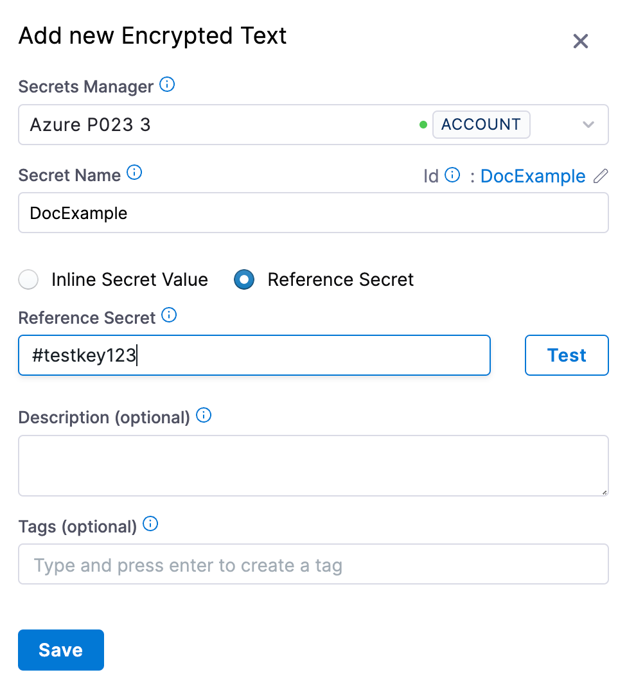
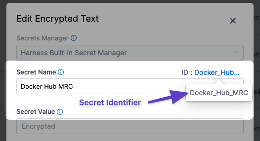
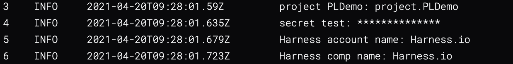

```mdx-code-block
import add_text_secret from './static/add-use-text-secrets-45.png'
import add_encrypted_text from './static/add-use-text-secrets-46.png'
import edit_encrypted_text from './static/add-use-text-secrets-49.png'
import create_edit_encrypted_text from './static/add-use-text-secrets-47.png'
import secret_expiry_date from './static/azurekeyvault-select-date.png'
```

You can add an encrypted text secret to a secrets manager and use the secret in resources such as pipelines and connectors.

This topic describes how to add a text secret in Harness.

## Add a text secret

You can add a text secret at account, organization, or project scope. 

This topic explains the steps to add an encrypted test secret in the account scope.

Secrets can be added inline while setting up a connector or other setting, and they can also be set up in the account, organization, or project resources.

To add an encrypted text secret in the account scope: 

1. In your Harness account, select **ACCOUNT SETTINGS**.
   
2. Select **Account Resources**, and then select **Secrets**.

3. Select **New Secret**, and then select **Text**.
   
   ```mdx-code-block
   
   ```

   The **Add new Encrypted Text** settings appear.

   ```mdx-code-block
   
   ```

4. In **Secrets Manager** select the secrets manager you will use to encrypt this secret.

5. In **Secret Name**, enter a name for the encrypted text. 

   This is the name you will use to reference the text elsewhere in your resources.

6. You can create the following typres of secrets:
   - **Inline Secret Value**: In **Inline Secret** **Value**, enter a value for the encrypted text.
     (Optional) If your secret is managed by Azure Key Vault, set an expiry date, select a date in **Expires on**.
     
      ```mdx-code-block
      
      ```
      
      :::important
      The Harness Delegate version 79306 is required for this feature.
      :::
      
   - **Reference Secret**: Create a Harness secret that refers to an existing secret and use that secret's name.

     You can reference existing secrets in the following types of Secret Managers:
     - Azure Key Vault
     - Hashicorp Vault
     - AWS Secrets Manager
     - GCP Secrets Manager
     Select **Test** to validate the secret reference path.

     

7. (Optional) Enter a **Description** and **Tags** for your secret.


11. Select **Save.**

## Use the secret in connectors

All of the passwords and keys used in Harness connectors are stored as encrypted text secrets in Harness.

You can either [create the secret](#add-a-text-secret) first and then select it in the connector or you can create it from the connector by clicking **Create or Select a Secret**:

```mdx-code-block

```
You can also edit the secret in the connector.

```mdx-code-block

```
## Reference the secret by identifier


:::info important
Harness does not support the creation of a secret that points to a secret manager in a different scope.
:::


For an Encrypted Text secret that's been scoped to a Project, you reference the secret in using the secret identifier in the expression: `<+secrets.getValue("your_secret_Id")>`.



Always reference a secret in an expression using its identifier. Names will not work.For example, if you have a text secret with the identifier `Docker_Hub_MRC`, you can reference it in a Shell Script step like this:


```
echo "text secret is: " <+secrets.getValue("Docker_Hub_MRC")>
```
You can reference a secret at the Org scope using an expression with `org`:


```
<+secrets.getValue("org.Docker_Hub_MRC")>​
```
You can reference a secret at the Account scope using an expression with `account`:


```
<+secrets.getValue("account.Docker_Hub_MRC")>​​
```
Avoid using `$` in your secret value. If your secret value includes `$`, you must use single quotes when you use the expression in a script.  
For example, if your secret in the Project scope has a value `'my$secret'`, and identifier `Docker_Hub_MRC`, to echo, use single quotes:  
`echo '<+secrets.getValue("Docker_Hub_MRC")>'`

## Invalid characters in secret names

The following characters aren't allowed in the names of secrets:


```
 ~ ! @ # $ % ^ & * ' " ? / < > , ;
```

## Secrets in outputs

When a secret is displayed in an output, Harness substitutes the secret value with asterisks so that the secret value is masked. Harness replaces each character in the name with an asterisk (\*).

For example, here the secret values referenced in a Shell Script step are replaced with `*****`:


If you accidentally use a very common value in your secret, like whitespace, the `*` substitution might appear in multiple places in the output.

If you see an output like this, review your secret and fix the error.

## Secret scope

When creating secrets, it's important to understand their scope in your Harness account.

A user can only create a secret according to the scope set by its Harness User permissions.

For example, when you create a new project or a new organization, a Harness Secret Manager is automatically scoped to that level.

## Line breaks and shell-interpreted characters

A text secret can be referenced in a script and written to a file as well. For example, here is a secret decoded from [base64](https://linux.die.net/man/1/base64) and written to a file:

`echo <+secrets.getValue("my_secret")> | base64 -d > /path/to/file.txt`

If you have line breaks in your secret value, you can encode the value, add it to a secret, and then decode it when you use it in a Harness step.

The previous example uses base64, but you can also write a secret to a file without it:

`echo '<+secrets.getValue("long_secret")>' > /tmp/secretvalue.txt`

If you do not use base64 and the secret value contains any character that are interpreted by the shell, it might cause issues.

In this case, you can use a special-purpose code block:


```
cat >/harness/secret_exporter/values.txt << 'EOF'  
MySecret:<+secrets.getValue("test")>  
EOF
```

## Characters length limit in secret names
A secret name cannot exceed 100 characters if you are using the Vault V2 engine.

## Sanitization

Sanitization only looks for an exact match of what is stored. So, if you stored a base64 encoded value then only the base64 encoded value is sanitized.

For example, let say I have this multiline secret:


```
line 1  
line 2  
line 3
```
When it is base64 encoded, it results in `bGluZSAxCmxpbmUgMgpsaW5lIDM=`.

We can add this to a Harness secret named **linebreaks** and then decode the secret like this:


```
echo <+secrets.getValue("linebreaks")> | base64 -d
```
The result loses any secret sanitization.


## Nested expressions using string concatenation

You can use the + operator or concat method inside the secret reference. For example, each of these expressions use one method and another Harness variable expression:

* `<+secrets.getValue("test_secret_" + <+pipeline.variables.envVar>)>`
* `<+secrets.getValue("test_secret_".concat(<+pipeline.variables.envVar>))>`

