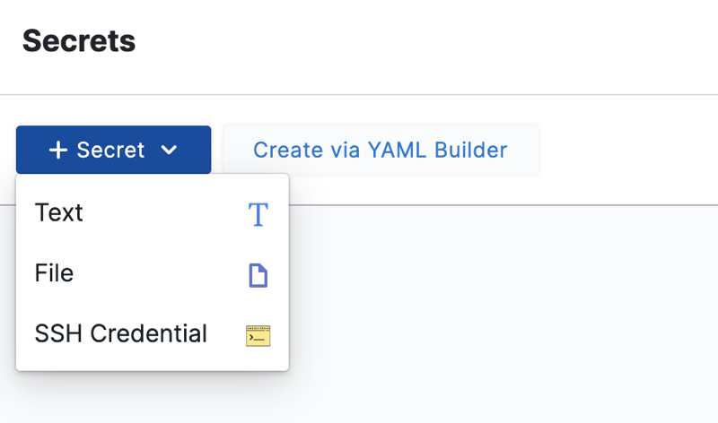
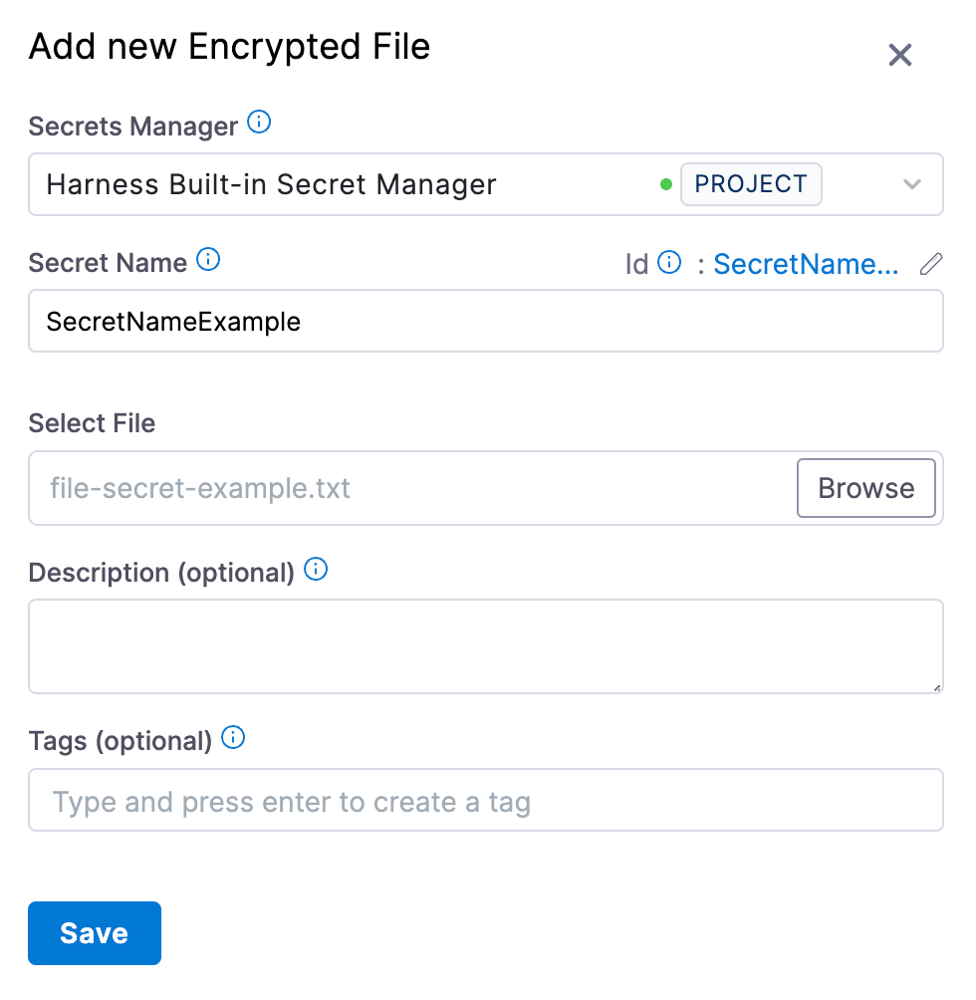
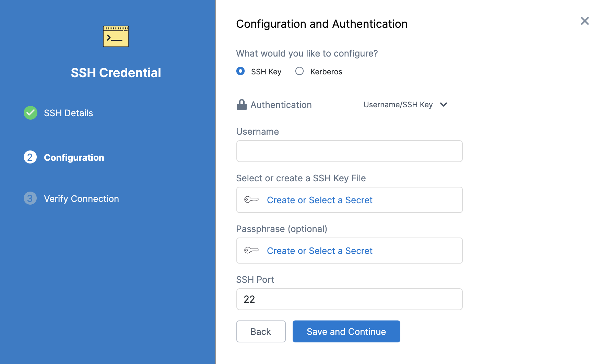
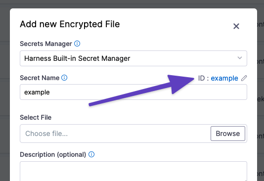

You can store encrypted files and reference them in your Harness resources, such as pipelines, steps, and connectors.

This topic assumes you have [created a Harness project](../organizations-and-projects/create-an-organization.md).

## Create an encrypted file secret

You can add an encrypted file secrets at the project, organization, and account scopes.

1. Depending on the scope where you want to create the secret, go to **Project Setup**, **Organization**, or **Account Resources**.
2. Select **Secrets**.
3. Select **Secret**, and then select **File**.

   <!--  -->

   <docimage path={require('../Secrets/static/add-file-secrets-55.png')} />

4. Select the [Secrets Manager](/docs/category/secrets-management) that you want to use to store the secret.
5. Enter a name for the secret.

   You can use this name to reference the encrypted file secret in pipelines, steps, connectors, and so on.

   An ID is created based on the name, and you can also use the ID to reference the encrypted file secret.

6. Select **Browse** and locate the file you want to store as a secret.
7. Optionally, you can enter a **Description** and **Tags**.
8. Select **Save**

## Reference an encrypted file secret

You can reference a encrypted file secret in any resource that allows files, such as SSH key files for SSH credentials, authentication keys for connectors, and steps in pipelines that ingest files.

### Reference by name

When populating a UI field, you can search and select secrets by the **Secret Name**

### Reference by ID

To reference encrypted file secrets in YAML or in fields that require expressions, you must use the ID in a [Harness expression](/docs/platform/references/runtime-inputs#expressions).

1. Locate the ID, next to the **Secret Name**, in the secret's settings.

   

   You can edit a secret's display name, but you can't change the ID.

2. Reference the secret using the appropriate expression format:

   * Secret created at the project scope, use: `<+secrets.getValue("FILE_SECRET_ID")>`
   * Secret created at the organization scope: `<+secrets.getValue("org.FILE_SECRET_ID")>`
   * Secret created at the account scope: `<+secrets.getValue("account.FILE_SECRET_ID")>`
