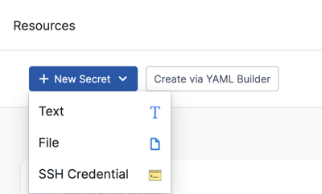
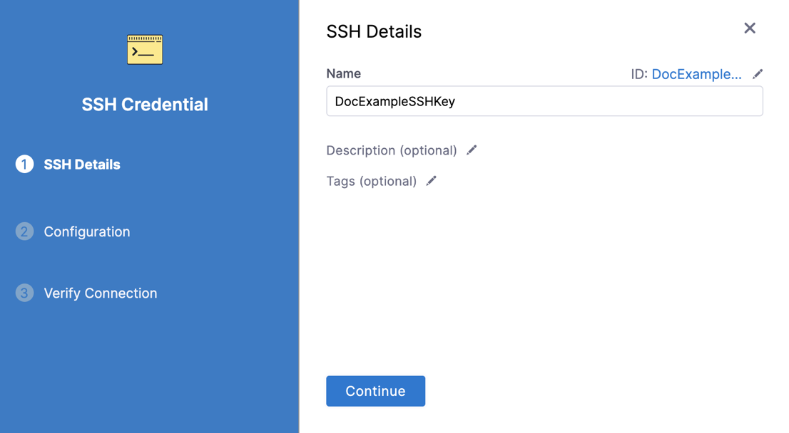

You can add SSH keys for use in connecting to remote servers, such as an AWS EC2 instance or Git repository.

:::tip Convert OpenSSH to PEM

Use this command to convert your OpenSSH key to PEM format:

```
ssh-keygen -p -m PEM -f your_private_key
```

This command converts your existing file headers from `BEGIN OPENSSH PRIVATE KEY` to `BEGIN RSA PRIVATE KEY`.

:::

## Add an SSH credential

Use these steps to add an SSH key that can be referenced in Harness entities.

You can add SSH credentials while creating connectors and other account or project resources, or you can select **Secrets** under **Account/Organization/Project Setup** and create an **SSH Credential** secret.

<!--  -->

<docimage path={require('./static/add-use-ssh-secrets-17.png')} />

Configure the **SSH Credential** settings as follows.

<!--  -->

<docimage path={require('./static/add-use-ssh-secrets-18.png')} />

1. Enter a **Name** for the SSH credential and select **Continue**.
2. Under **Select an Auth Scheme**, select one of the following:

   * **SSH Key:** Add SSH keys for Harness to use when connecting to remote servers.
   * **Kerberos:** SSH into a target host via the Kerberos protocol.

3. Provide the relevant **Username**. This may be the username for the user account on the remote server or another username. For example, if you want to SSH into an AWS EC2 instance, the username would be `ec2-user`.

   :::info Code repo connectors

   If this SSH key secret is for a [code repo connector](/docs/platform/connectors/code-repositories/connect-to-code-repo/), the **Username** must be `git`.

   :::

4. In **Select or create a SSH Key**, create or select an [Encrypted File Secret](./3-add-file-secrets.md) that contains the relevant SSH Key file.

   :::info note

   If you need to update the SSH key for an existing SSH credential, you can't edit the actual encrypted file secret that you selected when you created the credential. Instead, you must create a new encrypted SSH key file secret.

   :::

5. Enter the [SSH Key **Passphrase**](https://www.ssh.com/ssh/passphrase), if one is required. This is **not** required by default for AWS and many other platforms. Passphrases are stored as Harness [Encrypted Text Secrets](./2-add-use-text-secrets.md).
6. For **SSH Port**, leave the default port **22** or enter a different port, if needed, and then select **Save and Continue**.
7. Enter the **Host Name** of the remote server you want to SSH into. For example, if it is an AWS EC2 instance, it might be something like `ec2-76-939-110-125.us-west-1.compute.amazonaws.com`.
8. Select **Test Connection**.

   If the test is unsuccessful, you might see an error stating that no Harness Delegate could reach the host, or that a credential is invalid. Make sure that your settings are correct and that a Harness Delegate is able to connect to the server.

   When the test succeeds, select **Submit** to save the SSH credential.
