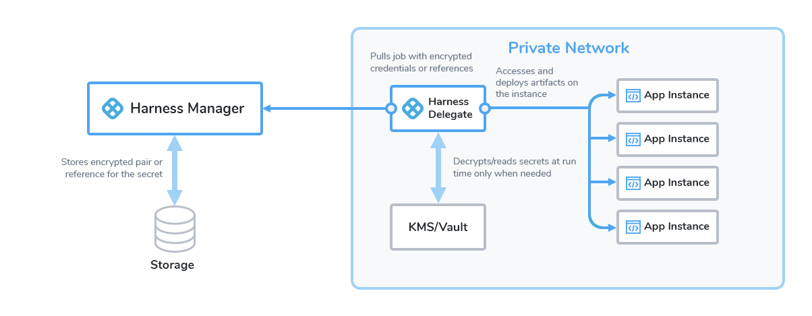

Harness includes a built-in Secret Management feature that enables you to store encrypted secrets, such as access keys, and use them in your Harness account. Some key points about Secret Management:

* Secrets are always stored in encrypted form and decrypted when they are needed.
* Harness Manager does not have access to your key management system, and only the Harness Delegate, which sits in your private network, has access to it. Harness never makes secret management accessible publicly. This adds an important layer of security.

### Before you begin

* Go to [Harness Key Concepts](../../../getting-started/learn-harness-key-concepts.md)

### Visual Summary

You can choose to use your own secret management solution, or the built-in Harness Secret Manager. This diagram shows how Harness handles secrets:

### Harness Secret Management Process Overview

Harness sends only encrypted data to the Secret Manager, as follows: 

1. Your browser sends data over HTTPS to Harness Manager.
2. Harness Manager relays encrypted data to the Harness Delegate, also over HTTPS.
3. The Delegate exchanges a key pair with the Secret Manager, over an encrypted connection.
4. The Harness Delegate uses the encrypted key and the encrypted secret and then discards them. The keys never leave the Delegate.

:::info note
Any secret manager requires a running Harness Delegate to encrypt and decrypt secrets. Any delegate that references a secret requires direct access to the Secret Manager.

:::

You can manage your secrets in Harness by using either a key management service (KMS) or a third-party secret manager.

#### Using Key Management Services

Google Cloud Key Management Service is the default Secret Manager in Harness and is named Harness Secret Manager Google KMS.

The Key Management Service (Google Cloud KMS or AWS KMS) only stores the key. Harness uses [envelope encryption](https://cloud.google.com/kms/docs/envelope-encryption) to encrypt and decrypt secrets. The encrypted secret and the encrypted Data Encryption Key (used for envelope encryption) are stored in the Harness database. 

:::warning
If you are using a KMS, rotation of keys is not supported by Harness and you might lose access to your secrets if the older version of the key is removed from your KMS.

:::

#### Using Third-Party Secret Managers

You can also use third-party Secret Managers, for example, HashiCorp Vault, Azure Key Vault, and AWS Secrets Manager.

These Secret Managers store the key, perform encryption and decryption, and also store the secrets (encrypted key pair). Neither the keys nor the secrets are stored in the Harness database. A reference to the secret is stored in the Harness database.

#### Secrets in Harness Community and Self-Managed Enterprise Edition Accounts

In Community and Self-Managed Enterprise Edition accounts, Harness uses a random-key secrets store as the Harness Secret Manager.

:::info note
By default, Self-Managed Enterprise Edition installations use the local MongoDB database for the default Harness Secret Manager. Harness does not recommend using the local MongoDB database. Once you have installed Self-Managed Enterprise Edition, [Add a secret manager](./5-add-secrets-manager.md). 

:::

:::info note
Harness does not currently support migrating secrets from the random-key secrets store. If you add secrets to the random-key secrets store, you will need to re-create them in any custom secret manager you configure later.

:::

If you created a Harness trial account, a Delegate is typically provisioned by Harness, and the default Harness Secret Manager performs encryption/decryption.

#### Harness Secrets and Harness Git Experience

When you set up [Harness Git Experience](../../10_Git-Experience/git-experience-overview.md), you select the Connectivity Mode for Git syncing. You have two options:

* **Connect Through Manager:** Harness SaaS will connect to your Git repo whenever you make a change and Git and Harness sync.
* **Connect Through Delegate:** Harness will make all connections using the Harness Delegate. This option is used for Self-Managed Enterprise Edition frequently, but it is also used for Harness SaaS. See [Harness Self-Managed Enterprise Edition Overview](../../../self-managed-enterprise-edition/introduction/harness-self-managed-enterprise-edition-overview.md).

If you select **Connect Through Manager**, the Harness Manager decrypts the secrets you have set up in the Harness Secret Manager.

If you select **Connect Through Delegate**, Harness Delegate, which runs in your private network and therefore has access to your key management system, decrypts the secrets.

#### Secret Cache

In the secret manager, Harness maintains a cache of the encrypted data, except for those stored in HashiCorp Vault. The cache also contains metadata associated with the secret, such as path to the secret, encryption key, and version. The time to live (TTL) for the cache is 30 minutes.

Decrypting a secret sometimes requires its metadata. When you edit a secret, its metadata changes and a stale value is retrieved from the cache. This happens in the following cases:

- The secret manager is Google Cloud KMS or AWS KMS.

- The secret manager is Google Cloud Secret Manager: The secret manager contains version information in its metadata. Every time you edit the inline secret, its version is incremented and updated in the database. However, on subsequent access, the older value is retrieved because cached metadata contains information about older versions.

- The secret is of the reference type: If a secret's reference path is edited, the path is updated in the database. However, the cached value continues to store the older path and fetches the stale secret.

This issue does not occur with secret managers that do not use a KMS. In such secret managers. secrets are inline, and no metadata is used to retrieve the value. 

